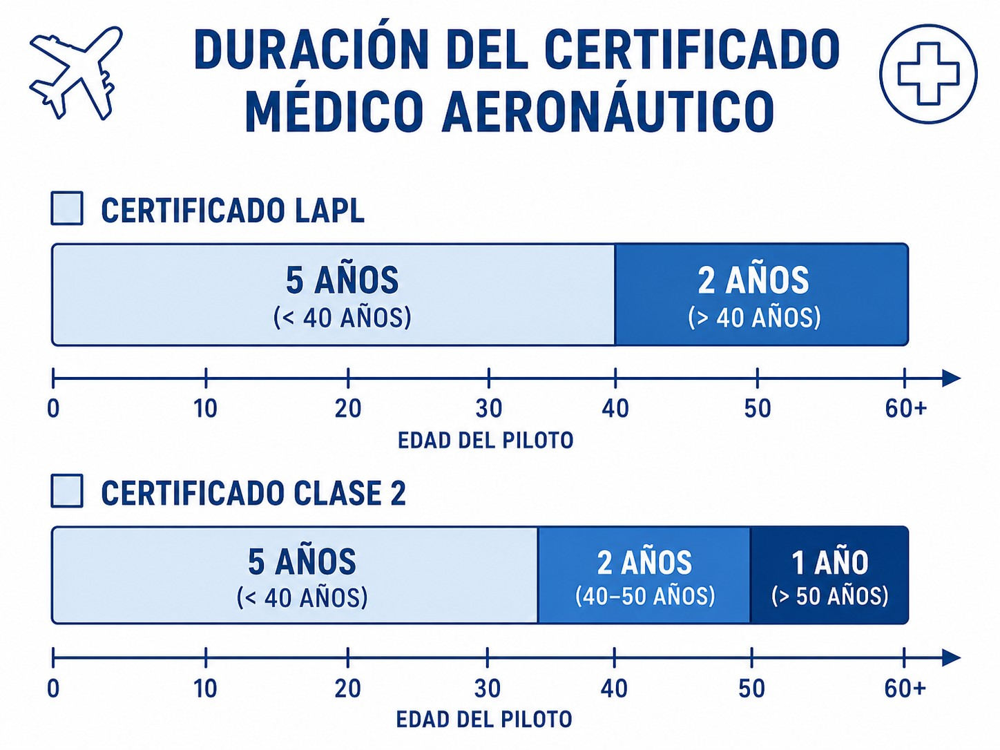
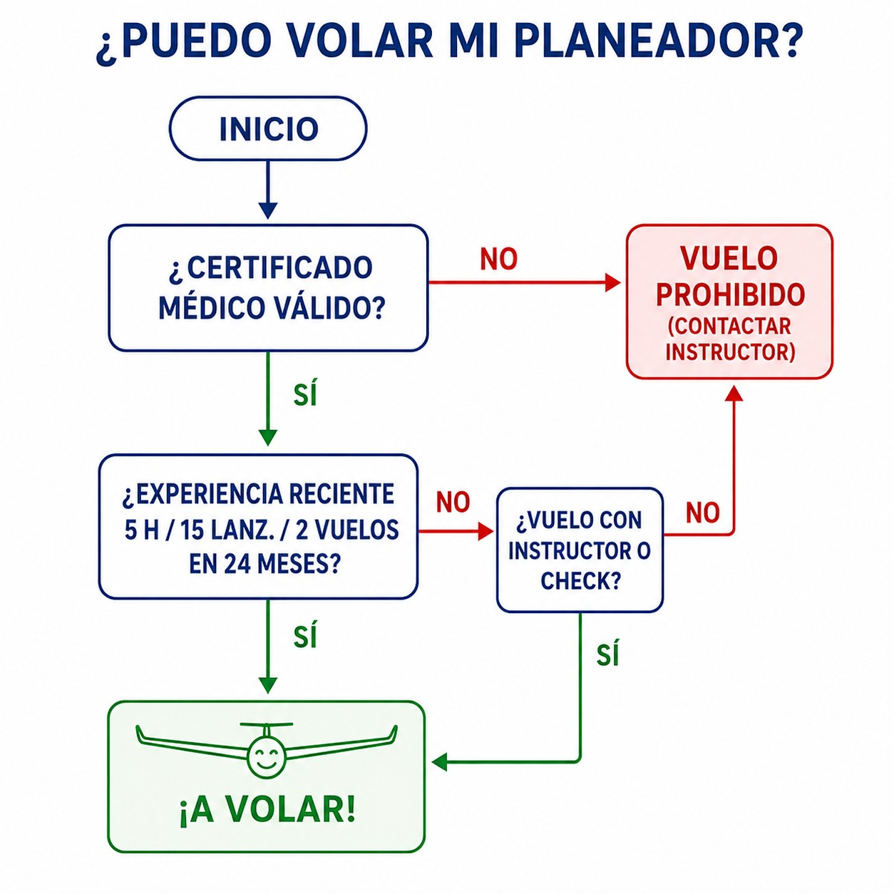

# Personnel licensing

> Your licence is a privilege, not a right; keeping it active takes continuing experience and medical fitness.
>
>
> In this chapter you will learn:
>
>
> * What the SPL is: validity, privileges and the applicable rules (Part-SFCL).
> * The differences between the LAPL and Class 2 medical certificates, and how long they last.
> * The “5 hours - 15 launches - 2 flights” rule for staying legal.
> * What you need, besides the licence, to take someone flying with you.

## The SPL (Sailplane Pilot Licence)

To fly a glider legally in Europe you need an **SPL** (**Sailplane Pilot Licence**), governed by Part-SFCL of Regulation (EU) 2018/1976 (amended by 2020/358).

You can obtain it at 16, although you can already fly solo as a student at 14. It entitles you to act as pilot-in-command (PIC) of sailplanes and touring motor gliders, and in theory it is **for life**: the document does not expire.

But the fact that the document does not expire does not mean you can always fly. To exercise your privileges you must meet two conditions **sine qua non**: hold a **valid medical certificate** and meet the **recent experience** requirements.

## The medical certificate

No medical, no flying. Keeping track of its expiry date is your responsibility.

Either a **Class 2** or an **LAPL** (**Light Aircraft Pilot Licence**) medical certificate is valid. For most sport pilots the LAPL is enough and less demanding. Its validity depends on your age: **60 months** (5 years) if you are under 40, and **24 months** (2 years) from 40 onwards (@fig-01-cap04-medical-validity). Watch out for the subtlety in MED.A.045: a certificate issued **before** your 40th birthday stops being valid when you turn **42**, even if the 60 months have not run out. If it was issued when you were 39, it is not valid until 44: it expires at 42.

::: {.callout-warning title="Safety"}
If your health changes (surgery, serious illness, pregnancy, new glasses), your medical certificate may be suspended. Always consult an Aero-Medical Examiner (AME) before flying again.
:::

{#fig-01-cap04-medical-validity}

## Recent experience: the 24-month rule

To fly solo or with passengers you must show that you are current. The SFCL rules set a rolling window of the **last 24 months**, within which, to keep your sailplane privileges active (excluding TMG), you must have completed:

1. **5 hours** of flight time as pilot-in-command (or dual).
2. **15 launches**.
3. **2 training flights** with an instructor.

### What happens if I do not meet it?

You do not lose the licence; your privileges become “dormant”. To wake them up you have two options: pass a **proficiency check** with an examiner, or fly dual with an instructor until you have made up what is missing (@fig-01-cap04-recencia-flow).

::: {.callout-tip title="Golden rule"}
* **5 , 15 , 2**
* **5** hours, **15** take-offs, **2** flights with an instructor. (In the last 2 years.)
:::

{#fig-01-cap04-recencia-flow}

## Carrying passengers

Taking someone with you is a big responsibility, and a brand-new licence does not allow it straight away. First you must complete **10 hours** of flight time or **30 launches** as pilot-in-command **after** obtaining the licence and, in addition, a **training flight** in which you demonstrate to an FI(S) instructor your competence to carry passengers (unless you already hold an FI(S) certificate).

And once that is done, there is a recency requirement: **3 launches in the last 90 days**. If you have not flown for three months, make a few solo flights before inviting anyone.

::: {.callout-important title="Regulation"}
Regulations (EU) 2018/1976 and 2020/358 (SFCL.115): an SPL holder shall only carry passengers if, after obtaining the licence, they have completed 10 hours of flight time or 30 launches as PIC **and a training flight demonstrating competence to an FI(S)** (or hold an FI(S) certificate), as well as meeting the recency requirement in SFCL.160(e). Failure to comply leads to sanctions and loss of insurance cover.
:::

::: {.postit}
**Chapter summary: licensing**

To fly legally you need three things:

* **SPL licence**: your pilot's qualification, governed by Part-SFCL. It is valid for life, but its privileges depend on your medical and recent experience.
* **Medical certificate**: Class 2 or LAPL. Without a valid medical, the licence is worthless.
* **Recent experience**: in the last 24 months, 5 hours of flight time (as PIC, dual or with an FI(S)), 15 launches and 2 training flights with an FI(S). If you fall short, fly with an instructor until you meet them or pass a proficiency check with an FE(S).
* **Passengers**: require extra experience (10 h or 30 launches after the licence), a training flight with an FI(S) demonstrating competence (unless you are already an FI(S)) and 3 launches in the last 90 days.
:::
