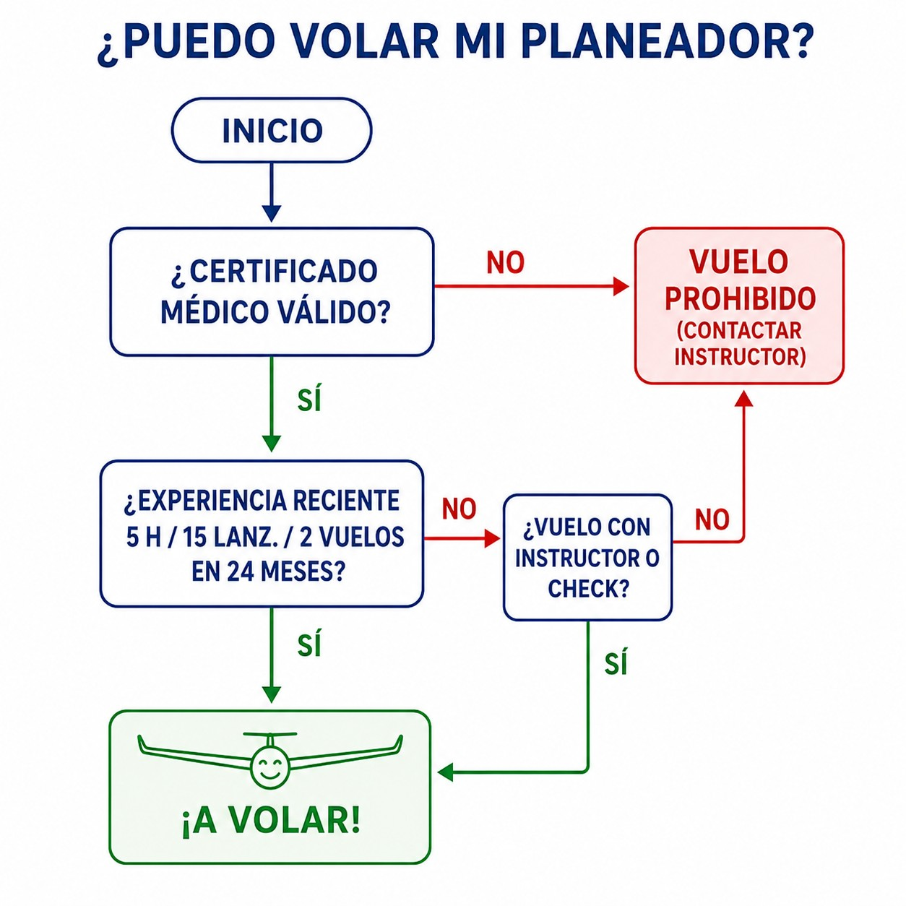

# Personnel licensing

> Your licence is a privilege, not a right. To keep it active you need continuing experience and medical fitness.
>
>
> In this chapter you will learn:
>
>
> * What the SPL is: validity, privileges and the applicable rules (Part-SFCL).
> * How the LAPL and Class 2 medical certificates differ, and how long they last.
> * The “5 hours - 15 launches - 2 flights” rule and the recency requirement for each launch method.
> * What you need, besides the licence, to take someone flying with you.

## The SPL (Sailplane Pilot Licence)

To fly a glider legally in Europe you need an **SPL** (**Sailplane Pilot Licence**), governed by Part-SFCL of Regulation (EU) 2018/1976 (amended by 2020/358).

You can obtain it at 16, although as a student you can fly solo from 14. It entitles you to act as pilot-in-command (PIC) of sailplanes, including powered sailplanes, without remuneration and in non-commercial operations, and in theory it is **for life**: the document does not expire. To fly for remuneration or in commercial operations you must also be 18 and, after obtaining the licence, have completed 75 hours of flight time or 200 launches as PIC (SFCL.115(a)(3)); instructors and examiners may be paid for instructing or examining (SFCL.115(b)). **Touring motor gliders (TMG)** are another matter: if you took your skill test in a sailplane, to fly them you need to extend your privileges with training and a skill test in a TMG (SFCL.150), and their recency requirement is different: in the last 24 months, 12 hours including, on TMGs, 6 hours, 12 take-offs and landings and a training flight of 1 hour with an instructor (SFCL.160(b)).

A licence that never expires does not mean you can always fly, though. Two conditions are **sine qua non** for exercising your privileges: a **valid medical certificate** and the **recent experience** requirements.

## The medical certificate

No medical, no flying. Keeping an eye on its expiry date is your job.

Either a **Class 2** or an **LAPL** (**Light Aircraft Pilot Licence**) medical certificate is valid. For most sport pilots the LAPL is enough, and it is less demanding. Its validity depends on your age: **60 months** (5 years) if you are under 40, and **24 months** (2 years) from 40 onwards (@fig-01-cap04-medical-validity). MED.A.045 has a catch: a certificate issued **before** your 40th birthday stops being valid when you turn **42**, even if the 60 months have not run out. If it was issued when you were 39, it is not valid until 44: it expires at 42.

A **Class 2** is only mandatory if you fly a sailplane in commercial operations (MED.A.030(c)(4)). It is valid for 60 months up to the age of 40 (with the same age-42 rule), 24 months between 40 and 50 (a certificate issued before your 50th birthday stops being valid when you turn 51) and 12 months from 50 onwards (MED.A.045).

::: {.callout-warning title="Safety"}
If your health changes (surgery, serious illness, pregnancy, admission to hospital, regular medication, or needing corrective lenses for the first time), your medical certificate may be suspended (MED.A.020). Always consult an Aero-Medical Examiner (AME) before flying again.
:::

{#fig-01-cap04-medical-validity .corregir}

## Recent experience: the 24-month rule

To fly solo or with passengers you must show that you are current. The SFCL rules look back over a rolling window of the **last 24 months**. To keep your sailplane privileges active (excluding TMG), in that time you must have completed:

1. **5 hours** of flight time as pilot-in-command (or dual).
2. **15 launches**.
3. **2 training flights** with an instructor.

### What happens if I do not meet it?

You do not lose the licence, but your privileges become “dormant”. There are two ways to wake them up: pass a **proficiency check** with an examiner, or fly dual with an instructor until you have made up what is missing (@fig-01-cap04-recencia-flow).

::: {.callout-tip title="Golden rule"}
* **5 , 15 , 2**
* **5** hours, **15** launches, **2** flights with an instructor. (In the last 2 years.)
:::

{#fig-01-cap04-recencia-flow .corregir}

### On top of that, for each launch method

The “5-15-2” is not enough. Your privileges are limited to the launch methods you have been trained in (winch, aerotow, self-launch, bungee launch), and each one has its own recency requirement (SFCL.155). To keep a method you must have made at least **5 launches with it in the last 24 months**; for bungee launches, **2** are enough. If you fall short, make up the missing ones flying dual or solo under the supervision of an instructor.

You can comfortably meet the “5-15-2” with aerotows and still not be current for a winch launch.

## Carrying passengers

Taking someone with you is a big responsibility, and a brand-new licence does not allow it straight away. **After** obtaining the licence you must first complete **10 hours** of flight time or **30 launches** as pilot-in-command, plus a **training flight** in which you show an FI(S) instructor that you are competent to carry passengers (unless you already hold an FI(S) certificate).

Even then, there is a recency requirement: **3 launches in the last 90 days**. If you have not flown for three months, make a few solo flights before you invite anyone.

::: {.callout-important title="Regulation"}
Regulations (EU) 2018/1976 and 2020/358 (SFCL.115): an SPL holder shall only carry passengers if, after obtaining the licence, they have completed 10 hours of flight time or 30 launches as PIC **and a training flight demonstrating competence to an FI(S)** (or hold an FI(S) certificate), as well as meeting the recency requirement in SFCL.160(e).
:::

Carrying passengers without meeting these requirements is an offence under the Ley de Seguridad Aérea (Spanish Aviation Safety Act) and, depending on your policy, may leave you without insurance cover.

::: {.postit}
**Chapter summary: licensing**

To fly legally you need three things:

* **SPL licence**: your pilot qualification, governed by Part-SFCL. It is valid for life, but its privileges depend on your medical and your recent experience.
* **Medical certificate**: Class 2 or LAPL. Without a valid medical, the licence is worthless.
* **Recent experience**: in the last 24 months, 5 hours of flight time (as PIC, dual or with an FI(S)), 15 launches and 2 training flights with an FI(S). If you fall short, fly with an instructor until you meet them, or pass a proficiency check with an FE(S).
* **Launch methods**: you may only use those you were trained in, and each one requires at least 5 launches in the last 24 months (2 for bungee launches) (SFCL.155).
* **Passengers**: require extra experience (10 h or 30 launches after the licence), a training flight with an FI(S) demonstrating competence (unless you are already an FI(S)) and 3 launches in the last 90 days.
:::
