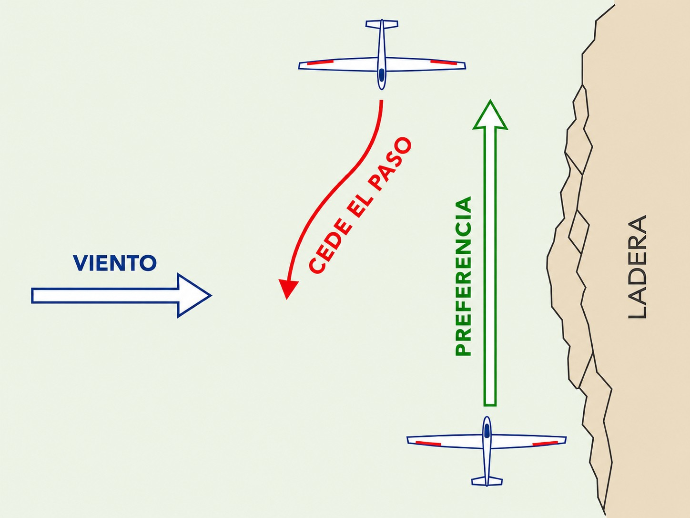
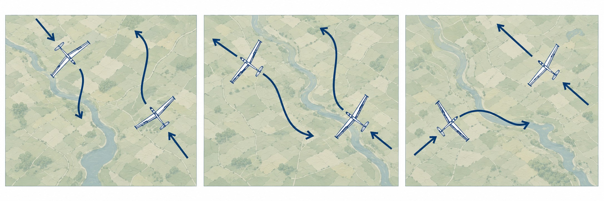
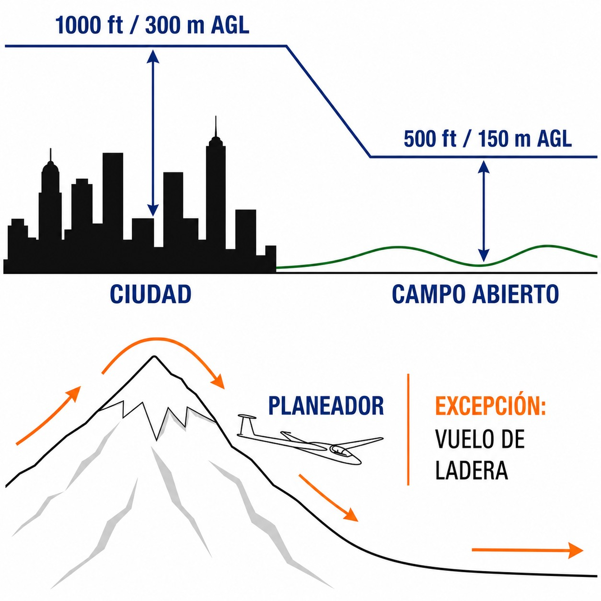

# Rules of the air

> The sky has no STOP signs, but it does have strict rules; mastering the SERA regulation is essential to avoid collisions.
>
>
> In this chapter you will learn:
>
>
> * The SERA regulation, the European highway code of the air.
> * The “see and avoid” principle of visual flight (VFR).
> * Who gives way to whom (balloons > gliders > powered aircraft).
> * When you may fly low (ridges, field landings) and when you may not.

## The highway code of the sky: SERA

In Europe we fly under a single regulation: **SERA** (**Standardised European Rules of the Air**), directly applicable in Spain as an EU regulation and supplemented by Real Decreto 552/2014 (Royal Decree 552/2014). Whether you fly in Albacete or in Germany, the basic rules are the same.

The fundamental principle is **VFR** (**Visual Flight Rules**): we fly by external visual references.

## Basic principle: “see and avoid”

In visual flight, you alone are responsible for not colliding. Air traffic control (ATC) can help you, but the final responsibility is yours. That demands a constant scan of the sky (the visual scanning technique) and a little gymnastics: move the aircraft or your head to see behind the canopy frame or under the nose, because blind spots exist.

::: {.callout-warning title="Safety"}
Most collisions happen on clear days and close to aerodromes. Never assume the other pilot has seen you. If in doubt, give way.
:::

## Right of way

Who goes first when two aircraft meet? SERA.3210 makes it clear.

### 1. The manoeuvrability hierarchy

The basic rule: the less able to manoeuvre, the higher the priority.

1. **Balloons**: highest priority; they can hardly manoeuvre.
2. **Gliders**: we can only go down; we cannot hold level indefinitely.
3. **Airships**.
4. **Powered aeroplanes and microlights**: they have an engine and manoeuvre at will.

There is one exception: powered aircraft must give way to aircraft towing other aircraft or objects (a banner, or the tug-glider combination itself), because their manoeuvrability is greatly reduced. As a free-flying glider the rule does not bind you, but prudence does: keep clear of an aerotow combination as soon as you see it.

### 2. Conflict situations

* **Head-on**: both turn to their **right**.

* **Converging**: on crossing tracks at the same level, the one coming from the **right** has priority. Careful: if you are coming from the right but flying under power and the other is a glider, the glider wins through the hierarchy.
* **Overtaking**: if you catch up with another aircraft from behind, the one ahead has priority. Overtake it on its **right**. With one exception tailor-made for us: a glider overtaking another glider may do so **on the right or on the left** (useful on a ridge, where only one side is safe).
* **On a ridge**: if two gliders meet on a collision course while ridge soaring, **the one with the hill on its right has priority**. The other must move away from the slope to give way (@fig-01-cap05-prioridades-ladera). This rule **is not in SERA**: it is a universal gliding convention. The regulation's head-on rule makes *both* aircraft turn right, which is impossible for the one that has the slope on that very side.

{#fig-01-cap05-prioridades-ladera}

* **Landing**: the lowest glider has priority to land (but diving to cut in is not allowed). In addition, under SERA.3210, gliders on final and landing always have priority over powered aircraft (@fig-01-cap05-prioridades).

{#fig-01-cap05-prioridades}

## Minimum flight heights

To protect people and property on the ground, SERA.5005 sets minimum heights. Except for take-off or landing, you may not fly below:

1. **300 m** above the highest obstacle within a radius of 600 m, when flying over congested areas (cities, towns, gatherings of people).
2. **150 m** above ground or water, in open country.

### Exceptions for gliding

SERA.5005(f) allows exceptions “by permission from the competent authority”, and its AMC1 gives that very authority the task of setting the minimum heights for ridge soaring and for forced landing practice. In Spain they are set by **article 15 of Real Decreto 552/2014** (unofficial translation), which allows flight below the heights in SERA.5005(f)(2) (the 150 m in open country, not the 300 m over populated areas) in two cases that concern us:

* **Ridge soaring**: gliders flying on ridges are exempt, provided that this involves no risk or nuisance to persons or property on the surface.
* **Forced landing training**: you may descend to **50 m (150 ft)**, keeping 150 m from any person, vehicle or vessel on the surface and from any artificial obstacle (@fig-01-cap05-alturas-minimas).

{#fig-01-cap05-alturas-minimas}

::: {.callout-tip title="Golden rule"}
**Balloon > Glider > Powered.**
If it has an engine, it gives way to you. If it is a balloon, you give way.
If you are head-on, **always to the right**.
:::

::: {.postit}
**Chapter summary: rules of the air**

The **SERA** regulation is the highway code of the sky:

* **VFR**: we fly by seeing and being seen. Eyes outside.
* **Right of way**: balloons > gliders > powered (the one that can manoeuvre most gives way). When converging, the one coming from the right has priority. When landing, the lowest glider goes first, and gliders have priority over powered aircraft. On a ridge, priority to the one with the hill on its right: a gliding convention, not a SERA rule.
* **Minimum heights (SERA.5005(f))**: 150 m in general, 300 m over populated areas. In Spain, Real Decreto 552/2014 exempts gliders on a ridge from the 150 m, provided there is no risk or nuisance to persons or property, and allows descent to 50 m when practising forced landings, 150 m from any person, vehicle or vessel and from any artificial obstacle.
:::
