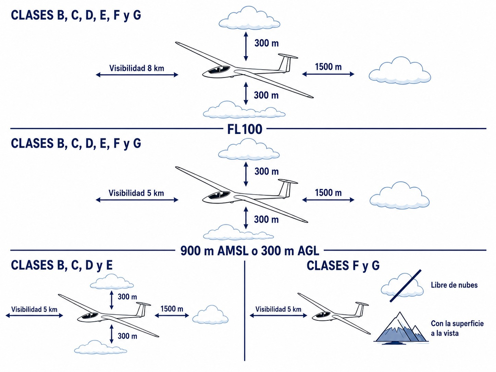

# Procedures for air navigation: aircraft operations

> Safe navigation needs precise rules. Know the VMC minima and cruising levels well and you can share the sky without friction.
>
>
> In this chapter you will learn:
>
>
> * The weather minima (VMC): when visual flight is legal and which exceptions apply to gliders.
> * The semicircular rule: how to choose your cruising altitude according to your track.
> * The critical difference between QNH (altitude), QFE (height) and QNE (flight levels).
> * When oxygen is mandatory, so that hypoxia does not creep up on you.

## VFR minima: visibility and distance from cloud

Visual flight (VFR) needs minimum weather conditions (**VMC**). Below those minima, VFR flight is prohibited. The general rule changes with altitude.

### Below 3,000 ft AMSL (or 1,000 ft AGL)

The upper limit of this band is the **higher** of the two values: 3,000 ft above sea level or 1,000 ft above the terrain. Over the Meseta, with the ground at about 2,600 ft, the band reaches up to about 3,600 ft AMSL. This is where gliders usually fly, and the minima depend on the airspace you are in:

* **Controlled airspace (classes B, C, D, E)**: 5 km visibility, and a distance from cloud of 1,500 m horizontally and 1,000 ft vertically.
* **Uncontrolled airspace (classes F, G)**: 5 km visibility, clear of cloud and in sight of the surface.

Watch out for an exception you will often see quoted: in uncontrolled airspace, at 140 kt or less, SERA allows the competent authority to permit flight visibilities down to **1,500 m**. Spain has done so, in Real Decreto 1180/2018 (Royal Decree 1180/2018), Article 30, only for helicopters and for aeroplanes on specialised operations, so **for a glider the minimum is still 5 km**, however slowly you fly (@fig-01-cap06-vmc-minima).

### Above 3,000 ft AMSL (up to FL 100)

5 km visibility, and a distance from cloud of 1,500 m horizontally and 1,000 ft vertically, whatever airspace you are in. Remember this on big wave days: above FL 100, the minimum visibility rises to **8 km**.

{#fig-01-cap06-vmc-minima .corregir}

## Semicircular rule for cruising levels

To keep aircraft from meeting head-on en route, each one flies at an altitude that depends on its magnetic track. In Spain (Real Decreto 1180/2018, Article 6 and Annex I; AIP España, ENR 1.7), the semicircular rule for VFR flights above **3,000 ft AGL** is oriented **North-South**:

* **Northbound tracks (270° to 089°)**: **even** altitudes or levels + 500 ft (4,500 ft, 6,500 ft…; above the transition altitude, FL 65, FL 85…).
* **Southbound tracks (090° to 269°)**: **odd** altitudes or levels + 500 ft (3,500 ft, 5,500 ft…; above the transition altitude, FL 75, FL 95…).

::: {.callout-tip title="Golden rule"}
**North Even / South Odd**
Heading **north** → **even** levels.
Heading **south** → **odd** levels.
:::

{#fig-01-cap06-semicircular .corregir}

## Altimeter setting: QNH, QFE and QNE

Your altimeter measures pressure, not height. What it tells you depends on the pressure you set in the Kollsman window:

* **QNH**: altimeter setting reduced to mean sea level. The altimeter shows **altitude** and, on the ground, roughly the aerodrome elevation. We use it to navigate and to fly circuits.
* **QFE**: aerodrome pressure. The altimeter shows **height** above the aerodrome; on the ground it reads zero. Rarely used on cross-countries, but handy for local flying or competitions.
* **QNE**: the indication with the standard setting (1013.25 hPa). The altimeter shows **flight levels (FL)**. It is used above the transition altitude (6,000 ft generally in Spain, with exceptions such as Madrid at 13,000 ft or Granada at 7,000 ft) so that all aircraft share the same reference, whatever the weather. Note that, unlike QNH and QFE, QNE is not a pressure anyone gives you. It is the **altimeter reading with 1013.25 hPa set**, which is why we say “setting standard”, not “setting the QNE”.

::: {.callout-tip title="Golden rule"}
As a memory aid (Q codes are not abbreviations; this is only a prompt):

* **QNH** = ***N**autical **H**eight* (altitude above sea level).
* **QFE** = ***F**ield **E**levation* (height above the airfield). Careful: on QFE the altimeter reads **0** at the airfield; it is on QNH that it reads the airfield elevation.
:::

::: {.callout-important title="Regulation"}
Below the **transition altitude** (6,000 ft in most of Spain, with exceptions such as Madrid or Granada), we fly on **QNH** (altitude). Above it, we set **1013.25 hPa** and fly **flight levels (FL)**.
:::

## Supplemental oxygen

The higher you climb, the less oxygen there is, and hypoxia gives no warning: you feel euphoric, lose judgement and pass out. That is why the rules say two things:

1. The pilot-in-command must ensure that all occupants use supplemental oxygen whenever they determine that its lack may impair their faculties.
2. If the pilot cannot determine that effect, EASA's acceptable means of compliance (AMC) is for everyone to use it above **10,000 ft**.

::: {.callout-important title="Regulation"}
**SAO.OP.150** requires the pilot-in-command to ensure that oxygen is used when they determine that its lack might impair the occupants' faculties. Its **AMC1** adds the acceptable means of compliance: when the pilot-in-command cannot determine this, they **should** ensure that all occupants use it whenever the pressure altitude is above **10,000 ft**. An AMC is not binding in the way the regulation is, but departing from it means showing that you comply just as well.
:::

::: {.callout-warning title="Safety"}
The legal rule is only the minimum. Physiologically, many pilots are already impaired at 8,000–9,000 ft, especially at night or when tired. On wave flights, connect the oxygen and use it before you reach 10,000 ft.
:::

## Minimum instruments on board

The same operations rules set the glider's minimum equipment for each type of flight.

::: {.callout-important title="Regulation"}
**SAO.IDE.105(a)**: every sailplane must carry a means of measuring and displaying the time (in hours and minutes), pressure altitude and indicated airspeed; powered sailplanes add magnetic heading. **SAO.IDE.105(b)**: when the sailplane cannot be maintained on a desired flight path without reference to instruments, in cloud flying or at night, a means of measuring and displaying vertical speed, attitude (or turn and slip) and magnetic heading is added.
:::

In practice, by day and in VFR, a wristwatch, the altimeter and the airspeed indicator are enough. Powered sailplanes add the compass. Before each flight, the pilot-in-command also checks that the sailplane is airworthy and registered, that the necessary instruments and equipment are on board and operative, and that mass, balance, loading and limitations are within what the AFM sets (SAO.GEN.130). Cloud or night flying also needs the variometer, an attitude or turn-and-slip indicator, and magnetic heading. The same applies, even in VMC, when you have no external reference to hold the attitude: no horizon, over the sea, desert or snow (GM1 SAO.IDE.105(b)).

One operational procedure from the syllabus is covered in other volumes of this collection: the **flight plan**. Its radio procedure is in **Book 4 — Communications** (ch. 2), the ICAO form item by item in **Book 7 — Flight Performance and Planning** (ch. 4), and its relationship with the ATS services in **Book 9 — Navigation** (ch. 7).

::: {.postit}
**Chapter summary: procedures for air navigation**

* **VMC minima**: general rule, 5 km visibility and cloud 1,500 m horizontally / 1,000 ft vertically. Below 3,000 ft AMSL (or 1,000 ft AGL, if higher) in uncontrolled airspace, 5 km, clear of cloud and with the surface in sight is enough; the reduction to 1,500 m that SERA allows does not apply to gliders in Spain. Above FL 100, 8 km.
* **Semicircular rule (Spain, North-South)**: northbound (270°–089°), even + 500 ft; southbound (090°–269°), odd + 500 ft. “North Even / South Odd”.
* **Altimeter**: QNH = altitude (navigation and circuits); QFE = height above the aerodrome; QNE (1013.25 hPa) = flight levels above the transition altitude (6,000 ft generally in Spain).
* **Oxygen**: under SAO.OP.150, the pilot-in-command must ensure it is used when they determine that the lack of oxygen may impair faculties or be harmful. If they cannot assess that effect, AMC1 SAO.OP.150 sets the default: use oxygen above 10,000 ft. For your body's sake, connect it earlier.
* **Pre-flight (SAO.GEN.130)**: before starting the flight, the pilot-in-command checks that the sailplane is airworthy and registered, with the necessary instruments and equipment installed and working. They also check mass, balance, loading and the AFM limits.
* **Minimum instruments (SAO.IDE.105)**: time, pressure altitude and indicated airspeed; powered sailplanes add magnetic heading. In cloud, at night or with no external reference to hold the attitude: vertical speed, attitude or turn/slip, and magnetic heading.
:::
