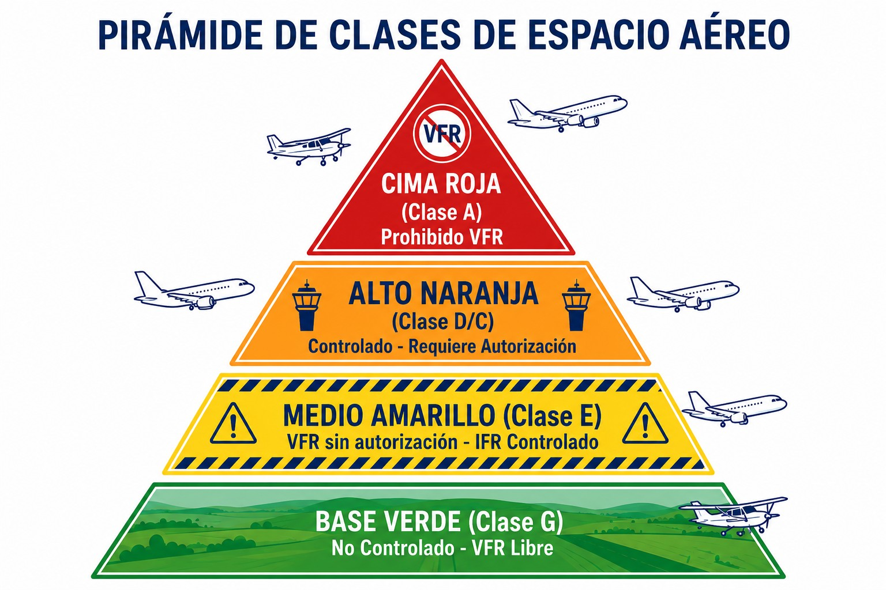
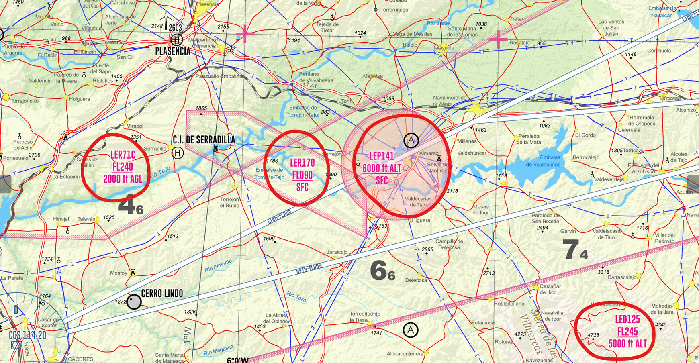

# Air traffic regulations: airspace structure

> The sky is divided into invisible “boxes”. Know which one you are in and you will stay clear of infringements and hazards.
>
>
> In this chapter you will learn:
>
>
> * The airspace classes: what changes between controlled (A-E) and uncontrolled (G) airspace.
> * When you need a clearance, radio and transponder to enter.
> * How to operate in RMZs (radio mandatory zones) and TMZs (transponder mandatory zones).
> * Where flying is prohibited or dangerous: P, R and D areas.

## The road map of the sky

The air is not free, or at least not all of it. To keep traffic in order, airspace is divided into **classes** (A to G) and **zones**. You need to know where you are, both to stay within the law and to stay out of danger.

## Controlled vs uncontrolled airspace

This is the main split. In **controlled** airspace, someone (ATC) separates you from other aircraft, or at least keeps an eye on you. In **uncontrolled** airspace you are on your own, with the radio to hand.

### Airspace classes (SERA.6001)

ICAO defines 7 classes, but in Spain we mainly use classes **A, C, D and E** (controlled) and **G** (uncontrolled) (@fig-01-cap07-clases-espacio).

| Class | Type | Requirements for VFR (gliders) |
| --- | --- | --- |
| **A** | **Controlled** (IFR only) | **VFR PROHIBITED**. You cannot enter. (E.g. Madrid TMA area A). **Requirements**: clearance + radio + transponder. |
| **C** | **Controlled** | **Separation**: ATC separates you from IFR traffic. From other VFR traffic you only receive traffic information (and traffic avoidance advice on request): **you separate yourself from VFR traffic**. **Requirements**: clearance + radio + transponder. |
| **D** | **Controlled** | **Separation**: none for VFR. ATC gives you traffic information on IFR and other VFR traffic, but **see and avoid is up to you**. **Requirements**: clearance + radio + transponder (generally). |
| **E** | **Controlled** (for IFR) | **Hybrid**: controlled for IFR, “free” for VFR. **VFR**: you need neither a clearance nor a radio (although a radio is highly recommended). ATC does not separate you from anyone, but gives traffic information where it can. |
| **G** | **Uncontrolled** | **Free**: you fly under your own responsibility. **Service**: flight information (FIS) only, if you request it. |
: Airspace classes and VFR requirements for gliders

::: {.callout-note title="Airmanship"}
ICAO rules define classes **B** and **F**, but in practice they are not used for general aviation or training in Spain. Spanish airspace is mostly class G (uncontrolled airspace away from routes and airports) or classes A, C, D and E (on routes and around airports).
:::

{#fig-01-cap07-clases-espacio}

## Special zones: RMZ and TMZ

Sometimes the airspace is class G, and free, but the authority wants a little order without controlling everything. These two arrangements do that:

* **RMZ** (**Radio Mandatory Zone**): uncontrolled airspace where it is **mandatory to carry a radio and communicate**. Before entering you must say who you are, where you are and what you intend to do.
* **TMZ** (**Transponder Mandatory Zone**): you must carry and operate a **transponder** with the required capabilities. A listening watch or radio contact is only mandatory if the zone is also an RMZ or the publication says so.

::: {.callout-tip title="Golden rule"}
If you see an RMZ on the chart, do not enter silently. Call the frequency shown and report: “Juliana Information, EC-OJE, glider, entering RMZ north sector…”.
:::

## Prohibited, restricted and danger areas

Some airspace is “locked” for safety or defence reasons and marked with codes such as LER71:

* **P** (**Prohibited**): never enter. Think of the Royal Palace or nuclear power stations.
* **R** (**Restricted**): entry is subject to conditions. You can usually pass through when it is inactive, or with special permission (nature reserves, military exercise areas).
* **D** (**Danger**): there is a hazard of some kind (explosives testing, hazardous activities). You may enter at your own risk, but you are better off avoiding them (@fig-01-cap07-zonas-prd).

{#fig-01-cap07-zonas-prd}

::: {.callout-warning title="Safety"}
Infringing an active P or R area can bring serious sanctions, and even interception by military aircraft. Plan your flight and check the NOTAMs to see whether the R areas are active. Interception signals and the response procedure (SERA.11015) are covered in Book 4 (*Communications*), chapter 8.
:::

::: {.postit}
**Chapter summary: airspace**

The sky is divided into “boxes” with different rules. Do not go where you are not allowed:

* **Controlled classes**: class A is IFR only; in B, C and D, VFR needs an ATC clearance and two-way communication (B is not used in Spain); in E, VFR needs neither a clearance nor a mandatory radio. How much ATC separates you depends on the class: IFR always, and VFR too in some of the more restrictive classes.
* **Class G (uncontrolled)**: you fly under your own responsibility, with “see and avoid”. You can receive a flight information service (FIS) if it is available and you request it, but nobody separates you.
* **ATC clearances**: a clearance or instruction does not take away the responsibility of the pilot-in-command. If you cannot comply safely, say so at once and agree a safe alternative.
* **Special zones**: in an **RMZ** you must carry a radio and make contact; in a **TMZ**, you must carry and operate a transponder that meets the published requirements.
:::
