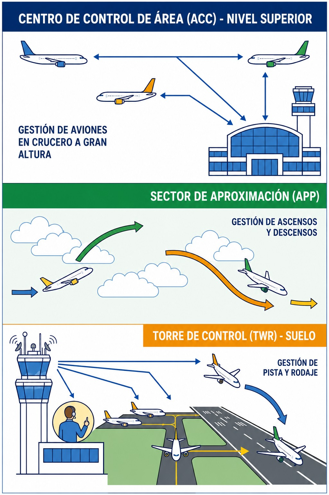
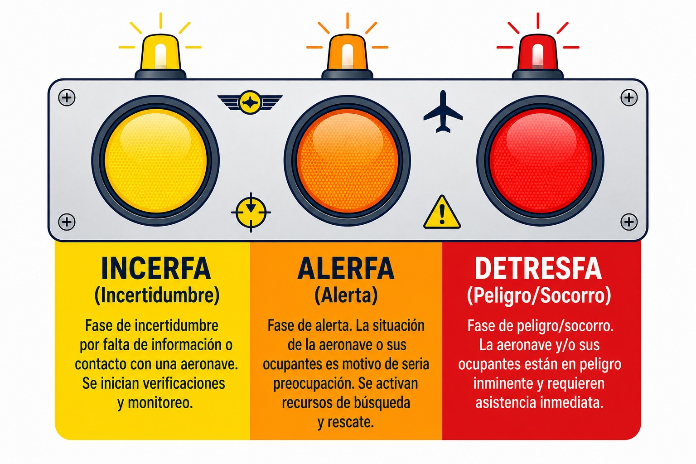

# Air traffic service (ATS) and air traffic management (ATM)

> The Air Traffic Services are there to help you, but you need to know what to ask for: control, information or alerting. Above them sits a larger system that decides what airspace you can use each day.
>
>
> In this chapter you will learn:
>
>
> * The three ATS services: control (ATC), information (FIS) and alerting (ALRS).
> * When they separate you (ATC) and when you separate yourself (FIS).
> * The search and rescue protocol: INCERFA, ALERFA and DETRESFA.
> * What air traffic management (ATM) is, and why the airspace you see on the chart is not the airspace you will have tomorrow.

## What is ATS for?

The Air Traffic Services (**ATS**) do more than “watch”. Under SERA.7001, their tasks are to prevent collisions (between aircraft and with obstacles), to expedite and maintain an orderly flow of traffic, to provide advice and information useful for safety, and to notify and assist in emergencies.

For that, ATS is split into three very different services, and it makes all the difference to know which one you are getting at any given moment.

## 1. Air traffic control service (ATC)

The top tier. Its main task is to **separate** aircraft.

Air traffic controllers (ATCOs) provide it, and they give you **clearances** (mandatory instructions) and traffic information. Under certain rules, keeping you from colliding is the controller's responsibility.

It is organised into three units, one for each phase of flight (@fig-01-cap08-dependencias-atc):

1. **Tower** (TWR): controls the aerodrome and the circuit (take-offs, landings, taxiing).
2. **Approach** (APP): controls arrivals to and departures from the airport area.
3. **Area Control Centre** (ACC): controls aircraft en route, high above.

{#fig-01-cap08-dependencias-atc}

## 2. Flight information service (FIS)

This is the service gliders get most of the time, in class G or E. Controllers or flight information service officers (FISOs) provide it, and what they give you is **advice and information**: whether there is traffic, what the weather is doing, whether danger areas are active…

Here the responsibility is **yours**. FIS warns you (“traffic at 12 o'clock”), but seeing and avoiding is up to you. Nobody separates you from anyone.

::: {.callout-note title="Airmanship"}
* **ATC**: “Turn heading 360 for traffic”. (A mandatory instruction; they separate you.)
* **FIS**: “Traffic converging on your right”. (Information; YOU decide what to do to avoid a collision.)
:::

## 3. Alerting service (ALRS)

Your life insurance. It is activated when there is an emergency or when there are fears for an aircraft's safety, and it works in three phases of growing concern (@fig-01-cap08-fases-emergencia):

1. **INCERFA (uncertainty phase)**: there is uncertainty about the safety of the aircraft and its occupants. ATS starts gathering information. The rules declare it in any of these three situations:
  
  * **No communication**: no communication has been received from the aircraft within 30 minutes of the expected time, or of the first unsuccessful attempt to contact it (whichever comes first).
  * **Late arrival**: the aircraft has not arrived within 30 minutes of its estimated time of arrival (ETA).
  * **Doubts about safety**: there are well-founded suspicions or doubts about the safety of the aircraft and its occupants.
2. **ALERFA (alert phase)**: there is concern for the safety of the aircraft and its occupants. The rescue services (SAR) are warned so that they are ready.
3. **DETRESFA (distress phase)**: there is reasonable certainty that the aircraft and its occupants are threatened by grave and imminent danger and need immediate assistance. The rescue assets are sent out: SAR helicopters and aircraft.

{#fig-01-cap08-fases-emergencia}

::: {.callout-warning title="Safety"}
If you have a real emergency, have **NOT** filed a flight plan and are not in radio contact, the alerting service will take much longer to start (only when your family reports that you have not come home). Use the radio and file the flight plan!
:::

Two useful cross-references within the collection. The **light signals** a tower can use to direct you without radio are covered in **Book 4 — Communications**, chapter 7. The **flight plan**, which feeds this alerting service, is covered in Books 4 — Communications (procedure), 7 — Flight Performance and Planning (the form) and 9 — Navigation (use of the ATS).

## Air traffic management (ATM)

ATS is the part of the system that talks to you on the radio. Above it there is something bigger: **Air Traffic Management** (**ATM**), which manages both the traffic and the airspace it flies through. It has three legs:

* **ATS**: the three services you have just seen. This is the leg that looks after you.
* **ASM**: airspace management. It decides what airspace is available, to whom and when.
* **ATFM**: air traffic flow management. It matches the number of aircraft to what the system can absorb.

Of the three, the one that affects you directly is the second.

For decades, military airspace was military seven days a week, used or not. Today the **flexible use of airspace** (**FUA**) applies: airspace is a single resource, shared out every day according to who really needs it. Each afternoon a management cell decides which areas will be activated tomorrow and which will be released, and publishes the result.

The result is areas that only exist at certain times (**TSAs** and **TRAs**, reserved by the hour) and routes that are only open when the area they cross is free (**CDRs**).

::: {.callout-tip title="Golden rule"}
The chart tells you where an area is, never whether it is active today. For that you need the NOTAMs and the daily airspace publication, and you check them while preparing the flight, not in the air.
:::

Flow management is another matter and hardly affects you. When there are more aircraft than the system can handle, it rations capacity with **slots**: allocated take-off times that keep aircraft on the ground instead of stacking them in the air. Slots are for IFR traffic with a flight plan. A glider flying VFR in class G neither gets one nor needs one; at most, they explain why an aerodrome with commercial traffic keeps you waiting.

::: {.callout-important title="Regulation"}
The flexible use of airspace is established by **Regulation (EC) No 2150/2005**, which lays down common rules for the flexible use of airspace in the European Union.
:::

::: {.callout-note title="Airmanship"}
The airspace available to you today is not yesterday's. Repeat last week's cross-country without checking again which areas are active, and you are flying with an old photograph.
:::

::: {.postit}
**Chapter summary: air traffic services (ATS) and air traffic management (ATM)**

ATS offers you three kinds of help:

* **Control (ATC)**: they give you instructions (clearances) to separate you from other aircraft. The units are TWR, APP and ACC, and the service only operates in controlled airspace.
* **Flight information (FIS)**: they give you useful information (weather, hazards, nearby traffic), but you are responsible for avoiding collisions. “Traffic information” is not “separation”.
* **Alerting (ALRS)**: alerts search and rescue (SAR) if you do not arrive on time or if you have an emergency.

And ATS is only one of the three legs of **ATM**:

* **ATM = ATS + ASM + ATFM**: the services that look after you, airspace management and flow management.
* **Flexible use (FUA)**: airspace is shared out every day, not once and for all. Some areas only exist at certain times (TSA, TRA), and some routes are only open when those areas are released (CDR).
* **What falls to you**: the chart says where an area is; the NOTAMs say whether it is active today. ATFM *slots* are a matter for IFR traffic: they do not affect a glider in class G.
:::
