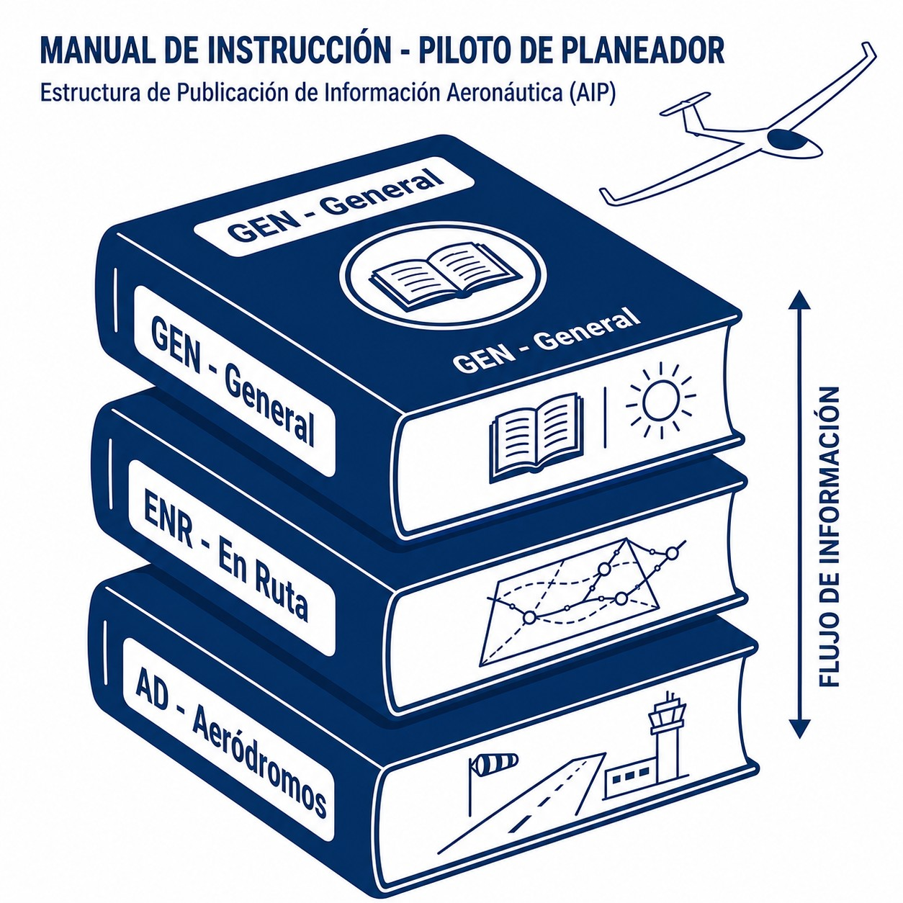
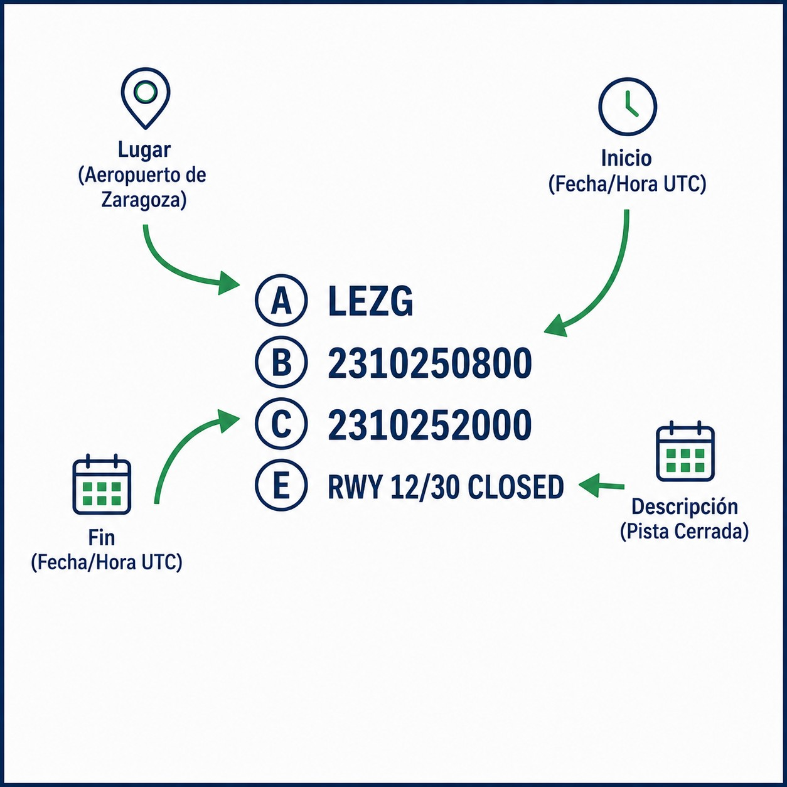

# Aeronautical information services (AIS)

> Information is safety; a pilot who ignores the NOTAMs is a pilot flying blind towards danger.
>
>
> In this chapter you will learn:
>
>
> * The three sources of information: the AIP (permanent), NOTAMs (urgent) and AICs (informative).
> * The pilot's legal duty to consult the available information before the flight.
> * How to use ENAIRE's Insignia to see the restrictions on the map.

## Information is safety

Before take-off, the pilot must “become familiar with all available information appropriate to the intended operation”. This is not advice: it is a **legal obligation** (SERA.2010). To help you comply, States provide Aeronautical Information Services (**AIS**).

In Spain, the main provider is **ENAIRE**, and everything is grouped in the Integrated Aeronautical Information Package (IAIP).

## The AIP (Aeronautical Information Publication)

The **AIP** is a country's aviation “bible”: it contains the permanent information essential for navigation, organised in three parts (@fig-01-cap09-estructura-aip):

1. **GEN (General)**: regulations, distress signals, conversion tables, sunrise and sunset, available services.
2. **ENR (En-route)**: airspace structure (airways, prohibited and restricted areas), radio navigation aids, navigation warnings.
3. **AD (Aerodromes)**: detailed data for each airport: runways, frequencies, hours, approach and taxi charts.

{#fig-01-cap09-estructura-aip}

### The AIRAC cycle

The AIP does not change every day. Significant, foreseeable updates (new routes, frequencies) are published under the **AIRAC** system (Aeronautical Information Regulation and Control), which ensures that changes reach everyone well in advance of their entry into force.

## Urgent news: NOTAM (Notice to Airmen)

{#fig-01-cap09-ejemplo-notam}

Some things cannot wait for the AIRAC cycle: a crane on the runway final, an unserviceable VOR, an air show on Saturday… That is what **NOTAMs** are for: temporary notices (generally for 3 months at most) about the establishment, condition or change of any aeronautical facility, service or procedure, or about a hazard to navigation (@fig-01-cap09-ejemplo-notam).

Checking the NOTAMs for your departure aerodrome, destination, alternates and route before **every** flight is mandatory.

## Aeronautical Information Circulars (AIC)

These are notices that do not justify a NOTAM (they do not affect operations urgently and directly) but that are worth knowing: administrative matters such as new charges, seasonal safety recommendations, icing prevention or technical explanations.

::: {.callout-tip title="Golden rule"}
In Spain, you can consult all of this free of charge on ENAIRE's **ICARO** and **Insignia** portals. Insignia is a fantastic visual tool for seeing NOTAMs on the map. Get into the habit of using it.
:::

::: {.postit}
**Chapter summary: aeronautical information service (AIS)**

Information is safety. Your sources:

* **AIP**: the permanent “fat manual”. Charts, frequencies, danger areas, airport hours. It is the foundation.
* **NOTAM**: the news. Urgent temporary notices (a closed runway, an air show, a temporary restriction). Checking them before every flight is mandatory.
* **AIC**: informative circulars on safety and administrative changes.
:::
