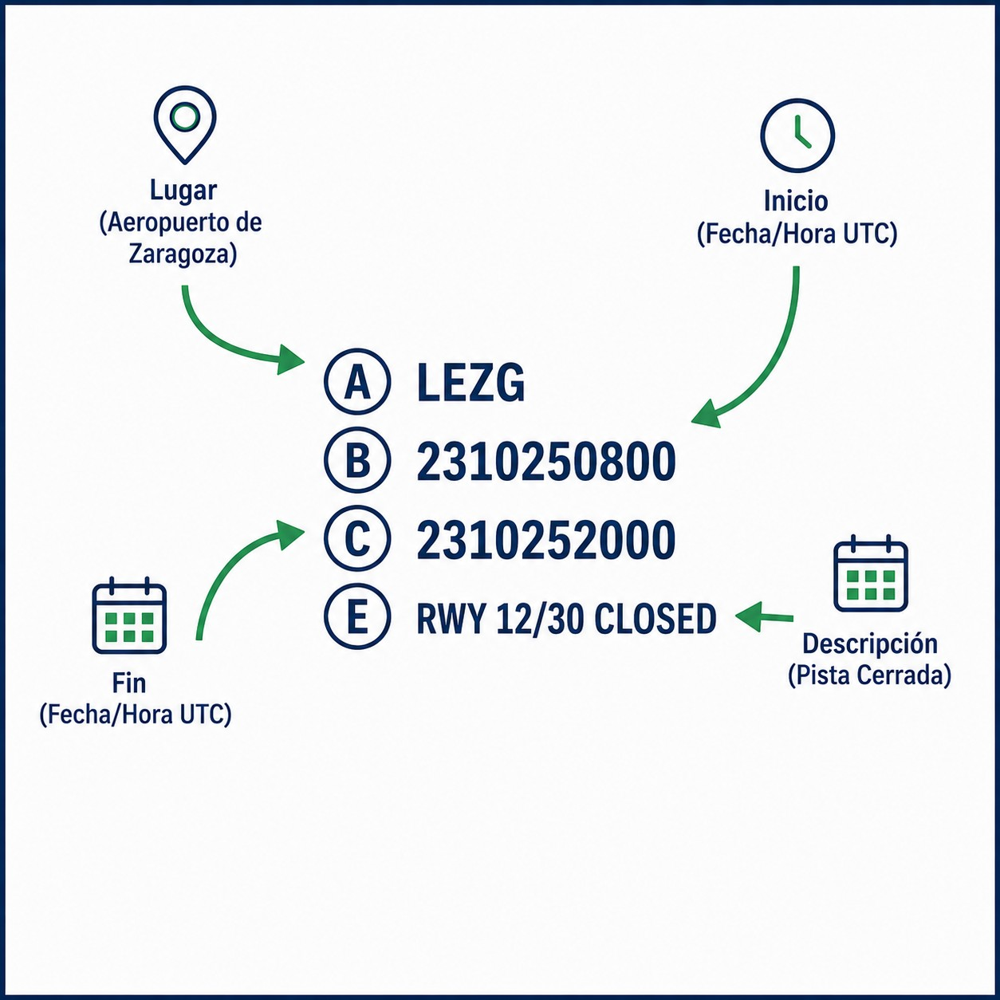

# Aeronautical information services (AIS)

> Information is safety. A pilot who ignores the NOTAMs is flying blind towards danger.
>
>
> In this chapter you will learn:
>
>
> * The sources of information: the AIP (permanent), its supplements, SUPs (temporary and long-lasting), NOTAMs (urgent) and AICs (informative).
> * The pilot's legal duty to consult the available information before the flight.
> * Where to consult all this, and how to see the NOTAMs and restrictions on the map.

## Information is safety

Before take-off, the pilot must “become familiar with all available information appropriate to the intended operation”. It is not advice but a **legal obligation** (SERA.2010). To help you comply, States provide Aeronautical Information Services (**AIS**).

In Spain, the main provider is **ENAIRE**, and it all comes together in the Integrated Aeronautical Information Package (IAIP).

## The AIP (Aeronautical Information Publication)

The **AIP** is a country's aviation “bible”. It holds the permanent information you need to navigate, organised in three parts (@fig-01-cap09-estructura-aip):

1. **GEN (General)**: regulations, distress signals, conversion tables, sunrise and sunset, available services.
2. **ENR (En-route)**: airspace structure (airways, prohibited and restricted areas), radio navigation aids, navigation warnings.
3. **AD (Aerodromes)**: detailed data for each airport: runways, frequencies, hours, approach and taxi charts.

{#fig-01-cap09-estructura-aip}

### The AIRAC cycle

The AIP does not change every day. Significant changes that can be planned (new routes, frequencies) are published under the **AIRAC** system (Aeronautical Information Regulation and Control), so that everyone receives them well before they come into force: they take effect on common dates, every **28 days**, and ENAIRE distributes them 42 days in advance so that they arrive at least 28 days beforehand (AIP España, GEN 3.1).

### AIP Supplements (SUP)

When a change is temporary but long-lasting (three months or more), or needs lengthy text or graphics, it does not go in a NOTAM: it is published as an **AIP Supplement** (**SUP**), on yellow pages, or pink ones if it follows the AIRAC cycle. They are common in gliding: temporary areas for a championship, changes at an aerodrome during works. Check the SUPs in force together with the AIP.

## Urgent news: NOTAM (Notice to Airmen)

Some things cannot wait for the AIRAC cycle: a crane on the runway final, an unserviceable VOR, an air show on Saturday… **NOTAMs** cover these: temporary notices (generally for 3 months at most) about the establishment, condition or change of any aeronautical facility, service or procedure, or about a hazard to navigation.

Each NOTAM has its fields (@fig-01-cap09-ejemplo-notam). The ones you will look at most are **A**, the aerodrome or region affected; **B** and **C**, the start and end of validity, as year, month, day, hours and minutes in UTC (2310250800 is 25 October 2023 at 08:00 UTC); and **E**, the text of the notice.

{#fig-01-cap09-ejemplo-notam .corregir}

Before **every** flight you must check the NOTAMs for your departure aerodrome, destination, alternates and route. In practice you do not read them one by one: you request them grouped in a **pre-flight information bulletin** (**PIB**) for your route and aerodromes, which is what ICARO gives you.

## Aeronautical Information Circulars (AIC)

These cover things that do not need a NOTAM (they do not affect operations urgently and directly) but are still worth knowing: administrative matters such as new charges, seasonal safety advice, icing prevention or technical explanations.

::: {.callout-tip title="Golden rule"}
In Spain, you can consult all of this free of charge on ENAIRE's **ICARO** and **Insignia** portals. Insignia shows the NOTAMs on a map, which makes them far easier to read. Get into the habit of using it.
:::

::: {.postit}
**Chapter summary: aeronautical information service (AIS)**

Information is safety. Your sources:

* **AIP**: the permanent “fat manual”. Charts, frequencies, danger areas, airport hours. Everything else builds on it.
* **SUP**: AIP Supplements for long-lasting temporary changes (three months or more). Consult them together with the AIP.
* **NOTAM**: the news. Urgent temporary notices (a closed runway, an air show, a temporary restriction). Checking them before every flight is mandatory.
* **AIC**: informative circulars on safety and administrative changes.
:::
