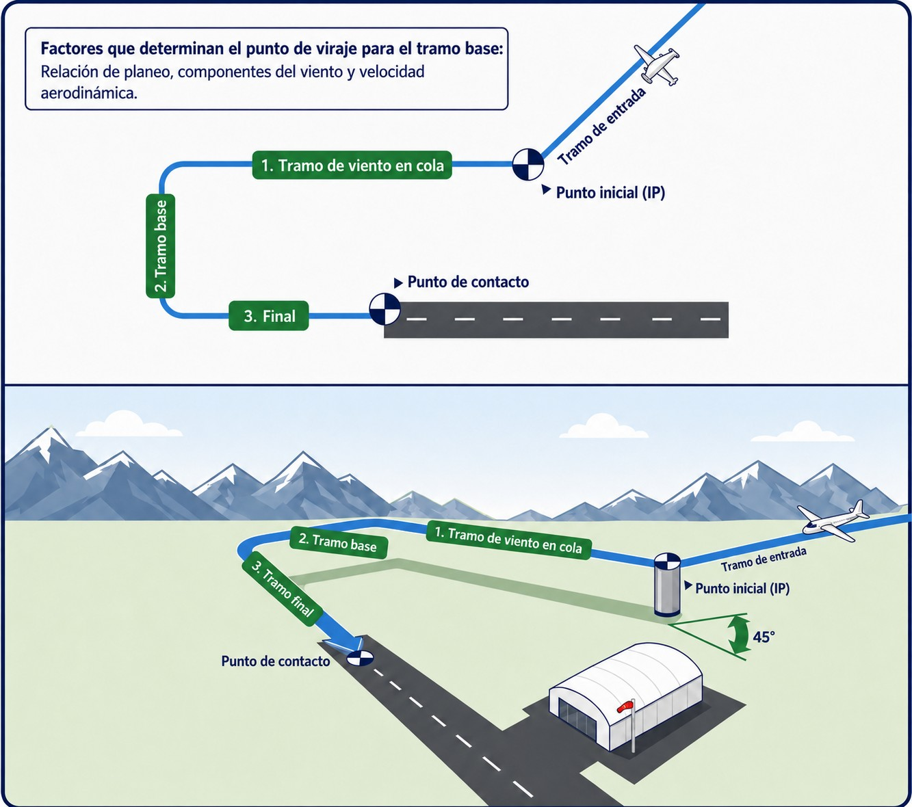
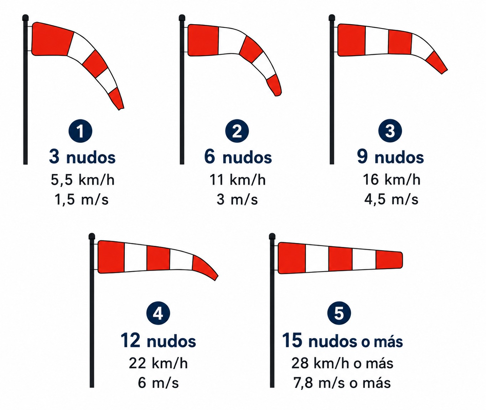
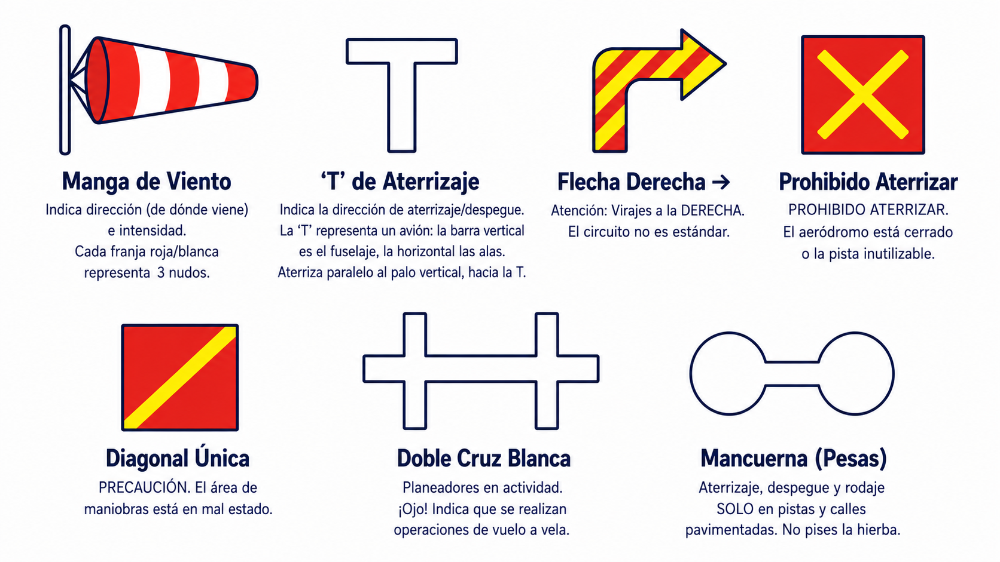

# Aerodromes, external take-off sites

> In the circuit, visual rules reign supreme; learn to read the ground signals when the radio falls silent.
>
>
> In this chapter you will learn:
>
>
> * The aerodrome circuit: its legs (downwind, base, final) and the direction of turns.
> * The signals area: the landing “T”, the windsock and the prohibition symbols on the ground.
> * Basic rules for moving around the aerodrome safely.

## The aerodrome: the realm of visual rules

An aerodrome is much more than a runway. It is an organised system that lets fast aeroplanes and slow gliders live together without colliding, and it rests on two pillars: the **circuit** and the **visual signals**.

## The aerodrome circuit (traffic circuit)

To keep traffic in order, we all fly an imaginary rectangle around the runway. Turns are made to the **left** unless otherwise indicated (@fig-01-cap10-circuito-transito). In a glider, the downwind leg is usually flown at about **200–300 metres AGL**, and ideally you join the circuit at 45° to that leg.

### Key legs for the glider

1. **Downwind**: you fly parallel to the runway, in the opposite direction to the landing. This is where the pre-landing checks go.
2. **Base leg**: you turn 90° towards the runway and make the last adjustment to height and speed. Minimum height to start it: 150 m.
3. **Final**: lined up with the runway, airbrakes out.

{#fig-01-cap10-circuito-transito}

## The signals area

{#fig-01-cap10-manga-viento}

If you have no radio (or it fails), the ground talks to you. The **light signals** a tower can direct at you with a lamp are covered in **Book 4 — Communications**, chapter 7 (communications failure); the ground signals are here. In the **signals area**, a white-bordered square near the tower or the runway, you will find vital symbols (@fig-01-cap10-area-senales):

| Signal | Meaning |
| --- | --- |
| **Windsock** | Shows the direction (where the wind comes from) and strength. (Each red/white band usually represents about 3 knots, 5.5 km/h.) |
| **Landing 'T'** | Shows the landing/take-off direction. The 'T' represents an aircraft: the vertical bar is the fuselage, the horizontal one the wings. **Land parallel to the vertical bar, towards the T**. |
| **Right-hand arrow** | → **Caution**: turns to the **RIGHT**. The circuit is non-standard. |
| **Red square with diagonals** | (Red square with a yellow saltire.) **LANDING PROHIBITED**. The aerodrome is closed or the runway unusable. |
| **Single diagonal** | (Red square with one yellow diagonal.) **CAUTION**. The manoeuvring area is in poor condition. |
| **Double white cross** | **Gliders in operation**. Look out! It shows that gliding operations are taking place. |
| **Dumb-bell** | (White.) Landing, take-off and taxiing **ONLY on paved runways and taxiways**. Keep off the grass. |
: Aerodrome visual signals

{#fig-01-cap10-area-senales}

::: {.callout-tip title="Golden rule"}
Before take-off or when you arrive at a new airfield, **always look for the signals area**. It gives you information (runway in use and direction of turns) at a glance, even without a radio.
:::

## External take-off sites and landings away from aerodromes

Gliding does not always start or end at an aerodrome. The syllabus includes **external take-off sites** (uncertified sites operated from occasionally) and, by the very nature of the glider, **field landings**. Their technique is covered in **Book 6 — Operational Procedures**, chapter 5; what matters here is their legal side:

* **Landowner's permission**: taking off from an external site requires the prior consent of whoever has the use of the land, as well as meeting the conditions set by national rules for flights away from aerodromes.
* **Responsibility of the pilot-in-command**: you are responsible for checking that the site is suitable and the operation safe (dimensions, obstacles, third parties). An external site has no signals area, no information service, and nobody who has inspected the surface for you.
* **After a field landing**: the aircraft may have caused damage (crops, fences) for which you are liable in civil law; compulsory third-party liability insurance covers precisely these cases. Find the landowner, record the condition of the land and agree how the glider will be retrieved; the operational side and dealing with the landowner are developed in **Book 6 — Operational Procedures**.

::: {.postit}
**Chapter summary: aerodromes**

On the ground, visual rules rule:

* **Circuit**: turns to the **left**, unless a signal says otherwise.
* **Signals area**: the windsock shows direction and strength; the landing T, the landing and take-off direction; the right-hand arrow warns of right-hand turns; the red square with yellow diagonals prohibits landing; the red panel with a single diagonal calls for caution because the manoeuvring area is in poor condition; and the double white cross announces gliders in operation.
:::
