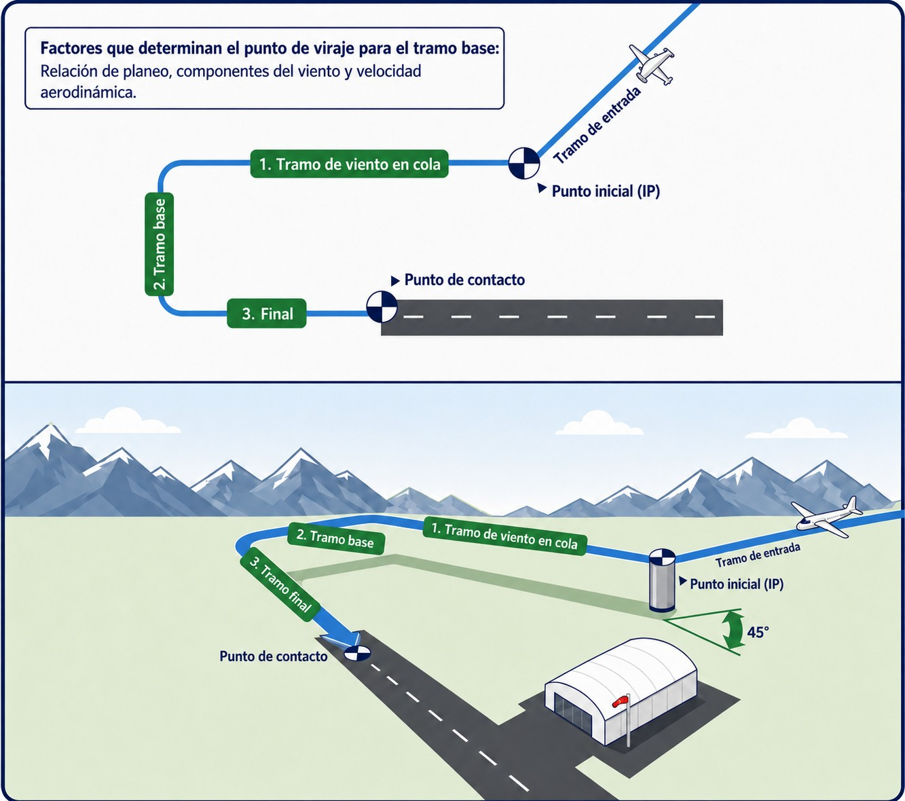
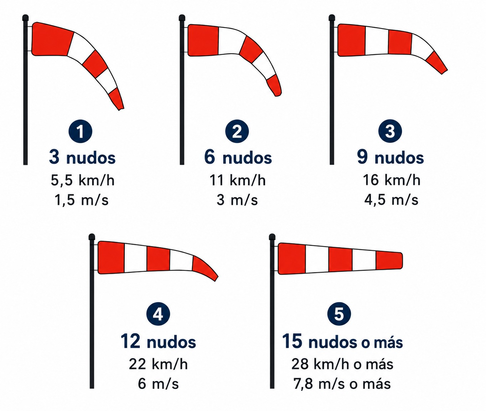

# Aerodromes, external take-off sites

> In the circuit, visual rules come first. Learn to read the ground signals for when the radio goes quiet.
>
>
> In this chapter you will learn:
>
>
> * The aerodrome circuit: its legs (downwind, base, final) and the direction of turns.
> * The signals area: the landing “T”, the windsock and the prohibition symbols on the ground.
> * The legal side of external sites and field landings.

## The aerodrome: the realm of visual rules

An aerodrome is much more than a runway. It is an organised system that lets fast aeroplanes and slow gliders share the same place without colliding, and it rests on two things: the **circuit** and the **visual signals**.

## The aerodrome circuit (traffic circuit)

To keep traffic in order, everyone flies the same imaginary rectangle around the runway. Turns are to the **left** unless a signal says otherwise (@fig-01-cap10-circuito-transito). In a glider, the downwind leg is usually flown at about **200–300 metres AGL**, and ideally you join the circuit at 45° to that leg.

### Key legs for the glider

1. **Downwind**: you fly parallel to the runway, in the opposite direction to the landing. This is where you do the pre-landing checks.
2. **Base leg**: you turn 90° towards the runway and make the last adjustment to height and speed. Usual reference for starting it: about 150 m (an instructional guideline, not a legal minimum; see Book 6, chapter 4).
3. **Final**: lined up with the runway, airbrakes out.

{#fig-01-cap10-circuito-transito}

## The signals area

{#fig-01-cap10-manga-viento}

If you have no radio (or it fails), the ground talks to you. The **light signals** a tower can flash at you with a lamp are covered in **Book 4 — Communications**, chapter 5 (communications failure); this chapter deals with the ground signals. The **signals area**, a white-bordered square near the tower or the runway, holds symbols you must know (@fig-01-cap10-area-senales):

| Signal | Meaning |
| --- | --- |
| **Windsock** | Shows the direction (where the wind comes from) and strength. (Each red/white band usually represents about 3 knots, 5.5 km/h.) |
| **Landing 'T'** | Shows the landing/take-off direction. The 'T' represents an aircraft: the vertical bar is the fuselage, the horizontal one the wings. **Land parallel to the shaft, towards the cross arm** (the horizontal bar). |
| **Right-hand arrow** | → **Caution**: turns to the **RIGHT**. The circuit is non-standard. |
| **Red square with diagonals** | (Red square with a yellow saltire.) **LANDING PROHIBITED**, and the prohibition is liable to be prolonged. |
| **Single diagonal** | (Red square with one yellow diagonal.) **CAUTION** when approaching and landing, because of the bad state of the manoeuvring area or for any other reason. |
| **Double white cross** | **Gliders in operation**. Look out! It shows that gliding operations are taking place. |
| **Dumb-bell** | (White.) Landing, take-off and taxiing **only on runways and taxiways**, which may be grass. |
| **Dumb-bell with black bars** | (White, with a black bar across each circular portion.) Landing and take-off **on runways only**; other manoeuvres need not be confined to runways and taxiways. |
| **Crosses on a runway or taxiway** | (White on runways, yellow on taxiways.) That area is **unfit for use**. |
| **Two digits at the tower** | Take-off direction, in tens of degrees magnetic (e.g. 27 = 270°). |
| **Letter C** | (Black on a yellow background.) Air traffic services reporting office. |
: Aerodrome visual signals (SERA, Appendix 1, 3.2)

{#fig-01-cap10-area-senales}

::: {.callout-tip title="Golden rule"}
Before take-off or when you arrive at a new airfield, **always look for the signals area**. At a glance, and without a radio, it tells you the runway in use and the direction of turns.
:::

## External take-off sites and landings away from aerodromes

A gliding flight does not always start or end at an aerodrome. The syllabus includes **external take-off sites** (uncertified sites used occasionally) and, because of what a glider is, **field landings**. Their technique is covered in **Book 6 — Operational Procedures**, chapter 5. Here we look at the legal side:

* **An adequate site**: Part-SAO calls any site other than an aerodrome that the pilot-in-command selects for take-off or landing an **operating site**, and requires it to be adequate for the type of sailplane and operation (SAO.OP.100). You are the one who checks it: dimensions, obstacles, third parties. An external site has no signals area, no information service and nobody who has inspected the surface for you.
* **Occasional use of a piece of land**: in Spain, land used as an aerodrome on an occasional basis (no more than 40 operations a year or 15 a month) is an **aeródromo eventual**, an occasional aerodrome (Real Decreto 1189/2011, Royal Decree 1189/2011). It is authorised by the autonomous community (regional government); if it lies in a controlled, restricted or danger area, an airspace compatibility report is also needed, and if not, it is enough to tell AESA (Spanish Aviation Safety Agency) where it is and when it will be used.
* **Landowner's permission**: to take off from an external site you need the prior consent of whoever has the use of the land.
* **After a field landing**: if you had filed a flight plan, send an arrival report as soon as possible to the appropriate air traffic services unit, so that the alerting service is not activated (SERA.4020; see **Book 7**, chapter 4). The aircraft may have caused damage (crops, fences) for which whoever operates the glider is liable, you or your club; compulsory third-party liability insurance covers these cases (Regulation (EC) No 785/2004). Find the landowner, record the condition of the land and agree how the glider will be retrieved. The operational side, and how to deal with the landowner, are covered in **Book 6 — Operational Procedures**.

::: {.postit}
**Chapter summary: aerodromes**

Around the aerodrome, visual rules come first:

* **Circuit**: turns to the **left**, unless a signal says otherwise.
* **Signals area**: the windsock shows direction and strength; the landing T, the landing and take-off direction; the right-hand arrow warns of right-hand turns; the red square with yellow diagonals prohibits landing; the red panel with a single diagonal calls for caution because the manoeuvring area is in poor condition; and the double white cross announces gliders in operation.
* **External sites**: the pilot-in-command chooses an adequate site (SAO.OP.100) and needs the landowner's permission; after a field landing with a flight plan, report your arrival.
:::
