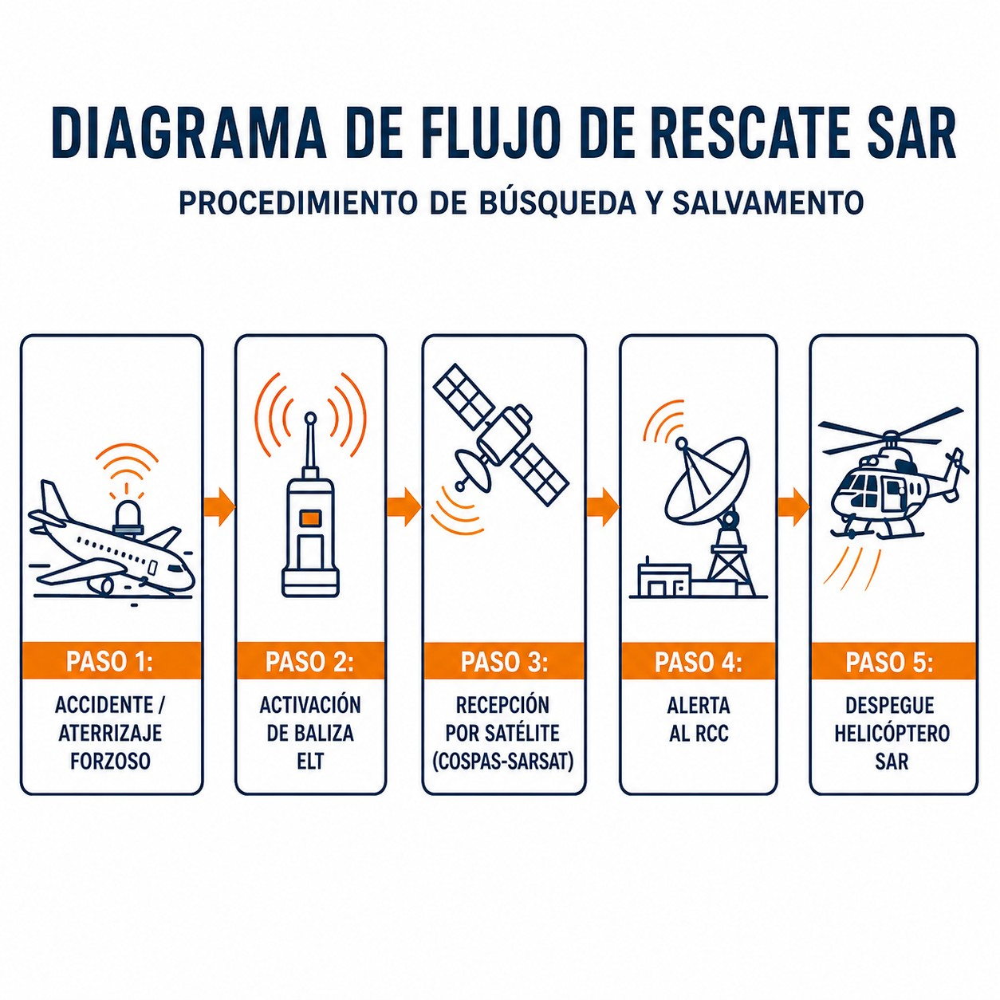
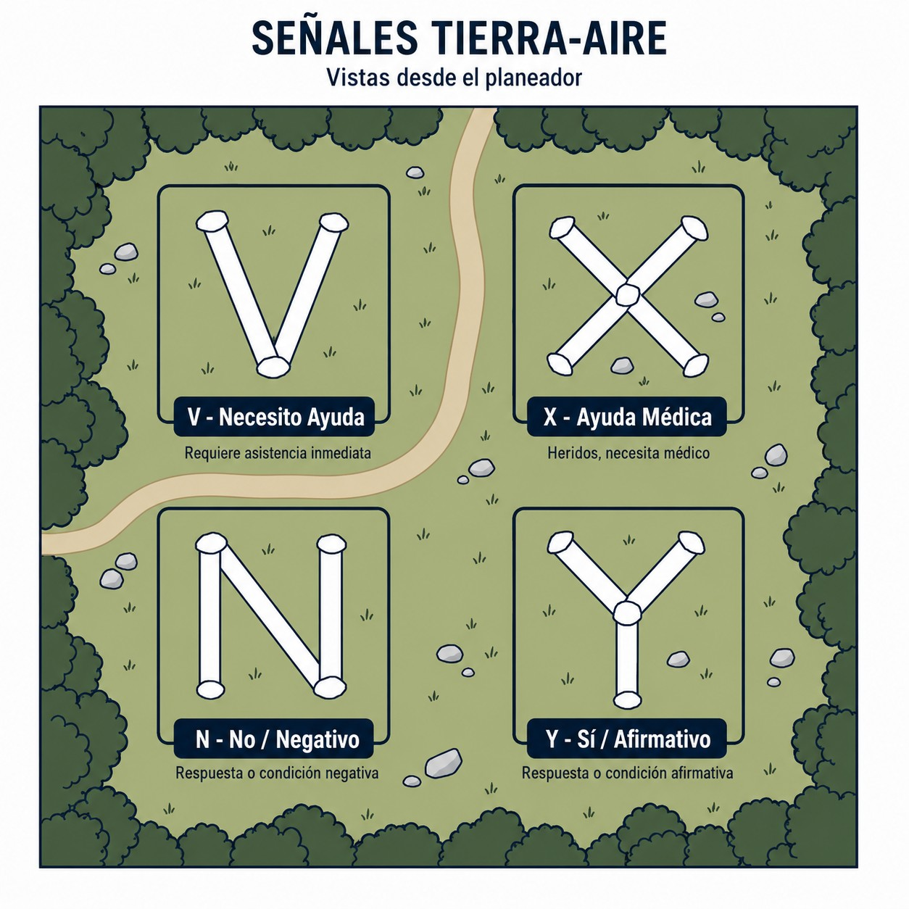

# Search and rescue

> When everything else fails, the Search and Rescue system is your last line of defence. It is how they find you.
>
>
> In this chapter you will learn:
>
>
> * Who coordinates rescue in Spain (the RCCs).
> * The emergency phases: INCERFA (doubt), ALERFA (concern) and DETRESFA (imminent danger).
> * The visual survival code (V, X, N, Y) for communicating without a radio.

## When everything fails: the SAR system

The Search and Rescue service (**SAR**) is your final safety net. In Spain it is run by the **Ejército del Aire** (the Spanish Air and Space Force), supported by other assets, and its mission is simple: find you and save you.

### Organisation

The **RCC** (Rescue Coordination Centre) pulls the strings. Spain has three main ones:

1. **RCC Madrid** (Torrejón Air Base): covers most of the peninsula.
2. **RCC Canarias** (Gando Air Base): covers the archipelago and a vast area of the Atlantic.
3. **RCC Palma** (Son San Juan Air Base): covers the Mediterranean and the Balearic Islands.

There are also **RSCs** (rescue sub-centres) for specific areas.

## The emergency phases (SAR review)

SAR does not go out searching “just because”. It acts in stages that match the severity, in phases activated by ATC or by the RCC itself:

1. **INCERFA (uncertainty phase)**: there is uncertainty about the safety of the aircraft and its occupants. The RCC starts gathering information.
2. **ALERFA (alert phase)**: there is concern for the safety of the aircraft and its occupants. The SAR teams get ready.
3. **DETRESFA (distress phase)**: there is reasonable certainty of grave and imminent danger and that immediate assistance is needed. The assets take off: aircraft and helicopters (@fig-01-cap11-actuacion-accidente).

{#fig-01-cap11-actuacion-accidente}

## The language of survival: ground-to-air signals

If you are on the ground and an aircraft is looking for you, you have to tell it something. Without a radio, use the **visual signals code**: make the signals large (at least 2.5 m) and high-contrast, with cloth, stones or furrows (@fig-01-cap11-senales-tierra-aire).

| Symbol | Meaning | Mnemonic |
| --- | --- | --- |
| **V** | **Require ASSISTANCE** | “V” for *Venid* (Spanish for “come here”). |
| **X** | **Require MEDICAL assistance** | A cross, as on an ambulance or a pharmacy. |
| **N** | **NO** / Negative | “N” for No. |
| **Y** | **YES** / Affirmative | “Y” for Yes. |
| **→** | **Proceeding in this direction** | An arrow showing the heading. |
: Ground-to-air visual signals code

{#fig-01-cap11-senales-tierra-aire}

::: {.callout-warning title="Safety"}
If you pick up a distress signal in flight (visual or on 121.5 MHz):

1. **Note the position**.
2. **Do not block the frequency** (listen first).
3. **Notify ATC**, or whoever you can, immediately.
4. If possible, stay in the area until relieved (without putting yourself in danger).
:::

::: {.postit}
**Chapter summary: search and rescue (SAR)**

If something goes wrong, SAR will come looking for you. Know the phases:

* **INCERFA (uncertainty phase)**: there is uncertainty about the safety of the aircraft and its occupants.
* **ALERFA (alert phase)**: there is concern for the safety of the aircraft and its occupants.
* **DETRESFA (distress phase)**: there is reasonable certainty of grave and imminent danger and that immediate assistance is needed.
* **Ground-to-air signals**: **V** = require assistance; **X** = require medical assistance; **N** = no; **Y** = yes.
:::
