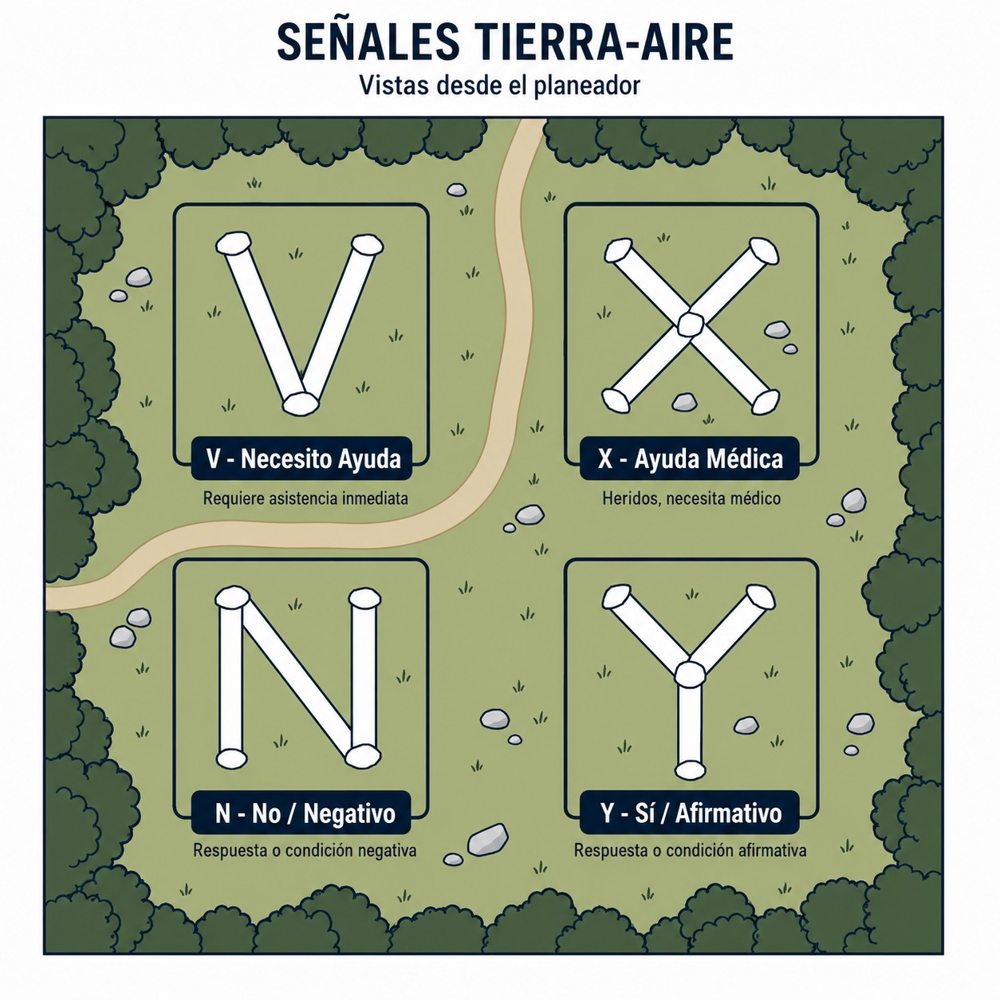

# Search and rescue

> When everything else fails, the Search and Rescue system is your last line of defence. It is how they find you.
>
>
> In this chapter you will learn:
>
>
> * Who coordinates rescue in Spain (the RCCs).
> * The emergency phases: INCERFA (doubt), ALERFA (concern) and DETRESFA (imminent danger).
> * The visual survival code (V, X, N, Y) for communicating without a radio.

## When everything fails: the SAR system

The Search and Rescue service (**SAR**) is your final safety net. In Spain it is the responsibility of the **Ejército del Aire y del Espacio** (the Spanish Air and Space Force), in collaboration with the Ministry of Transport and supported by other assets, and its mission is simple: find you and save you.

### Organisation

The **RCC** (Rescue Coordination Centre; the AIP calls them ARCCs) pulls the strings. Spain has three, one for each search and rescue region (AIP España, GEN 3.6):

1. **ARCC Madrid** (Torrejón): the region that coincides with the Madrid FIR, that is, the centre, west, north and south of the peninsula.
2. **ARCC Palma**: the Barcelona FIR (the north-east of the peninsula and the Levante, the east coast) and the Balearic Islands, plus Andorra.
3. **ARCC Canarias**: the archipelago and a vast area of the Atlantic.

If you fly in Catalonia or the Valencia region, your centre is Palma, not Madrid.

## The emergency phases (SAR review)

SAR does not go out searching “just because”. It acts in stages that match the severity, in phases activated by ATC or by the RCC itself:

1. **INCERFA (uncertainty phase)**: there is uncertainty about the safety of the aircraft and its occupants. The RCC starts gathering information.
2. **ALERFA (alert phase)**: there is concern for the safety of the aircraft and its occupants. The SAR teams get ready.
3. **DETRESFA (distress phase)**: there is reasonable certainty of grave and imminent danger or that immediate assistance is needed. The assets take off: aircraft and helicopters (@fig-01-cap11-actuacion-accidente).

{#fig-01-cap11-actuacion-accidente}

### Emergency beacons: ELT and PLB

The chain in the figure starts with the beacon. An **ELT** (installed in the aircraft) or a **PLB** (personal) transmits on **406 MHz**, the only frequency the Cospas-Sarsat satellites have detected since 2009, and on **121.5 MHz**, which SAR assets use with their direction finders to locate you in the final phase. Register it: the 406 MHz signal carries a code that identifies the beacon and its owner.

Part-SAO requires you to carry life-saving and signalling equipment when you fly over areas in which search and rescue would be especially difficult, and its acceptable means of compliance specifies at least one ELT, one PLB or one equivalent registered emergency locator (SAO.IDE.125 and its AMC1).

## The language of survival: ground-to-air signals

If you are on the ground and an aircraft is looking for you, you have to tell it something. Without a radio, use the **visual signals code**: make the signals large (at least 2.5 m) and high-contrast, with cloth, stones or furrows (@fig-01-cap11-senales-tierra-aire).

| Symbol | Meaning | Mnemonic |
| --- | --- | --- |
| **V** | **Require ASSISTANCE** | “V” for *Venid* (Spanish for “come here”). |
| **X** | **Require MEDICAL assistance** | A cross, as on an ambulance or a pharmacy. |
| **N** | **NO** / Negative | “N” for No. |
| **Y** | **YES** / Affirmative | “Y” for Yes. |
| **→** | **Proceeding in this direction** | An arrow showing the heading. |
: Ground-to-air visual signals code

How will you know the aircraft has understood you? By day, it **rocks its wings**; by night, it flashes its landing lights twice or switches its navigation lights on and off twice. If it makes none of these signals, it has not understood you (AIP España, GEN 3.6).

{#fig-01-cap11-senales-tierra-aire}

::: {.callout-warning title="Safety"}
If you pick up a distress signal in flight (visual or on 121.5 MHz):

1. **Note the position**.
2. **Do not block the frequency** (listen first).
3. **Notify ATC**, or whoever you can, immediately.
4. If possible, stay in the area until relieved (without putting yourself in danger).
:::

::: {.postit}
**Chapter summary: search and rescue (SAR)**

If something goes wrong, SAR will come looking for you. Know the phases:

* **INCERFA (uncertainty phase)**: there is uncertainty about the safety of the aircraft and its occupants.
* **ALERFA (alert phase)**: there is concern for the safety of the aircraft and its occupants.
* **DETRESFA (distress phase)**: there is reasonable certainty of grave and imminent danger or that immediate assistance is needed.
* **Beacons**: a registered 406 MHz ELT or PLB is detected by satellite; 121.5 MHz is used to locate you in the final phase.
* **Ground-to-air signals**: **V** = require assistance; **X** = require medical assistance; **N** = no; **Y** = yes.
:::
