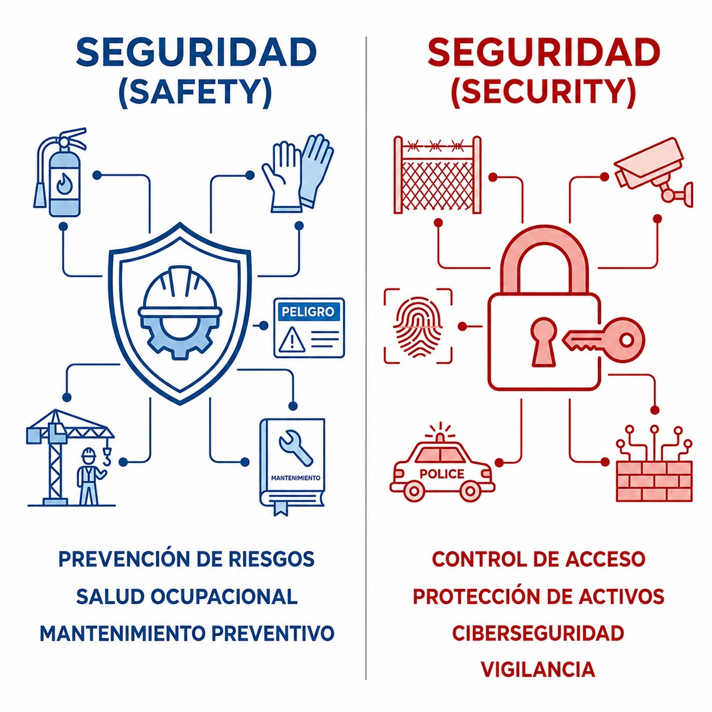
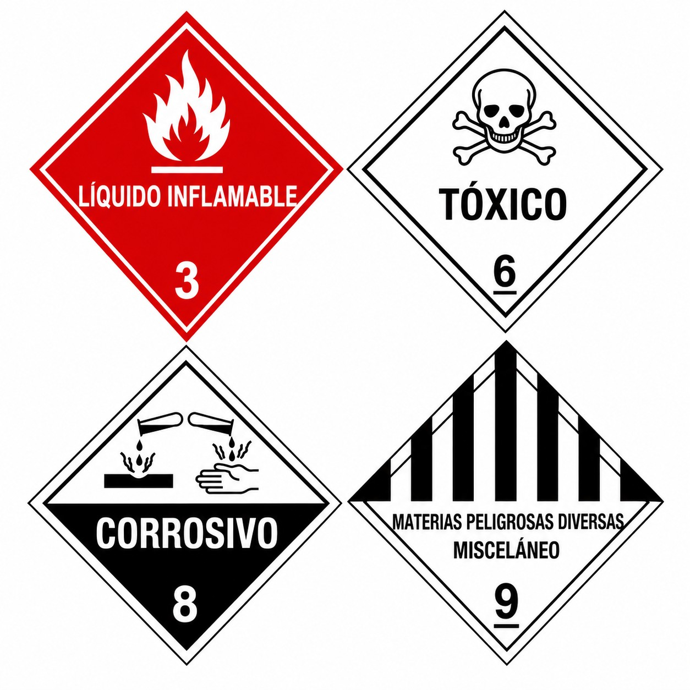

# Security

> Aviation security is not just for the big airlines. Protecting your aircraft from unlawful acts is one of your basic responsibilities as a pilot.
>
>
> In this chapter you will learn:
>
>
> * The difference between avoiding accidents (**safety**) and preventing criminal acts (**security**).
> * How to secure your aircraft on the ground and check that nobody has tampered with it.
> * Which articles are prohibited on board because of the risk they pose.

## Safety vs security: aren't they the same?

Spanish uses a single word, *seguridad*, for both, but in aviation they are two very different ideas (@fig-01-cap12-safety-vs-security):

1. **Safety** (operational safety): preventing unintended **accidents**: the engine not stopping, no collisions, maintenance done properly. In short, “flying safely”.
2. **Security** (aviation security): protecting against intentional **unlawful acts**: nobody stealing your aircraft, nobody planting a bomb, no hijacks. In short, physical protection.

{#fig-01-cap12-safety-vs-security}

## Your responsibility in general aviation

Even if you fly a glider from a small airfield, **security** concerns you too:

* **Access control**: do not leave your aircraft open or accessible to anyone. If you have a hangar, lock it. If not, secure the cockpit.
* **Pre-flight inspection with a security eye**: as well as checking the oil, check whether anyone has tampered with anything. Are there unfamiliar objects in the cockpit? Signs of forced entry?
* **Documentation**: always carry your identification (national ID card, licence). The Guardia Civil or the airport authority may ask to see it at any time, airside or landside.

## Dangerous goods

These are articles or substances that can put health, safety or property at risk. The general rule is simple: you may **not** carry them on board (@fig-01-cap12-mercancias-peligrosas). Reasonable quantities of what the flight or safety requires are allowed (approved medical oxygen, lithium batteries for personal use under certain conditions), always with great care.

{#fig-01-cap12-mercancias-peligrosas}

::: {.callout-warning title="Safety"}
If you see someone loitering around the hangars, tampering with other people's aircraft or behaving suspiciously at the aerodrome, **report it immediately** to the person in charge of the airfield or to the police. Security is everyone's business.
:::

::: {.postit}
**Chapter summary: security**

Keep the two English words apart:

* **SAFETY**: operational safety. Not having an accident while flying.
* **SECURITY**: physical protection. Nobody stealing your aircraft or planting a bomb.
* **Your duty**: do not leave the aircraft open or accessible to strangers, do not carry dangerous goods (except for approved exceptions) and respect the restricted areas of airports.
:::
