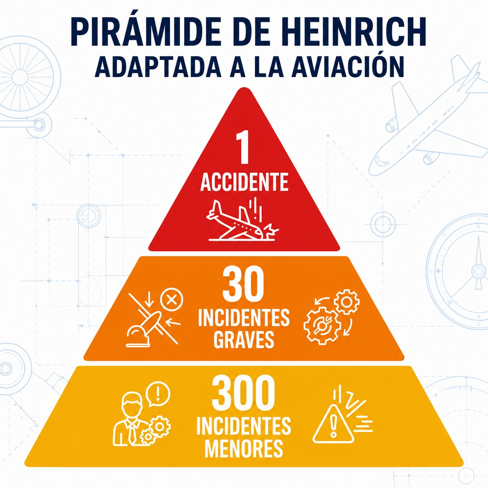
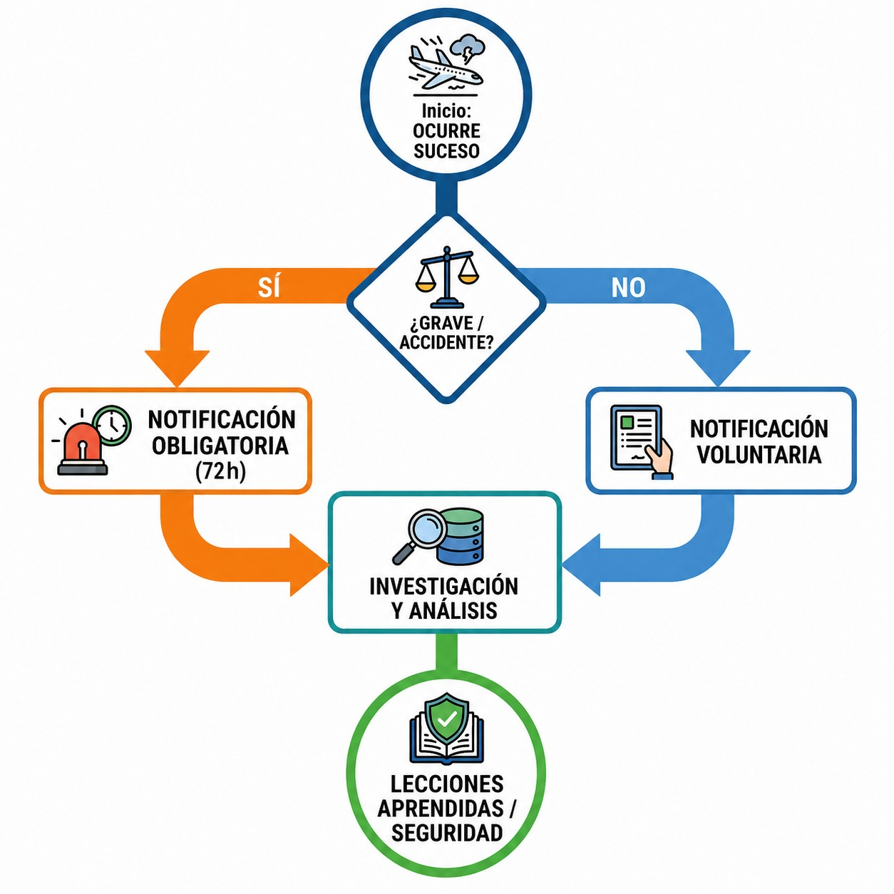

# Accident reporting

> Reporting occurrences is not about finding someone to blame. It is about learning from mistakes so that the sky stays safe for everyone.
>
>
> In this chapter you will learn:
>
>
> * The legal differences between an accident, a serious incident and an incident.
> * When you must report an occurrence to the CIAIAC and to AESA, and the deadlines: without delay to the CIAIAC, within 72 hours to AESA.
> * The “just culture” principle: reporting honest mistakes without fear of punishment.

## Key definitions (Regulations (EU) No 996/2010 and No 376/2014)

In aviation, not everything is an accident, and the legal distinctions matter (@fig-01-cap13-piramide-sucesos):

1. **ACCIDENT**: someone is fatally or seriously injured; the aircraft suffers major structural damage or failures that affect its strength or flight capability; or the aircraft goes missing or becomes inaccessible.
2. **SERIOUS INCIDENT**: an occurrence with a high probability of having ended in an accident. The classic “near miss”.
3. **INCIDENT**: any other occurrence that affects or could affect safety, without reaching the above.

{#fig-01-cap13-piramide-sucesos}

## The duty to report: the occurrence reporting system

To improve safety, the State needs data: not to punish, but to prevent. That is why there are two systems side by side:

* **Mandatory reporting**: all accidents and serious incidents must be reported.
* **Voluntary reporting**: if something happens to you that you do not have to report, but you think others could learn from it, report it anyway.

### To whom, and when?

1. **CIAIAC** (Comisión de Investigación de Accidentes e Incidentes de Aviación Civil, the Spanish civil aviation accident and incident investigation commission): investigates the technical causes so that the same thing does not happen again.
2. **AESA** (Agencia Estatal de Seguridad Aérea, the Spanish Aviation Safety Agency): oversees regulatory compliance.

The deadlines differ. To the CIAIAC, report the accident or serious incident **without delay** (Regulation (EU) No 996/2010, Article 9). To AESA, report the occurrence as soon as possible and in any case within **72 hours** (Regulation (EU) No 376/2014) (@fig-01-cap13-flujo-notificacion).

::: {.callout-tip title="Golden rule"}
European regulations promote a “just culture”. The aim of reporting is **NOT to find someone to blame** (except for gross negligence or wilful misconduct), but to **learn**. Do not be afraid to report your mistakes: it is the only way the system gets better.
:::

{#fig-01-cap13-flujo-notificacion}

::: {.callout-warning title="Safety"}
If you suffer or witness an accident:

1. Priority: **save lives** and prevent further danger (fire, etc.).
2. Then: **DO NOT TOUCH ANYTHING**. The CIAIAC investigation depends on the wreckage being left as it is. Only move it if you must, to free victims or prevent a fire.
:::

::: {.postit}
**Chapter summary: accidents and incidents**

* **Accident**: there are fatal or serious injuries, structural damage to the aircraft, or the aircraft goes missing or becomes inaccessible.
* **Serious incident**: the circumstances indicate that there was a high probability of an accident, or the occurrence endangered (or could have endangered) the safety of the operation.
* **Obligation**: report it **without delay** to the **CIAIAC**; report the occurrence to **AESA** within **72 hours** at most.
* **Evidence**: do not touch anything, except to save lives or prevent another hazard. The investigation needs the wreckage left as it is.
:::
