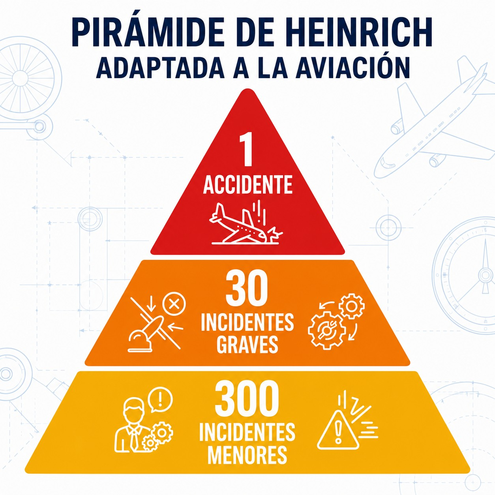
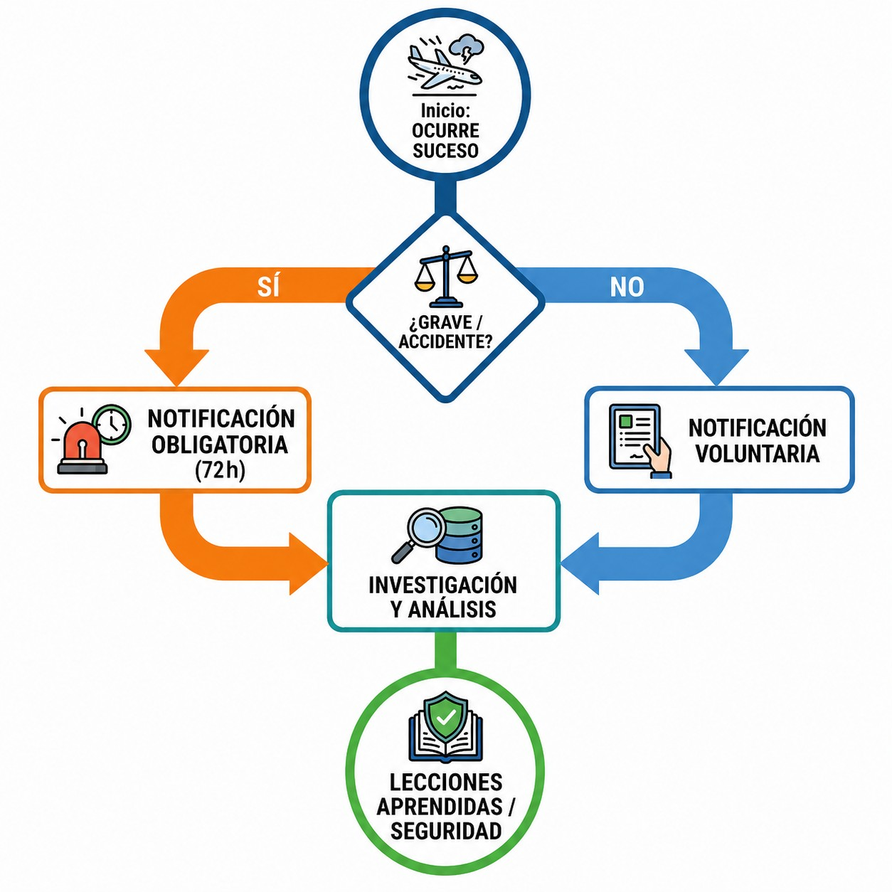

# Accident reporting

> Reporting occurrences is not about finding someone to blame. It is about learning from mistakes so that the sky stays safe for everyone.
>
>
> In this chapter you will learn:
>
>
> * The legal differences between an accident, a serious incident and an incident.
> * When you must report an occurrence to the accident investigation authority and to AESA, and the deadlines: without delay to the former, within 72 hours to the latter.
> * The “just culture” principle: reporting honest mistakes without fear of punishment.

## Key definitions (Regulations (EU) No 996/2010 and No 376/2014)

In aviation, not everything is an accident, and the legal distinctions matter (@fig-01-cap13-piramide-sucesos):

1. **ACCIDENT**: between the time anyone boards with the intention of flight and the time everyone has disembarked, someone is fatally or seriously injured; the aircraft suffers major structural damage or failures that affect its strength or flight capability; or the aircraft goes missing or becomes inaccessible. Note: damage limited to parts such as wing tips, wheels, brakes or the aircraft skin is not enough, on its own, to make it an accident (Regulation (EU) No 996/2010, Article 2).
2. **SERIOUS INCIDENT**: an occurrence with a high probability of having ended in an accident. The classic “near miss”.
3. **INCIDENT**: any other occurrence that affects or could affect safety, without reaching the above.

{#fig-01-cap13-piramide-sucesos}

## The duty to report: the occurrence reporting system

To improve safety, the State needs data: not to punish, but to prevent. That is why there are two systems side by side:

* **Mandatory reporting**: accidents and serious incidents and, in addition, the occurrences listed in Commission Implementing Regulation (EU) 2015/1018 (Annex V, Section 2, sailplanes). They include an airspace infringement, a cable release that endangered the glider, a near collision requiring an emergency avoidance manoeuvre, an emergency call, and being left with no safe landing area.
* **Voluntary reporting**: if something happens to you that you do not have to report, but you think others could learn from it, report it anyway.

### To whom, and when?

1. **The accident investigation authority**: investigates the technical causes so that the same thing does not happen again. Since 15 July 2026 it has been the Autoridad Administrativa Independiente para la Investigación Técnica de Accidentes e Incidentes ferroviarios, marítimos y de aviación civil (the Spanish independent authority for the technical investigation of railway, maritime and civil aviation accidents and incidents), which replaced the CIAIAC (Comisión de Investigación de Accidentes e Incidentes de Aviación Civil, the Spanish Civil Aviation Accident and Incident Investigation Commission) under Ley 2/2024 (Act 2/2024).
2. **AESA** (Agencia Estatal de Seguridad Aérea, the Spanish Aviation Safety Agency): runs the occurrence reporting system (*Sistema de Notificación de Sucesos*) to analyse risks. It may not use what it learns only from your report to bring proceedings against you for an unintentional error or an oversight (Regulation (EU) No 376/2014, Article 16(6)).

The deadlines differ. To the investigation authority, report the accident or serious incident **without delay** (Regulation (EU) No 996/2010, Article 9). To AESA, report the occurrence within **72 hours** of becoming aware of it (Regulation (EU) No 376/2014, Article 4(7)), through your organisation's system or, if you do not belong to one, directly to AESA's occurrence reporting system.

::: {.callout-tip title="Golden rule"}
European regulations promote a “just culture”. The aim of reporting is **NOT to find someone to blame** (except for gross negligence or wilful misconduct), but to **learn**. Do not be afraid to report your mistakes: it is the only way the system gets better.
:::

<!-- RETIRADA hasta rehacerla (auditoría del libro 01, NOR-05: la figura daba por voluntaria la notificación de cualquier suceso que no fuera accidente o incidente grave). Ver recursos/auditorias/seguimiento-libro-01.md.
{#fig-01-cap13-flujo-notificacion}
-->

::: {.callout-warning title="Safety"}
If you suffer or witness an accident:

1. Priority: **save lives** and prevent further danger (fire, etc.).
2. Then: **DO NOT TOUCH ANYTHING**. The technical investigation depends on the wreckage being left as it is. Only move it if this is necessary for safety reasons or to help the injured, or if the person in control of the site authorises it; and, if you can, photograph anything before you move it (Regulation (EU) No 996/2010, Article 13).
:::

::: {.postit}
**Chapter summary: accidents and incidents**

* **Accident**: there are fatal or serious injuries, structural damage to the aircraft, or the aircraft goes missing or becomes inaccessible.
* **Serious incident**: an incident in which the circumstances indicate that there was a high probability of an accident (Regulation 996/2010 gives examples in its Annex).
* **Obligation**: report it **without delay** to the **accident investigation authority** (formerly the CIAIAC); report the occurrence to **AESA** within **72 hours** at most.
* **What must be reported**: not only accidents and serious incidents, but also the occurrences listed in Regulation 2015/1018, such as an airspace infringement, a near collision with an avoidance manoeuvre or a cable release that endangered the glider.
* **Evidence**: do not touch anything, except to save lives or prevent another hazard. The investigation needs the wreckage left as it is.
:::
