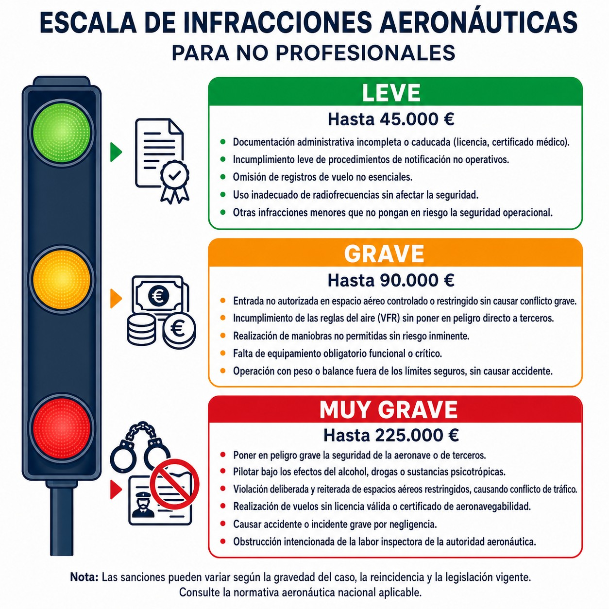

# National law

> European rules are not the whole story: national legislation also governs what we do. Knowing the Aviation Safety Act spares you costly legal surprises.
>
>
> In this chapter you will learn:
>
>
> * The role of the Aviation Safety Act (LSA 21/2003) in Spain.
> * Who is who between the DGAC and AESA: one sets the policy, the other oversees compliance.
> * The penalty regime: minor, serious and very serious infringements, and their consequences.

## Spanish legislation: the national framework

On top of the European regulations (EASA/SERA), Spain has its own legislation, which supplements the EU framework and fills in its detail. The main law is **Ley 21/2003, de 7 de julio, de Seguridad Aérea (LSA)**, the Spanish Aviation Safety Act 21/2003 of 7 July.

## The Directorate General of Civil Aviation (DGAC)

The **Dirección General de Aviación Civil (DGAC)**, the Spanish Directorate General of Civil Aviation, is the part of the Ministry of Transport and Sustainable Mobility that designs the strategy and directs aviation policy.

AESA oversees and sanctions; the DGAC works on the policy and regulatory side. It designs the strategy for the aviation sector, drafts and proposes national rules, represents Spain in bodies such as ICAO and coordinates the different organisations in the sector.

::: {.callout-note title="Airmanship"}
Think of the **DGAC** as the one that writes the “rules of the game” (policy and strategy), and of **AESA** as the “referee” that makes sure they are followed day to day (oversight and sanctions).
:::

## AESA: Spain's air police

The **Agencia Estatal de Seguridad Aérea (AESA)**, the Spanish Aviation Safety Agency, created by Real Decreto 184/2008 (Royal Decree 184/2008), enforces the civil aviation rules in Spain. It checks that operators, pilots, maintenance workshops and aerodromes comply with them. It also regulates air transport, air navigation and airport security, analyses the risks to air transport safety, and has the power to impose **sanctions** when the rules are broken.

## Infringements and sanctions

The LSA classifies infringements by severity (@fig-01-cap14-infracciones). The examples below summarise it (unofficial translation):

### Minor infringements

* Unjustified delays in submitting documentation.
* Minor breaches of administrative procedures that do not affect safety.
* Minor documentation breaches.

### Serious infringements

* Flying without a valid licence for the type of aircraft.
* Breaking the rules of the air without causing serious risk.
* Not carrying the mandatory documentation on board.

### Very serious infringements

* Flying under the influence of **alcohol or drugs**.
* **Gross negligence** causing an accident or a person's death.
* Operating an aircraft without a valid **Certificate of Airworthiness**.
* **Forging** aeronautical qualifications, licences or documentation.

{#fig-01-cap14-infracciones}

::: {.callout-warning title="Safety"}
Fines can be **very high**, even for private pilots. Flying without a licence, without insurance or under the influence of alcohol can cost you thousands of euros and a ban from flying. Not knowing the law does **NOT** excuse you from complying with it.
:::

::: {.callout-tip title="Golden rule"}
If you have any doubt about whether an operation is legal (e.g. flying close to a controlled airport, carrying passengers without recency), **ask your club, your instructor or AESA first**. Better to ask than to end up facing disciplinary proceedings.
:::

::: {.postit}
**Chapter summary: national law**

Besides the European rules, Spain applies the **Aviation Safety Act (LSA 21/2003)**.

* It sets out the regime of infringements and sanctions: the **very serious** ones (death or accident) can lead to a ban from flying.
* **DGAC**: defines aviation policy (the “rules of the game”).
* **AESA**: oversees and sanctions (the “referee”).
:::
