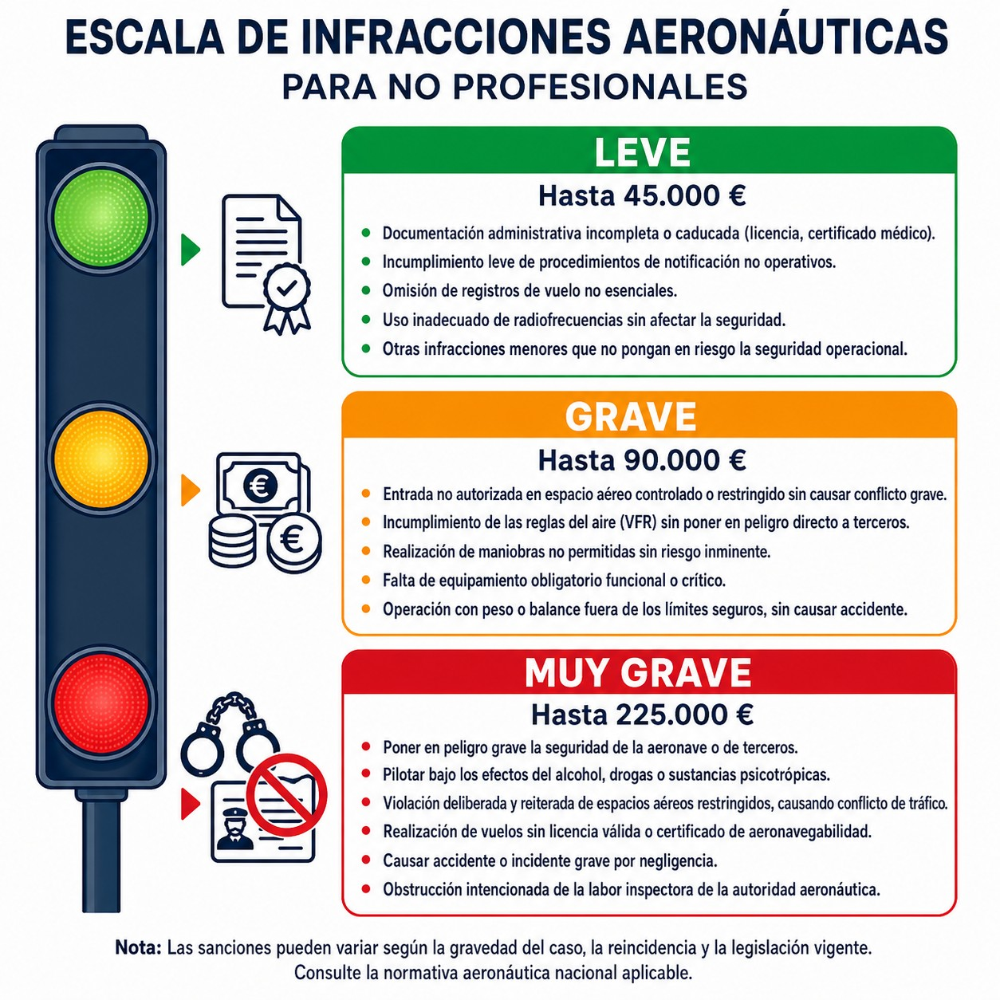

# National law

> European rules are not the whole story: national legislation also governs what we do. Knowing the Aviation Safety Act spares you costly legal surprises.
>
>
> In this chapter you will learn:
>
>
> * The role of the Aviation Safety Act (LSA 21/2003) in Spain.
> * Who is who between the DGAC and AESA: one sets the policy, the other oversees compliance.
> * The penalty regime: minor, serious and very serious infringements, and their consequences.

## Spanish legislation: the national framework

On top of the European regulations (EASA/SERA), Spain has its own legislation, which supplements the EU framework and fills in its detail. These are the pieces that affect you most:

* **Ley 48/1960, sobre Navegación Aérea**, the Spanish Air Navigation Act: the general law of Spanish civil aviation.
* **Ley 21/2003, de 7 de julio, de Seguridad Aérea (LSA)**, the Spanish Aviation Safety Act 21/2003 of 7 July: it allocates responsibilities, regulates inspection and sets out the infringements and sanctions. It is the main subject of this chapter.
* **Ley 209/1964, Penal y Procesal de la Navegación Aérea**, the Spanish Air Navigation Criminal and Procedural Act: aviation crimes.
* **Real Decreto 1180/2018** (Royal Decree 1180/2018): implements the European rules of the air (SERA) in Spain.
* **Real Decreto 1088/2020** (Royal Decree 1088/2020): completes the occurrence reporting regime.
* **Ley 2/2024** (Act 2/2024): creates the independent authority that investigates accidents, which replaced the CIAIAC.

## The Directorate General of Civil Aviation (DGAC)

The **Dirección General de Aviación Civil (DGAC)**, the Spanish Directorate General of Civil Aviation, is the part of the Ministry of Transport and Sustainable Mobility that designs the strategy and directs aviation policy.

AESA oversees and sanctions; the DGAC works on the policy and regulatory side. It designs the strategy for the aviation sector, drafts and proposes national rules, represents Spain in bodies such as ICAO and coordinates the different organisations in the sector.

::: {.callout-note title="Airmanship"}
Think of the **DGAC** as the one that writes the “rules of the game” (policy and strategy), and of **AESA** as the “referee” that makes sure they are followed day to day (oversight and sanctions).
:::

## AESA: Spain's air police

The **Agencia Estatal de Seguridad Aérea (AESA)**, the Spanish Aviation Safety Agency, created by Real Decreto 184/2008 (Royal Decree 184/2008), enforces the civil aviation rules in Spain. It checks that operators, pilots, maintenance workshops and aerodromes comply with them. It also regulates air transport, air navigation and airport security, analyses the risks to air transport safety, and has the power to impose **sanctions** when the rules are broken. It is also the body that **issues your licence** and keeps the aircraft register (Real Decreto 184/2008, Article 9), and it runs the occurrence reporting system.

## Infringements and sanctions

The LSA does not classify a pilot's conduct item by item: it grades infringements by what they lead to (Article 44).

* **Minor**: failing to meet any of your safety obligations (flying with a valid licence, not flying with impaired physical or mental capacity, operating an airworthy aircraft, following the operating rules, carrying the required documents, holding the compulsory insurance), if nothing else happens.
* **Serious**: the same failure, if it causes a serious incident, serious injuries or damage of between €5,000 and €15,000.
* **Very serious**: if it causes an accident, a person's death or damage of more than €15,000.

Some conduct is defined separately, with its own severity: failing to report an occurrence is minor; failing to notify a serious incident to the accident investigation authority is serious; failing to notify it of an accident, or obstructing its investigation, is very serious (Article 50).

Fines for a private individual range from a warning or €60 up to €45,000 for minor infringements, from €45,001 to €90,000 for serious ones and from €90,001 to €225,000 for very serious ones (Article 55(1)). In addition, a serious infringement can lead to the suspension of your licence for up to five years, and a very serious one to its revocation; two very serious infringements within a year mean three years' disqualification (Article 56).

And some conduct is more than an administrative infringement: setting out on a flight under the influence of alcohol or drugs is a **criminal offence** (Ley 209/1964, Penal y Procesal de la Navegación Aérea, Article 31).

{#fig-01-cap14-infracciones .corregir}

::: {.callout-warning title="Safety"}
Fines can be **very high**, even for private pilots. Flying without a licence or without insurance can cost you thousands of euros and, if it ends in a serious incident or an accident, the suspension or revocation of your licence; flying under the influence of alcohol is, on top of that, a crime. Not knowing the law does **NOT** excuse you from complying with it.
:::

::: {.callout-tip title="Golden rule"}
If you have any doubt about whether an operation is legal (e.g. flying close to a controlled airport, carrying passengers without recency), **ask your club, your instructor or AESA first**. Better to ask than to end up facing disciplinary proceedings.
:::

::: {.postit}
**Chapter summary: national law**

Besides the European rules, Spain applies the **Aviation Safety Act (LSA 21/2003)**.

* It sets out the regime of infringements and sanctions. Failing to meet your safety obligations is **minor**; **serious** if it causes a serious incident or serious injuries, and **very serious** if it causes an accident or a death. Serious infringements can lead to the suspension of your licence for up to five years and very serious ones to its revocation.
* Flying under the influence of **alcohol or drugs** is, in addition, a **crime** (Ley 209/1964).
* **DGAC**: defines aviation policy (the “rules of the game”).
* **AESA**: oversees and sanctions (the “referee”).
:::
