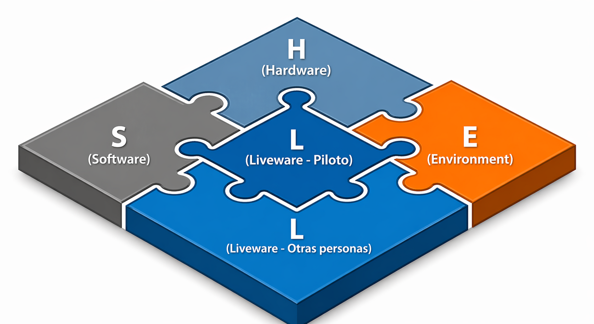
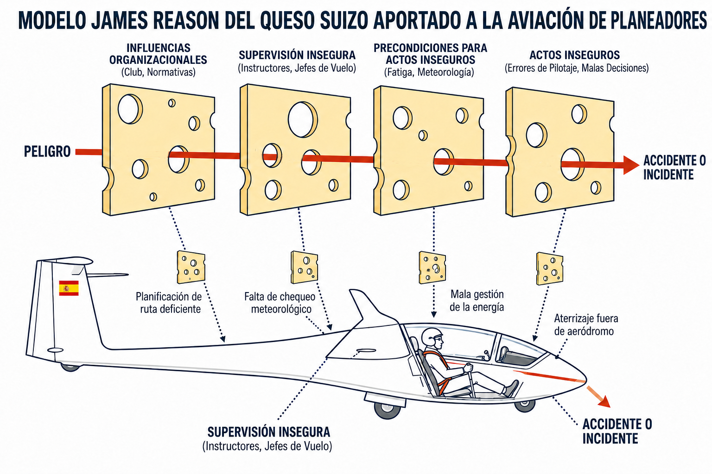
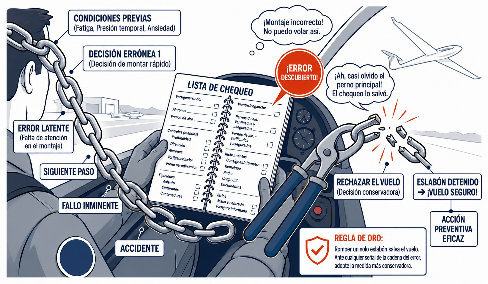
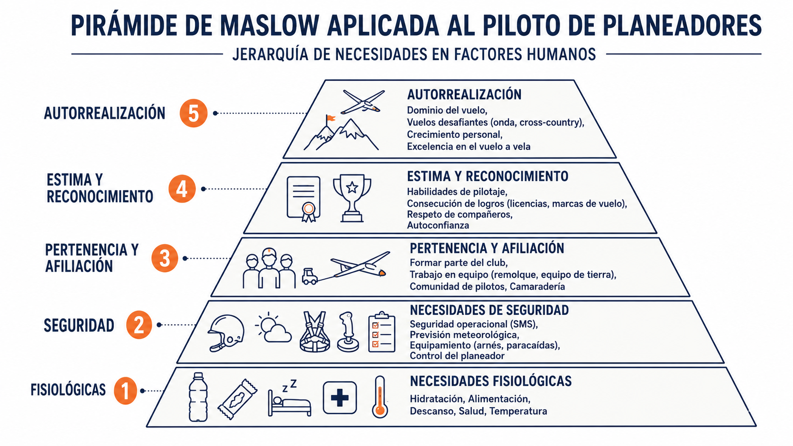

# Human factors: basic concepts

> Stick-and-rudder technique is not enough. Most gliding accidents have a human cause, and almost all of them could have been avoided. This chapter gives you a framework for understanding why we make mistakes and how to put barriers in place before an error turns into consequences.
>
>
> In this chapter you will learn:
>
>
> * **The SHELL model**: how you interact with software, hardware, the environment and other people.
> * **Human error and the Swiss cheese model**: why errors are inevitable and how failures line up.
> * **The error chain**: why breaking a single link is enough to prevent the accident.
> * **Influences on behaviour**: peer pressure, just culture and Maslow's pyramid.

## Introduction to human factors and flight safety

Gliding demands constant coordination between the pilot, the aircraft and an environment that never stops changing. For decades, pilot training focused almost entirely on handling the controls (**stick and rudder skills**). Experience has shown, however, that flawless technique does not by itself make a flight safe. This is where **human factors** come in.

ICAO (International Civil Aviation Organization) defines human factors as the environmental, organisational and job factors, and the individual characteristics, that influence behaviour in the aviation environment and directly affect health and safety. In practical terms, it is about understanding how the pilot interacts with the aircraft, the procedures, the weather and everyone else involved in the operation.

The pilot is not infallible. Perception, memory and the ability to process complex information under pressure all have built-in limits. The discipline of human factors does not try to turn the pilot into someone who never makes mistakes. It teaches you to **recognise your physiological and psychological limitations**, accept them and apply proven strategies to manage them, so that your aeronautical decision-making (**Aeronautical Decision-Making**, ADM) improves.

## The human factor in aviation accidents

As aviation technology has advanced, the share of accidents caused by mechanical failure has fallen considerably. Current statistics show that **the human factor is the main cause, or a contributing factor, in approximately 90 % of accidents in general aviation and gliding**. The lesson in that figure is simple: the vast majority of these accidents are foreseeable and, therefore, **avoidable**.

Broken down, the human component in gliding accidents usually looks like this:

* **Poor decision-making (approx. 40 %):** The main factor. It includes pressing on into deteriorating weather or leaving the search for a field landing too late.
* **Handling errors (approx. 30 %):** Mistakes in flying technique or in handling the controls, often linked to distraction.
* **Poor pre-flight preparation (approx. 12 %):** Critical omissions while rigging the glider or during the pre-take-off checks, such as not connecting the controls properly or not securing the canopy.
* **Insufficient situational awareness (approx. 6 %):** Losing spatial awareness or visual contact with other traffic, with the risk of a collision in flight (**mid-air collision**).

::: {.callout-warning title="Safety"}
The EASA (European Union Aviation Safety Agency) Safety Review shows that the most critical phases of a glider flight are landing (approximately 50 % of accidents) and take-off (21 %). Keep your attention at its highest during these phases, with a cockpit free of distractions and every system checked.
:::

In fatal accidents (up to 26 % according to EASA data), the main cause is loss of control in flight, which often ends in a **stall and spin**, particularly dangerous at low height in the circuit. Other serious causes include collisions with terrain (17 %) and badly handled emergencies after incomplete winch launches (10 %).

Knowing these statistics lets you focus your attention on the phases and situations with the highest risk, and adopt more conservative decision criteria where experience shows the margins are narrowest.

## Conceptual models: the SHELL model

Gliding does not happen in a vacuum: the pilot is constantly interacting with their surroundings. To understand that interaction, ICAO uses the **SHELL model**, a conceptual framework first developed by the psychologist Elwyn Edwards in 1972 (as the SHEL model) and later refined by Frank Hawkins, who added the second L for other people. The name is an acronym of its components, which fit together like the pieces of a jigsaw puzzle, with the human factor always at the centre (@fig-02-cap01-modelo-shell):

* **Software (S):** The non-physical elements. It includes the applicable regulations, flight manuals, standard procedures, **checklists** and aeronautical symbols.
* **Hardware (H):** The machine. It covers the glider itself, the instruments on board and any other physical tool or equipment.
* **Environment (E):** Where the operation takes place. It includes both the external conditions (weather, visibility, turbulence) and those inside the cockpit (noise, temperature, ergonomics).
* **Liveware (L, other people):** The people you deal with during the flight, such as your instructor, the ground crew, controllers or other pilots.
* **Liveware (L, the central self):** You, the pilot-in-command (**Pilot in Command**). It refers to your physical and cognitive abilities, your level of training and experience, and your state of fatigue or stress.

{#fig-02-cap01-modelo-shell}

Safety depends on the interfaces between your “central self” and the other blocks. If the pieces do not fit perfectly (for example, if the **Liveware-Environment** interface is poor because radio interference makes communication difficult), the door opens to human error.

## Human error: types and the Swiss cheese model

According to James Reason, human error is any departure from a planned sequence of physical or mental actions that prevents the intended result. Modern aviation safety thinking assumes that **to err is human and inevitable**. The aim is not to eliminate errors altogether, which is impossible, but to catch them early and put defensive barriers in place before they have consequences.

James Reason illustrated this process with the **Swiss cheese model**: each layer of the safety system (training, procedures, checklists, supervision) acts as a barrier with holes in it. When the holes in every layer line up, the accident happens (@fig-02-cap01-queso-suizo).

{#fig-02-cap01-queso-suizo}

Pilot failures fall into two categories, depending on the intention behind the act:

* **Error:** An unintentional deviation. The pilot gets it wrong without meaning to, through lack of attention or by applying the wrong technique.
* **Violation:** A deliberate breach of a rule or procedure. Repeated without consequences, it breeds false confidence and makes risky behaviour normal.

Depending on when they show up relative to the accident, errors are either:

* **Latent errors:** Weaknesses already present in the system, such as poor initial training or a flawed procedure that invites failure.
* **Active errors:** The immediate mistake that sets off the accident chain, such as attempting a turn at low speed and low height.

::: {.callout-note title="Airmanship"}
To make errors less likely, use the checklists even when you know the procedure by heart, ask your instructor to assess you regularly and watch out for anything that degrades performance, such as fatigue or the complacency that comes with experience.
:::

## Preventing and mitigating error

Accidents rarely have a single cause. Most result from a series of wrong decisions, pre-existing conditions and latent errors that line up to form the **error chain** (@fig-02-cap01-cadena-error). The Swiss cheese model described in the previous section is a picture of exactly this process.

The most important practical consequence is that **breaking a single link in the chain is enough to prevent the accident**. A conservative decision, an extra check or turning down the flight when you have reasonable doubts is enough to stop the process before it leads to consequences.

{#fig-02-cap01-cadena-error}

::: {.callout-tip title="Golden rule"}
**Breaking a single link saves the flight.** At any sign that the error chain has started (deteriorating weather, an unresolved defect, high fatigue), take the most conservative option available. It is the most effective action any pilot can take.
:::

## Influences on human behaviour

Gliding has a strong social side. The pilot operates in an environment where dealings with the club, the school, the instructors and fellow pilots constantly shape their decisions. Recognising these influences is the first step towards neutralising their effect on safety.

### The social environment and peer pressure

At an aerodrome, one of the most common forms of influence is **peer pressure**. When most of the club's pilots decide to take off despite a marginal crosswind or an unfavourable forecast, there is an unspoken pressure not to be left out. You need to recognise when a flying decision rests on other people's opinions rather than on your own technical judgement. The signature in the glider's logbook is personal and cannot be handed over: the responsibility for the decision lies with the pilot-in-command alone.

### Organisational culture and just culture

The way a club handles errors defines its **organisational culture**. Historically, aviation responded to error by punishing it: whoever made a mistake was sanctioned or reprimanded. Far from improving safety, that approach encouraged cover-ups. Damage went unreported for fear of punishment and ended up causing accidents on later flights.

Today, **just culture** (**Just Culture**) is actively promoted: a framework that accepts that unintentional error is inevitable and treats it as a chance for everyone to learn, without reprisals, provided there is no deliberate negligence or conscious breach of procedures.

::: {.callout-note title="Airmanship"}
Encourage a just culture around you. If a glider is accidentally damaged while being towed or put away (a knock to the tailplane on the way into the hangar, say), report it immediately to the instructor or the engineer in charge. Covering it up puts at risk the next pilot, who will fly that aircraft without knowing about the damage.
:::

### Motivation and performance: Maslow's pyramid

A pilot's performance is closely tied to their motivation and psychological balance. Abraham Maslow set out a hierarchy of human needs that runs from the most basic (health, food, physical safety) to the higher ones (recognition, personal achievement, self-fulfilment). This hierarchy applies directly to flying.

When the drive to reach a goal (beating a personal best, winning a competition) overrides the basic level of safety, the pilot may take unjustified risks: pressing on into bad weather, flying over areas with no landing options or ignoring warning signs. In the same way, flying in a strongly negative emotional state (stress, a personal conflict or serious money worries) narrows attention and invites carelessness in the critical phases of flight.

The practical conclusion is clear: safety sits at the base of the pyramid and cannot be made subordinate to any higher goal (@fig-02-cap01-piramide-maslow).

{#fig-02-cap01-piramide-maslow}

::: {.postit}
**Chapter summary: basic concepts of human factors**

* **SHELL model**: The basic conceptual framework for analysing how the pilot (Liveware) interacts with the other elements: Software (procedures), Hardware (the aircraft), Environment (the surroundings) and other Liveware (other people).
* **Error management**: Human error is taken to be inevitable. The aim of safety is not to eliminate it altogether, but to detect it in time and manage its consequences before they affect the safety of the flight.
* **Error chain**: Accidents rarely have a single cause. They are the sum of small errors and latent conditions. Your job is to break the chain as soon as you spot the first link.
* **Influences on behaviour**: How we think under pressure, our everyday motivation to fly set against unmet basic needs (Maslow's pyramid) and direct pressure from fellow pilots at the hangar all deeply affect our mental capacity as commanders. We should support a strict “just culture” in which technical errors can be reported freely without reprisals, so that we learn together instead of hiding damage that could prove fatal.
:::
