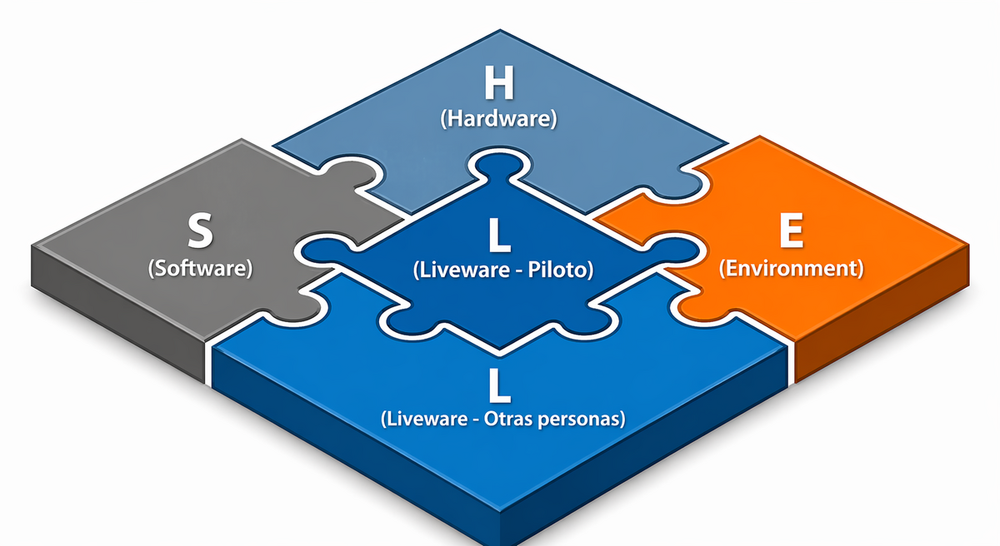
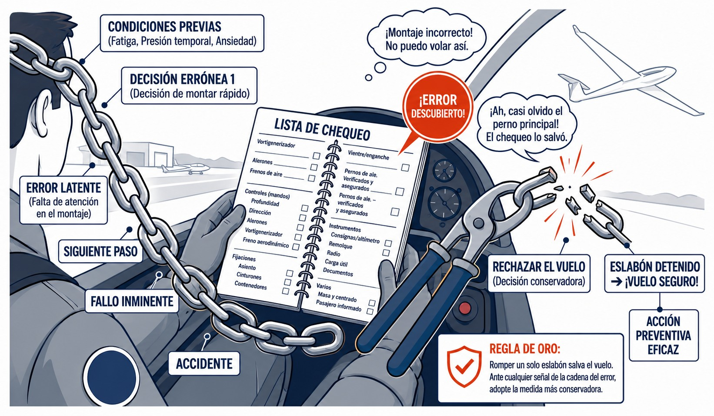
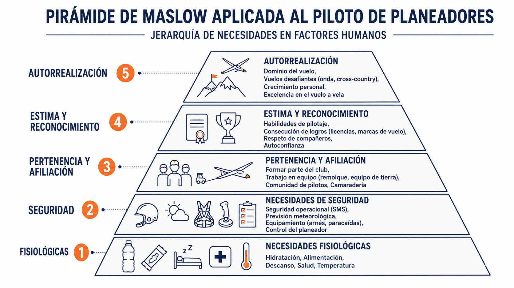

# Human factors: basic concepts

> Stick-and-rudder technique is not enough. Most gliding accidents have a human cause, and almost all of them could have been avoided. This chapter explains why we make mistakes and how to stop an error before it has consequences.
>
>
> In this chapter you will learn:
>
>
> * **The SHELL model**: how you interact with software, hardware, the environment and other people.
> * **Human error and the Swiss cheese model**: why errors are inevitable and how failures line up.
> * **The error chain**: why breaking a single link is enough to prevent the accident.
> * **Influences on behaviour**: peer pressure, just culture and Maslow's pyramid.

## Introduction to human factors and flight safety

In gliding, the pilot, the aircraft and an ever-changing environment have to work together all the time. For decades, pilot training focused almost entirely on handling the controls (**stick and rudder skills**). Experience has shown that flawless technique alone does not make a flight safe. That is where **human factors** come in.

According to the Human Factors Training Manual of the International Civil Aviation Organization (ICAO, Doc 9683), human factors is about people in their living and working situations: their relationship with machines, with procedures and with the environment about them, and their relationships with other people. In practice, it means understanding how the pilot deals with the aircraft, the procedures, the weather and everyone else involved in the flight.

Pilots make mistakes. Perception, memory and the ability to process complex information under pressure all have built-in limits. Human factors will not turn you into a pilot who never gets it wrong. They teach you to **recognise your physiological and psychological limitations**, accept them and manage them with proven strategies, so that your aeronautical decision-making (**Aeronautical Decision-Making**, ADM) improves.

## The human factor in aviation accidents

As aircraft have become more reliable, fewer accidents are caused by mechanical failure. Across aviation as a whole, the FAA attributes about **80 % of accidents** to human factors. In gliding, an analysis of some 250 glider accident reports from Germany, the United States and Austria (C. Ceipek, 2019) attributes **close to 90 % to pilot error**. These figures come from specific studies, not from a law; their value is above all teaching. Read them the other way round: the vast majority of these accidents are foreseeable, and therefore **avoidable**.

The same analysis breaks down the human share like this:

* **Poor decision-making (approx. 40 %):** The main factor. It includes pressing on into deteriorating weather or leaving the search for a field landing too late.
* **Handling errors (approx. 30 %):** Mistakes in flying technique or in handling the controls, often linked to distraction.
* **Poor pre-flight preparation (approx. 12 %):** Critical omissions while rigging the glider or during the pre-take-off checks, such as not connecting the controls properly or not securing the canopy.
* **Insufficient situational awareness (approx. 6 %):** Losing spatial awareness or visual contact with other traffic, with the risk of a collision in flight (**mid-air collision**).

::: {.callout-warning title="Safety"}
EASA's *Annual Safety Review 2019* shows that the most critical phases of a glider flight are landing (approximately 50 % of accidents) and take-off (21 %), averaged over 2008 to 2017 and counting only accidents with a known phase. Be at your most alert in these phases, with no distractions in the cockpit and every system checked.
:::

According to the same review, of the fatal glider accidents between 2014 and 2018, about 26 % were due to **stall and spin**, which is particularly dangerous at low height in the circuit; 17 % to collisions with the hill; and 10 % to badly handled incomplete winch launches.

Knowing these figures tells you where to focus: on the riskiest phases and situations, with more conservative decisions where experience shows the margins are narrowest.

## Conceptual models: the SHELL model

Gliding does not happen in a vacuum: the pilot is always interacting with their surroundings. To understand that interaction, ICAO uses the **SHELL model**, a conceptual framework first developed by the psychologist Elwyn Edwards in 1972 (as the SHEL model) and later drawn by Frank Hawkins (1975) as the block diagram ICAO uses today. The name is made up of the initials of its components, which fit together like jigsaw pieces around the human at the centre (@fig-02-cap01-modelo-shell):

* **Software (S):** The non-physical elements. It includes the applicable regulations, flight manuals, standard procedures, **checklists** and aeronautical symbols.
* **Hardware (H):** The machine. It covers the glider itself, the instruments on board and any other physical tool or equipment.
* **Environment (E):** Where the operation takes place. It includes both the external conditions (weather, visibility, turbulence) and those inside the cockpit (noise, temperature, ergonomics).
* **Liveware (L, other people):** The people you deal with during the flight, such as your instructor, the ground crew, controllers or other pilots.
* **Liveware (L, the central self):** You, the pilot-in-command (**Pilot in Command**). It refers to your physical and cognitive abilities, your level of training and experience, and your state of fatigue or stress.

{#fig-02-cap01-modelo-shell}

Safety depends on where your “central self” meets the other blocks. When the pieces do not fit (say the **Liveware-Environment** interface is poor because radio interference makes communication difficult), human error gets its opening.

## Human error: types and the Swiss cheese model

According to James Reason, human error occurs when a **planned** sequence of physical or mental actions fails to achieve its intended outcome, and the failure cannot be put down to chance. Modern aviation safety starts from the idea that **to err is human and inevitable**. You cannot eliminate errors altogether. What you can do is catch them early and put barriers in their way before they have consequences.

James Reason illustrated this process with the **Swiss cheese model**: each layer of the safety system (training, procedures, checklists, supervision) acts as a barrier with holes in it. When the holes in every layer line up, the accident happens (@fig-02-cap01-queso-suizo).

{#fig-02-cap01-queso-suizo .corregir}

Pilot failures fall into two categories, depending on intent:

* **Error:** An unintentional deviation. The pilot gets it wrong without meaning to, through lack of attention or by applying the wrong technique.
* **Violation:** A deliberate breach of a rule or procedure. Repeated without consequences, it breeds false confidence and makes risky behaviour normal.

Errors can also be sorted by when they show up relative to the accident:

* **Latent errors:** Weaknesses already present in the system, such as poor initial training or a flawed procedure that invites failure.
* **Active errors:** The immediate mistake that sets off the accident chain, such as attempting a turn at low speed and low height.

::: {.callout-note title="Airmanship"}
To make errors less likely, use the checklists even when you know the procedure by heart, ask your instructor to assess you regularly and watch out for anything that degrades performance, such as fatigue or the complacency that comes with experience.
:::

## Preventing and mitigating error

Accidents rarely have a single cause. Most come from a series of wrong decisions, pre-existing conditions and latent errors that line up to form the **error chain** (@fig-02-cap01-cadena-error). The Swiss cheese model in the previous section is a picture of exactly that.

The practical lesson is that **breaking a single link in the chain is enough to prevent the accident**. A conservative decision, an extra check, or saying no to the flight when you have real doubts: any one of them stops the chain before it gets anywhere.

{#fig-02-cap01-cadena-error .corregir}

::: {.callout-tip title="Golden rule"}
**Breaking a single link saves the flight.** At any sign that the error chain has started (deteriorating weather, an unresolved defect, high fatigue), take the most conservative option available. Nothing else a pilot can do works as well.
:::

## Influences on human behaviour

Gliding is a social sport. The club, the school, the instructors and your fellow pilots all shape your decisions, all the time. To stop that influence affecting safety, you first have to notice it.

### The social environment and peer pressure

At an aerodrome, one of the commonest influences is **peer pressure**. When most of the club decides to fly despite a marginal crosswind or a poor forecast, nobody wants to be the one left on the ground. Learn to spot when a flying decision rests on other people's opinions rather than on your own judgement. The signature in the glider's logbook is yours and nobody else's: the decision belongs to the pilot-in-command alone.

### Organisational culture and just culture

How a club handles errors defines its **organisational culture**. For a long time, aviation punished error: whoever made a mistake was sanctioned or reprimanded. Far from improving safety, that encouraged cover-ups. Damage went unreported for fear of punishment and later caused accidents.

Today the industry promotes **just culture** (**Just Culture**) instead. It accepts that unintentional errors will happen and treats them as a chance for everyone to learn, actions, omissions and decisions that match each person's experience and training are not punished, but gross negligence, wilful violations and destructive acts are not tolerated (Regulation (EU) No 376/2014, Art. 2(12)).

::: {.callout-note title="Airmanship"}
Encourage a just culture around you. If a glider is accidentally damaged while being towed or put away (a knock to the tailplane on the way into the hangar, say), report it immediately to the instructor or the engineer in charge. Covering it up puts at risk the next pilot, who will fly that aircraft without knowing about the damage.
:::

### Motivation and performance: Maslow's pyramid

How well you fly depends a great deal on your motivation and state of mind. Abraham Maslow set out a hierarchy of human needs in five levels: at the base, **physiological** needs (rest, hydration, food); above them, **safety** needs (feeling safe); then **belonging** and **esteem**; and at the top, **self-actualisation**. It maps directly onto flying.

When the drive to reach a goal (beating a personal best, winning a competition) overrides those basic needs, the pilot may take unjustified risks: pressing on into bad weather, flying over areas with no landing options or ignoring warning signs. Flying in a strongly negative emotional state (stress, a personal conflict, serious money worries) does similar damage: it narrows your attention and invites carelessness when it matters most.

The practical conclusion: the lower levels —physiological and safety needs— must be met before you pursue higher goals, and no achievement justifies sacrificing them (@fig-02-cap01-piramide-maslow).

{#fig-02-cap01-piramide-maslow .corregir}

::: {.postit}
**Chapter summary: basic concepts of human factors**

* **SHELL model**: The basic conceptual framework for analysing how the pilot (Liveware) interacts with the other elements: Software (procedures), Hardware (the aircraft), Environment (the surroundings) and other Liveware (other people).
* **Error management**: Human error is inevitable. The aim is not to eliminate it but to catch it in time and manage its consequences before they affect the flight.
* **Error chain**: Accidents rarely have a single cause. They are the sum of small errors and latent conditions. Your job is to break the chain as soon as you spot the first link.
* **Influences on behaviour**: How we think under pressure, our motivation to fly when basic needs are unmet (Maslow's pyramid) and direct pressure from fellow pilots at the hangar all deeply affect our mental capacity as pilots-in-command. Support a strict “just culture”, so that errors are reported without fear of reprisals and everyone learns from them, instead of hiding damage that could end in an accident.
:::
