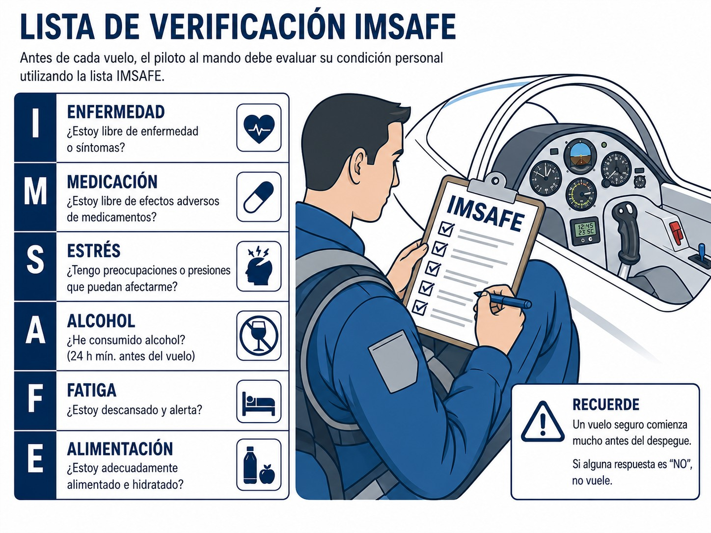
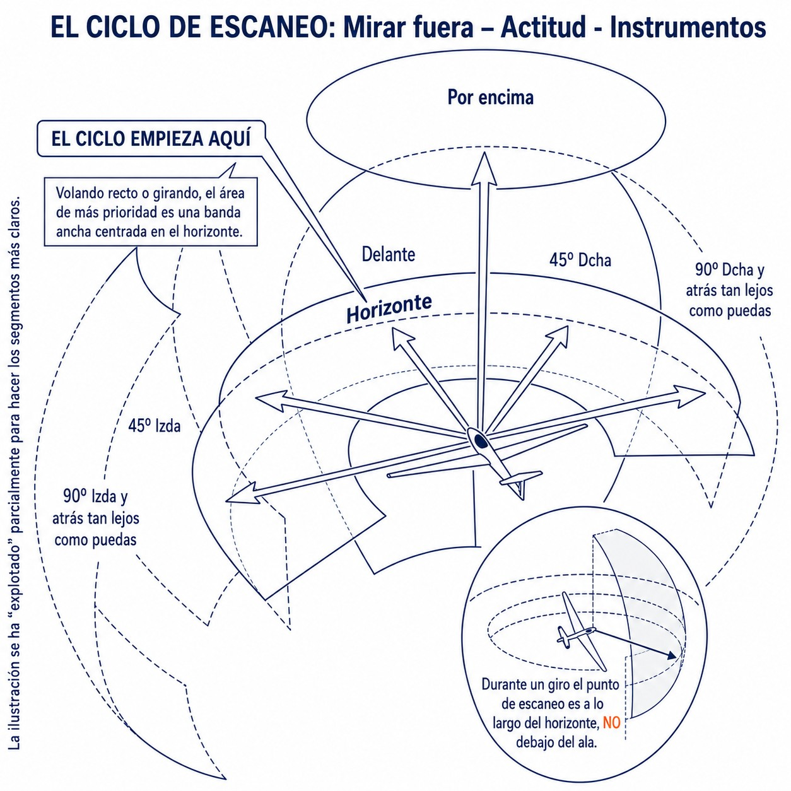
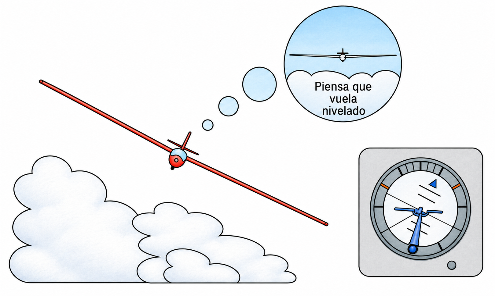
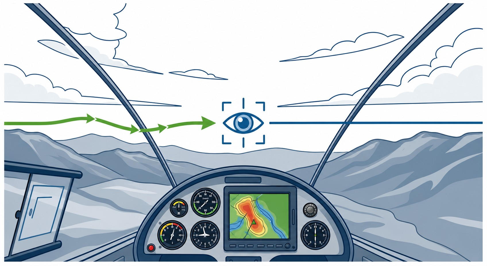
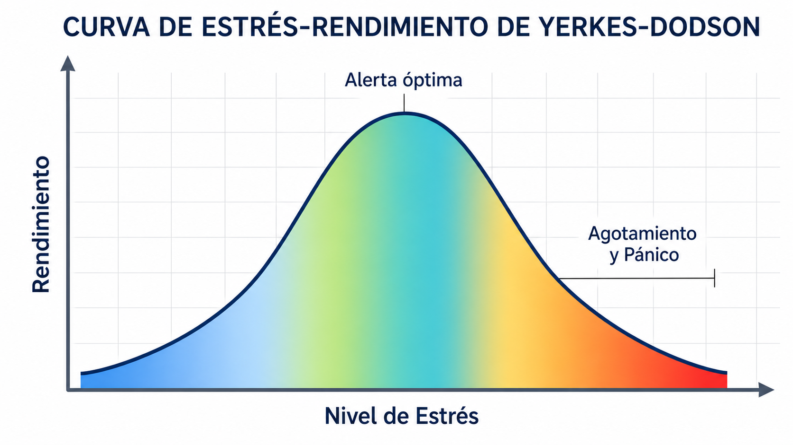

# Basic aviation physiology and health maintenance

> This chapter is about what flying does to your body and what keeps a glider pilot fit to fly: the effects on the senses, the toll that altitude takes, and the non-negotiable rules you must meet before you take the controls.

## Fitness to fly and self-assessment (the IMSAFE checklist)

Your physical and mental health is the most critical part of flight safety. European rules are clear: you must not fly if you are unfit for any reason (injury, illness, medication, fatigue, the effects of any psychoactive substance) or simply if you feel unwell.

::: {.callout-important title="Regulation"}
You must consult an Aero-Medical Examiner (AME) or a general practitioner if you have had a significant injury or surgery, started regular medication, become pregnant or started wearing corrective lenses for the first time. These situations call for a new assessment of your medical fitness, and you must not fly as pilot-in-command until the cause has been resolved and you are fit again (**MED.A.020 Decrease in medical fitness**).
:::

To check yourself systematically before you get into the cockpit, aviation uses a personal checklist with the mnemonic **IMSAFE** (“I am safe”). It matters as much as the pre-flight inspection of the glider (@fig-02-cap02-imsafe-checklist):

{#fig-02-cap02-imsafe-checklist}

* **I - *Illness*:** Do you have any symptoms right now? Even a cold can get worse with the pressure changes in flight (dysbarism), and it wears down your attention. Do not fly with a fever or a viral infection.
* **M - *Medication*:** Are you taking any medicine, prescription or not? Many over-the-counter drugs, such as antihistamines for allergies, cause drowsiness and impair cognitive and motor performance.
* **S - *Stress*:** Are you under significant psychological or emotional pressure? Serious problems at work, at home or with money take up mental space you need for judgement and flying.
* **A - *Alcohol*:** Have you had a drink recently? The effects last long after the last glass. The aviation rule is “bottle to throttle” (**bottle to throttle**): at least 8 hours since the last drink.
* **F - *Fatigue*:** Have you rested and slept enough? Fatigue significantly reduces alertness, decision-making ability and reaction times.
* **E - *Eating*:** Have you eaten and drunk properly in the last few hours? Flying on an empty stomach lowers blood glucose and saps concentration. On long days, drinking matters as much as eating: drink water regularly to prevent dehydration and heatstroke.

::: {.callout-tip title="Golden rule"}
Before every flight, run through the **IMSAFE** list in your head. If any item comes out badly, the only safe decision is to cancel the flight (**NO-GO**).
:::

## The sensory system and orientation

### Vision

Vision is the glider pilot's most important sense. We evolved to move in two dimensions on the ground, and flying in three makes demands on our perception that nothing else does.

#### Basic anatomy of the eye

The inside of the eye works much like the sensor of a camera. Light enters and falls on the **retina**, which contains two main types of photoreceptor cells:

* **Cones:** They work well in good light. They let us see fine detail at the centre of our visual field and tell colours apart (day vision).
* **Rods:** They sit mainly in the periphery of the retina. They cannot tell colours apart, but they are very sensitive to dim light and excellent at detecting sideways movement (night and peripheral vision).

Where the optic nerve joins the retina there is an anatomical “blind spot”: anything whose image falls exactly there goes unseen. Short-sightedness, too much sun, smoking and fatigue also reduce visual acuity considerably.

::: {.callout-important title="Regulation"}
Correct colour perception is mandatory. At your initial medical you will have to pass tests such as the Ishihara test. If you cannot show safe colour discrimination, your sailplane pilot licence (governed by Part-SFCL) will be restricted to daytime flight (**Day** VFR).
:::

#### Visual scanning techniques

In visual flight, collisions are prevented mainly by **See and Avoid**. A good pilot spends more than 95% of the time looking outside and checks the instruments only in quick glances of 2 to 4 seconds.

To scan the sky effectively, use the clock method (@fig-02-cap02-escaneo-visual):

1. Take the glider's nose as **12 o'clock**.
2. Sweep the sky in structured sectors, from **9** round to **3**.
3. Pay special attention to the band of sky closest to the horizon, because aircraft flying at your altitude will mostly appear there.

{#fig-02-cap02-escaneo-visual}

::: {.callout-note title="Airmanship"}
Before starting a turn (to the right, for example), make a habit of taking a quick look back over the opposite side. That way you know no traffic is closing in from the blind spot before you bank.
:::

::: {.callout-warning title="Safety"}
The worst collision risk in free flight is a head-on track, common when ridge soaring or running along cloud streets. A glider coming straight at you hardly moves across your visual field: it just suddenly gets bigger. A pilot needs at least 3 seconds to react and carry out an avoiding manoeuvre, which should preferably be **a turn to the right**.
:::

#### Night vision and visual illusions in flight

Vision deteriorates as light and oxygen fall. Even at fairly low altitudes (6,000 feet), blood oxygen drops enough to affect the peripheral rods in poor light, so your eyesight falls off sooner than you would expect.

In darkness, over snow or over water there is little texture or outline to go on, and the brain easily fills the gap with dangerous illusions:

* **Black hole approach (Black Hole Approach):** On final towards a lit runway surrounded by very dark terrain with no lights at the sides (a lake, for instance), the brain loses its true sense of depth. The illusion makes you believe you are higher than you are and that the approach path is steeper than normal. You feel the urge to lower the nose to “correct” it, and risk hitting the ground short of the threshold. The remedy is to hold the speed shown on the airspeed indicator and ignore the sensation until you have textured visual references on the ground again.
* **Autokinetic illusion:** If you stare at a single light in the dark for several seconds, the eye's tiny involuntary movements make the light seem to move. You may then wonder whether it is another aircraft. The remedy is to keep your scan going and never fix your eyes on a single light for more than a few seconds.

{#fig-02-cap02-ilusiones-opticas}

### The ear and the vestibular system

Dysbarisms are disorders caused by small pockets of gas trapped in the body, which expand and contract as the outside pressure changes, exactly as **Boyle's law** predicts.

As the glider climbs, atmospheric pressure falls and the trapped air expands, trying to get out. Three parts of the body are mainly affected:

1. **Middle ear:** The passage that equalises pressure with the outside is the Eustachian tube. In the climb, the expanding air usually escapes through it without much trouble, even with some congestion. The real problem comes in the **descent**: if the tube is inflamed by a cold, air cannot get back in, the eardrum is pushed inwards and an unbearable pain sets in, **barotitis media**.
2. **Sinuses:** As with the ears, a temporary blockage causes intense nerve pain around the eyebrows or cheekbones.
3. **Digestive tract and tooth decay:** Gassy food before a flight means painful cramps at altitude. In the same way, a tiny air bubble trapped under a filling can cause a fierce “barodontic” toothache in the climb.

::: {.callout-note title="Airmanship"}
Upper airway congestion (colds, severe allergic rhinitis) automatically rules you out of flying (**No-Go**). A barotrauma in the descent hurts so much that you will not be able to fly the glider safely.
:::

## Spatial disorientation and sensory illusions

To stay oriented while thermalling under the clouds, you combine three sources of information: vision, the proprioceptive system (signals from muscles and tendons) and, above all, the **vestibular system** of the inner ear, which senses acceleration.

Our senses evolved for moving over the ground in two dimensions under constant gravity. Without a reliable view of the horizon, the brain falls easily for illusions that cause **spatial disorientation**: a false sense of your actual position or attitude.

* **Vestibular illusions:** A long, steady turn in a thermal can fool the semicircular canals into sensing that the glider is level or barely turning (an illusion of stability). Conversely, severe turbulence can make you pull sharply on the stick when the aircraft is actually in a normal attitude.
* **Visual illusions:** A sloping approach perspective, a lack of texture on the ground (snow, water) or a runway much wider or narrower than usual can distort your estimate of height over the threshold.

::: {.callout-warning title="Safety"}
When the horizon is lost and what you “feel” contradicts the instruments, ignore your instinct. **Trust the instruments** (airspeed indicator, yaw string, slip ball and artificial horizon) and act on them.
:::

## Motion sickness

Motion sickness (**motion sickness**), or airsickness, is what happens when the brain gets conflicting signals from different senses. In a glider it usually starts when what your eyes see does not match the accelerations and rotations your inner ear feels.

A typical case: the pilot is circling steadily in a thermal and looks down to programme the flight computer. The eyes, fixed on the still screen, report no movement, but the labyrinth of the inner ear keeps detecting changes in G-force and rotation. The conflict can bring on sudden tiredness, pallor, cold sweats, nausea and vomiting.

::: {.callout-note title="Airmanship"}
Motion sickness can affect even seasoned pilots, especially after a spell without flying or in severe turbulence. There is nothing to be ashamed of. Accept it, and always keep sick bags within reach.
:::

{#fig-02-cap02-cinetosis-fijacion}

To prevent and manage airsickness, make these habits second nature (@fig-02-cap02-cinetosis-fijacion):

* **Look at the horizon:** Nothing works better than an outside reference. At the first signs of discomfort, lift your chin, find the natural horizon and fix your eyes on a distant point. Avoid looking at the instruments or reading papers on your kneeboard.
* **Reduce movement:** Keep sudden head movements to a minimum. Prolonged negative accelerations make you more susceptible to sickness, so avoid extreme changes of attitude when there is no need.
* **Flights with passengers:** Be careful with inexperienced passengers on board. Keep trial flights to about 30 minutes and turn gently, so they enjoy it.
* **Hydration:** Dehydration in a cockpit heated by the sun through the canopy makes the discomfort worse. Carry enough water, drink regularly and open the fresh-air vent to get cool air on your face.

::: {.callout-warning title="Safety"}
Do not take antihistamine travel-sickness tablets (such as **Biodramina**, a common dimenhydrinate brand in Spain) before flying. They are contraindicated in aviation: they make you deeply drowsy, which ruins the reaction times and alertness you need to fly safely.
:::

If you still feel too sick to fly properly, safety comes first. In a two-seater, hand over to the qualified pilot on board by saying “**you have control**”. In a single-seater, settle the glider into straight and level flight to reduce the sensory conflict in the inner ear, open the ventilation fully and cut the flight short by landing as soon as possible.

## Carbon monoxide poisoning (a risk in motor gliders and tugs)

A pure glider has no engine, but much of today's fleet is touring motor gliders (**Touring Motor Gliders**, TMG) or gliders with a retractable engine. In these aircraft the cabin heating usually takes its heat straight from the exhaust, so turning it on brings a risk of **carbon monoxide (CO) poisoning**. During an aerotow take-off you can also breathe in exhaust gases from the tug.

Carbon monoxide has no smell, no colour and no taste. It binds to haemoglobin about 200 times more readily than oxygen does, and once it has done so the haemoglobin can no longer carry O₂ to the brain. The result is **anaemic hypoxia**, at any altitude. A figure often quoted in the aeromedical literature is that smoking a few cigarettes before a flight raises the CO saturation of haemoglobin to a level that degrades night vision as much as already flying at several thousand feet, even when you are low. (The exact figures vary with the source and the number of cigarettes; the operational message, that smoking before flight cuts into your night vision, does not change.)

The first symptoms are vague: a headache or slight muscle weakness, quickly followed by nausea, disorientation, blurred vision and misplaced euphoria. Left unchecked, it ends in loss of consciousness.

::: {.callout-warning title="Safety"}
In motor gliders, have a carbon monoxide detector fitted to the panel and check its expiry date. At any symptom (headache, bright red lips), or if the detector patch changes colour, act at once: **turn off the heating**, open the ventilation fully, use supplemental oxygen if you have it and land without delay.
:::

## Hypothermia and cold at altitude

Gliding often takes you high. In the standard atmosphere, the outside air cools by about 2 °C per 1,000 ft. At 4,000 m you can meet –20 °C, and near the tropopause –50 °C or lower.

The semi-reclined flying position and the lack of muscular activity make **hypothermia** (a core body temperature below 35 °C) more likely. Sunshine through the canopy can keep your upper body comfortably warm while your feet and legs, in the shade of the instrument panel, get cold enough for frostbite.

Hypothermia starts with shivering and progresses to lethargy, mental confusion and slurred speech. Worse, the cold dulls your ability to notice your own decline. It can also kill the batteries of electronic instruments (including the oxygen regulator) just when you need them.

::: {.callout-note title="Airmanship"}
For winter wave flying, always dress **in layers**. Avoid tight shoes or socks at all costs: a foot that sits still on the rudder pedals for hours needs free blood flow if it is not to freeze. Choose boots with plenty of room, thermal insoles and gloves that leave you completely free to move the control stick.
:::

## Physiological stress and its effects

Stress in the cockpit is not always the enemy. Some tension (the feeling just before a competition take-off, or before your first ridge flight) is good and even necessary. It wakes up the nervous system, raises alertness and sharpens your reactions: it is what brings you to peak performance.

Two frameworks help here, and they describe different things. The first, the **Yerkes-Dodson curve**, relates arousal to performance. It has the shape of an inverted U: too little tension gives you an apathetic pilot and too much a pilot who freezes, with the peak in the middle (@fig-02-cap02-curva-estres).

{#fig-02-cap02-curva-estres}

The second, Hans Selye's **General Adaptation Syndrome**, describes how the body responds when tension goes on for a long time, in three stages:

1. **Alarm stage (reaction):** Faced with something new or a sudden threat, the body releases a surge of adrenaline. Heart rate and breathing shoot up, the pupils dilate and the brain goes on full alert, ready to fight or flee.
2. **Resistance stage (adaptation):** If the stressor does not go away within a few minutes (for example, battling one strong sink after another far from a safe landable field), the body works hard to adjust and keep you composed.
3. **Exhaustion stage:** When the situation is too intense or lasts too long, the reserves used in stage two run out. Exhaustion sets in, and your ability to think and to handle the glider collapses fast.

### Hyperventilation

One physical sign of acute stress (not of any real lack of oxygen) is **hyperventilation**: breathing too fast and too deeply because of anxiety.

This rapid breathing flushes large amounts of carbon dioxide (CO₂) out of the blood and raises its pH (respiratory alkalosis). Paradoxically, although the lungs move more air, the lack of CO₂ stops the haemoglobin from releasing its oxygen to the brain tissue.

The **symptoms** are easy to recognise: tingling and numbness in the hands and feet, cramps around the mouth, palpitations, nausea, pallor and a feeling of suffocation even though you are breathing. Left unchecked, it can lead to drowsiness and loss of consciousness.

The immediate treatment is to slow your breathing down deliberately. Talking or singing out loud regulates the breathing cycle; holding your breath for a few seconds can also help restore the CO₂ in your blood.

### Overconfidence, pressure and decision-making

Prolonged stress eats away at safety: it can breed **overconfidence** or switch off critical thinking. Pressure (winning a task, keeping up with a more experienced pilot, or just wanting to get there) pushes you into risks you would never accept on the ground. Be strict and honest about what you can do. The best competition pilots have one thing in common: they are hard on themselves when they review their own decisions after landing.

::: {.callout-note title="Airmanship"}
To keep stress within the safe operating range, **avoid stacking up several “firsts”** on the same flight. Flying a glider type that is completely new to you, on aerotow from an aerodrome you do not know, into a gusty crosswind gale, is too many unknowns at once. Your mind will skip the alarm stage and go straight to panic. Add new things one at a time.
:::

## Fatigue (acute and chronic) and its effect on performance

Acute stress is an immediate threat. Fatigue works slowly, wearing down mental and physical performance long before obvious signs such as yawning appear.

Fatigue degrades all of a pilot's abilities: it reduces analytical capacity, muddles reasoning, slows decision-making, lengthens reaction times and weakens the sustained attention you need to spot other traffic.

Flying after an exhausting day at work affects your circuit and landing as much as flying short of sleep. Pilots also tend to underestimate how much circadian rhythms affect their performance.

::: {.callout-warning title="Safety"}
**The only cure for fatigue is sleep.** Coffee and energy drinks mask the symptoms for a while, but they do not restore your cognitive abilities. If fatigue is affecting your attention or reasoning, the decision is **NO-GO** (cancel the flight).
:::

## Dehydration, heatstroke and sun exposure

In summer, the canopy acts like a greenhouse. When you are thermalling in flying clothes with a parachute on your back, the cockpit can get very hot.

In these conditions, and breathing faster at altitude, you cool yourself by sweating heavily. You can easily lose 1 to 3 litres of water an hour without noticing.

Gradual dehydration thickens the blood and impairs circulation. The first symptoms are headache and growing tiredness. Next come muscle cramps and, in serious cases, **heatstroke**, which can cause a racing heart and loss of consciousness (**black out**) at the controls.

::: {.callout-tip title="Golden rule"}
**Thirst** comes late. By the time your mouth feels dry, dehydration has already cut into your cognitive performance. And water you drink in the cockpit takes about 20 minutes to reach your bloodstream effectively. **Stay ahead by drinking regularly throughout the flight; never wait until you are thirsty**.
:::

## Effects of alcohol, drugs, self-medication and doping

Aviation rules prohibit flying under the influence of psychoactive substances. To fly safely you need your judgement and reflexes at full strength.

### The “bottle to throttle” rule

Alcohol is the commonest depressant of the central nervous system. Its effect on reaction time is worse at altitude, where there is less oxygen in the blood (hypobaric hypoxia).

::: {.callout-important title="Regulation"}
**AMC1 SAO.GEN.130(f) and SAO.GEN.135(b)** (ED Decision 2019/001/R), entitled *Alcohol consumption*, sets out the “bottle to throttle” rule (**bottle to throttle**) for sailplane crews: no alcohol in the **8 hours before** the flight, a blood alcohol level at the start of the flight of no more than **0.2 g/l** (or the national limit, if stricter) and **no alcohol during the flight**. Do not confuse it with AMC1 SAO.GEN.130(f) on its own, which deals with scuba diving and blood donation.
:::

You may hear that Spain requires “zero alcohol” for flying. It does not: **Spain has not set a stricter national limit**. AESA's own material on ramp alcohol tests says so: its form reads “National regulatory limit (not defined in Spain)” (unofficial translation). The EASA threshold of 0.2 g/l therefore applies. Do not mix it up with the road traffic limits. Still, 0.2 g/l is a legal limit, not a target. The only safe practice is to get into the glider with no alcohol in your body at all.

### Self-medication, antihistamines and painkillers

Illegal drugs automatically invalidate an EASA medical certificate. Beyond them, the biggest hidden danger in general aviation is **self-medication**.

Over-the-counter medicines, such as **antihistamines** for hay fever or travel-sickness tablets, are incompatible with flying. They slow your reflexes and make you drowsy, often without you realising it.

**The basic rule is simple: if the leaflet advises against driving or operating heavy machinery, flying under its effects is completely prohibited**.

### Doping and therapeutic use exemptions (TUE)

Like any other elite sport, competition gliding is regulated internationally and tested strictly under the rules of the **World Anti-Doping Agency (WADA)**.

::: {.callout-note title="Airmanship"}
To fly in championships while under medical treatment without risking disqualification (there is testing after landing), you must justify the medication in advance by applying for a **Therapeutic Use Exemption (TUE)**. With it, a positive doping test will not lead to sanctions.
:::

::: {.postit}
**Chapter summary: aviation physiology**

* **IMSAFE fitness:** Check your condition with the list **Illness**, **Medication**, **Stress**, **Alcohol**, **Fatigue**, **Eating** before take-off. If in doubt, cancel the flight (**NO-GO**). If you have a significant medical problem, see an Aero-Medical Examiner (AME).
* **Dysbarism:** Body gases expand as you climb. Never fly with a cold or a blocked nose: the pain in your eardrums and sinuses from the pressure change will leave you unable to fly.
* **Sensory illusions:** Once you lose outside visual references, your inner ear will fool you. If you are disoriented with no clear horizon, ignore your sensations and trust the instruments completely.
* **Carbon monoxide (CO):** A lethal gas with no smell, colour or taste that only a dedicated detector can pick up. It is a real danger in motor gliders (TMG) because of the engine fumes and the cabin heating. At the slightest symptom or warning from the detector, turn off the heating, open the ventilation and land immediately.
* **Hypothermia:** Sitting still in the cockpit and the cold at altitude will quickly drain your body heat, dulling your reflexes and clarity. Always fly with warm clothing in layers, and avoid tight footwear that restricts circulation.
* **Stress and hyperventilation:** Panic can make you pant uncontrollably, upsetting the carbon dioxide level in your blood and causing numbness and blindness. To stop it, slow your breathing deliberately with long breaths out, and talk or sing out loud to steady yourself.
* **Dehydration:** The closed cockpit is a greenhouse and you lose fluid fast. By the time you feel thirsty, you already have a deficit that cuts into your cognitive abilities. Drink water regularly from take-off to head off headaches or a deadly heatstroke.
* **Fatigue:** Tiredness slows your reactions and clouds your decisions. Coffee or energy drinks will not stop its hidden effects on attention. There is only one cure: sleep.
* **EASA rules, medication and alcohol:** No exceptions: **“bottle to throttle”**, 8 hours without alcohol before the flight, no alcohol during the flight and a blood alcohol level below 0.2 g/l, or the national limit if stricter (AMC1 SAO.GEN.130(f) and SAO.GEN.135(b)). Do not self-medicate: even innocent-looking allergy or travel-sickness tablets can make you too drowsy to fly.
:::
