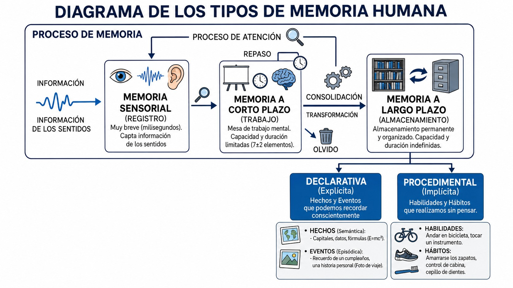
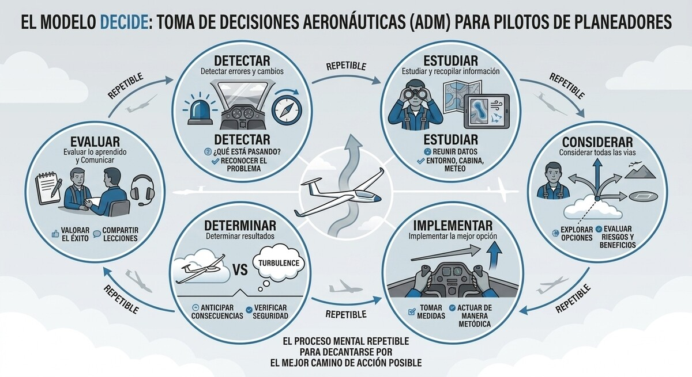
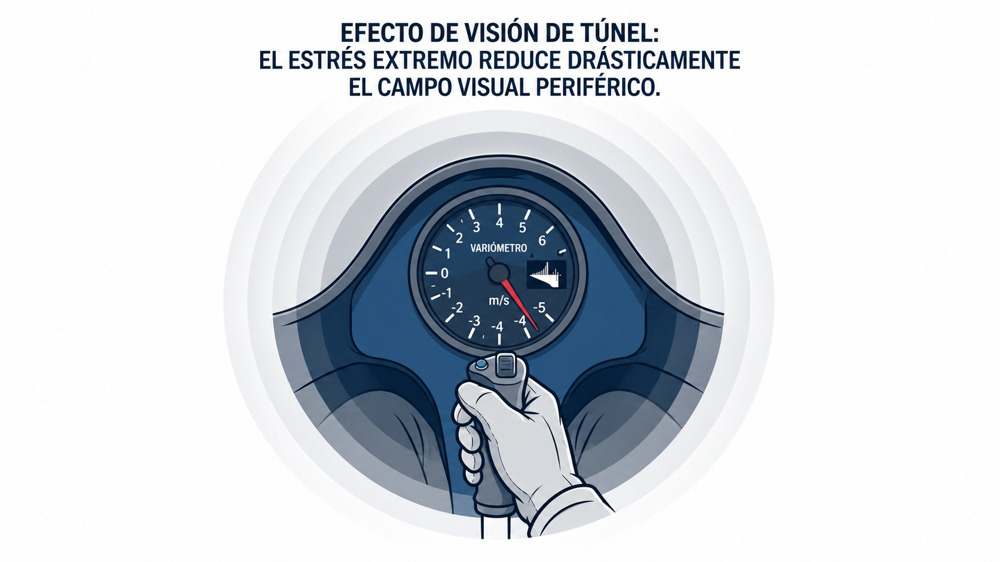

# Basic aviation psychology

> Flying well is, above all, deciding well. This chapter is about the instrument that really flies the glider, your mind: how it processes information, how it decides under pressure, and which attitudes and psychological traps you should learn to recognise in yourself.
>
>
> In this chapter you will learn:
>
>
> * **Information processing**: perception, attention and the types of memory.
> * **Situational awareness**: what it is and what degrades it.
> * **Decision-making (ADM)**: the DECIDE model and risk management with PAVE.
> * **The five hazardous attitudes** and their antidotes.
> * **Workload and SRM**: tunnel vision, overload and resource management for the pilot flying alone.

## Information processing: attention, memory and perception

To fly a glider safely, the pilot's brain is constantly processing information through three interlinked mechanisms: perception, attention and memory.

**Perception** is the ability to make sense of what is around you and of changes in the flight variables (a shift in the wind, the closeness of the ground). Unlike the world on the ground, the air lacks the usual cues for depth and size. That makes judging distances harder, and too much information without the usual cues can lead to qualitative overload.

**Attention** is the filter that lets you concentrate on the relevant information inside the cockpit and outside it. Attention is not limitless: biological or psychological factors can wear it down quickly and stop you seeing the whole picture.

**Memory**, in which the hippocampus plays a key part, lets you encode, store and retrieve vital information. In the cockpit you use several memory systems (@fig-02-cap03-memoria-tipos):

* **Sensory memory:** Holds information for barely 200 milliseconds after the senses pick it up.
* **Short-term memory:** Lasts about 30 seconds. It is the pilot's “RAM”, essential for dealing with the immediate tactical situation.
* **Long-term memory:** The long-term store of knowledge. It divides into non-declarative memory (procedural or unconscious, such as the mechanical feel of the stick) and declarative memory (explicit, combining episodic and semantic memory, such as the speeds in the flight manual or past experiences).

{#fig-02-cap03-memoria-tipos}

## Situational awareness (**Situational Awareness**) and what reduces it

Situational awareness (**Situational Awareness**) is the perception of the elements in the environment within a volume of time and space, the understanding of what they mean and, above all, the projection of their state or position into the near future.

In a glider cockpit, this means building and keeping up throughout the flight an accurate mental picture of what is happening: how the wind is changing and where it is heading, where you really are relative to the landing field, who is in the circuit, what the other aircraft are doing, and your own height and energy.

::: {.callout-warning title="Safety"}
Losing situational awareness is usually the first link in most gliding accident chains. Qualitative attention overload, panic over something you do not understand, fatigue or discomfort in a badly adjusted seat all sharply reduce your ability to take in the full picture that defines a safe flight.
:::

## Aeronautical decision-making (ADM)

Aeronautical decision-making (ADM, for **Aeronautical Decision Making**) is the systematic, repeatable mental process a pilot uses to choose the best possible course of action in response to a given set of circumstances in the glider cockpit.

Whether thermalling or on final approach, the pilot interacts with the environment by assessing scenarios and hazards, making plans, managing the level of risk and acting on it. One of the most widely accepted frameworks in civil aviation for training and shaping ADM is the **DECIDE model** (@fig-02-cap03-decide):

* **D**etect that a change or an error has occurred that needs your attention.
* **E**stimate the need to react, actively gathering all the information about the event.
* **C**hoose the best outcome after considering all the possible ways of dealing with the hazard.
* **I**dentify the actions that will achieve it.
* **D**o the chosen action, methodically, quickly or calmly as the situation requires.
* **E**valuate the result: check whether the course taken corrects the deviation, learn from it and share the conclusions.

{#fig-02-cap03-decide}

## Risk management and assessment models (the PAVE model)

Risk management is the shield that protects your decision-making. Every flight carries some hazards. Your job is not to avoid them all (which is impossible) but to identify, assess and mitigate them systematically.

The **PAVE model** divides the risks of a flight into four basic elements that are easy to assess:

* **P (Pilot):** Physical and psychological condition. Is the pilot rested? Suffering from fatigue or stress? Current on recent experience?
* **A (Aircraft):** The state of the glider. Is it the right equipment for the planned flight? Are the instruments working and the inspections up to date?
* **V (enVironment):** Weather, alternate aerodromes, terrain, traffic density and airspace.
* **E (External pressures):** Factors such as the need to finish a course, the pressure not to disappoint a passenger or the rush to catch a weather window that is closing.

::: {.callout-tip title="Golden rule"}
Breaking your flight down mentally with PAVE before take-off lets you spot the error chain and cut it before you even get into the cockpit.
:::

## Recognising and mitigating hazardous attitudes

Your attitudes (your motivational stance towards the world around you) shape how you react to risk. Aviation training classically identifies five hazardous attitudes that you must learn to recognise and neutralise in yourself.

### Anti-authority (**anti-authority**)

“Don't tell me what to do”, or plain indiscipline. A pilot with this attitude rejects established standards, rules or the advice of experienced instructors as unnecessary or excessive.

**Antidote:** Follow the rules: most of them were written in blood. Complying with the rule is the most basic safety factor. “Follow the rules. They are usually right.”

### Impulsivity (**impulsivity**)

“I must do something, and I must do it now.” Faced with a problem, the pilot feels an urgent need to act at once without stopping to think about the consequences.

**Antidote:** Except in a very few extreme emergencies, take a second to apply the DECIDE model. “Not so fast. Think first.”

### Invulnerability (**invulnerability**)

“It won't happen to me.” The pilot knows the risks exist but feels magically protected, as if an accident could never happen to them.

**Antidote:** Accidents happen to anyone who puts their aircraft in a situation with no safety margin. “It could happen to me.”

### Arrogance or overconfidence (*Macho*)

“I can do it.” The pilot tries to impress, to show off a supposedly superior level of skill by pulling stunts or ignoring guidance, out of overconfidence in their flying. Bravado.

**Antidote:** Accepting your operational limits is the truest sign of **airmanship**. Taking unnecessary risks is a sign of immaturity. “Taking chances is foolish.”

### Resignation (**resignation**)

“What's the use? It's all lost.” Faced with adversity, or with the complexity of a problem on a cross-country, the pilot believes they have no control over the situation and stops flying, becoming a mere passenger in the tragedy. It sometimes goes hand in hand with a blind complacency about minor problems.

**Antidote:** Never stop flying the aircraft. There is always something you can do to improve the situation; trust your training. “I'm not helpless. I can make a difference.”

## Managing workload and psychological stress in flight

Stress is the body's non-specific biological response to any physical, environmental or psychological demand placed on it. In aviation, it works as an ancient alarm system that warns us of possible danger.

Contrary to popular belief, not all stress is harmful. A moderate level of stress (like the one you feel on your first solo) is very positive: it raises your alertness, sharpens your senses and speeds up your reactions, bringing you to your peak performance.

But if the psychological pressure keeps building (say you stray into severe instrument conditions, ignoring your limits), that manageable stress quickly turns into panic. Performance plummets and the pilot is flooded with sensory input. Unable to process the overwhelming picture in the cockpit, the brain locks up and focuses every last bit of its remaining attention on a single detail of the flight (often the least important one), shutting out every other sensible visual or mental input. This deadly phenomenon is informally called **tunnel vision** (@fig-02-cap03-vision-tunel).

::: {.callout-warning title="Safety"}
Under extreme stress and panic, basic survival instincts such as trying to “get away from the ground by hauling back on the stick” can override your reasoning. This sudden, instinctive manoeuvre at low height will use up all your glider's energy and throw you, beyond recovery, into a loss of control or an unrecoverable spin. Know your limits and do not get into situations you are not more than ready for.
:::

{#fig-02-cap03-vision-tunel}

Everything you do in the air follows a continuous cycle known as the “3 P” model: **Perceive, Process and Perform**. Every second of a flight, the pilot perceives information from the environment, processes it mentally and acts on it.

The human mind's capacity to handle this endless stream of events at once is essentially finite: think of it as a glass that can only hold so much water. During a turbulent aerotow, flying into the sun, while trying to spot another glider that has just called on base, the cognitive glass can overflow spectacularly. This is known as **qualitative overload**. When the complexity of the flying task at that precise moment outstrips the pilot's performance and training, the safety margin disappears and the latent accident takes its place.

::: {.callout-tip title="Golden rule"}
When you feel your glass overflowing, stop for a second, breathe, and cut the mental load by ruthlessly simplifying your priorities, following the old aviation saying: **Aviate, Navigate, Communicate** (first fly the aircraft safely, then worry about where you are going, and only last, and only if strictly necessary, pick up the radio to tell someone about it).
:::

## Single-pilot resource management (SRM)

SRM is the art of skilfully managing all the resources on board and outside the glider (information, equipment and human help) before and during the flight, so that a pilot flying alone operates safely.

Unlike multi-crew flying, where tasks are shared out, the glider pilot manages the whole flight as the sole decision-maker. Your job is to use every available resource so as not to exceed your processing capacity. SRM resources include your own equipment (instruments, the trim on board), radio communications (asking ATC or getting weather information) and tools on the ground (a good pre-flight, or an instructor on the radio).

::: {.callout-note title="Airmanship"}
It is better to plan ahead on the ground than to react in the air. Avoiding many new situations at once (a new glider at an unfamiliar aerodrome in poor weather) is the clearest sign that you know how to manage your resources, with common sense as the foundation.
:::

## Complacency and lack of operational discipline

Two of the worst and most insidious enemies linked to hazardous attitudes are complacency and lack of operational discipline.

**Complacency** grows out of a false sense of security bred by too much routine and a familiar environment. Thoughts like “I've landed here thousands of times” lead you to skip the pre-flight checklist or stop watching for traffic. However good your skills are, never drop your guard.

**Indiscipline**, closely tied to the anti-authority attitude, means deliberately departing from the standards and procedures you were taught. It spreads like an epidemic: a bad practice seen over and over at an airfield ends up being accepted as normal by all its pilots, passing lethal habits on to students and seriously weakening the safety culture of the whole club.

::: {.postit}
**Chapter summary: aviation psychology**

* **Situational awareness**: The ability to perceive accurately what is happening, understand what it means and project its future state. Losing it is the first link in most accident chains.
* **Decision-making (ADM)**: A systematic mental process (such as the DECIDE model) that pilots use to choose the best course of action consistently in response to a set of circumstances.
* **Stress**: The body's response to a physical or psychological demand. A moderate level improves performance (alertness), but excessive or chronic stress blocks decision-making and fixes attention on irrelevant details (tunnel vision).
* **Workload and performance**: Your processing capacity is limited (like a glass of water). If the complexity of the flight (bad weather, traffic, a defect) fills the glass, you overflow. Simplify the task (aviate, navigate, communicate) to win back your safety margin.
* **Information processing**: It covers perception (interpreting the environment), attention (focus) and sensory, short-term and long-term memory. Too much outside information that you cannot take in can cause qualitative overload.
* **Risk management (PAVE)**: A systematic assessment of the critical factors, divided into Pilot, Aircraft, enVironment (**Environment**) and External pressures.
* **Hazardous attitudes**: The five attitudes to avoid are anti-authority, impulsivity, invulnerability, arrogance (overconfidence) and resignation.
* **Resource management (SRM)**: The solo pilot's ability to make full use of the equipment on board, information, communications and outside help so as not to exceed their limits.
* **Complacency and indiscipline**: Complacency comes from too much routine and creates a false sense of security, while indiscipline spreads a poor safety culture around the aerodrome as people ignore the rules.
:::
