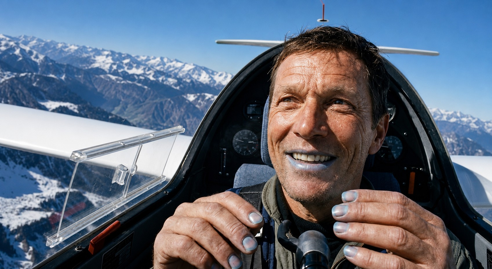
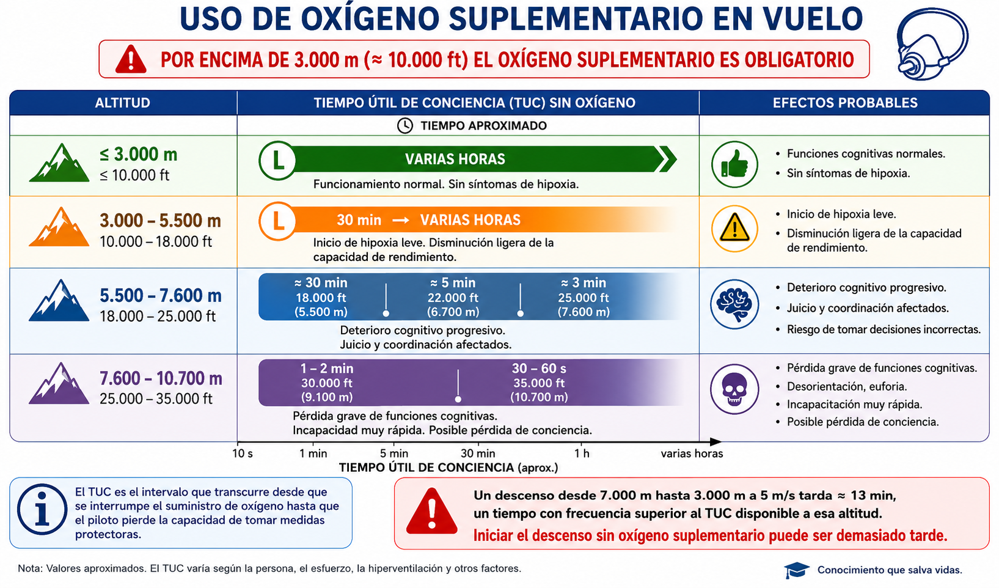
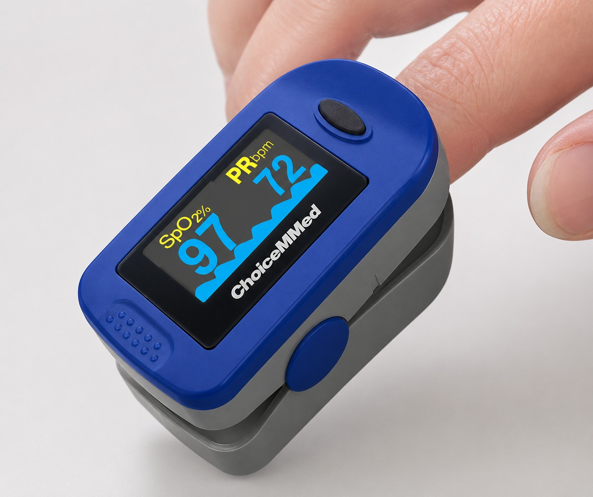

# Use of oxygen

> As the glider climbs, atmospheric pressure falls and less oxygen is available to the body. This chapter explains what causes hypoxia and hyperventilation, how to recognise and treat them, and what the rules and your oxygen equipment require of you at altitude.

## The atmosphere and the gas laws

A glider cockpit is not pressurised. To understand what altitude does to you in it, you need two basic principles of physics.

The atmosphere is made up of 78% nitrogen and 21% oxygen. Those percentages stay the same as you climb. What changes is the **atmospheric pressure**.

**Dalton's law** states that the total pressure of a mixture of gases is the sum of the partial pressures of its components. As you climb, there is less air above you, so the overall pressure falls. At sea level, that pressure “pushes” oxygen molecules efficiently through the alveoli of the lungs into the blood. At high altitude the pressure is so low that oxygen can no longer cross the alveolar membrane properly: you are still breathing 21% oxygen, but your cells are starved of it.

**Boyle's law** says that the volume of a confined gas increases when the outside pressure falls. As you climb, any pocket of air trapped in the body (stomach, intestines, sinuses or ears) expands to match the outside pressure.

::: {.callout-note title="Airmanship"}
Do not fly with a bad cold or a blocked nose, especially if you expect high thermal tops or wave flights. Air trapped in the sinuses or the middle ear expands as you climb and can cause sharp, intense pain (barotrauma) that leaves you unable to fly safely.
:::

## The respiratory system

The lungs contain millions of alveoli covered in capillaries. When you breathe in, oxygen reaches the alveoli and, driven by barometric pressure, crosses into the blood. There, the **haemoglobin** in the red blood cells carries the oxygen to the brain, the retina and the muscles, and picks up the waste carbon dioxide (CO~2~), which you breathe out with the next breath.

At altitude, the lungs and the heart work normally, but the pressure is too low to load oxygen in the alveoli. The red blood cells reach the brain practically empty. That shortage of oxygen in the brain is **hypoxia**.

## Hypoxia

### Types of hypoxia

High altitude is the commonest cause, but there are four different mechanisms:

1. **Hypoxic hypoxia:** The atmospheric pressure is too low to transfer oxygen into the blood. This is the most frequent form in glider pilots. The fix is to descend or turn on the supplemental oxygen.
2. **Hypaemic (or anaemic) hypoxia:** The blood loses its ability to carry oxygen. It is mainly caused by breathing in **carbon monoxide (CO)** from the tug's exhaust or by heavy smoking, because CO takes the place of oxygen in the haemoglobin.
3. **Stagnant (or ischaemic) hypoxia:** Blood flow to the brain stops or slows down. In a glider it can happen in tight turns with high positive G, which push the blood towards the legs and drain it from the head, causing tunnel vision or a temporary loss of vision (**grey-out**).
4. **Histotoxic hypoxia:** The brain cells cannot use the oxygen they receive because they have been poisoned. **Alcohol, drugs or certain medicines** (muscle relaxants or antihistamines, among others) have this effect.

### Stages and symptoms

Symptoms vary from person to person and with fatigue, smoking, alcohol or acclimatisation to altitude. Pilots often fail to notice their own.

The most dangerous symptom, and the first to appear according to the AESA syllabus, is **euphoria**: the pilot feels exceptionally well and does not see the danger. Then come irritability, difficulty speaking, loss of short-term memory, poorer arithmetic and drowsiness. In the advanced stages **cyanosis** appears (a bluish colour in the lips and nails), followed by loss of consciousness (@fig-02-cap04-cianosis).

::: {.callout-warning title="Safety"}
Euphoria is the most treacherous symptom of hypoxia: the pilot does not suspect they are in danger. If you notice blurred vision, tingling in your hands and feet, unjustified euphoria or a headache after a fast climb to high altitude, assume hypoxia. Turn the oxygen supply to 100% and start descending immediately.
:::

{#fig-02-cap04-cianosis}

### Time of Useful Consciousness (TUC)

The TUC is the time from losing your oxygen supply to losing the ability to protect yourself. The higher you are, the shorter it is.

The following chart shows the reference values (@fig-02-cap04-hipoxia-tiempo-conciencia):

{#fig-02-cap04-hipoxia-tiempo-conciencia}

A descent from 7,000 m to 3,000 m at a rate of 5 m/s takes more than 13 minutes, often longer than the TUC available at that altitude. If you start down without oxygen, you may not get there in time.

::: {.callout-tip title="Golden rule"}
At any failure of the oxygen supply, or any suspicion of hypoxia, apply the rule: **“100% oxygen and descend”**. Turn the flow fully on and get below 10,000 ft without hesitation. Above a certain altitude, the TUC is too short to think or act properly.
:::

### Prevention and treatment

The best prevention is to see the risk coming and use the oxygen equipment as a matter of routine, almost without thinking.

Before the flight, check the equipment:

* Check that the cylinder gauge reads between 150 and 200 bar.
* Check that the cannula or mask is properly connected, with no kinks or blockages.
* Confirm that the flow regulator works properly.

If symptoms of hypoxia appear in flight:

1. Turn the oxygen supply to **100% flow** immediately.
2. Check that the cannula or mask seals properly and does not leak.
3. If the symptoms do not clear within a few seconds, descend below 10,000 ft.

::: {.callout-note title="Airmanship"}
Carry an emergency *checklist* for hypoxia, because your reasoning may be impaired just when you need it most. If you have a pulse oximeter on board, check your saturation (SpO~2~) whenever in doubt.
:::

## Hyperventilation

### Causes and mechanism

Hyperventilation is breathing that is too fast or too deep. It comes from stress or anxiety, not from a lack of oxygen. In a glider, severe turbulence, a difficult field landing or a hard decision in flight can set it off.

When you hyperventilate, you breathe out too much CO~2~. The body sets blood flow to the brain by the level of CO~2~ in the blood. When that level falls (hypocapnia), the blood vessels in the brain constrict and less oxygen gets through, even though your lungs are full of it. You end up, paradoxically, suffocating with full lungs.

### Symptoms

The symptoms look a lot like hypoxia, which makes the two hard to tell apart:

* Tingling and numbness in the hands, feet and around the mouth.
* Muscle cramps or spasms.
* A feeling of not getting enough air, and palpitations.
* Dizziness, nausea and drowsiness.
* In serious cases, loss of consciousness.

::: {.callout-tip title="Golden rule"}
To tell hypoxia from hyperventilation, look at two things: **altitude** and **emotional state**.

* If you are above 10,000 ft and feel euphoric or sluggish: probably **hypoxia**. Go to 100% oxygen and descend.
* If you are below 10,000 ft and feel tingling with sweating and anxiety: probably **hyperventilation**. Slow your breathing down.

If in doubt at high altitude, treat for hypoxia first.
:::

### Treatment

The aim is to bring the CO~2~ in your blood back to normal:

1. **Slow your breathing down:** Breathe in slowly and deeply, and hold the air for a few seconds before breathing out.
2. **Talk out loud:** Read the *checklist* or count out loud. You cannot pant while you talk, so your breathing slows down.
3. **In serious cases:** Cover your nose and mouth with a sick bag to breathe back in some of the CO~2~ you have exhaled and restore the balance.
4. If the hyperventilation continues, end the flight and return to the airfield.

::: {.callout-warning title="Safety"}
Do not use supplemental oxygen if you diagnose hyperventilation and you are not at high altitude: more oxygen would only deepen the CO~2~ imbalance and the symptoms. If you cannot confirm that you are below 10,000 ft, treat for hypoxia first.
:::

## Regulatory requirements for the use of oxygen

::: {.callout-important title="Regulation"}
**SAO.OP.150:** “The pilot-in-command shall ensure that all persons on board use supplemental oxygen whenever he or she determines that, at the altitude of the intended flight, lack of oxygen might result in impairment of their faculties or harmfully affect them.”

**AMC1 SAO.OP.150:** when the pilot-in-command cannot determine that effect, all occupants should use oxygen whenever the pressure altitude is above **10,000 ft**.
:::

So 10,000 ft is not an absolute legal limit. It is the default for when you cannot judge how a lack of oxygen will affect the people on board. The real obligation is the first one: assess, and make sure.

::: {.callout-note title="Airmanship"}
**At night or at dusk**, start using oxygen from **5,000 ft**. The rules do not require it, but night vision suffers first: the rods in the peripheral retina are the first cells hit by a lack of oxygen.
:::

## Oxygen equipment and systems in gliders

### Types of system

Gliders mainly use two types of system:

* **Continuous-flow system:** Delivers a steady flow of oxygen set by the pilot (usually 2 to 2.5 L/min). It is simple, reliable and cheap, but it keeps flowing while you breathe out, which wastes oxygen and dries the nasal passages. FAA guidance does not recommend it above **25,000 ft (FL250)**; higher up, demand systems with a mask are needed.
* **Pulse-demand system (*Electronic Delivery System*, EDS):** Senses the start of each breath with barometric sensors and releases only the volume needed, shutting off the flow while you breathe out. It can make a cylinder last three or four times longer than continuous flow. Its weak point is the 9 V battery, which can fail in severe cold. Connect it to the glider's main battery if you can, and keep the 9 V as a backup.

### Inspection, use, maintenance and safety

Before every high-altitude flight, visually check the cylinder, the connections and the tubes. Check the pressure on the gauge and make sure the cannula or mask has no kinks.

::: {.callout-warning title="Safety"}
**Aviation oxygen, not medical oxygen.** Medical oxygen contains more moisture, which can freeze in the regulator at high-altitude temperatures and block the flow. Use only oxygen labelled “for aviation use” (dry oxygen, more than 98.5% pure).

**No grease anywhere near it.** Do not put moisturising cream, sunscreen or lubricants near the connections, regulators or nozzles. Oxygen under pressure can make grease ignite explosively, with no flame or spark needed.
:::

## Pulse oximeter

The pulse oximeter is a non-invasive device that measures the oxygen saturation of the blood (SpO~2~) and the heart rate in real time (@fig-02-cap04-pulsioximetro). Nothing detects hypoxia earlier: it shows the problem before you feel any symptoms.

{#fig-02-cap04-pulsioximetro}

Put the pulse oximeter on your index finger before take-off and keep the reading in view throughout the flight. For wave flights, fix it in the cockpit with Velcro or use an adapted glove so that you can read it without taking off your cold-weather gear.

An SpO~2~ below **90%** means you are hypoxic: turn on the supplemental oxygen and start descending straight away.

::: {.callout-note title="Airmanship"}
Note your SpO~2~ at different altitudes on normal flights (at 3,000 m, at 5,000 m) to learn how your own body responds. Pilots differ.
:::

::: {.postit}
**Chapter summary: use of oxygen**

* **Gas laws:** Atmospheric pressure falls with altitude (Dalton's law), making it harder for oxygen to pass into the blood. Body gases expand as you climb (Boyle's law); do not fly with a badly blocked nose if you want to avoid painful barotrauma.
* **Respiratory system and hypoxia:** Haemoglobin carries oxygen from the alveoli to the brain. When the pressure is too low, the red blood cells reach the brain empty and hypoxia sets in.
* **Types of hypoxia:** There are four: **hypoxic** (low atmospheric pressure, the most frequent in gliders), **hypaemic** (carbon monoxide or smoking), **stagnant** (high G in tight turns) and **histotoxic** (alcohol, drugs or medicines).
* **Symptoms and diagnosis:** The first symptom is euphoria; the pilot does not see the danger on their own. Then come drowsiness, difficulty with calculations, cyanosis and loss of consciousness. The pulse oximeter detects hypoxia before the symptoms become obvious.
* **Time of Useful Consciousness (TUC):** At 25,000 ft, the TUC is 3 to 5 minutes; at 30,000 ft, 1 to 2 minutes. A long descent can take longer than the TUC available: always act before you need to.
* **Rules (SAO.OP.150 and its AMC):** Supplemental oxygen is mandatory when the pilot determines that a lack of it may impair the occupants' faculties; when they cannot determine this, the AMC's default rule is to use it whenever above **10,000 ft**. At night or at dusk it is **recommended** (not a rule) from **5,000 ft**.
* **Oxygen systems:** Continuous flow is simple but uses more oxygen and dries the nasal passages. The pulse-demand system (EDS) makes the cylinder last much longer but depends on batteries that can fail in the cold. Always use dry aviation oxygen, not medical oxygen.
* **Equipment safety:** Keep grease and creams away from oxygen connections: risk of explosive combustion. Check the cylinder pressure before every flight (between 150 and 200 bar).
* **Hyperventilation:** Caused by stress or anxiety, not by a lack of oxygen. Breathing out too much CO~2~ constricts the blood vessels in the brain, producing symptoms similar to hypoxia (tingling, cramps, dizziness). Treatment: slow your breathing, talk out loud or breathe CO~2~ back in by partly covering your mouth.
* **Pulse oximeter:** Keep your saturation (SpO~2~) above **90%**; below that threshold, turn on the oxygen and descend immediately.
:::
