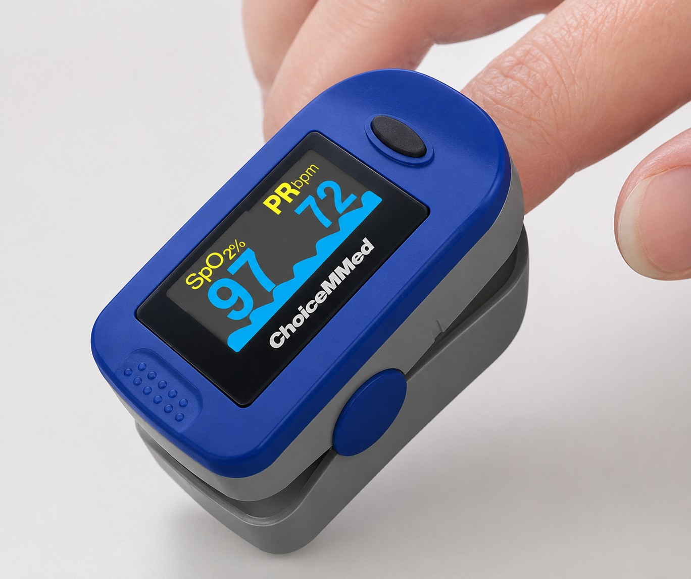

# Use of oxygen

> As the glider climbs, atmospheric pressure falls and less oxygen is available to the body. This chapter explains what causes hypoxia and hyperventilation, how to recognise and treat them, and what the rules and your oxygen equipment require of you at altitude.

## The atmosphere and the gas laws

A glider cockpit is not pressurised. To understand what altitude does to you in it, you need two basic principles of physics.

The atmosphere is made up of 78% nitrogen and 21% oxygen. Those percentages stay the same as you climb. What changes is the **atmospheric pressure**.

**Dalton's law** states that the total pressure of a mixture of gases is the sum of the partial pressures of its components. As you climb, there is less air above you, so the total pressure falls; and since oxygen is always 21% of the mixture, its **partial pressure** falls in the same proportion. That partial pressure is what “pushes” oxygen molecules through the alveoli of the lungs into the blood. The higher you go, the weaker the push and the less oxygen reaches the blood: you are still breathing 21% oxygen, but your blood carries less and less of it. There is no threshold above which oxygen stops getting through, just a gradual decline.

**Boyle's law** says that the volume of a confined gas increases when the outside pressure falls. As you climb, any pocket of air trapped in the body (stomach, intestines, sinuses or ears) expands to match the outside pressure.

**Henry's law** completes the picture: the amount of gas dissolved in a liquid depends on the pressure of that gas above it. As the pressure falls, nitrogen dissolved in the blood and tissues tends to come out of solution and can form bubbles: **decompression sickness** (*the bends*). According to ICAO, it starts to be a threat above about 25,000 ft, and diving before flying makes it far more likely, because the body then carries extra nitrogen (Chapter 2).

::: {.callout-note title="Airmanship"}
Do not fly with a bad cold or a blocked nose, especially if you expect high thermal tops or wave flights. Air trapped in the sinuses or the middle ear cannot equalise with the outside pressure, especially in the descent, and can cause sharp, intense pain (barotrauma) that leaves you unable to fly safely.
:::

## The respiratory system

The lungs contain millions of alveoli covered in capillaries. When you breathe in, oxygen reaches the alveoli and, driven by barometric pressure, crosses into the blood. There, the **haemoglobin** in the red blood cells carries the oxygen to the brain, the retina and the muscles, and picks up the waste carbon dioxide (CO~2~), which you breathe out with the next breath.

At altitude, the lungs and the heart work normally, but the lower partial pressure loads less oxygen onto the haemoglobin. Blood saturation falls gradually —to about 89% at 10,000 ft and 65% at 20,000 ft, according to ICAO— and the brain gets less oxygen than it needs. That shortage of oxygen is **hypoxia**.

## Hypoxia

### Types of hypoxia

High altitude is the commonest cause, but there are four different mechanisms:

1. **Hypoxic hypoxia:** The atmospheric pressure is too low to transfer oxygen into the blood. This is the most frequent form in glider pilots. The fix is to descend or turn on the supplemental oxygen.
2. **Hypaemic (or anaemic) hypoxia:** The blood loses its ability to carry oxygen. It is mainly caused by breathing in **carbon monoxide (CO)** from the tug's exhaust or by heavy smoking, because CO takes the place of oxygen in the haemoglobin.
3. **Stagnant (or ischaemic) hypoxia:** Blood flow to the brain stops or slows down. In a glider it can happen in tight turns with high positive G, which push the blood towards the legs and drain it from the head, causing tunnel vision or a temporary loss of vision (**grey-out**).
4. **Histotoxic hypoxia:** The brain cells cannot use the oxygen they receive because they have been poisoned. It is caused by **alcohol, narcotics and some poisons**. Other drugs, such as sedatives or antihistamines, do not cause it on their own, but they make the pilot more vulnerable to hypoxia.

### Stages and symptoms

Symptoms vary from person to person and with fatigue, smoking, alcohol or acclimatisation to altitude. Pilots often fail to notice their own.

One of the first symptoms, and the most dangerous, is usually **euphoria**: the pilot feels exceptionally well and does not see the danger. The order of symptoms varies from one person to another, but for each pilot it tends to repeat: knowing your own is the best alarm. Then come irritability, difficulty speaking, loss of short-term memory, poorer arithmetic and drowsiness. In the advanced stages **cyanosis** appears (a bluish colour in the lips and nails), followed by loss of consciousness (@fig-02-cap04-cianosis).

::: {.callout-warning title="Safety"}
Euphoria is the most treacherous symptom of hypoxia: the pilot does not suspect they are in danger. If you notice blurred vision, tingling in your hands and feet, unjustified euphoria or a headache after a fast climb to high altitude, assume hypoxia. Turn your equipment up to its maximum oxygen supply and start descending immediately.
:::

{#fig-02-cap04-cianosis}

### Time of Useful Consciousness (TUC)

The TUC is the time from losing your oxygen supply to losing the ability to protect yourself. The higher you are, the shorter it is.

The FAA's reference values are: at 22,000 ft, 5 to 10 minutes; at 25,000 ft, 3 to 5 minutes; at 30,000 ft, 1 to 2 minutes; and at 35,000 ft, 30 to 60 seconds (@fig-02-cap04-hipoxia-tiempo-conciencia). They are averages: they vary a great deal from one person to another and get shorter with physical effort, and other tables, such as ICAO's, give somewhat lower figures.

{#fig-02-cap04-hipoxia-tiempo-conciencia .corregir}

A descent from 7,000 m to 3,000 m at a rate of 5 m/s takes more than 13 minutes, often longer than the TUC available at that altitude. If you start down without oxygen, you may not get there in time.

::: {.callout-tip title="Golden rule"}
At any failure of the oxygen supply, or any suspicion of hypoxia, apply the rule: **“oxygen and descend”**. Turn your equipment up to its maximum supply —the 100% setting on a regulator with a mask, maximum flow on an EDS or the flow for the next altitude up on a continuous-flow system— and get below 10,000 ft without hesitation. Above a certain altitude, the TUC is too short to think or act properly.
:::

### Prevention and treatment

The best prevention is to see the risk coming and use the oxygen equipment as a matter of routine, almost without thinking.

Before the flight, check the equipment:

* Check on the gauge that the cylinder pressure, given its capacity and the temperature, is enough for the planned flight with a reserve (see the manufacturer's endurance table). The filling pressure depends on the cylinder, and it drops in the cold.
* Check that the cannula or mask is properly connected, with no kinks or blockages.
* Confirm that the flow regulator works properly.

If symptoms of hypoxia appear in flight:

1. Turn your equipment up to its **maximum oxygen supply** immediately.
2. Check that the cannula or mask seals properly and does not leak.
3. If the symptoms do not clear within a few seconds, descend below 10,000 ft.

::: {.callout-note title="Airmanship"}
Carry an emergency *checklist* for hypoxia, because your reasoning may be impaired just when you need it most. If you have a pulse oximeter on board, check your saturation (SpO~2~) whenever in doubt.
:::

## Hyperventilation

### Causes and mechanism

Hyperventilation is breathing that is too fast or too deep. It usually comes from stress or anxiety, but it can also be the body's reaction to hypoxia itself. In a glider, severe turbulence, a difficult field landing or a hard decision in flight can set it off.

When you hyperventilate, you breathe out too much CO~2~. The body sets blood flow to the brain by the level of CO~2~ in the blood. When that level falls (hypocapnia), the blood vessels in the brain constrict and less oxygen gets through, even though your lungs are full of it. You end up, paradoxically, suffocating with full lungs.

### Symptoms

The symptoms look a lot like hypoxia, which makes the two hard to tell apart:

* Tingling and numbness in the hands, feet and around the mouth.
* Muscle cramps or spasms.
* A feeling of not getting enough air, and palpitations.
* Dizziness, nausea and drowsiness.
* In serious cases, loss of consciousness.

::: {.callout-tip title="Golden rule"}
Do not try a fine diagnosis in flight: tingling, sweating or dizziness can come from either, and hypoxia also occurs below 10,000 ft (carbon monoxide, night flying, smoking). Act in order:

1. **Hypoxia first:** turn the oxygen up to its maximum supply, check the equipment and, if you are high, descend.
2. **If the symptoms do not improve,** treat hyperventilation: slow your breathing down.
:::

### Treatment

The aim is to bring the CO~2~ in your blood back to normal:

1. **Slow your breathing down:** Breathe more slowly, making each breath out longer.
2. **Talk out loud:** Read the *checklist* or count out loud. You cannot pant while you talk, so your breathing slows down.
3. **In serious cases:** Cover your nose and mouth with a sick bag to breathe back in some of the CO~2~ you have exhaled and restore the balance.
4. If the hyperventilation continues, end the flight and return to the airfield.

::: {.callout-warning title="Safety"}
If in doubt between hypoxia and hyperventilation, treat hypoxia first: turn the oxygen on or up and check the equipment; then control your breathing rate. The first symptoms of the two are alike and they can occur together, because hypoxia also makes you breathe faster. Breathing oxygen does not make hyperventilation worse: CO~2~ is lost through your breathing rate, not through the oxygen you breathe.
:::

## Regulatory requirements for the use of oxygen

::: {.callout-important title="Regulation"}
**SAO.OP.150:** “The pilot-in-command shall ensure that all persons on board use supplemental oxygen whenever he or she determines that, at the altitude of the intended flight, lack of oxygen might result in impairment of their faculties or harmfully affect them.”

**AMC1 SAO.OP.150** (an acceptable means of compliance, not binding in the way the regulation is): when the pilot-in-command cannot determine that effect, they should ensure that everyone uses oxygen whenever the pressure altitude is above **10,000 ft**.

**SAO.IDE.115:** when SAO.OP.150 requires oxygen, the sailplane must be “equipped with oxygen storage and dispensing apparatus capable of storing and dispensing the required oxygen supplies”. That equipment must be approved and must let the crew check in flight that oxygen is being delivered (CS 22.1441 and CS 22.1449).
:::

So 10,000 ft is not an absolute legal limit. It is the default for when you cannot judge how a lack of oxygen will affect the people on board. The real obligation is the first one: assess, and make sure.

::: {.callout-note title="Airmanship"}
**At night or at dusk**, start using oxygen from **5,000 ft** (FAA, AIM 8-1-2). The rules do not require it, but night vision suffers first: the rods in the peripheral retina are the first cells hit by a lack of oxygen.
:::

## Oxygen equipment and systems in gliders

### Types of system

Gliders mainly use two types of system:

* **Continuous-flow system:** Delivers a steady flow of oxygen that the pilot sets according to altitude: the flowmeter is graduated in feet. It is simple, reliable and cheap, but it keeps flowing while you breathe out, which wastes oxygen and dries the nasal passages. With a **cannula**, the usual interface in gliders, it is only suitable up to about **18,000 ft (FL180)**: above that you need a mask, because when you talk or breathe through your mouth the cannula no longer delivers enough oxygen. With a mask, the FAA considers it suitable up to about 25,000 ft. On high wave flights, carry a backup oxygen supply as well.
* **Pulse-demand system (EDS, *Electronic Delivery System*, one manufacturer's trade name):** Senses the start of each breath with barometric sensors and releases only the volume needed, shutting off the flow while you breathe out. It can make a cylinder last three or four times longer than continuous flow. Its weak point is its batteries, which can fail in severe cold: carry spares. Wiring it to the glider's battery is a modification of the aircraft, which can only be done in line with its flight manual and the airworthiness rules.

### Inspection, use, maintenance and safety

Before every high-altitude flight, visually check the cylinder, the connections and the tubes. Check the pressure on the gauge and make sure the cannula or mask has no kinks.

::: {.callout-warning title="Safety"}
**Aviation oxygen, not medical oxygen.** Use aviation oxygen only. Neither medical nor industrial oxygen meets the same specifications, so its suitability for use in flight is not guaranteed.

**No grease anywhere near it.** Do not put moisturising cream, sunscreen or lubricants near the connections, regulators or nozzles. Oxygen under pressure can make grease ignite explosively, with no flame or spark needed.
:::

## Pulse oximeter

The pulse oximeter is a non-invasive device that measures the oxygen saturation of the blood (SpO~2~) and the heart rate in real time (@fig-02-cap04-pulsioximetro). It is a very useful aid for detecting hypoxia before the symptoms become obvious to the pilot, but it does not replace watching for symptoms. It has important limits: with **carbon monoxide** it reads normal even when there is hypoxia, because it mistakes haemoglobin taken up by CO for haemoglobin saturated with oxygen; and cold fingers, movement or direct sunlight give low or unstable readings. If you have symptoms, act even if the reading looks good.

{#fig-02-cap04-pulsioximetro .corregir}

Put the pulse oximeter on your index finger before take-off and keep the reading in view throughout the flight. For wave flights, fix it in the cockpit with Velcro or use an adapted glove so that you can read it without taking off your cold-weather gear.

An SpO~2~ below **90%** is a signal to act: turn on the supplemental oxygen and start descending. For reference, at 10,000 ft a healthy person without oxygen reads about 89%.

::: {.callout-note title="Airmanship"}
Note your SpO~2~ at different altitudes on normal flights, with your oxygen system working, to learn how your own body responds. Pilots differ.
:::

::: {.postit}
**Chapter summary: use of oxygen**

* **Gas laws:** Atmospheric pressure falls with altitude and, with it, the partial pressure of oxygen, which is always 21% of the total (Dalton's law): the higher you go, the less oxygen reaches the blood. Body gases expand as you climb and contract as you descend (Boyle's law); do not fly with a badly blocked nose: in the descent the pressure does not equalise and causes painful barotrauma.
* **Respiratory system and hypoxia:** Haemoglobin carries oxygen from the alveoli to the brain. With altitude, the blood carries less and less oxygen and hypoxia sets in, gradually.
* **Types of hypoxia:** There are four: **hypoxic** (low atmospheric pressure, the most frequent in gliders), **hypaemic** (carbon monoxide or smoking), **stagnant** (high G in tight turns) and **histotoxic** (alcohol, narcotics or poisons).
* **Symptoms and diagnosis:** One of the first symptoms, and the most treacherous, is usually euphoria; the pilot does not see the danger on their own. The order varies from one person to another. Then come drowsiness, difficulty with calculations, cyanosis and loss of consciousness. The pulse oximeter helps to detect hypoxia before the symptoms become obvious, but carbon monoxide and cold distort its reading.
* **Time of Useful Consciousness (TUC):** At 25,000 ft, the TUC is 3 to 5 minutes; at 30,000 ft, 1 to 2 minutes. A long descent can take longer than the TUC available: always act before you need to.
* **Rules (SAO.OP.150 and its AMC):** Supplemental oxygen is mandatory when the pilot determines that a lack of it may impair the occupants' faculties; when they cannot determine this, the AMC's default rule is to use it whenever above **10,000 ft**. At night or at dusk it is **recommended** (not a rule) from **5,000 ft**.
* **Oxygen systems:** Continuous flow is simple but uses more oxygen and dries the nasal passages. A cannula is only good up to about 18,000 ft; above that, a mask. The pulse-demand system (EDS) makes the cylinder last much longer but depends on batteries that can fail in the cold. Always use aviation oxygen: medical oxygen does not meet its specifications.
* **Equipment safety:** Keep grease and creams away from oxygen connections: risk of explosive combustion. Before every flight, check that the cylinder pressure is enough for the planned flight with a reserve.
* **Hyperventilation:** Caused mainly by stress or anxiety, although it can also come with hypoxia. Breathing out too much CO~2~ constricts the blood vessels in the brain, producing symptoms similar to hypoxia (tingling, cramps, dizziness). Treatment: slow your breathing, talk out loud or breathe CO~2~ back in with a bag over your nose and mouth. If in doubt about hypoxia, oxygen first.
* **Pulse oximeter:** Keep your saturation (SpO~2~) above **90%**; below that threshold, turn on the oxygen and descend immediately. It is an aid, not a substitute: if you have symptoms, act even if the reading looks good.
:::
