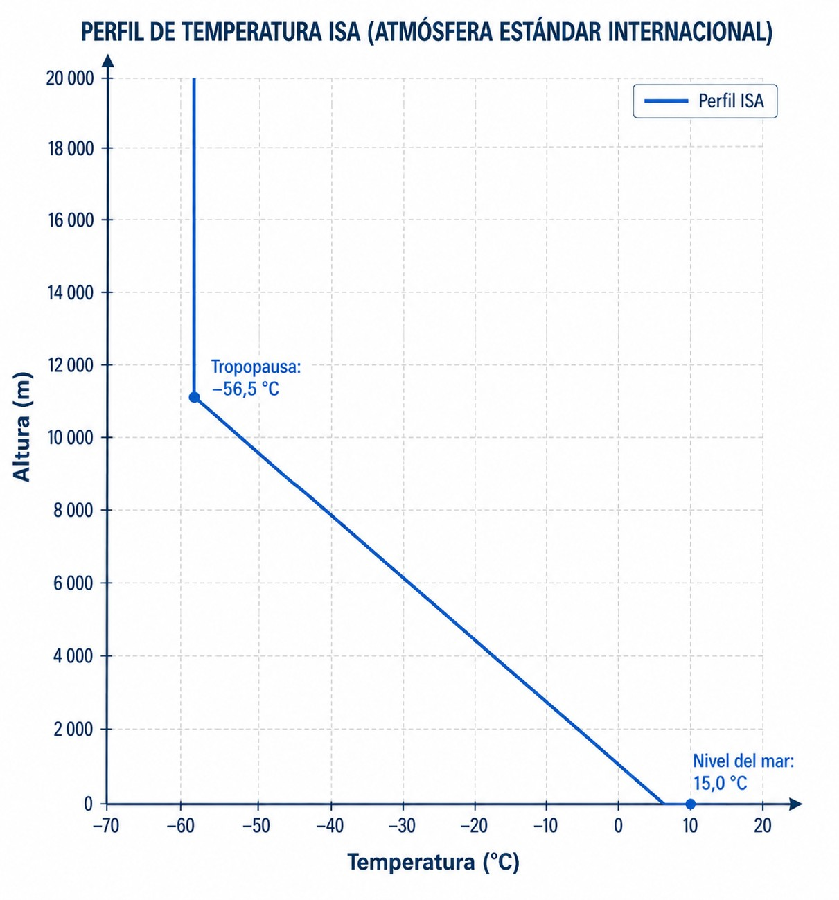

# The atmosphere

> Without understanding the atmosphere, no forecast chart makes sense.
> In this chapter you will learn what the International Standard Atmosphere (ISA) is, why air
> pressure, temperature and density change with altitude, and how those changes directly
> affect the performance of your glider and your own physiology in flight.

## The International Standard Atmosphere (ISA)

To standardise aircraft design and instrument calibration worldwide, the International Civil Aviation Organization (ICAO) defined the **International Standard Atmosphere** (ISA). It is an idealised model that assumes **dry air** (0 % humidity) and uses theoretical average values; you will rarely meet a “pure” ISA day in real life.

At mean sea level (MSL), ISA sets the following reference conditions (@fig-03-cap01-atmosfera-isa):

* Temperature: 15 °C
* Atmospheric pressure: 1013.25 hPa (equivalent to 29.92 inHg or 760 mm Hg)
* Air density: 1.225 kg/m^3^

Because the ISA model assumes 0 % humidity, it does not define a **dew point** either. In the real atmosphere, the dew point is the temperature to which a mass of air must be cooled for the water vapour it contains to start condensing. When the air temperature and the dew point come close or become equal, the relative humidity reaches 100 % and the air is saturated: cloud or fog forms. For the glider pilot, the difference between temperature and dew point is the key figure for estimating the cumulus base and the likelihood of morning fog (see Chapter 3: Thermodynamics).

{#fig-03-cap01-atmosfera-isa}

## Standard lapse rates in aviation

As we climb, conditions change in fixed ways that the ISA model defines as standard lapse rates. They let you do quick mental calculations in flight.

* **Standard temperature lapse rate**: temperature in the troposphere falls by 2 °C for every 1,000 feet of climb (or 6.5 °C for every 1,000 metres).
* **Standard pressure lapse rate**: atmospheric pressure falls by about 1 hPa for every 30 feet of climb in the lower layers of the atmosphere.

::: {.callout-tip title="Golden rule"}
Memorise these three equivalences of the ISA standard lapse rate: **2 °C / 1,000 feet** for temperature, and **1 hPa / 30 feet** for pressure. In metric terms, if you climb 90 metres the pressure falls by 10 hPa; in feet, if you climb 3,000 feet it falls by 100 hPa. If you take off from an aerodrome at 2,000 feet with QNH 1013 hPa and 20 °C, you can estimate that at 5,000 feet the temperature will be about 6 °C colder (14 °C) and the pressure will have dropped by about 100 hPa.
:::

## Air density and glider performance

A glider flies on the air that meets its wings, so **lift** depends directly on air density.

Lower air density (which amounts to a higher “density altitude”) means fewer molecules acting on the wings, which reduces the overall performance of the glider. Certain weather conditions reduce air density dangerously:

* High temperatures (the air expands and becomes less dense).
* Low atmospheric pressure.
* High humidity (water vapour is less dense than dry air).

::: {.callout-warning title="Safety"}
A hot day at a high aerodrome (high density altitude) cuts performance sharply: the tug will climb much more slowly, the glider will need more runway to take off, and in flight you will have less lift for the same angle of attack.
:::

## Partial pressure of oxygen and hypoxia

Although the proportion of oxygen in the air stays constant at 21 % throughout the troposphere, the drop in atmospheric pressure as you climb lowers the pressure at which that oxygen enters your lungs. At 18,000 feet, atmospheric pressure is half of what it is at sea level.

::: {.callout-note title="Airmanship"}
A prolonged lack of oxygen in the body's tissues is called **hypoxia**. It matters so much for flight safety (loss of consciousness, impaired vision) that its symptoms, the Time of Useful Consciousness (TUC) and the use of oxygen equipment are covered in depth in **Book 2 — Human Performance**, chapter 4.
:::

::: {.postit}
**Chapter summary: the atmosphere**

* **ISA atmosphere**: an ideal model for standardising instruments and performance (15 °C, 1013.25 hPa, 0 % humidity at MSL). You will rarely meet a “pure” ISA day, but it is the universal reference.
* **Standard lapse rates**: temperature falls by 2 °C for every 1,000 ft. Pressure falls by 1 hPa for every 30 ft **or every 9 metres**. Both equivalences are useful: the first where altimeters read in feet, the second when you work with altitudes in metres.
* **Density and performance**: a glider needs air to fly. Lower density (high elevation or a hot day) means less lift and poorer performance: you need more runway to take off and you fly faster for the same angle of attack.
* **Partial pressure of O~2~**: although the proportion of oxygen stays the same (21 %), the pressure at which it enters your lungs falls sharply with height, causing hypoxia (its physiological effects are covered in detail in **Book 2 — Human Performance**, chapter 4).
:::
