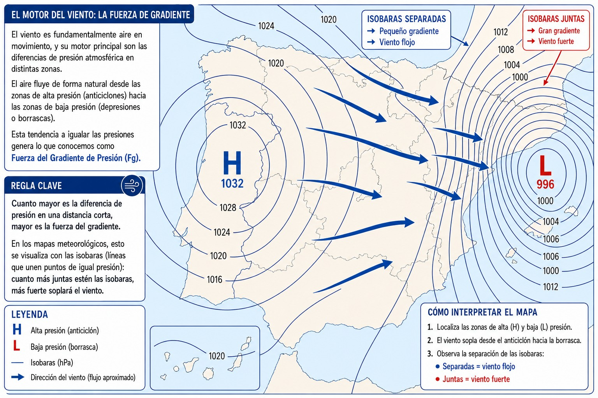
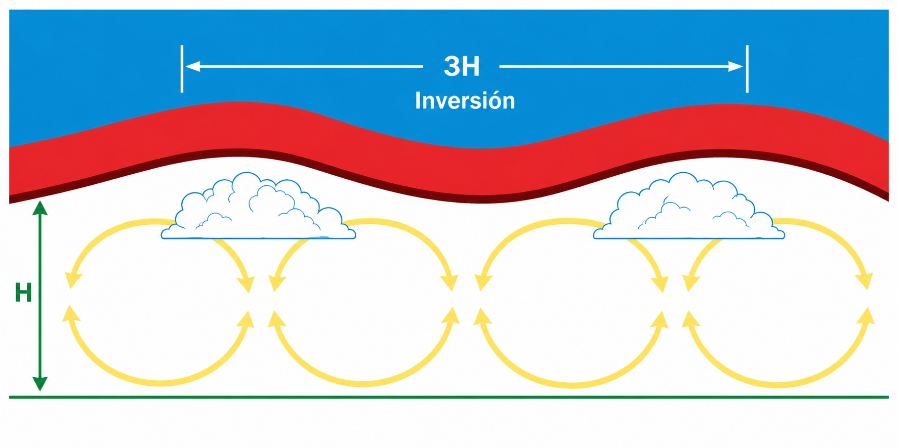
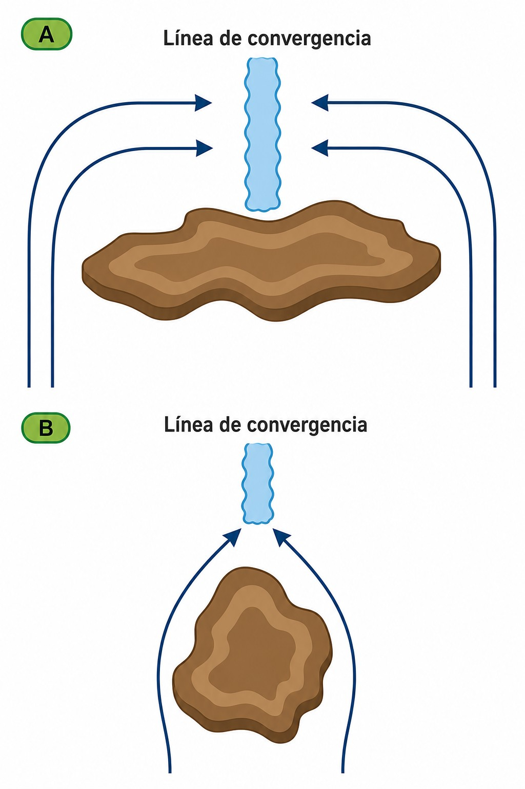
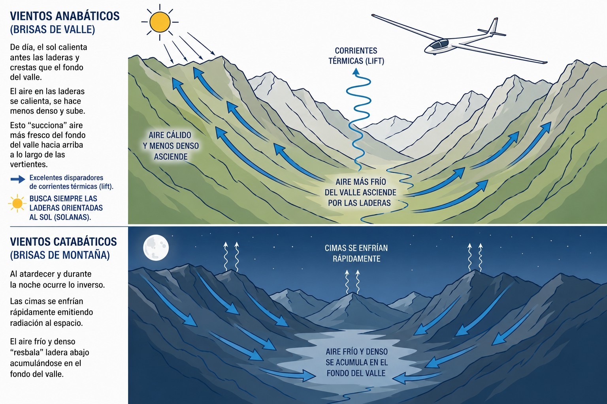
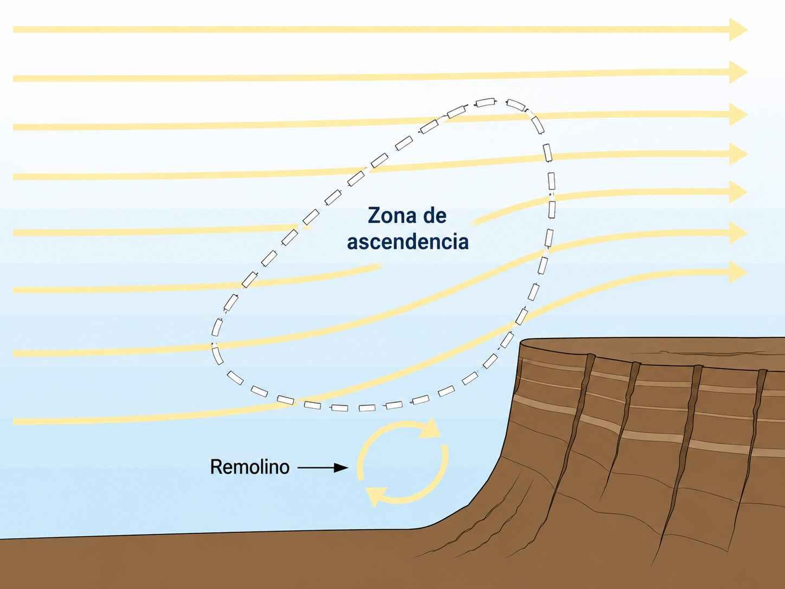
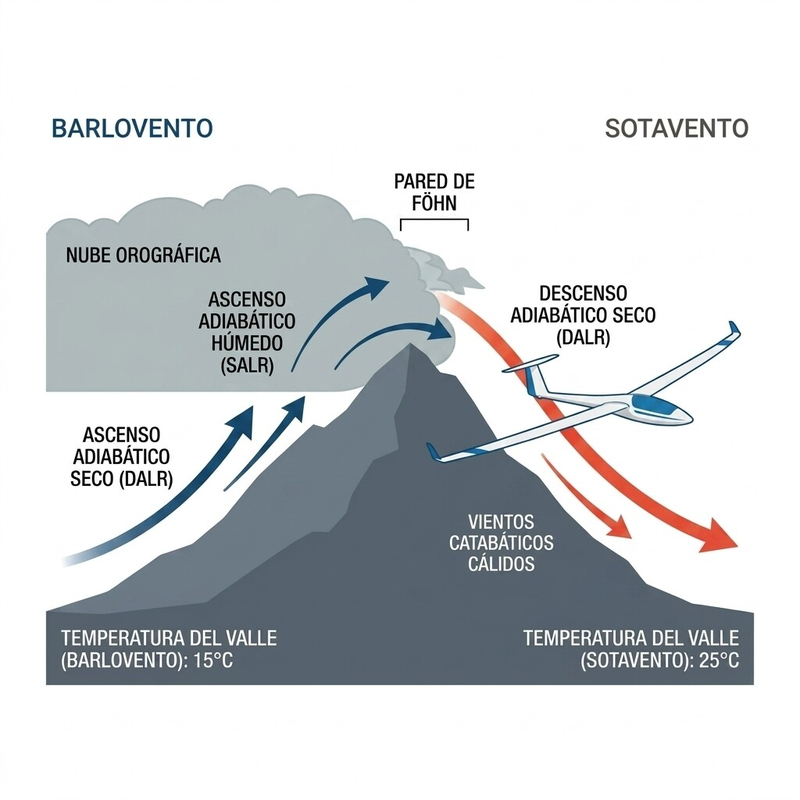
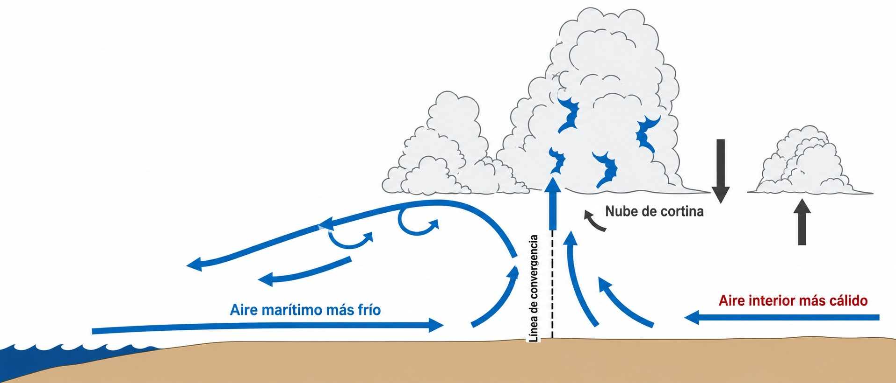

# Wind

> Wind is the raw material of soaring: sometimes your ally, always a safety factor you must
> understand and respect. In this chapter you will learn why the wind blows, how the Earth's
> rotation and the terrain shape it, and which local winds (anabatic, katabatic, Foehn, sea
> breeze) define the weather at each airfield.

## What drives the wind: the pressure gradient force

Wind is air in motion, driven mainly by differences in atmospheric pressure from one area to another.

Air naturally flows from areas of high pressure (anticyclones) towards areas of low pressure (depressions). The push that evens out the pressure is the **Pressure Gradient Force** (PGF). The rule is simple: the bigger the pressure difference over a short distance, the stronger the gradient force. On weather charts this shows up in the isobars (lines joining points of equal pressure): the closer together the isobars, the stronger the wind (@fig-03-cap02-gradiente-isobaras).

{#fig-03-cap02-gradiente-isobaras}

## The Coriolis force and the geostrophic wind

If the Earth did not rotate, the wind would flow straight from high to low pressure, crossing the isobars at right angles. But the Earth does rotate, and that adds an apparent force: the **Coriolis force**.

In the northern hemisphere, the Coriolis force deflects any moving mass of air to the **right**. As the wind speeds up under the pressure gradient, Coriolis pulls it to the right. Above about 1,000 metres over the ground (the friction level), the two forces (gradient and Coriolis) balance. The wind then stops crossing the isobars and blows **parallel** to them. This free wind aloft is called the **geostrophic wind**.

::: {.callout-tip title="Golden rule"}
Buys Ballot's law sums up the effect: in the northern hemisphere, if you stand with your back to the wind, the centre of low pressure is always on your left.
:::

## The effect of surface friction

Close to the ground (below those 1,000 metres), a third factor comes in: surface friction. Trees, buildings, mountains and the texture of the ground itself “brake” the airflow.

Friction slows the wind, and since the Coriolis effect depends on speed, it weakens too. The pressure gradient force does not. With Coriolis no longer fully balancing the gradient, the surface wind is deflected and **crosses the isobars towards the low pressure** (typically at an angle of about 30 degrees to the isobars).

::: {.callout-warning title="Safety"}
Because of friction, as you get close to the ground to land you will meet the “wind gradient” (boundary-layer *wind shear*). In the last few metres the wind will be lighter than in the circuit, and it will cross the isobars more sharply towards the low pressure. Fly the approach with a proper speed margin so that you do not run out of lift in the round-out (**flare**).
:::

{#fig-03-cap02-calles-nubes}

{#fig-03-cap02-convergencia-topografica}

## Local breezes: the mountain engine

The sun heats the ground unevenly, and that produces local winds that matter a great deal to the glider pilot, especially in mountain areas:

* **Anabatic winds (valley breezes)**: during the day, the sun warms the slopes and ridges of the mountains before the valley floor. The air in contact with the summits warms up, becomes less dense and rises, “sucking” cooler air from the valley floor up along the slopes. These anabatic breezes are excellent triggers for thermals (**lift**). Always look for the slopes facing the sun (@fig-03-cap02-vuelo-ladera).
* **Katabatic winds (mountain breezes)**: in the late afternoon and at night the reverse happens. The summits cool quickly by radiating heat into space. The cold, dense air “slides” down the slope and collects on the valley floor (@fig-03-cap02-ciclo-anabatico-catabatico).

{#fig-03-cap02-ciclo-anabatico-catabatico}

{#fig-03-cap02-vuelo-ladera}

::: {.callout-note title="Airmanship"}
Late in the afternoon, when cold katabatic winds flow down both slopes of a valley, they “squeeze” the warm air left in the middle and force it upwards. This is **restitution**. It gives very broad, smooth areas of lift in the middle of the valley, letting you stretch flights into the evening in completely calm air.
:::

## Foehn and Stau: when the mountain warms the air

When moist Atlantic wind hits a mountain range, something happens that looks almost like magic: the same air that arrives cold and full of cloud on the windward side can reach the lee valley dry, clear and ten degrees warmer. This is the **Foehn effect**. Its twin is the **Stau** (**Stau effect**), and both have direct consequences for the pilot.

The mechanism is asymmetric. On the **windward** slope (the one facing the wind), the air rises and first cools at the DALR (3 °C/1,000 ft) until it reaches its dew point, condenses and precipitates. From that level upwards it climbs saturated, cooling at only 1.5 °C/1,000 ft (SALR) and releasing latent heat into the atmosphere. On the lee side, the air has already lost its moisture on the windward slope and descends **dry** all the way, warming at the full DALR (3 °C/1,000 ft). So it arrives in the lee valley warmer than when it set out (@fig-03-cap02-fohn-stau). With height differences of 1,500–2,000 m, the difference between the two valleys can exceed 10–15 °C.

The **Foehn wall** is the bank of cloud that sits stationary over the crest on the windward side, marking the zone of precipitation. On the lee side there is a clear window, with high temperatures and low humidity. **Stau** is the name for the same process seen from the windward side: cloud build-up and heavy precipitation while the other valley enjoys the sun.

{#fig-03-cap02-fohn-stau}

An example close to home: the orange and lemon trees of the **Tiétar valley** (at the southern foot of the Sierra de Gredos, in Ávila and Cáceres) owe their Mediterranean microclimate to the Foehn that comes down the lee slope when the wind is from the north. While it is cold on the Castilian plateau, in the Tiétar they are picking oranges.

::: {.callout-warning title="Safety"}
The lee of a mountain range under an active Foehn can hide rotors with severe turbulence at the lower levels. Do not be lulled by clear skies and warm temperatures on the lee side: keep your altitude when crossing ranges in these conditions and avoid lee slopes at low height.
:::

::: {.callout-tip title="Golden rule"}
If the thermometer at the airfield reads several degrees above normal for the month, the relative humidity is unusually low and you can see a stationary mass of cloud over the mountains to the north, you are under a Foehn. Cloud bases will be very high and thermals explosive. Make the most of it, but watch out for rotors near the ground on the lee side.
:::

## Sea breezes and convergence lines: the front that is not on the chart

**Sea breezes** result from the same principle as mountain breezes: uneven heating. During the day the land warms up much faster than the sea. The warm air over the land rises, and cool sea air moves inland to fill the gap, forming a flow that can reach tens of kilometres inland (@fig-03-cap02-brisa-marina).

For the glider pilot, the real prize is the **convergence line** the breeze creates (@fig-03-cap02-convergencia-topografica). Where the cool, moist sea air meets the warm, dry continental air, a sharp boundary forms (a mini-front) where the air is forced to rise. That line moves slowly inland during the afternoon and can give smooth, continuous lift for kilometres, ideal for cross-country flying.

{#fig-03-cap02-brisa-marina}

You spot the convergence line by looking for these signs:

* Cumulus on the sea side have a **lower base** (moist air, high dew point) than those inland (dry air, high bases).
* The convergence sometimes produces a long band of somewhat more active cumulus, or even a **curtain cloud** along the boundary (@fig-03-cap02-calles-nubes).
* At ground level you may notice it as a sudden change of wind and a cooler feel as you cross it.

::: {.callout-note title="Airmanship"}
In summer, pilots flying from Fuentemilanos (Segovia) often work the south-westerly sea-breeze convergence that pushes in from the Atlantic across the Sistema Central. The Iberian thermal low (see the Climatology chapter) acts like a huge vacuum cleaner that draws the sea breeze inland, creating NW–SE convergence lines that work as motorways of lift for cross-country flying. Check RASP or SkySight (or the equivalent in TopMeteo or Meteo-Parapente) the evening before to anticipate where they will be.
:::

::: {.postit}
**Chapter summary: wind**

* **What drives the wind**: air naturally flows from high (H) to low (L) pressure because of the gradient force. The closer the isobars, the stronger it blows.
* **Coriolis force**: in the northern hemisphere, the Earth's rotation deflects the wind to the right. That is why, aloft, the wind ends up blowing parallel to the isobars (geostrophic wind).
* **Friction effect**: near the ground, friction slows the wind and weakens the Coriolis effect, so the wind crosses the isobars towards the low pressure. When landing, expect the wind to change direction and strength in the last few metres.
* **Local breezes**: the sun warms the slopes before the valley, producing rising (anabatic) breezes by day. At night, cold air flows down (katabatic). Knowing this cycle is vital for finding lift, or avoiding dangerous sink, in the mountains.
* **Foehn and Stau**: air rising on the windward side precipitates and releases latent heat (SALR). Descending on the lee side, now dry, it warms at the full DALR and can arrive up to 15 °C warmer. The “Foehn wall” marks the crest. Beware of rotors on the lee side.
* **Sea breezes and convergence**: the sea breeze pushes inland and creates a convergence line (a mini-front) with excellent lift for cross-country flying. Spot it by the different cumulus base heights on either side and by the band of active cloud over the boundary.
:::
