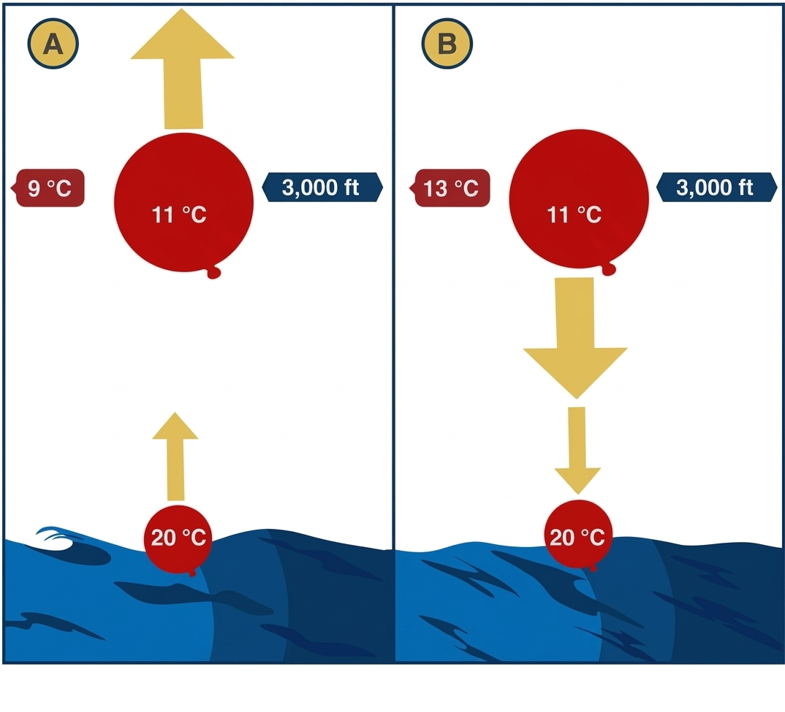
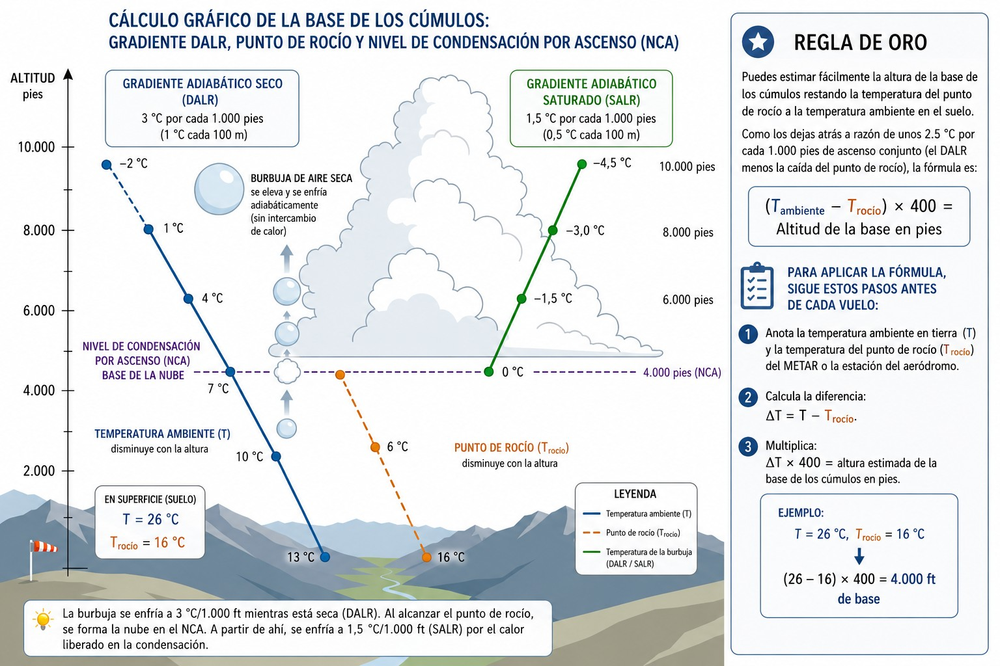
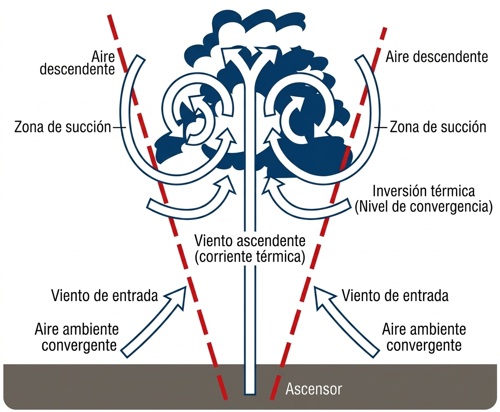
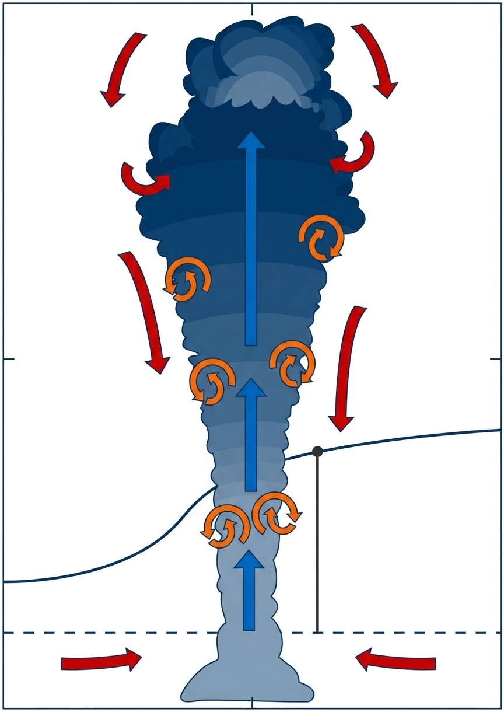
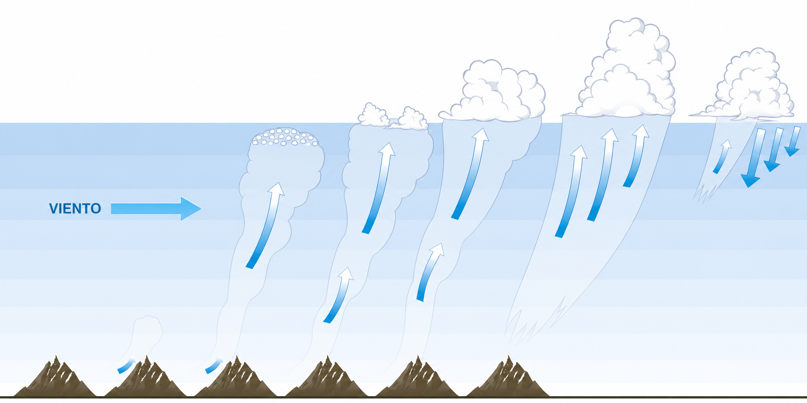

# Thermodynamics

> Thermodynamics is the invisible engine of engineless flight: without instability there are no
> thermals, and without thermals there is no cross-country flying. In this chapter you will learn
> to interpret atmospheric stability, to work out the cumulus base with a simple mental sum,
> to recognise a temperature inversion and to read the sounding indices that predict whether the
> day will be excellent or disappointing for flying.

## Atmospheric stability: the fuel of soaring

The stability of the atmosphere defines how a mass of air (a “bubble” or parcel) behaves when it is pushed upwards. Soaring lives, above all, on instability (@fig-03-cap03-estabilidad).

Picture a ball on different kinds of ground:

* **Stable atmosphere**: if you push a ball up the slope from the bottom of a valley, it rolls back to the middle. In the air, if the surroundings cool slowly with height (environmental lapse rate less than 1 °C/100 m), a rising bubble cools faster than its surroundings. It soon becomes colder (and heavier) than the air around it, stops rising and sinks back.
* **Unstable atmosphere**: picture the ball balanced precariously on a hilltop; a small push sends it rolling away without stopping. If the surrounding air cools very quickly with height (more than 1 °C/100 m), a bubble that starts to rise always stays warmer (and lighter) than the air around it, and its climb speeds up. This is the ideal condition for strong thermals.
* **Conditional instability**: it depends on humidity. If the air is dry, it is stable; but if it is saturated, the heat released by condensation (as cloud forms) keeps the bubble warm and it carries on rising (unstable).

{#fig-03-cap03-estabilidad}

## Adiabatic lapse rates and the cloud base

When a bubble of air rises by convection, it expands as it meets lower atmospheric pressure aloft. This expansion makes it cool internally (an adiabatic process), without exchanging heat with the outside air. How fast it cools depends on whether the air is dry or saturated.

* **Dry adiabatic lapse rate (DALR)**: as long as the bubble has not reached 100 % humidity, it cools at a constant rate of **3 °C for every 1,000 feet** (1 °C every 100 metres).
* **Saturated adiabatic lapse rate (SALR)**: when the bubble has cooled enough to reach its dew point, the water vapour starts to condense and forms the base of a cloud (the Lifted Condensation Level, or LCL). Condensation releases latent heat inside the bubble. So from the cloud base upwards the bubble keeps rising but cools much more slowly, typically at **1.5 °C for every 1,000 feet** (0.5 °C every 100 metres at low levels).

::: {.callout-tip title="Golden rule"}
You can easily estimate the height of the cumulus base by subtracting the dew point from the surface air temperature. Because the two converge at about 2.5 °C for every 1,000 feet of joint ascent (the DALR minus the fall in dew point), the formula is: **(T~air~ − T~dew~) × 400 = cloud base height in feet.**
:::

To apply the formula, follow these steps before every flight:

1. Note the air temperature on the ground (T) and the dew point (T~dew~) from the METAR or the airfield weather station.
2. Work out the difference: ΔT = T − T~dew~.
3. Multiply: ΔT × 400 = estimated height of the cumulus base in feet.

*Example: T = 26 °C, T~dew~ = 16 °C → (26 − 16) × 400 = **4,000 ft** cloud base.* (see @fig-03-cap03-base-cumulos-dalr-nca)

{#fig-03-cap03-base-cumulos-dalr-nca}

## Temperature inversions: the invisible lid

Temperature normally falls with altitude, but sometimes the opposite happens: we find layers where **the air temperature increases as we climb**. This is called a temperature inversion.

A temperature inversion acts like a lid or a glass ceiling. Because the air above the inversion is surprisingly warm, when a thermal rises and hits that layer it suddenly finds itself surrounded by air that is warmer (and therefore lighter) than itself. The thermal loses its **buoyancy** at once and its climb stops dead.

::: {.callout-warning title="Safety"}
Inversions shut convection down completely and so cap the height you can climb to in a glider. They also trap smoke, haze and industrial moisture near the surface, and in-flight visibility below the inversion layer can become very poor.
:::

## Convection: carrying heat upwards

Convection carries heat vertically through the atmosphere, and it is the very mechanism that forms thermals.

The sun does not heat the air directly: it heats the surface of the earth. This heating is very uneven: a dark ploughed field, a rocky area or a village of dry rooftops will warm up much faster than a dense forest or a lake. The warm ground heats the layer of air just above it by contact.

That warm air, now less dense and lighter, tends to rise by buoyancy, forming a convective current or “thermal”. At first the bubble clings to the ground through friction, building up its upward push until it finally breaks away and starts to rise.

::: {.callout-note title="Airmanship"}
To find the best thermals, look for “sources” that warm up quickly (dry ground, harvested fields, rocky areas in the sun) and “triggers”, or release points that help the bubble break away from the ground, such as the crest of a hill facing the wind or a line of trees at the edge of a sunny field.
:::

Meteorologists distinguish two conceptual models of how that vertical flow is organised inside:

* **Bubble model**: heat builds up over the source until the bubble breaks away, as if you were pulling a balloon free. The climb is intermittent: the central core rises faster than the edges, where the air sinks. The glider must find the core and stay in it to get the best climb (@fig-03-cap03-modelo-burbuja).

{#fig-03-cap03-modelo-burbuja}

* **Column / plume model**: over strong, persistent sources (a quarry, a large town, a slope that has faced the sun all morning), the convective flow is continuous, like smoke from a chimney. The climb is steadier and more predictable, ideal for cross-country flying (@fig-03-cap03-modelo-columna).

{#fig-03-cap03-modelo-columna}

On real days both structures exist side by side. Early morning tends to produce isolated bubbles; as the heating builds, long-lasting columns may appear. Recognising which one dominates on the day improves your thermal centring and cuts the time lost outside the climb (@fig-03-cap03-ciclo-vida-termica).

{#fig-03-cap03-ciclo-vida-termica}

::: {.mas-alla}
## Stability indices: the day's thermometer

[**↗ BEYOND THE EXAM.**]{.mas-alla-tag} Sounding indices (TT, K, CAPE, LI) and Skew-T diagrams should not be exam material: they belong to cross-country training. Study them once you have mastered the rest of the syllabus; they are here because they make a pilot, not just a pass.

Describing the atmosphere in qualitative terms (“it looks unstable”, “it looks promising”) is useful, but cross-country pilots go a step further: they quantify instability with indices derived from thermodynamic soundings.

An experienced flying instructor usually works with two pairs of indices:

* **TT + K** as everyday tools for deciding whether you fly and what you can expect.
* **CAPE + LI** as tools for deeper analysis when the day “has a catch”.

Field experience adds a key distinction: **TT (Total Totals) is especially reliable over flat country, while K is more representative in the mountains**. When you plan a flight over flat terrain (Castile, Aragon, La Mancha), look at TT. If you will be flying among mountain ranges (the Pyrenees, the Sistema Central, the Sistema Ibérico), give more weight to K.

### Total Totals (TT): the index for flat country

The Total Totals (TT) index combines the vertical temperature gradient with low-level humidity. Its formula:

::: {.callout-note title="Airmanship"}
The TT + K chart the instructor pins up in the hangar every morning gives you a quick snapshot of the day. TT tells you how much “fuel” the atmosphere has to build a Cb over flat country; K tells you the same for the mountains. Do not rely on just one: use them together before every pre-flight.
:::

TT thresholds and what they mean for soaring:

| TT | Conditions for soaring |
| --- | --- |
| < 44 | Stable atmosphere; weak or no thermals |
| 44–48 | Moderate instability; convection possible without thunderstorms |
| > 48 | Fairly unstable; Cb development likely over flat country |
| > 52 | Thunderstorm very likely: isolated storms |
| 55 | Scattered thunderstorms, some moderate and an isolated severe one |
| 58 | Scattered moderate thunderstorms, some severe and an isolated tornado |
| 61 | Frequent moderate thunderstorms; some severe or a tornado |
| 64 | Frequent moderate thunderstorms with severe storms and tornadoes |
: Total Totals (TT) thresholds and what they mean

The classic TT thunderstorm thresholds come from the work of Robert C. Miller for the US military warning centre (*Notes on Analysis and Severe-Storm Forecasting Procedures of the Air Force Global Weather Central*, 1972). The “for soaring” bands in the first two rows are an operational adaptation by this collection, not Miller's.

::: {.callout-warning title="Safety"}
TT has its limits: it overestimates instability if the temperature at 500 hPa is very low without convective support at low levels, and it does not pick up strong stability or high humidity below 850 hPa well. In those situations, back up your analysis with the K-Index and CAPE.
:::

### K-Index: the index for the mountains

The K-Index combines the temperature gradient between 850 hPa and 500 hPa with humidity at low and middle levels. It is the usual measure for forecasting convective activity in mountain areas:

| K | Conditions for soaring |
| --- | --- |
| < -10 | No thermals or very weak ones (very stable atmosphere) |
| -10 to 5 | Blue thermals without cumulus; little convection |
| 5–15 | Good soaring conditions, cumulus present |
| 15–20 | Excellent: high bases, strong thermals, occasional showers |
| 20–30 | Excellent convection, but a growing risk of showers and thunderstorms |
| > 30 | High probability of thunderstorms (> 60 %): do not plan long flights |
: K-Index thresholds and what they mean

The upper bands of the table agree with George's classic scale of air-mass thunderstorm probability (15–20 ≈ 20 %, 21–30 ≈ 20–60 %, 31–35 ≈ 60–80 %). The first three rows, on the other hand, are an operational adaptation by this collection. Below 15 the meteorological scale makes no distinction at all, because it only forecasts thunderstorms; yet for the glider pilot that is exactly where a day with no thermals and a good day part company.

::: {.callout-note title="Airmanship"}
The K-Index was designed to predict thunderstorms, not the quality of soaring. Its thresholds vary with region and season: in dry areas such as the Meseta Central, low humidity can give low K values even with strong thermals. In the mountains, if the 850 hPa level lies close to the ground, the index is less representative. Always use it together with TT and, if the day looks as though it may turn nasty, add CAPE.
:::

### CAPE and LI: digging deeper when the day has a catch

* **CAPE** (**Convective Available Potential Energy**): it quantifies the energy available for convection. It is the area between the parcel curve and the environment curve on the thermodynamic diagram. Reference values: 0 J/kg = absolute stability; 1,000–2,500 J/kg = an excellent thermal day; > 3,500 J/kg = severe convection likely.

::: {.callout-note title="Airmanship"}
The CAPE values you see in general meteorology textbooks usually rate 1,000–2,500 J/kg as “moderately unstable”, keeping “very unstable” for higher values. For the glider pilot, that range is simply excellent: it gives strong thermals and high bases without the risk of severe thunderstorms. When you consult outside tools such as SkySight or the University of Wyoming, read CAPE in its aeronautical context, not on the scales used in convective meteorology for thunderstorms.
:::

* **LI (Lifted Index)**: the difference between the temperature of the parcel and that of the environment at 500 hPa, after lifting the parcel adiabatically from the ground. Negative values indicate instability: the more negative, the greater the convective potential.

::: {.callout-tip title="Golden rule"}
An exceptional convection day (known informally in competition slang as a “thermonuclear day”): TT between 48 and 55, K between 15 and 20, CAPE between 1,000 and 2,500 J/kg, negative LI and light, variable winds. These are the days for distance records. You can find all these indices in any online sounding: free of charge from the University of Wyoming, AEMET (the Spanish State Meteorological Agency, through its AMA service), Windy or Meteoblue; with forecasts aimed at gliding in SkySight, TopMeteo or Meteo-Parapente.
:::

The threshold tables in the previous sections have eight bands each because they describe the whole spectrum, from calm to severe thunderstorms. The table below sums up the useful band for each index; the full tables are field material for when you fly for real:

| Index | Good thermal day band | Warning sign (thunderstorm) |
| --- | --- | --- |
| **TT** (Total Totals) | 44–52 | > 55 |
| **K** (K-Index) | 15–25 (qualified in the mountains) | > 25 |
| **CAPE** | 1,000–2,500 J/kg | > 2,500–3,500 J/kg |
| **LI** (Lifted Index) | slightly negative | very negative |
: The four sounding indices: reference bands for soaring

The golden rule for the cockpit: no single index decides anything. TT and K tell you whether the day will fly; CAPE and LI tell you how much energy it has and whether that energy may turn against you as a thunderstorm.

::: {.callout-warning title="Safety"}
TT > 55 or K > 25 combined with CAPE > 2,500 J/kg signals a high risk of thunderstorms developing during the day. In these conditions, plan to land before 16:00 and always have an alternative landing field identified before the convection builds.
:::
:::

::: {.postit}
**Chapter summary: thermodynamics**

* **Atmospheric stability**: a key concept. Air is “stable” if a bubble pushed upwards tends to sink back, and “unstable” if it keeps rising on its own. Soaring lives on instability.
* **Adiabatic lapse rates**: dry air cools by 3 °C for every 1,000 ft as it rises (DALR). Saturated air (cloud) cools only half as much, 1.5 °C (SALR). Memorise this to predict the cloud base and how the cloud will develop.
* **Inversions**: layers where temperature **rises** with height instead of falling. They act as an invisible lid that stops thermals and traps pollution and haze.
* **Convection**: the sun heats the ground, the ground heats the air, and the air rises as a bubble (bubble model) or as a continuous plume (column model). The colder the air aloft compared with the ground, the stronger the thermal.
:::
