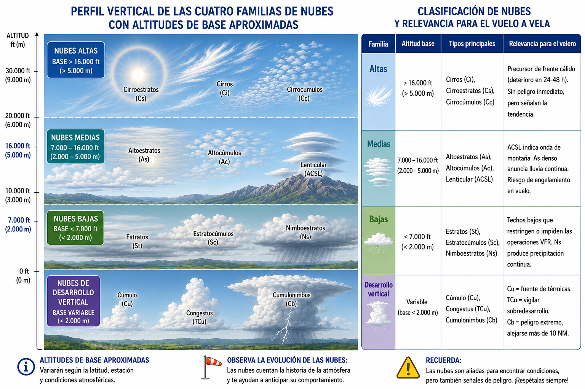
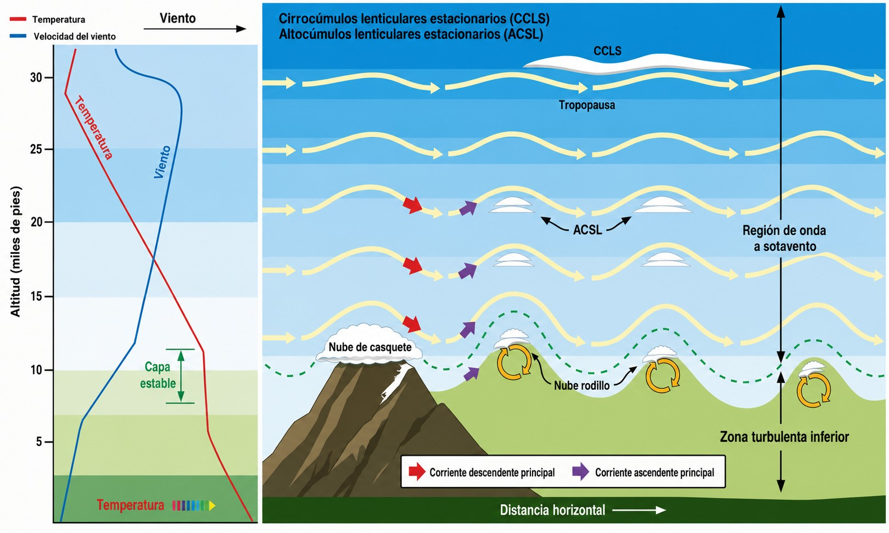

# Clouds and fog

> Clouds are the visual language of the atmosphere: if you can read them, they tell you where
> the lift is, where the danger is and how the weather is going to develop. In this chapter
> you will learn to identify the cloud types that matter for soaring, the hazards that go with
> each family, and how to interpret fog and mist when deciding whether to take off.

## Reading the clouds

For a glider crew, clouds are the visual map of the atmosphere. The figure below sums up the four main families and what each means in practice for soaring (@fig-03-cap04-familias-nubes-perfil):

{#fig-03-cap04-familias-nubes-perfil}

The WMO classifies clouds into **ten genera**, grouped into those four families by the height of their base:

High clouds (base > 6,000 m)

Cirrus (Ci), Cirrocumulus (Cc), Cirrostratus (Cs)

Medium clouds (base 2,000–6,000 m)

Altocumulus (Ac), Altostratus (As), Nimbostratus (Ns)

Low clouds (base < 2,000 m)

Stratus (St), Stratocumulus (Sc)

Vertical development

Cumulus (Cu), Cumulonimbus (Cb)

For soaring they do not all carry the same weight: cumulus mark thermals, cumulonimbus is the greatest danger, cirrus announce an approaching front and nimbostratus bring persistent precipitation. Even so, it pays to recognise all ten, because each one tells you something about the state of the atmosphere.

## Hazards of vertical development

In highly unstable, moist conditions, a cumulus can keep growing, develop into *cumulus congestus* and finally turn into a **cumulonimbus (Cb)**.

A cumulonimbus has a great vertical extent, often topped by an anvil where it reaches the tropopause. It holds massive energy, enough to put flight safety at serious risk. The hazards include:

* **Severe turbulence:** the updraughts and downdraughts that exist side by side inside and around a Cb easily exceed the structural limits of a glider. The gust front can reach kilometres from the core and strike without warning.
* **Hail:** updraughts carry water up into the freezing layers again and again, forming hailstones that can grow to a considerable size. A hail strike can seriously damage the canopy and the composite structure of the aircraft.
* **Electrical activity:** a lightning strike on the glider compromises the integrity of the aircraft and puts the occupants in direct danger.
* **Massive icing:** on entering the supercooled zones of a Cb, the leading edge picks up clear ice in seconds, destroying the laminar profile and sending the stall speed soaring.

::: {.callout-warning title="Safety"}
Always avoid flying near a cumulonimbus. A lateral safety separation of 10 to 20 nautical miles is recommended. If a convective system threatens the airfield, start your landing procedure at once.
:::

## Reduced visibility: fog and mist

A significant drop in visibility counts against the Visual Flight Rules (VFR).

* **Mist and haze:** they reduce horizontal visibility to between 1,000 m and 3,000 m.
* **Fog:** water suspended at ground level that restricts visibility to less than 1,000 m. In these conditions, VFR operation is not possible.

**Radiation fog** is of particular interest. It forms at dawn in winter after clear nights under anticyclonic conditions. The rapid cooling of the ground chills the lowest layer of air, saturating it and producing thick, localised banks of fog.

Another type that matters to operators at coastal and valley airfields is **advection fog**. Unlike radiation fog, it does not depend on the ground cooling overnight: it forms when a mass of warm, moist air moves horizontally over a colder surface (a cold sea, a snow-covered valley or a coastline). The temperature contrast is enough to saturate the base of that air mass and produce a dense fog bank that can persist day and night for as long as the flow lasts. It is typical of the Galician and Cantabrian coast in winter and of the Mediterranean coast in autumn with an easterly *levante* wind.

::: {.callout-tip title="Golden rule"}
Pay special attention to the late afternoon on days that began with persistent radiation fog. As the sun goes down, overnight cooling can bring the fog back in minutes and close the field before you land. On coasts and in valleys with an onshore wind, add the risk of advection fog: it can arrive without warning and at any time of day.
:::

## Lenticular altocumulus and wave flying

**Lenticular clouds** (**Altocumulus lenticularis**) have smooth, convex, lens-like shapes. Although they form under strong winds aloft, they stay completely stationary relative to the terrain.

They are the visible proof of a steady laminar flow crossing a mountain obstacle and bouncing downwind of it. In practice they signal a **mountain wave** system, where you can climb steadily without turbulence and gain a great deal of height in silky-smooth air (@fig-03-cap04-nubes-onda-montana).

{#fig-03-cap04-nubes-onda-montana}

::: {.callout-warning title="Safety"}
Below the wave, at low level, lurks the **rotor**: a very violent cylinder of rotating turbulence that gives itself away with ragged, unstable fractocumulus. If you are towed in a wave area, the tug will be thrown about hard as it crosses the rotor. Always keep enough height to avoid it and follow the tug pilot's instructions at all times.
:::

::: {.postit}
**Chapter summary: clouds and fog**

* **What clouds mean**: for the glider pilot, clouds are the map of the sky. Small, cotton-wool **cumulus (Cu)** are our best friends (they mark thermals). High **cirrus** often announce a front (bad weather within 24–48 h).
* **Hazard of vertical development**: if a cumulus grows tall (**Cu congestus**), watch it closely. If it becomes a **cumulonimbus (Cb)**, stay miles away: severe turbulence, hail and lightning can destroy a glider.
* **Fog vs mist**: both reduce visibility. Fog (< 1 km) is critical for landing and take-off. There are two common types: **radiation** fog (cold, clear nights; it usually clears with the morning sun) and **advection** fog (warm air over a cold surface; it can appear at any time and does not depend on the night).
* **Lenticular clouds**: lens- or saucer-shaped, they stay “still” even in strong winds. They indicate a **mountain wave**, which lets you climb very high but warns of very dangerous turbulence (rotors) at low level.
:::
