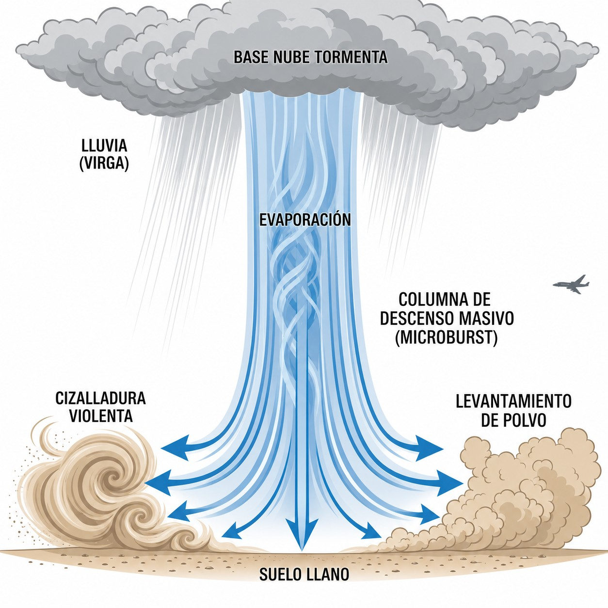

# Precipitation

> Precipitation (rain, hail, freezing rain or virga) is not just a nuisance: it can turn into
> an emergency within minutes. In this chapter you will learn how each type of precipitation
> affects the glider aerodynamically, which are the most dangerous, and what decisions you must
> take at the first signs to stay safe.

## Rain and aerodynamic degradation

Gliders are designed with laminar-flow aerofoils tuned for high efficiency. Rain spoils that: the airflow separates early and turns turbulent along the wet wings.

The effects are immediate:

* **Higher stall speed:** the wing will lose its lift at a significantly higher speed than when it is dry.
* **Lower glide performance:** the **glide ratio** suffers, so you must recalculate your glide cone and look for landing options within a shorter range.
* **Higher rate of descent:** you sink noticeably faster (**sink rate**) at the same flying speed.

::: {.callout-warning title="Safety"}
With wet wings, always add a minimum margin of 5–10 kt to your standard approach speed. Avoid steep turns: the risk of stalling is significantly higher than when the wings are dry, and the stall can come without warning.
:::

## Hail (GR) and convective clouds

Hail is born inside the cumulonimbus (Cb). Powerful updraughts hurl water droplets above the freezing level, where they freeze. They then fall, are caught by the updraught again and rise once more, gaining a layer of ice on each cycle, like an onion, until they are too heavy for the updraught to hold. Hailstones can end up more than 2–3 cm across.

For light composite aircraft, the energy of the hail (added to the aircraft's own speed) is a serious structural risk. Cracked and holed **canopies** are common, as is damage to the protective **gelcoat**, and severe direct hits can cause delamination of the composite core.

::: {.callout-note title="Airmanship"}
Do not assume that hail falls only directly beneath the Cb: the wind aloft can throw it out tens of kilometres under the spreading anvil. Always keep a safe distance from the anvil, even if the sky below looks completely clear.
:::

## Freezing rain (FZRA) and rapid ice build-up

**Freezing rain** (**FZRA**) is rain that is already supercooled when it falls: liquid drops below 0 °C that have not yet frozen, the **supercooled droplets**. The classic setting is a warm front in winter, when the rain passes through a layer of below-freezing air near the ground. You do not have to be inside a cloud: when the drops hit any solid surface of the glider (leading edge, canopy, nose) they freeze in fractions of a second, forming opaque ice or rime. Inside cloud, between 0 °C and −15 °C, the same droplets cause the icing described in chapter 9.

The result is **icing**, one of the fastest and most serious hazards in soaring:

* The cockpit canopy ices over in seconds, removing every VFR visual reference.
* Ice deforms the leading edge, destroys the laminar lift and sharply raises the stall speed.
* The added weight, spread unevenly towards the wingtips, increases drag and brings in lateral imbalances that are hard to correct.

At the first sign of icing (rime on the wing's leading edge or on the canopy), turn through 180° and descend at once to levels where the temperature is above zero. Do not wait: icing speeds up as more of the surface is covered.

## Virga: the invisible falling curtain

**Virga** is a curtain of precipitation that falls from the base of a cloud but evaporates before reaching the ground. It looks like grey or bluish streaks that fade into the air at mid-height, never touching the terrain.

The danger lies in what happens when those drops evaporate. Evaporation cools the surrounding air, which becomes denser and falls en masse towards the ground as a violent downdraught, the **downburst** or **microburst** (@fig-03-cap05-virga-microrrafaga).

{#fig-03-cap05-virga-microrrafaga}

These localised downdraughts (**microburst** / **downdraft**) can reach descent rates greater than the glider's ability to climb. Flying under virga, especially on final approach, can cause unrecoverable sink before the threshold. Whenever you see virga, keep a safe distance from it, both laterally and vertically.

::: {.postit}
**Chapter summary: precipitation**

* **Rain and performance**: for a glider, rain is kryptonite. Water on the wings spoils the laminar profile, sharply raising the stall speed and the rate of descent. If it is raining, add a safety margin to your landing speed.
* **Hail (GR)**: associated with cumulonimbus (Cb). It can be met even outside the cloud, under the anvil. It is destructive to composite structures. NEVER fly under a thunderstorm anvil.
* **Freezing rain (FZRA)**: supercooled drops that freeze on impact. It is a serious emergency: ice builds up in seconds, adding weight and deforming the aerofoil. Get out of that area at once (usually by changing altitude).
* **Virga**: a curtain of rain that evaporates before reaching the ground. It is a visual warning of strong downdraughts and possible severe turbulence beneath it.
:::
