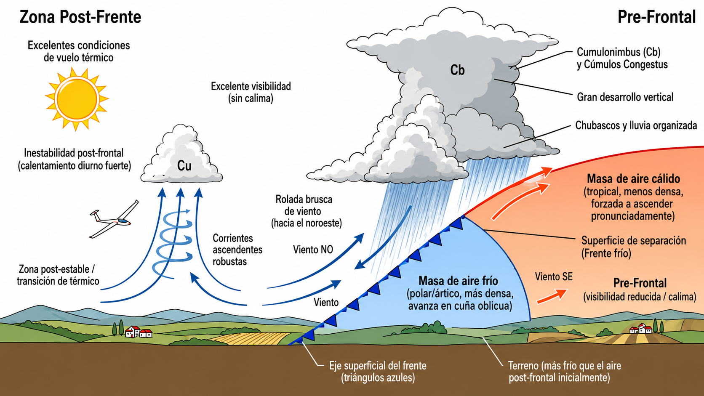
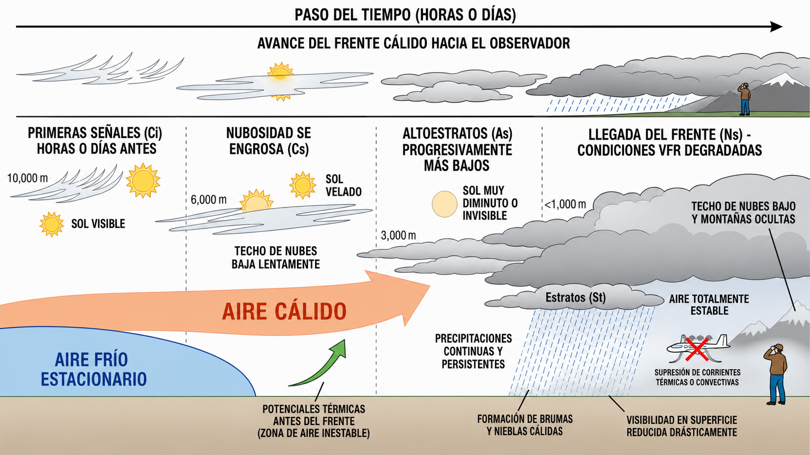
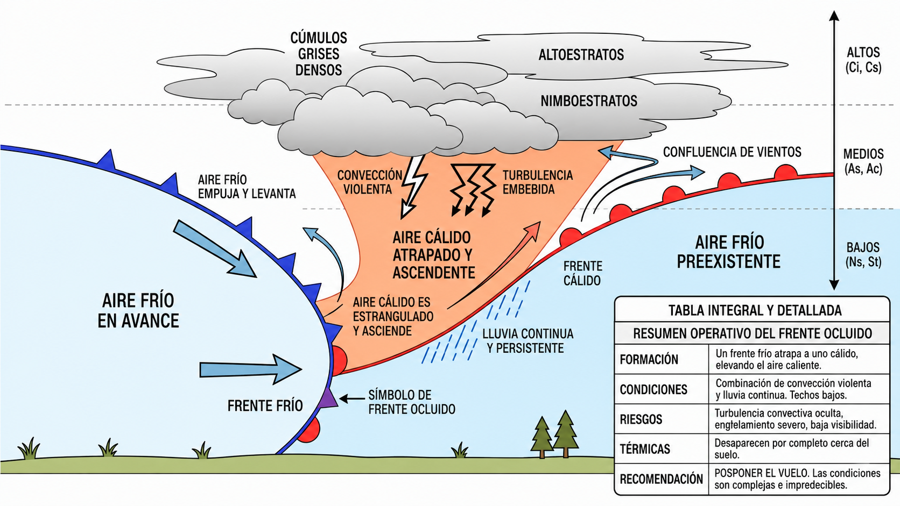

# Air masses and fronts

> A front is the boundary between two air masses with different properties, and crossing one
> without planning can turn a good flight into an emergency. In this chapter you will learn
> to recognise cold, warm and occluded fronts before they reach your area, and you will
> understand why the relative temperature of the air mass decides whether you will have
> thermals or fog under your wheels.

## Cold fronts and instability

A **cold front** is the boundary surface along which a mass of cold air, being denser, advances as a wedge and pushes in underneath an existing mass of warm air. This forces the warm air to rise steeply.

The passage of a cold front brings a sharp drop in temperature, an abrupt veer in the wind (usually to the north-west or north), reduced visibility and organised precipitation, often as showers and clouds with great vertical development such as cumulonimbus (Cb) (@fig-03-cap06-frente-frio-estructura).

For soaring, the best weather comes after the front. Once the frontal barrier has cleared, the region is dominated by a transitional air mass that is clearly colder than the ground. As its base is warmed by contact with the ground, marked **post-frontal instability** sets in.

::: {.callout-tip title="Golden rule"}
The days immediately after the passage of a large-scale cold front usually offer the best thermal conditions. They bring excellent visibility with no haze, rising atmospheric pressure and strong daytime heating that sets off vigorous thermals marked by well-defined cumulus (Cu).
:::

{#fig-03-cap06-frente-frio-estructura}

## Warm fronts and pre-frontal subsidence

A **warm front** occurs when a mass of warm air advances and rises gently over a denser, stationary mass of cold air lying in the lower basin. Because its slope is much gentler than that of a cold front, it develops and moves slowly and over a long period.

The approach of a warm front can be seen hours or days in advance as **cirrus (Ci)** clouds appear in stages (@fig-03-cap06-frente-calido-nubes). As the system advances, the cloud thickens and gradually lowers, passing through cirrostratus and altostratus and ending in a layer of nimbostratus (Ns) and stratus (St).

A warm front makes VFR conditions steadily worse:

* It brings continuous precipitation and persistent drizzle over a wide area.
* Cloud ceilings come down gradually, hiding high ground and mountains.
* Constant humidity favours warm mist and fog that drastically reduce surface visibility.
* Thermodynamically, it makes the air mass completely stable, physically suppressing any usable convective currents or thermals.

{#fig-03-cap06-frente-calido-nubes}

## Occlusion and the stationary front

When a cold front moves faster than the warm front ahead of it, it eventually catches up. The cold front then pushes from behind and traps the warm air in between: it pinches it, lifts it off the ground and forces it to rise completely. This process is called an **occluded front**, or occlusion (@fig-03-cap06-tipos-frentes).

In operational terms, an occlusion combines the worst of both fronts: the violent convection of the cold front plus the continuous rain and low ceilings of the warm front. The warm air no longer touches the ground, so thermals disappear, and convective turbulence can be embedded in thick layers of cloud with no clear visual warning. Faced with an occluded front, postpone the flight: conditions are complex and unpredictable.

{#fig-03-cap06-tipos-frentes}

There is a fourth type of front, less common but seen on synoptic charts: the **stationary front**. It forms when two air masses of similar temperature and density meet and neither is strong enough to push over the other. The result is an almost motionless boundary between the two masses, which can last for days, bringing persistent rain and fog along its axis. On synoptic charts it is drawn with alternating blue triangles and red semicircles on opposite sides of the frontal line.

::: {.callout-important title="Regulation"}
**SERA.5001** (Commission Implementing Regulation (EU) No 923/2012) sets the weather minima for VFR flight. In class G airspace, at and below 3,000 ft AMSL or 1,000 ft above terrain, whichever is higher, the general minimum visibility is **5 km**, clear of cloud and with the surface in sight. It may be reduced to **1,500 m** for flights at 140 kt or less, provided the speed gives adequate opportunity to see other traffic or obstacles in time to avoid a collision. Inadvertent entry into IMC by a VFR pilot without an instrument rating is a serious offence.
:::

## Air masses and relative temperature

When it comes to convection, the absolute temperature of the air mass matters less; what counts is the **temperature of the air mass relative to the temperature of the ground it is moving over**.

* **Cold air sliding over warm ground = INSTABILITY.** This happens when cool maritime air arrives over continental plateaus warmed by the sun. The base of that air mass is warmed by contact with the ground, becomes lighter and rises: strong thermals start up, good for cross-country flying.
* **Warm air sliding over cold ground = STABILITY.** This happens when a warm mass moves over a cold ocean or over snow-covered land. The base of that air cools and becomes denser in contact with the ground, forming a stable inversion that suppresses any thermals and favours persistent fog.

## Classifying air masses

Before talking about relative temperature, it helps to know where the air above you comes from. Air masses are classified by two criteria: their **latitude of origin** (which sets their temperature) and their **track** (which sets their humidity).

| Code | Type | Temperature | Humidity and characteristics for soaring |
| --- | --- | --- | --- |
| **Tc / Tm** | Tropical (continental or maritime) | Warm | Tm: moist, frequent haze, weak thermals. Tc: hot and dry, strong instability in summer, excellent thermals over the Meseta. |
| **Pc / Pm** | Polar (continental or maritime) | Cold | Pm: moist, classic post-frontal, low cumulus bases but thermals present. Pc: very cold and dry, exceptional visibility. |
| **A** | Arctic / Antarctic | Very cold | Winter outbreaks from the north. Below-zero temperatures on the airfield, severe icing, strong winds. Do not fly. |
: Classifying air masses by origin and track

The most common situation over the Iberian Peninsula during the soaring season (spring and summer) is the arrival of **polar maritime air (Pm)** after a cold front has passed. Having crossed the Atlantic and warmed up over the hot ground of the peninsula, this air mass produces the perfect combination for cross-country flying: blue sky, good visibility, bases at 5,000–7,000 ft and thermals of 3–4 m/s.

::: {.callout-warning title="Safety"}
Do not take off in marginal visibility under an inversion: after a cable break or an emergency release, the landing back on the field would have to be made without visual references, with the risk of a fatal impact. If you have any doubt about the visibility, postpone the flight.
:::

::: {.postit}
**Chapter summary: air masses and fronts**

* **Cold front**: the glider pilot's best friend (once it has passed). It brings instability, clean skies and strong thermals (a “post-frontal” sky). As it passes, expect showers, a wind veer and a drop in temperature.
* **Warm front**: bad news. Heralded by cirrus that lowers to stratus, it brings continuous rain, low ceilings and poor visibility. The air is stable, so forget about thermals.
* **Occlusions**: when the cold front catches the warm front. It usually means unsettled weather, mixed cloud and precipitation. Of little use for flying.
* **Air masses**: what matters is relative temperature. Cold air over warm ground = instability (thermals!). Warm air over cold ground = stability (layer cloud, fog, inversion).
:::
