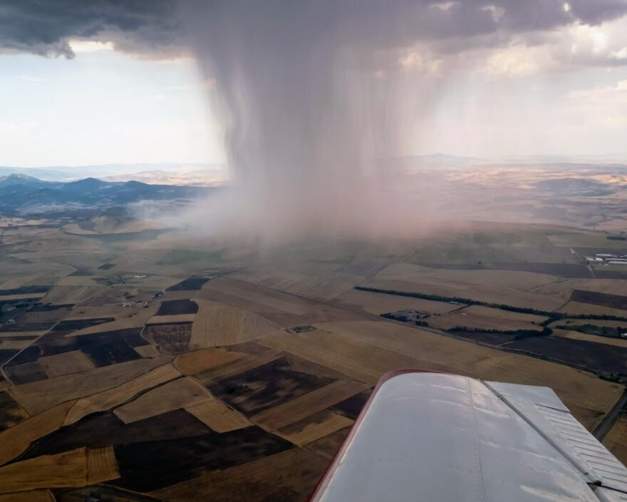
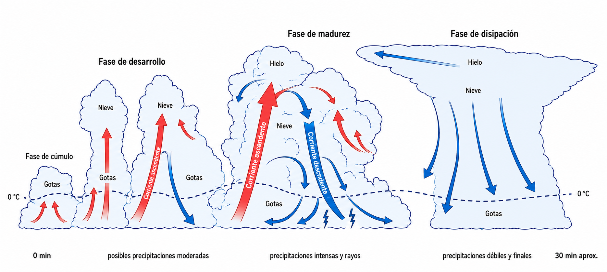
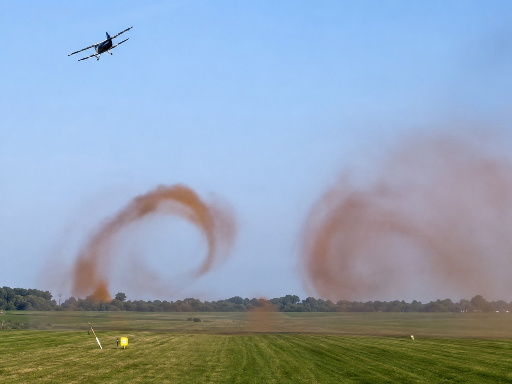
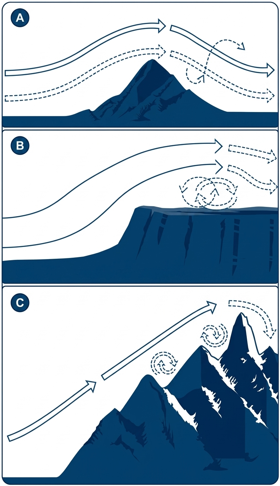
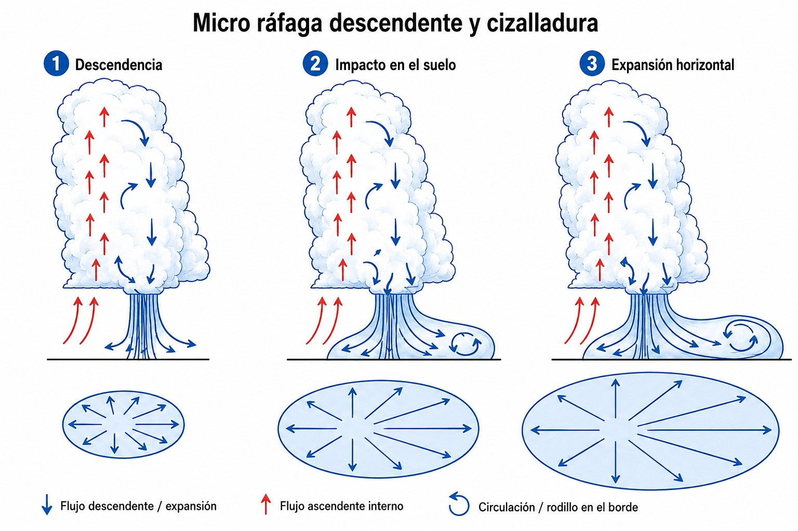

# Flight hazards

> Dangerous weather does not always give you fair warning: a Cb can grow while you do your
> pre-flight checks, ice can form in minutes, and wind shear can put you on the ground in the
> last few metres of final approach. In this chapter you will learn to identify and avoid the
> most critical weather hazards for soaring, and what decisions to take when they appear.

## Thunderstorms and clouds of extreme development (Cb)

The cumulonimbus (Cb) is the most severe expression of atmospheric instability. It packs the most hostile weather phenomena into a single convective cell. For any aircraft, and especially for a light glider, flying doctrine is that you must **never** operate under a Cb, inside one, or close to one (a recommended avoidance margin of 10 to 20 NM) (@fig-03-cap09-cumulonimbus).

* **Structural hazards:** these immense convective formations unleash adjacent updraughts and downdraughts of extreme violence. The resulting shear turbulence (**updrafts** and **downdrafts**) can comfortably exceed the design limit load factors of any light aircraft, causing structural failure in flight.
* **Associated phenomena:** Cb are flanked by squalls with very strong directional gusts, frequent electrical discharges (lightning), heavy precipitation and, very probably, hail. Severe hail (over 2 cm across) destroys the laminar profile and can compromise the structural integrity of the glider.
* **Early identification:** anticipation is everything. Seeing the characteristic spreading “anvil” at the tropopause, or the deep, dark, advancing arch at the base (**roll cloud**), calls for an immediate avoiding manoeuvre and a decision to land in a field or at the nearest clear alternate airfield.

{#fig-03-cap09-cumulonimbus}

::: {.callout-warning title="Safety"}
Developing storm cells, or cells embedded (“embedded Cb”) in thick cloud layers (such as warm or occluded fronts), can hide their presence. When severe thunderstorm systems are forecast, when weather warnings show intense cores, or when there are signs of strong instability, give priority to getting back on the ground quickly and safely.
:::

### The life cycle of a thunderstorm cell

A thunderstorm is not a static object but a process with a beginning and an end. Understanding its three stages helps you read the sky and anticipate when a cell is most dangerous (@fig-03-cap09-ciclo-tormenta):

1. **Developing or cumulus stage**: the updraught dominates. A cumulus congestus grows rapidly upwards, fed by warm, moist air. No precipitation reaches the ground yet, but the lift is already strong and disorganised. For the glider, the lift is tempting and deceptive: the cloud is still “charging up”.
2. **Mature stage**: the most dangerous. Updraught and downdraught exist side by side; precipitation begins, dragging cold air down and producing the gust front at the surface. This is the stage of hail, lightning, extreme turbulence and the **downburst**. The cloud reaches its maximum vertical development and the anvil appears.
3. **Dissipating stage**: the downdraught dominates. Cold air from the precipitation cuts off the supply of warm air that fed the cell, the lift dies away and the storm breaks up, leaving remnants of anvil and light precipitation. Residual turbulence remains.

{#fig-03-cap09-ciclo-tormenta}

## Icing in gliders

**Icing** is one of the fastest and quietest hazards in soaring. It happens when the glider enters cloud or areas of visible moisture at below-zero temperatures. The range of greatest risk is between 0 °C and −15 °C, peaking at around −10 °C, although icing can occur at lower temperatures. Supercooled water droplets freeze in fractions of a second on touching the leading edge, the canopy or any forward-facing surface of the aircraft.

Not all ice is the same. Leaving aside hoar frost (which is not icing by supercooled droplets but direct deposition of vapour), icing proper takes three forms with different effects, depending on the temperature and the size of the droplets:

* **Hoar frost**: fine, white crystals formed when water vapour freezes directly (deposition) on cold surfaces, with no supercooled droplet involved. Strictly speaking, therefore, it is not icing. It is the mildest form: it degrades the aerofoil and can obscure the canopy, but the process is slower.
* **Rime ice**: forms from small droplets at low temperatures, typically below −15 °C. White and rough, it sticks mainly to the leading edge and increases drag noticeably.
* **Mixed ice**: between −10 °C and −15 °C, large and small droplets exist together, and the deposit combines the worst of the other two: hard, transparent layers with rough, white inclusions.
* **Clear ice**: the most dangerous. It forms from large droplets between 0 °C and −10 °C. It spreads as a hard, transparent layer over the whole wing surface, adds weight, upsets the balance of the aircraft and destroys the laminar lift. It is hard to see until it is already serious.

Whatever its form, the consequences are the same: the **stall speed** rises, the glide ratio falls and the canopy becomes opaque. A glider has no anti-icing system.

::: {.callout-warning title="Safety"}
At the first sign of icing (rime on the leading edge of the wing, or crystals on the canopy), act at once:

1. Turn through 180° and get out of the cloud.
2. Start descending towards levels where the temperature is above zero.
3. Do not wait: icing speeds up as more of the surface is covered.

A glider with structural ice can stall well above its usual speed, with no warning buffet at all.
:::

## Wake and orographic turbulence

Not all turbulence comes from the weather: some is generated by aircraft themselves, and some hides in the shelter of the mountains.

* **Wake turbulence:** large aircraft (heavy jets or large turboprops) shed two powerful vortices from their wingtips that spin like corkscrews. These vortices sink slowly below the flight path and can persist for several minutes in light winds. If a glider crosses that wake, it can be rolled over instantly, beyond the ability of the controls to correct it. At an airfield with mixed traffic, always wait at least 3 minutes after a heavy aircraft has taken off or landed before using the same runway (@fig-03-cap09-estela-turbulenta).
* **Helicopter wake:** helicopters produce extremely dangerous airflows because of the huge amount of energy concentrated by their rotor blades. The danger comes in two situations:
  
  * **In the hover or slow air taxiing:** the rotor drives a high-speed flow of air downwards (**downwash** or **rotor wash**) that strikes the ground and spreads out as turbulent vortices to a distance of at least three rotor diameters.
  * **In forward flight:** the rotor produces a pair of wake vortices similar to those of a fixed-wing aircraft, but noticeably more concentrated and intense at low speed. Crossing this wake can cause an instant, uncontrollable yaw or roll in a glider.

{#fig-03-cap09-estela-turbulenta}

* **Rotor turbulence:** downwind of a mountain range in a strong wind, the **rotor** forms at low level: a cylinder of air in chaotic rotation, invisible from outside. It is the dangerous flip side of mountain wave: while in the wave you climb smoothly, low down beneath that same wave the rotor can snatch control of the glider from you with a single gust. If you are towed in a wave area, follow the tug precisely, tighten your harness and keep away from the rotor zone if you can (@fig-03-cap09-flujo-crestas).

{#fig-03-cap09-flujo-crestas}

## Wind shear on final approach

**Wind shear** is a sudden change in wind speed or direction that affects the glider over a very short distance. For a glider on the approach it is one of the most treacherous hazards: it acts in seconds, with no visual warning. It is associated with active fronts, convergence zones, **downbursts** and low-level temperature inversions.

* **Risk on final:** the glider judges its glide energy against the prevailing headwind. If that headwind suddenly disappears or swings round to a tailwind (which is what happens when you cross a wind shear), the indicated airspeed (IAS) drops sharply, lift is reduced and the glider sinks abruptly. At low height over the threshold there is no margin for recovery: losing 10 kt of headwind on final can lead to a **crash landing** within seconds.
* **Microbursts and downbursts:** closely linked to the base of mature cumulonimbus discharging heavy rain. These masses of cold air plunge vertically to the ground, where they spread out horizontally, producing opposing radial gusts. Flying into a microburst on the approach is extremely dangerous: first the glider gets a deceptive gain in lift from the headwind, then seconds later it suffers massive sink from the descending air and the sudden tailwind, which can lead to a forced landing or an accident if there is not enough height and speed (@fig-03-cap09-cizalladura).

{#fig-03-cap09-cizalladura}

::: {.postit}
**Chapter summary: flight hazards**

* **Thunderstorms (Cb)**: the mother of all hazards. Never fly under a Cb or near one (< 10–20 NM). Extreme turbulence, hail and lightning. If you see an anvil, turn back.
* **Thunderstorm life cycle**: three stages. Developing (cumulus): the updraught dominates, no rain. Mature: updraught and downdraught together, hail, lightning and **downburst**; the most dangerous stage. Dissipating: the downdraught dominates and the cell breaks up.
* **Icing**: ice destroys the aerodynamics and raises the stall speed without warning. Four deposits: hoar frost (strictly speaking not icing, since it forms by deposition), rime, mixed and clear ice. **Clear ice** is the most dangerous because it is invisible and uneven. Greatest risk between 0 and −15 °C. If you pick up ice, leave the cloud and descend into warmer air.
* **Turbulence**: the wake of heavy aircraft sinks slowly and can roll you over instantly (wait 3 minutes before using the runway). The wave rotor forms downwind at low level, with chaotic, invisible rotation.
* **Wind shear**: a sudden change of wind on final. It can put you on the ground (loss of headwind speed). **Downbursts** first give a headwind, then sudden sink and a tailwind.
:::
