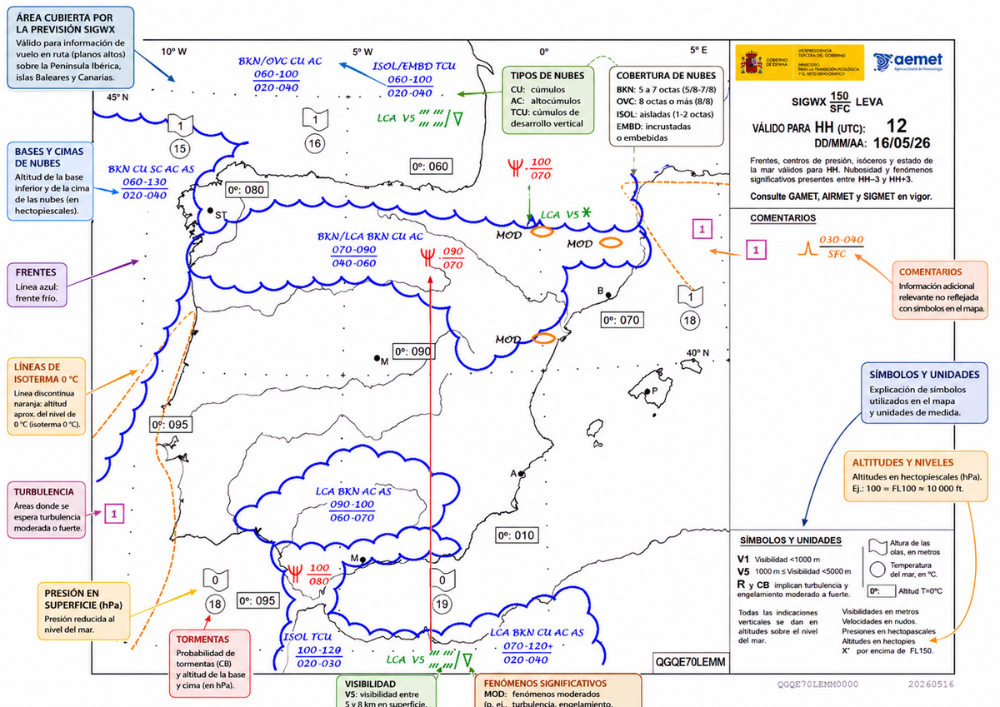
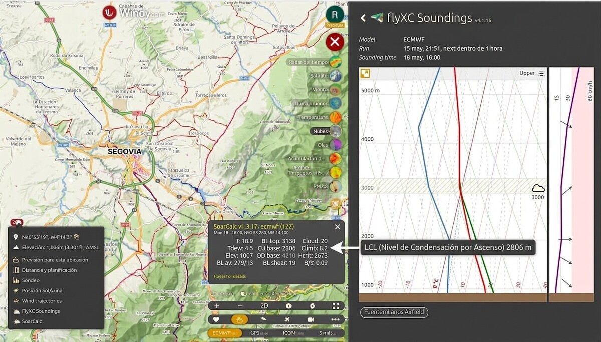

# Meteorological information

> Knowing how to fly is necessary; knowing how to read the weather before you take off is
> essential. In this chapter you will learn to interpret METARs, TAFs, SIGWX charts and
> thermodynamic soundings as they apply to gliding: from deciphering a four-letter code
> to deciding, with sound judgement, whether the day is worth getting the glider out of the hangar.

## METAR and TAF reports

Because soaring depends so heavily on the atmosphere, the ability to read and interpret aeronautical weather information accurately is a basic requirement before any flight. The main standard reports are the METAR and the TAF:

* **METAR (Meteorological Aerodrome Report):** an observation of the actual, current weather at the aerodrome. It is usually issued every 30 minutes (or every 60 minutes, depending on the aerodrome). It gives concise data on surface wind direction and speed, horizontal visibility, cloud (amount and base height), air temperature, dew point and altimeter setting (QNH). The message often ends with a short-term `TREND` forecast valid for the next 2 hours (or `NOSIG` if no significant change is expected).
* **SPECI (Special Aerodrome Report):** the urgent sibling of the METAR. It is issued outside the regular cycle as soon as conditions change significantly: the wind veers or strengthens, visibility or cloud base crosses an operational threshold, a thunderstorm appears. Its format is identical to the METAR; only the first word changes. If you find a SPECI when you check an aerodrome, read it before the METAR: it is more recent and was issued precisely because something has got worse.
* **TAF (Terminal Aerodrome Forecast):** the official aerodrome forecast. Prepared by meteorological offices, it forecasts how the weather at the aerodrome will develop over standard validity periods, usually 9, 24 or 30 hours. It uses change and probability groups that are essential for planning:
  * `FM` (**from**): a rapid, permanent change from the time given. Everything before it no longer applies.
  * `BECMG` (**becoming**): a gradual, permanent change within the period given.
  * `TEMPO`: temporary fluctuations, each lasting less than an hour and together less than half the period.
  * `PROB30` and `PROB40`: a 30 % or 40 % probability of what follows. **These are the only two that exist**: if the probability reaches 50 %, the phenomenon is coded as a change (`BECMG` or `FM`), and below 30 % it is not coded at all.

The crew must be fluent in this code. Of particular operational importance are indicators such as:

* CAVOK: indicates ideal VFR conditions, and requires four things **at the same time**: horizontal visibility of 10 km or more; no cloud below 5,000 ft or the highest minimum sector altitude, whichever is greater; **no Cb or TCU at any level**; and no significant weather. That “at any level” is a classic exam trap: a cumulonimbus with its base at 7,000 ft rules out CAVOK even though it is well above the 5,000 ft threshold. The label is the ICAO one; around the club you will hear the backronym *Ceiling And Visibility OK*, which is not the official name.
* NSC (No Significant Cloud): no cloud below 5,000 ft (or the highest minimum sector altitude, whichever is greater) and no Cb or TCU, when the CAVOK criteria are not met, typically because visibility is below 10 km.
* NCD (**No Cloud Detected**) and SKC (**Sky Clear**): often confused with NSC, and they do not mean the same. `NCD` is reported by an **automatic** station whose sensors have detected no cloud; `SKC` is written by a **human observer** who sees a clear sky. `NSC`, on the other hand, does not say there is no cloud: it says none is operationally significant.
* Reduced visibility: abbreviations such as `FG` (**Fog**) or `BR` (**Mist**) indicate marginal or restrictive VFR conditions and can hold up take-offs for a while.

Cloud cover is coded in **eighths of the sky covered**, or oktas, and there are four steps, not two:

| Code | Oktas | Meaning |
| --- | --- | --- |
| `FEW` (**Few**) | 1–2 | Few |
| `SCT` (**Scattered**) | 3–4 | Scattered |
| `BKN` (**Broken**) | 5–7 | Broken |
| `OVC` (**Overcast**) | 8 | Overcast |
: Cloud cover in oktas, as coded in METAR and TAF {#tbl-03-cap10-octas}

Note the jump in @tbl-03-cap10-octas between `SCT` and `BKN`. There, in a single eighth of sky, lies the difference between a day of usable cumulus and a sky that closes in and switches the thermals off.

::: {.callout-important title="Regulation"}
In written METARs and TAFs, the wind direction is given relative to **true north**. The wind that the Tower or the ATIS gives you by radio is relative to **magnetic north**, like the runway numbers, so that you can compare it directly with the runway heading without correcting anything. It is the same figure measured against two different norths, and it comes up often in the exam. The Communications book covers it in detail.
:::

### A worked example of METAR decoding

The message arrives in one piece, and the first step is to **split it into groups**; from there, each one is read on its own. This is the one we are going to decode:

```
METAR LEMD 241100Z 18002KT 9999 FEW028 OVC040 16/09 Q1019 NOSIG=
```

Group by group:

* **METAR**: type of report (routine observation).
* **LEMD**: aerodrome (in this case, Madrid-Barajas).
* **241100Z**: day 24 of the month, at 11:00 UTC (Zulu time).
* **18002KT**: wind from 180° (south), relative to true north, at 2 knots.
* **9999**: horizontal visibility of 10 km or more (excellent).
* **FEW028**: few clouds (**Few**, 1 to 2 oktas) with a base 2,800 feet above aerodrome elevation.
* **OVC040**: overcast (**Overcast**, 8 oktas) at 4,000 feet.
* **16/09**: air temperature 16 °C and dew point 9 °C. (If we apply our thermodynamic golden rule: (16 − 9) × 400 = 2,800 feet. It matches the cloud reported at 2,800 feet perfectly.)
* **Q1019**: altimeter setting (QNH) of 1019 hPa.
* **NOSIG**: TREND forecast indicating that **no** **sig**nificant changes are expected in the next 2 hours. The `=` marks the end of the message.

With the message decoded, what is left is the hard part: deciding. This METAR is a **no-go** for soaring, and a single word says so: `OVC040`. With overcast at 4,000 feet no sun reaches the ground, and without sun there is no differential heating, no thermals and no flying. It does not matter that the visibility is excellent, the wind calm and the QNH comfortable. And notice how close the two came: `FEW028` matched the golden rule and promised cumulus at 2,800 feet, and the layer covering them is only 1,200 feet higher. Get into the habit of asking yourself, group by group, what each one does to the day.

Other groups that turn up every day and are not in this example:

* **Wind**: `G` marks the gust (`18012G25KT`, 12 knots gusting 25); `VRB` means variable direction; and two headings joined by `V` (`180V240`) give the range over which the direction varies.
* **Visibility and cloud**: `VV///` is vertical visibility (the sky cannot be seen, so the measurement is made upwards through the fog); `NSW` (**No Significant Weather**) announces that a significant phenomenon has ended.
* **Weather**: `RE` prefixes recent weather (`RETS`, recent thunderstorm); `WS` warns of wind shear (`WS RWY18`).
* **Below-zero temperature**: marked with `M` (`M02/M05` is −2 °C and −5 °C).
* **Pressure**: `Q1019` is in hectopascals; `A2992` is in inches of mercury, the United States format.
* **Source and corrections**: `AUTO` means the report comes from an automatic station without human supervision; `COR` is a corrected report and `AMD` an amended TAF.

| Aspect | METAR | TAF |
| --- | --- | --- |
| Type | Actual observation (current state of the aerodrome) | Official forecast (expected development) |
| Issue frequency | Every 30 min (or 60 min at smaller aerodromes) | Every 3 h for 9 h validity; every 6 h for 24 and 30 h |
| Validity period | A single moment + 2-hour TREND | 9, 24 or 30 hours |
| Issued by | Observer or automatic station at the aerodrome | Meteorological office (AEMET) |
| Main use | Checking conditions at take-off or on arrival | Planning the flight in advance |
| Key indicators | `CAVOK`, `NSC`, `FG`, `BR`, `NOSIG` | `FM`, `BECMG`, `TEMPO`, `PROB30`, `PROB40` |
: METAR vs TAF: key differences for flight planning {#tbl-03-cap10-metar-taf}

In @tbl-03-cap10-metar-taf, the issue frequency depends on the validity: the short TAF is refreshed often and the long one rarely. A 24-hour TAF issued five hours ago may be well out of date and still be the one in force.

## Significant weather charts (SIGWX)

While METAR and TAF cover specific airports, **Significant Weather Charts (SIGWX)** show the expected weather over large en-route areas. They are the bird's-eye view of planning: they tell you where the fronts are, which areas of instability you should go round and where the freezing levels lie (@fig-03-cap10-sigwx).

* SIGWX charts show the distribution of fronts (cold, warm, stationary, occluded) and pressure systems, with their forecast movement.
* They identify axes of instability such as **troughs**, which come before the development of cumulus and showers.

The associated services also issue specific warnings. They are easily confused, and what separates them is the level:

* **SIGMET** (**Significant Meteorological Information**): phenomena hazardous to any aircraft, **at any level** and throughout the FIR: severe icing (`SEV ICE`), severe turbulence (`SEV TURB`), embedded cumulonimbus, volcanic ash. Although most of these phenomena live above FL100, the warning also applies to you: the Cb whose top justifies the SIGMET has its base at your height.
* **AIRMET** (**Airmen's Meteorological Information**): phenomena less severe than those in a SIGMET, **below FL100** (FL150 in mountainous areas). This is the one made to measure for us.
* **GAMET** (**General Area Meteorological Forecast**): an area forecast in abbreviated plain language for low levels, not a one-off warning.

Before a cross-country flight, checking the active SIGMETs and AIRMETs is mandatory.

{#fig-03-cap10-sigwx}

::: {.mas-alla}
## Thermodynamic soundings and temperature curves

[**↗ BEYOND THE EXAM.**]{.mas-alla-tag} Skew-T soundings and the indices calculated from them (K, CAPE, LI) belong to cross-country training and should not be exam material. Read them as an introduction to cross-country flying.

The thermodynamic sounding is the X-ray of the day: it shows how temperature and humidity change with height at a given place. It is plotted on **Skew-T log-P** or **Stüve** diagrams, and the tools that publish it (free and paid, general and gliding-specific) are listed with their addresses in the “Weather Sources for Soaring” appendix of this book. Learning to read a sounding will save you unnecessary tows and warns you of thunderstorms before they can be seen from the ground (@fig-03-cap10-indices-estabilidad).

{#fig-03-cap10-indices-estabilidad}

* The blue line shows the dew point
* the red line shows the air temperature
* the green line shows the temperature of a rising parcel
* the hatched area along the plot shows the convective layer (cumulus clouds)
* the wind plot shows wind from 0–30 km/h on the left (white background) and from 30 up to the maximum speed on the right (red background)

The three key readings are:

1. **Cumulus base (LCL):** watch out for a common mistake. Where the temperature and dew point curves touch is **not** the LCL but a layer that is already saturated: fog, stratus or a cloud that exists at that moment. The LCL comes from crossing two different lines: from the surface temperature you go up along the **dry adiabat**, from the surface dew point you go up along the **saturation mixing ratio line**, and where they cross is the height at which the parcel condenses. It is the same calculation as the golden rule in the thermodynamics chapter ((T − T~dew~) × 400 is its arithmetic approximation), so the sounding and the rule of thumb should give you the same answer; if not, you have misread one of them. For the day you are going to fly, do the construction with the **forecast maximum temperature** instead of the current one: what you then get is the convective condensation level (CCL), which is the real base of the afternoon cumulus and the same criterion used to plot the thermal ceiling.
2. **Thermal ceiling:** draw the dry adiabat from the forecast maximum temperature. Where that line crosses the environment curve again is the top of the thermals. The quality of the day lies in **how far it is from the base**: if the ceiling is well above the LCL, the convective layer is deep and the thermals will be strong; if the two almost coincide, thermal flying will be weak and short.
3. **Risk of overdevelopment (Cb):** if the environment curve becomes very unstable above the **Level of Free Convection** (LFC), the height above which the parcel rises on its own without anything pushing it, the midday cumulus may turn into cumulonimbus in the afternoon. CAPE quantifies that available energy: above 2,500 J/kg convection is vigorous and you need to watch the sky, and above 3,500 J/kg severe convection is likely. Combined with a K-Index above 25, it is the signature of a day that may end badly.

Those two numbers always go **as a pair**. You get cumulus when the LCL is below the thermal ceiling, because the parcel condenses before it stops rising; and you get blue thermals, without a single cloud to show you where the air is rising, when it is above. An LCL at 3,000 m with the ceiling at 4,000 gives cloud streets and a magnificent day; an LCL at 1,200 m with the ceiling at 1,100 gives a blue day. The height of the LCL on its own tells you nothing.

::: {.callout-tip title="Golden rule"}
An exceptional convection day (known informally in competition slang as a “thermonuclear day”) has a precise numerical signature: K-Index between 15 and 20, CAPE between 1,000 and 2,500 J/kg, negative LI, temperature at 850 hPa several degrees above **its climatological average for the date**, and light winds. Be careful with that last figure, which is easily misremembered: it is compared with the climatology, not with the surface. At 850 hPa (about 1,500 m) the air on a normal day is between 10 and 15 °C **below** the ground temperature; if it were above, that would mean a massive inversion, in other words the day on which there is not a single thermal. Look for these indices directly in the day's sounding, in any of the sources in the appendix.
:::
:::


## Analysing the data and making decisions

Before you go out to the launch point, cross-check several sources: it is both mandatory and prudent. Do not trust a single model or a single parameter.

* **Compare what you see with what the model forecasts:** if you arrive at the field and cloud is already covering the sunny slope when the sounding predicted thermal activity until 3 in the afternoon, something has gone wrong. Reality rules: cancel or wait.
* **The pilot-in-command's judgement:** the last word is always yours, not the model's. Cross-check at least two independent sources from those listed in the appendix (one general and one aimed at soaring), check the METAR and TAF for your home aerodrome and for nearby alternates, see whether there is a recent SPECI, and note the K and CAPE indices from the day's sounding. But remember: no favourable forecast on paper carries more weight than what you see at the launch point.

::: {.callout-note title="Airmanship"}
AEMET (*Agencia Estatal de Meteorología*, the Spanish State Meteorological Agency) and its aeronautical platform AMA (**Autoservicio Meteorológico Aeronáutico**, the aeronautical weather self-briefing service) are always the public, official and legally binding source for your pre-flight planning: METAR, SPECI, TAF, SIGMET and AIRMET. NOTAMs do not come from there: they are published by the aeronautical information service (AIS; in Spain, ENAIRE), and those that carry weather information (SNOWTAM for runway condition, ASHTAM for volcanic ash) draw on AEMET data but are issued through the AIS. The general and gliding-specific platforms listed in the appendix are mentioned in this manual because they are part of everyday operational reality, but they must never replace the official safety weather briefing.
:::

::: {.callout-warning title="Safety"}
If the actual weather at the launch point differs from a favourable forecast (unexpected low cloud, strong variable wind, thick haze), what you see always wins. A cancelled flight has never been an accident. A **no-go** culture is not cowardice: it is the judgement that marks a mature pilot.
:::

::: {.postit}
**Chapter summary: meteorological information**

* **METAR, SPECI and TAF**: your essential reports. METAR = current snapshot (every 30 min); SPECI = urgent snapshot, outside the cycle, because something has changed; TAF = forecast (for 9, 24 or 30 h). Learn to decode them fluently (CAVOK means visibility ≥ 10 km, no cloud below 5,000 ft and no Cb or TCU **at any level**; FG means fog; BR mist; oktas go FEW 1–2, SCT 3–4, BKN 5–7, OVC 8).
* **Significant weather charts (SIGWX)**: they show fronts and areas of turbulence and icing. Crucial for planning long routes. Warnings differ by level: SIGMET at any level, AIRMET below FL100 (FL150 in the mountains).
* **Decision-making**: do not trust a single source. Cross-check: METAR and TAF for the field and the alternates + SIGWX + the day's sounding + what you see at the launch point. If the weather looks doubtful, the best flight is the one that stays on the ground (no-go).
:::
