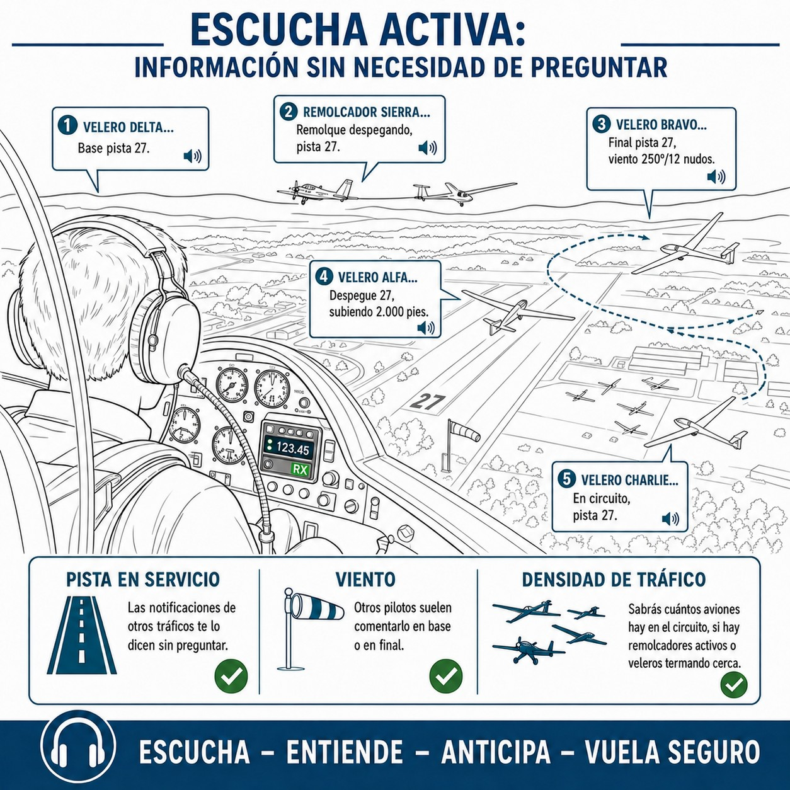
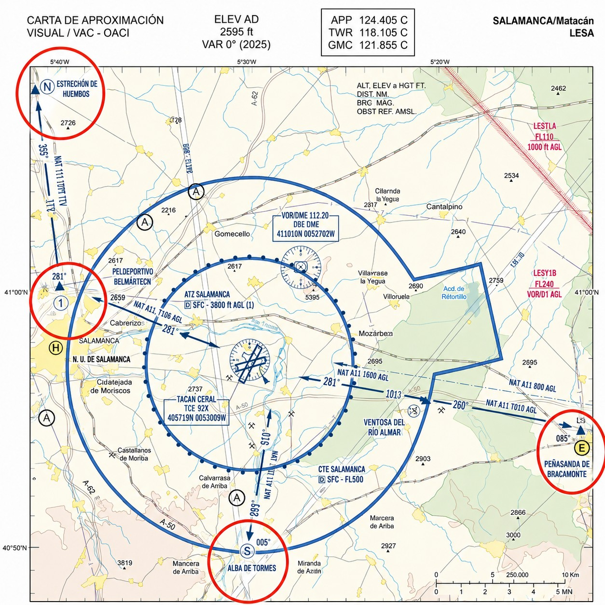
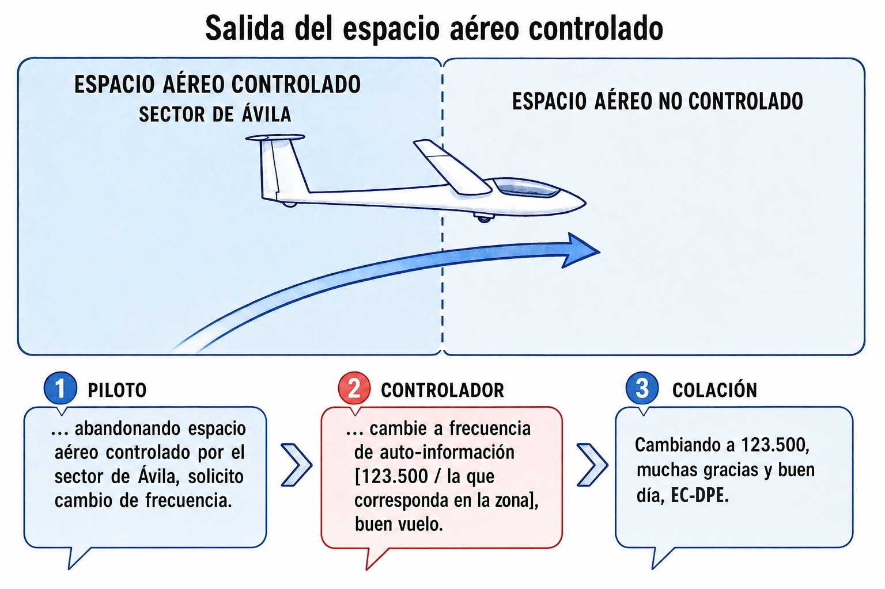

# VFR communications

> Flying VFR puts you in three very different settings, and in each one the radio is used differently. At a field without a tower, you are the one who calls and the one who looks. At a controlled one, you do not move without a clearance. And en route, whoever talks to you gives you information, but does not separate you. This chapter covers all three.

## VFR communication at uncontrolled airfields

### Blind broadcast at aerodromes without a control tower

*At a field without a tower, the pilot acts as their own controller.*

Most of the aerodromes that gliders fly from (club sites, forest strips, private aerodromes) are **uncontrolled aerodromes**. They operate in Class G airspace and there is no air traffic control (ATC) tower to clear you, separate you or give you headings.

Here safety comes from the **blind broadcast**: you transmit your position, altitude and intentions on the field frequency so that everyone knows where you are. Nobody will give you permission to take off or land. You report, and you decide.

The basics:

* **Whom you call**: the name of the aerodrome, not “Tower”. “Fuentemilanos, good morning…” (*Fuentemilanos, buenos días…*) or “Santa Cilia traffic…” (*Santa Cilia, tráfico…*)
* **What you say**: callsign, position, altitude and intention. “…glider Echo Papa Echo, 5 minutes east of the field at 1,500 metres, will report joining the circuit.” (*…velero Eco Papa Eco, a 5 minutos al este del campo a 1.500 metros, notificaré entrando al circuito.*)

::: {.callout-important title="Regulation"}
Even where a radio operator provides an AFIS (**Aerodrome Flight Information Service**) at a field, that operator **does not provide control**, only information (wind, runway in use, weather). The final decision and the responsibility for separation remain entirely with the pilot-in-command.
:::

### See and avoid

The radio helps you know where to look. Nothing more. VFR flight (**Visual Flight Rules**) is called that for a reason: seeing and avoiding is your responsibility, always, and it is **never handed over to the radio**.

Three things you must not forget:

1. **Do not assume everyone has a radio**: at many small fields there are microlights, paragliders and aircraft with no radio on board, or with the radio switched off.
2. **Do not assume you have been heard**: another pilot may be distracted, on another frequency, or have faulty equipment.
3. **Your eyes are in charge**: the radio tells you where to **look**, but keep your visual **scanning** going before any manoeuvre, especially when joining the circuit.

::: {.callout-warning title="Safety"}
A fatal mistake is to start a turn (for example, from base leg onto final) trusting only that “nobody has called their position on the radio”. Always make sure visually that the runway and the final approach are clear of traffic before you turn.
:::

{#fig-04-cap02-escucha-previa}

### The right frequency at the right time

When approaching any aerodrome, controlled or not, tune the field frequency **at least 10 minutes or 10 miles before** you arrive. Then listen before you open your mouth.

Just by listening for a few minutes you can work out (@fig-04-cap02-escucha-previa):

* **Runway in use**: other traffic's position reports tell you without your having to ask.
* **Wind**: other pilots often mention it on base or final.
* **Traffic density**: you will know how many aircraft are in the circuit, whether tugs are active or gliders are thermalling nearby.

Once you have that mental picture, press the PTT. Your first call will be specific, and nobody will have to repeat what you could have heard for yourself.

### The standard circuit and its position reports

The **traffic circuit** is the rectangular pattern that organises traffic around the aerodrome. Without it, every pilot would arrive in their own way.

Unless the aerodrome's visual approach chart (*VAC*) says otherwise, because of obstacles or noise restrictions, the standard ICAO/EASA circuit **is always left-hand**. The reason is practical: in conventional aeroplanes the pilot-in-command sits on the left, and in tandem gliders the view to that side is usually better. With a left-hand circuit, the runway always stays in sight.

These are the reports you make around the circuit:

1. **Joining the circuit**: call before you enter the vicinity. “Fuentemilanos, Echo Papa Echo, three minutes out, will report joining the circuit” (*Fuentemilanos, Eco Papa Eco, a tres minutos, notificaré entrando en circuito*).
2. **Downwind** (*viento en cola*): the leg parallel to the runway but in the opposite direction to the landing. Abeam the runway numbers or halfway along the leg, you call: “Fuentemilanos, Echo Papa Echo, downwind runway 16” (*Fuentemilanos, Eco Papa Eco, viento en cola pista 16*). In a glider, this report must be made from a position that guarantees you can glide to the runway.
3. **Base leg** (*tramo base*): the leg perpendicular to the centreline, where you configure the glider for landing. “Fuentemilanos, Echo Papa Echo, turning base 16” (*Fuentemilanos, Eco Papa Eco, virando a base 16*).
4. **Final approach** (*final*): lined up with the runway, after the last turn. “Fuentemilanos, Echo Papa Echo, final 16” (*Fuentemilanos, Eco Papa Eco, en final 16*).
5. **Runway vacated** (*pista libre*): on the ground and off the active runway. “Fuentemilanos, Echo Papa Echo, runway 16 vacated” (*Fuentemilanos, Eco Papa Eco, pista 16 libre*).

::: {.callout-tip title="Golden rule"}
At fields with a lot of gliding activity, the glider circuit may be flown on one side of the runway and the powered circuit (tugs included) on the other. Always check the aerodrome chart before the flight.
:::

::: {.callout-important title="Regulation"}
Under the SERA Regulation (SERA.3210), the order of right of way, from highest to lowest, is: balloons > gliders > airships > power-driven aircraft. A glider has priority over every power-driven heavier-than-air aircraft and **gives way to balloons**. This priority applies in flight and around the aerodrome; it never justifies relaxing your active lookout.
:::

::: {.callout-note title="Airmanship"}
SERA does not name paragliders and hang gliders in that hierarchy, but the prudent approach is to treat them like a glider and, in addition, give way to them: they manoeuvre much worse than you and descend with no way of climbing back. When in doubt, keep clear.
:::

### Coordinating with the tug and the winch

The launch has no equivalent in any other kind of aviation: your take-off depends on coordinating with someone outside the aircraft, and doing it well makes all the difference.

#### Winch launch

If the field has air-to-ground radio with the winch, the sequence is:

1. Canopy closed, aircraft ready. You transmit:
  
  “Winch, glider EC-DPE, dual, ready to take up slack.” (*Torno, velero EC-DPE, doble mando, listo para tensar.*)
2. The operator takes up the slack gently. Airbrakes closed, wings level, you confirm:
  
  “All out, all out, all out.” (*Remolcando, remolcando, remolcando.*) The winch applies full power.
3. When you release the cable: “Glider released, Echo Papa Echo.” (*Velero libre, Eco Papa Eco.*)
4. If something goes wrong: “Stop winch, stop winch, stop winch.” (*Stop torno, stop torno, stop torno.*)

Without air-to-ground radio, the **wing runner** coordinates with visual signals:

| Signal | Meaning |
| --- | --- |
| Wing on the ground (not level) | Glider not ready: do not take up slack |
| Wings level + airbrakes open | Take up slack gently |
| Wings level + airbrakes closed | Cable taut, OK: launch |
: Visual signals from the wing runner

::: {.callout-warning title="Safety"}
If the cable breaks or the winch fails, lower the nose at once to regain speed. At low height (below about **150 m AGL** on the winch) do not turn: land straight ahead on the available ground. Trying to get back to the take-off runway at low height is the most frequent cause of fatal winch-launch accidents. The full height-based decision bands (straight ahead, shortened circuit or normal circuit) are covered in **Book 6 — Operational Procedures**, chapter 7.
:::

#### Aerotow

Phraseology varies from one aerodrome to another; always check the local instructions. A common sequence:

— Glider pilot: “Tug Delta Victor Yankee, glider Echo Papa Echo, dual, ready, take up slack.” (*Remolcadora Delta Victor Yankee, planeador Eco Papa Eco, doble mando, listo tensando.*)

— Tug: “Echo Papa Echo, taking up slack.” (*Eco Papa Eco, tensando.*)

— Glider pilot: “All out.” (*Remolcando.*)

On release:
— “Tug Delta Victor Yankee, glider released.” (*Remolcadora Delta Victor Yankee, velero libre.*)

If the glider **cannot release the cable**, the in-flight distress signal is: rock the wings hard and move below and to the left of the tug, so that the tug pilot can release it from their end.

::: {.callout-note title="Airmanship"}
Before you get into the glider, always agree the release altitude and the direction to turn away with the tug pilot. That way the tug can return to the runway without crossing the glider that is starting its flight.
:::

## VFR communication at controlled airfields

### Clearance in controlled airspace

A **controlled aerodrome** has a control tower (TWR), and that changes the rules completely: here you do not take a step without an explicit clearance.

In controlled airspace such as a CTR, only the controller can issue instructions and separate traffic. You need a **clearance** for each phase:

* Start-up (if it applies, for motor gliders).
* **Taxi** along the taxiways to the runway.
* Line up on the active runway.
* Take-off.
* Entering, flying in or crossing the control zone (CTR).
* Landing.

::: {.callout-warning title="Safety"}
A clearance to “line up” or “line up and wait” on the active runway **never** amounts to a take-off clearance. You must stay still at the threshold until you hear the words **“Cleared for take-off”** (*Autorizado a despegar*) explicitly. If you have any doubt, ask: “Confirm, cleared for departure?” (*Confirme, ¿autorizado a salir?*). Never use the words “take off” (*despegar*) except to read back an express clearance.
:::

### The flight plan (FPL)

To enter airspace where you receive an air traffic control service (classes B, C and D, or any controlled aerodrome), you must file a **Flight Plan (FPL)** with the relevant ATS units, ahead of the estimated off-block time (EOBT) by the period set in the AIP-España and the aerodrome VAC. Class E is the exception within controlled airspace: VFR flights receive no control service there, so they need no flight plan, radio or clearance (SERA.4001(b)).

A glider nearly always flies in Class G. But if you need to cross a CTR or enter airspace where you will be controlled, file the FPL in good time. The deadlines and formats are in the AIP-España (ENR 1.10) and are binding, so check them before every flight that involves controlled airspace.

::: {.callout-note title="Airmanship"}
If you unexpectedly need to enter controlled airspace without a flight plan, you can file one in the air (AFIL, Airborne Flight Plan) by calling the ATC unit on the radio and giving the aircraft type, position, intentions and estimated times. This option depends on the availability of the service and on the controller's workload.
:::

::: {.callout-important title="Regulation"}
The exact deadlines for filing a flight plan are set out in **AIP-España ENR 1.10** and may vary with the type of operation and the ATC unit. Check it before every flight that involves controlled airspace; failing to comply may lead to the clearance being refused.
:::

{#fig-04-cap02-puntos-notificacion}

### Visual reporting points

The CTR (*Control Zone*) protects IFR arrivals and departures. Do not confuse it with the ATZ (*Aerodrome Traffic Zone*), which is a different and smaller airspace. To stay out of the way of IFR traffic, VFR flights enter and leave the CTR along fixed routes and points (@fig-04-cap02-puntos-notificacion).

These are the **visual reporting points**: physical references on the ground (a village, a motorway junction, a lake) that you fly over and from which you call the Tower. You will find them on the aerodrome's Visual Approach Chart (VAC), usually named with phonetic letters according to their geographical position: November for the north, Sierra for the south, Echo for the east.

Call the Tower 3 to 5 minutes before you reach the CTR entry point:

— “Jerez Tower, EC-DPE, over point Sierra at 1,000 feet, to enter the zone and land.” (*Jerez Torre, EC-DPE, sobre punto Sierra a 1000 pies, para entrar en zona y aterrizar.*)
— “EC-DPE, cleared to enter the zone via point Sierra at 1,000 feet or below, report right-hand downwind runway 02.” (*EC-DPE, autorizado a entrar en zona por punto Sierra a 1000 pies o inferior, notifique viento en cola derecha pista 02.*)

From then on you follow the Tower's instructions on altitude and route. No improvising.

### Read back everything in controlled airspace

We saw it in chapter 1: the **readback** is not optional. In controlled airspace it is even less so, because the controller separates traffic on the basis that you will do exactly what you have repeated.

Every ATC instruction that affects your flight path, the active runway, the pressure setting or radar identification must be **read back** word for word, ending with your callsign.

If the Tower says:
“Echo Papa Echo, cleared to land runway 36.” (*Eco Papa Eco, autorizado a aterrizar pista 36.*)

Your readback is:
“Cleared to land runway 36, Echo Papa Echo.” (*Autorizado a aterrizar pista 36, Eco Papa Eco.*)
The wind need not be read back, but the runway clearance must.

::: {.callout-tip title="Golden rule"}
If a controller's instruction includes a landing or take-off runway clearance, a heading or altitude to maintain, a QNH or a transponder code, your reply on the radio **CANNOT be “Wilco”** or “Copied” (*Copiado*), however you note it down, mentally or on your kneeboard. You must read those parameters back exactly as they were given to you.
:::

### Phraseology exercises

In communications, theory is not enough: you have to practise the voice. Work out these transmissions before looking at the solution; imagine you are the glider **EC-EPE**, “Echo Papa Echo” (*Eco Papa Eco*).

::: {.ejercicio}
**Exercise 1 — Reading back a clearance.**

The Tower tells you: “Echo Papa Echo, taxi to holding point runway 30, QNH 1019, report ready.” (*Eco Papa Eco, ruede al punto de espera pista 30, QNH 1019, notifique listo.*) What is your correct readback?

**Solution.** “To holding point runway 30, QNH 1019, will report ready, Echo Papa Echo.” (*Al punto de espera pista 30, QNH 1019, notificaré listo, Eco Papa Eco.*) You read back the taxi instruction, the runway and the QNH; the callsign closes the transmission. A plain “Roger” (*Recibido*) here would be a deviation from procedure.
:::

::: {.ejercicio}
**Exercise 2 — First contact in a CTR.**

You are going to enter the CTR of a controlled aerodrome from visual reporting point November. Put these elements of your initial call in order and complete them: intentions, callsign, position and altitude, and whom you are calling.

**Solution.** The order is **whom → who I am → where I am → what I want**: “[Aerodrome] Tower, Echo Papa Echo, glider, over November, 900 metres QNH, request entry to the CTR for transit southbound.” (*Torre de [aeródromo], Eco Papa Eco, planeador, sobre November, 900 metros QNH, solicito entrada al CTR para tránsito hacia el sur.*) Wait for the clearance before entering the CTR: in controlled airspace you go in with a clearance, not on your own initiative.
:::

::: {.ejercicio}
**Exercise 3 — “Line up ≠ take off”.**

The Tower transmits: “Echo Papa Echo, line up and wait runway 30.” (*Eco Papa Eco, entre y mantenga posición pista 30.*) Can you start the take-off? What do you read back?

**Solution.** No. **“Line up and wait”** (*Entre y mantenga posición*) clears you to occupy the runway, but **not** to take off; for that you need an explicit “cleared for take-off” (*autorizado a despegar*). Readback: “Lining up and waiting runway 30, Echo Papa Echo.” (*Entro y mantengo posición pista 30, Eco Papa Eco.*)
:::

## VFR communication with ATC (en-route)

### Flight information service (FIS)

En route through uncontrolled airspace (mostly Class G) there is no Tower watching you. But you have a useful tool: the **Flight Information Service (FIS)**.

The most important thing to know about FIS: it gives you **advice, not control**. It will not give you mandatory headings or altitudes to follow. Its job is to give you information so that you, as pilot-in-command, can decide. Separation is still your responsibility.

What you can ask for or receive:

* **Traffic information**: you will be told about known aircraft near your position or route. (In the United States this is called **Flight Following**; in Europe under SERA/EASA it is officially FIS.)
* **Weather**: METAR, TAF, SIGMET or AIRMET warnings en route or for your destination and alternate aerodromes.
* **Airspace status**: restricted, danger or military areas that are active or inactive.

To make contact, tune the “Information” frequency for your area (**Madrid Información**, **Zaragoza Información**…) and identify yourself with your callsign, aircraft type, position, route and what you need:

“Madrid Information, glider EC-DPE, over the Sierra de Ayllón at 2,000 metres, heading south towards Fuentemilanos, request traffic information.” (*Madrid Información, velero EC-DPE, sobre la sierra de Ayllón a 2000 metros, rumbo sur hacia Fuentemilanos, solicito información de tráfico.*)

::: {.callout-note title="Airmanship"}
On gliding **cross-country** flights, listening out on the relevant regional FIS frequency adds an extra layer of safety, especially on days with thunderstorm development, when real-time weather information is critical. Being in contact with FIS also speeds up the activation of the Search and Rescue (SAR) services if you land out away from an aerodrome.
:::

### Changing and leaving a frequency

Do not disappear from a frequency without a word. The Tower, Approach or Information controller has you on the screen or on their flight strip, and assumes you are still listening. If you vanish, they start to worry.

When you need to change frequency, there are two cases (@fig-04-cap02-cambio-frecuencia):

* **If you are under ATC control**: ask for permission. “Tower, EC-DPE, request to leave the frequency for club operations on 123.400” (*Torre, EC-DPE, solicito abandonar frecuencia para pasar a operaciones de club en 123.400*).
* **If you are on an Information (FIS) frequency**: it is not control, so you just tell them. “Madrid Information, EC-DPE, leaving your frequency for Fuentemilanos 123.500. Good day” (*Madrid Información, EC-DPE, abandonamos su frecuencia para pasar con Fuentemilanos 123.500. Buen día*).

{#fig-04-cap02-cambio-frecuencia}

### The transponder en route: the squawk code

If your glider has a **transponder**, it transmits a four-digit code (*squawk*) that ATC uses to identify you on the screen. In VFR, the default code is **7000**, unless ATC assigns you a different one. You will find the emergency codes in chapter 7.

::: {.callout-important title="Regulation"}
Codes 7600 (radio failure) and 7700 (emergency) trigger immediate alerts at every control centre. Select them only when that situation is real, and take great care when changing code so as not to set them off by accident.
:::

### Radio mandatory zones (RMZ)

Some sectors of class E, F or G airspace carry an extra requirement: they are **Radio Mandatory Zones (RMZ)**. Inside an RMZ the radio is not optional even though the airspace is uncontrolled; it is a requirement published in the AIP.

Before entering and while you are inside you must:

1. Maintain a continuous listening watch on the frequency designated for that RMZ.
2. Establish two-way contact with the relevant ATS unit before entering.
3. Follow the instructions or advice of the service provided.

The RMZs active in Spain appear on chart **ENR 6.12**. Check it during pre-flight planning, especially on cross-country flights that pass close to large airports in uncontrolled airspace.

::: {.callout-important title="Regulation"}
RMZs are governed by the SERA Regulation, which allows a Member State to set radio requirements in airspace where a control service is not mandatory. Their limits and conditions are referenced on **chart ENR 6.12** (radio mandatory zones chart).
:::

::: {.postit}
**Chapter summary: VFR communications**

**At uncontrolled aerodromes**

* **Blind broadcast**: at a field without a tower, you are the controller. Broadcast your position and intentions “into the air”. “Fuentemilanos traffic, glider EC-BRT, downwind runway 34” (*Fuentemilanos, velero EC-BRT, viento en cola pista 34*).
* **See and avoid**: the radio helps, but your eyes are in charge. Do not assume everyone has a radio or has heard you. Actively look for other traffic.
* **The right frequency**: tune the field frequency 10 minutes before arrival. Listening to others will tell you the runway in use, the wind and the traffic density.
* **Standard circuit**: unless told otherwise, the circuit is left-hand. Report: joining, downwind, base and final.
* **Launch (winch/tug)**: on the winch: “ready, take up slack” (*listo, tensando*) → “all out” ×3 (*remolcando*) → “cable released” (*cable libre*). To abort: “stop winch” ×3 (*stop torno*). Failure at low height (below 150 m on the winch): straight ahead, never turn back.

**At controlled aerodromes**

* **Clearance**: in controlled airspace, the Tower's word is law. You need an explicit clearance for everything: start-up, taxi, take-off, entering the zone. If you do not hear “cleared” (*autorizado*), do not move.
* **Flight plan (FPL)**: your entry ticket. File it at least 60 minutes in advance; the exact deadlines are in AIP-España ENR 1.10.
* **Reporting points**: the visual entry and exit gates to the CTR (Sierra, North, Echo…). Know them well on the VAC and report over them accurately.
* **Read back everything**: vital in controlled airspace. Repeat every instruction, without the wind and with your callsign at the end. “Cleared to land runway 36, Echo Papa Echo” (*Autorizado a aterrizar pista 36, Eco Papa Eco*).

**With ATC, en route**

* **Flight Information Service (FIS)**: an advisory service, not a control service. They tell you about traffic and weather (workload permitting), but separation is still your responsibility. “For information, contact Madrid Information…” (*Para información, contacte con Madrid Información…*).
* **Changing frequency**: never “vanish” from a controlled or information frequency. Ask for the change or report that you are leaving the frequency. “Madrid, EC-DPE, changing to club frequency 123.500” (*Madrid, EC-DPE, paso a frecuencia de club 123.500*).
* **Transponder en route**: if you have a transponder, the default VFR code is **7000**. Emergencies: **7700** (active emergency, **Mayday**) and **7600** (radio failure, see chapter 7). Use them only in a real emergency.
:::
