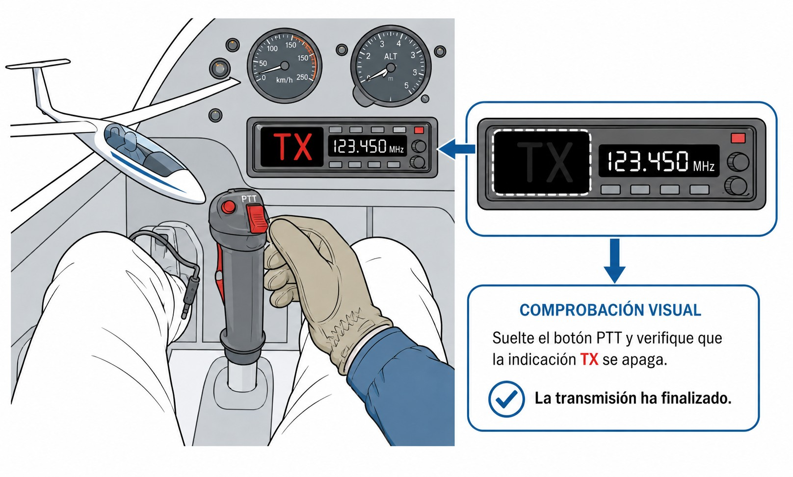

# General operating procedures

> Here are the procedures you will use on every flight: how to structure a call, when to ask for a radio check, how to make a position report, what to do when two aircraft transmit at once, the stuck PTT, the priority of emergency messages, how to use the microphone properly and what types of radio there are.

## The structure of communications

Every aeronautical transmission follows the same pattern. Memorising it as a fixed sequence frees you to concentrate on flying.

The initial call always goes in this order:

1. **Whom you are calling**: the name of the unit (*«Jerez Torre»*, “Jerez Tower”; *«Madrid Información»*, “Madrid Information”).
2. **Who is calling**: the aircraft's full callsign (*«Eco Charlie Delta Papa Eco»*).
3. **Where you are**: position or phase of flight (*«sobre punto Sierra»*, “over point Sierra”; *«en viento en cola pista tres cuatro»*, “downwind runway three four”).
4. **What you need**: request or intention (*«solicito datos»*, “request information”; *«listo para el despegue»*, “ready for departure”).

*Example of a first call at a controlled aerodrome:*
*— «Sabadell Torre, Delta Kilo India Alfa Victor, en punto de espera pista uno dos, listo para salida.»* (“Sabadell Tower, Delta Kilo India Alfa Victor, holding point runway one two, ready for departure.”)

The controller replies. From the second exchange onwards you may abbreviate the callsign to its last three letters, but only if the ground station has done so first.

When you **read back** an instruction, the callsign goes at the end:

*— «Autorizado despegar pista uno dos, viento cero nueve cero grados seis nudos, Alfa Victor.»* (“Cleared for take-off runway one two, wind zero nine zero degrees six knots, Alfa Victor.”)

In a **blind broadcast** (uncontrolled aerodrome), with no designated station to talk to, the callsign goes at the beginning:

*— «Eco Charlie Delta Papa Eco, en viento en cola derecha pista tres cuatro, intención aterrizaje.»* (“Echo Charlie Delta Papa Echo, right-hand downwind runway three four, intending to land.”)

::: {.callout-tip title="Golden rule"}
Before you press the PTT, put the whole message together in your head: *Whom? → Who am I? → Where am I? → What do I need?* A structured message takes up less time on the frequency and gives the controller less to misunderstand.
:::

::: {.callout-note title="Airmanship"}
Some instructors recommend opening the **first** call to a station with a simple *«buenos días»* (“good morning”) or *«buenas tardes»* (“good afternoon”) before the message: *«Fuentemilanos tráfico, buenos días, Eco Charlie Delta Papa Eco…»* (“Fuentemilanos traffic, good morning, Echo Charlie Delta Papa Echo…”). It is not ICAO phraseology, which aims for economy of words, so keep it for the **first contact** rather than every transmission. But there is a person at the other end of the radio, and a greeting oils the relationship with the tower, FIS or the other traffic at your field. With one proviso: on a busy frequency or in an emergency, courtesy can wait and you go straight to the point.
:::

## Radio check

If you have doubts about your radio equipment, you can ask the nearest tower or information unit for a **radio check**.

Careful: if you have just spoken to the tower and they have answered you normally, do not ask for a **radio check** as a matter of routine. Use it only when you have a real reason to doubt your equipment.

Reception quality is assessed on a readability scale from 1 to 5:

* **1:** Unreadable (incomprehensible audio or carrier only).
* **2:** Readable now and then (very broken).
* **3:** Readable with difficulty (very high background noise, but understandable).
* **4:** Readable (good quality, slight noise).
* **5:** Perfectly readable (clear audio, no noise).

**Example exchange:**
*— «Fuentemilanos, buenas tardes, Eco Charlie Delta Papa Eco, solicito prueba de radio en 123.400.»* (“Fuentemilanos, good afternoon, Echo Charlie Delta Papa Echo, request radio check on 123.400.”)
*— «Eco Papa Eco, le recibo 5.»* (“Echo Papa Echo, readability 5.”)
*— «Cinco, gracias, Eco Papa Eco.»* (“Five, thank you, Echo Papa Echo.”)

The check should not last more than 10 seconds. Saying the numbers slowly and clearly is usually enough.

## Position reports

A **position report** tells ATC or other aircraft where you are. You make one when passing compulsory reporting points, when FIS asks for it, or as a spontaneous update on a cross-country flight.

The minimum structure has three elements:

1. Aircraft **identification**.
2. **Position**: reporting point, town or recognisable geographical reference.
3. **Altitude or flight level**, with its altimeter reference (QNH or FL).

If FIS or ATC require it, you add:

1. **UTC time** over the point.
2. **Next reporting point** and estimated time of arrival.

*Example at an uncontrolled field (blind broadcast):*
*— «Buitrago, velero Eco Charlie Delta Papa Eco, sobre el embalse de Riosequillo, mil quinientos pies QNH, estimado Buitrago en cero cinco.»* (“Buitrago, glider Echo Charlie Delta Papa Echo, over the Riosequillo reservoir, one thousand five hundred feet QNH, estimating Buitrago at zero five.”)

*Example with FIS on a cross-country flight:*
*— «Madrid Información, Eco Charlie Delta Papa Eco, sobre Somosierra, nivel de vuelo cero ocho cero, estimado Aranda en tres cinco.»* (“Madrid Information, Echo Charlie Delta Papa Echo, over Somosierra, flight level zero eight zero, estimating Aranda at three five.”)

::: {.callout-note title="Airmanship"}
On cross-country flights in a glider, update your position with FIS whenever you depart significantly from your planned route or change sector. A well-informed FIS can coordinate a search more quickly if you stop making contact.
:::

## Simultaneous calls and waiting on the frequency

When two aircraft transmit at the same time, the signals overlap and the other end hears distorted or unintelligible audio. This is **mutual blocking**.

If it happens, the controller may reply *«Estación llamando a [dependencia], identifíquese»* (“Station calling [unit], identify yourself”), or repeat the only fragment they could make out. In that case:

* Listen for whether your callsign was mentioned.
* Wait for the frequency to be clear.
* Transmit your whole message again.

If you get no answer, wait **at least 10 seconds** before trying again. Trying sooner may step on another aircraft that is receiving instructions.

::: {.callout-note title="Airmanship"}
Before you press the PTT, always listen to the frequency for a few seconds. A transmission that “steps on” another blocks both. If the frequency is busy, wait for the conversation to finish before starting yours.
:::

## The blocked microphone (stuck PTT)

The **blocked microphone**, or stuck PTT, is more common than it seems, and more serious. In gliders the PTT button is usually built into the control stick, exactly where any accidental pressure can activate it.

If the button stays mechanically pressed (a failed spring, the headset lead pulling on it, or a leg resting on a portable PTT), your radio goes into **continuous transmission** and sends out a carrier non-stop.

The consequences are serious:

1. **Total blocking**: while you transmit, **nobody else can talk or receive on that frequency** for tens or hundreds of kilometres, depending on your altitude. You are cutting off ATC communications and other people's emergency calls.
2. **Self-inflicted deafness**: your radio is transmitting, so you receive nothing. You do not hear what is happening on the frequency either.

The cure is simple: **a visual check after every transmission** (@fig-04-cap03-luz-tx). Most panel radios have a **TX** indicator on the display that lights up while you transmit. Always check that it **goes out** when you release the button.

{#fig-04-cap03-luz-tx}

## Message hierarchy and priority

Not all messages are equal. ICAO sets a clear order of priority so that the most urgent always gets through first:

1. **DISTRESS messages (MAYDAY)**: absolute priority. They indicate that the aircraft or the people on board are in grave and imminent danger (fire, structural failure, extreme medical emergency) and need immediate help. If you hear a Mayday, keep quiet. Total silence on that frequency, unless the aircraft in distress calls you or you are in a position to relay its call to a distant tower. The phrase for imposing silence is *«Cesen transmisiones, Mayday»* (*“Stop transmitting, Mayday”*).
2. **URGENCY messages (PAN PAN)**: second priority. There is a serious problem (a failing engine in a motor glider that is still flying, a critical loss of position, a passenger taken ill with no immediate threat to life) but no rescue is needed at that very second. They take priority over ordinary traffic and require others not to interfere, though without the total silence imposed by a Mayday.
3. **Direction-finding communications (VDF)**: requests for a magnetic heading or bearing (QDM or QDR requests).
4. **Flight safety messages**: ATC traffic warnings, separation and urgent weather information (SIGMET/AIRMET).
5. Routine **meteorological messages**: METAR, TAF and en-route forecasts.
6. **Flight regularity communications**: closing a flight plan, position confirmations and operational coordination.

::: {.callout-important title="Regulation"}
The malicious or false transmission of emergency signals (Mayday / Pan Pan) is no joke: in Spain, if it causes the rescue services to be mobilised, it is a criminal offence punishable by imprisonment or a fine (Código Penal, the Spanish Criminal Code, Article 561), quite apart from the real operational risk it creates by diverting emergency resources. Use them only when the real situation demands it.
:::

## Microphone technique

Using the **headset** microphone or the **boom mic** properly is simpler than it looks, but three things make the difference between clean audio and a transmission the controller has to ask you to repeat.

* **Physical distance**: the foam side of the microphone **a centimetre from your lips without touching them**. Too far away and your voice is lost in the cockpit noise; touching them, it produces static.
* **Sideways position**: set the capsule slightly to one side, level with the corner of your mouth, not in front of it. That way the air released when you say plosive consonants (“P”, “T”, “K”) passes over the capsule instead of hitting the diaphragm and producing the pops that distort the audio (**plosive sounds**).
* **Constant volume**: speak at a normal conversational volume. Treat the microphone like the one on your smartphone. **Do not shout**. Even in turbulence or cockpit noise, shouting saturates the signal and makes it less readable, not clearer (**clipping**). If your usual volume is not enough, adjust the microphone gain on the panel or check the cable connectors (**jack plugs**).

## Radio equipment

Aeronautical VHF radios work from **118 MHz to 136.975 MHz** with amplitude modulation (AM). There are two types, depending on how they are installed:

**Panel-mounted radio**: fixed in the instrument panel and connected to the aircraft's external antenna. More power (typically 6–10 W), better range and controls that are easier to use in flight. It is the standard in two-seat gliders and single-seat competition gliders.

**Handheld radio**: self-contained, with its own battery. Less power (1–5 W) and an internal antenna that is less efficient than an external one, which cuts the range at low altitude. It is used as a backup if the fixed installation or the glider's battery fails.

### Key functions

* **Dual watch**: monitors two frequencies at the same time and transmits only on the primary. Useful for listening to FIS while you work with the tower.
* **Squelch**: mutes the speaker when the signal falls below a minimum threshold, removing background noise. Set it too tight and you may lose weak signals from distant aircraft.
* **Channel selector**: always confirm the frequency visually on the display before you transmit.

### Mandatory 8.33 kHz spacing

The technical details and regulations on VHF channel spacing are covered in chapter 7. As a practical rule for operations: check that your equipment is **8.33 kHz compliant** before you fly, because a 25 kHz radio cannot tune most of today's European ATC frequencies. In practice, compliance is shown by the **ETSO-C169a** marking, the European technical standard that certifies a VHF radio for 8.33 kHz channel spacing.

::: {.postit}
**Chapter summary: general operating procedures**

* **Call structure**: Whom → Who I am → Where I am → What I need. In a readback, the callsign goes at the end. In a blind broadcast, the callsign goes at the beginning.
* **Radio check**: ask for one only if you have doubts about the equipment. Use the readability scale from 1 (unreadable) to 5 (perfect): *«Le recibo 5»* (“Readability 5”).
* **Position reports**: identification + position + altitude (QNH or FL). On a cross-country flight add the UTC time and the next point with its estimate. Update FIS if you leave your route.
* **Simultaneous calls**: if the frequency is busy, wait. After a call with no answer, wait 10 seconds before trying again. ATC decides the order when several aircraft call at once.
* **Blocked microphone**: check that the TX light goes out when you release the PTT. A stuck PTT knocks out the frequency for every user.
* **Message priority**: DISTRESS (Mayday) has absolute priority and imposes total silence; URGENCY (Pan Pan) asks for priority without requiring that silence. If you hear someone else's Mayday, keep quiet unless you can assist or relay.
* **Microphone technique**: microphone close to the lips but not touching them. Normal, steady volume. Shouting saturates the signal and reduces intelligibility.
* **Radio equipment**: panel (6–10 W, external antenna) or handheld (1–5 W, backup). 8.33 kHz spacing is mandatory (Regulation (EU) No 1079/2012); the **ETSO-C169a** marking certifies that the radio meets that channel spacing.
:::
