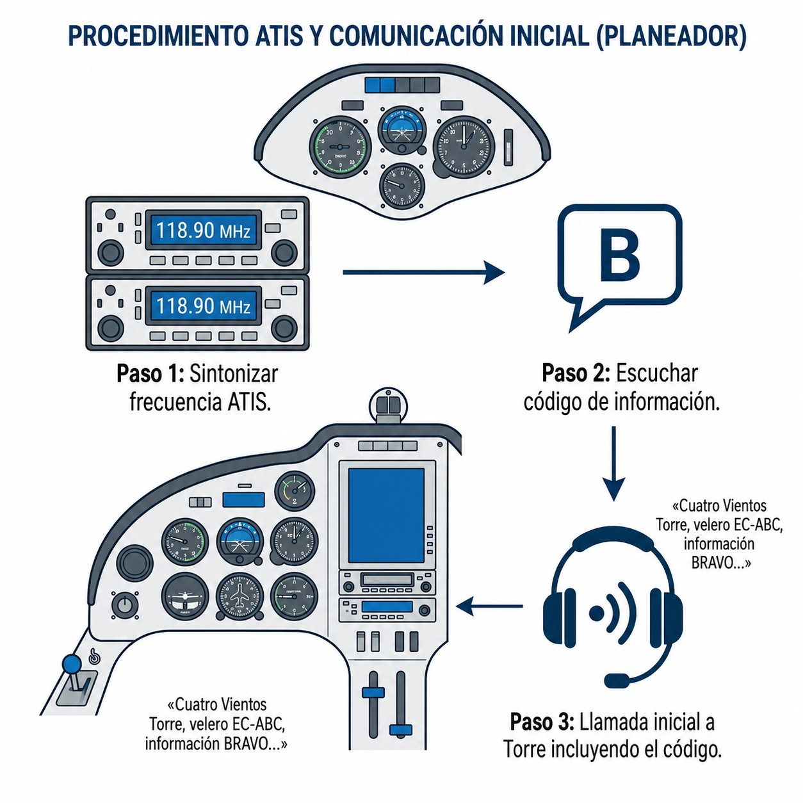
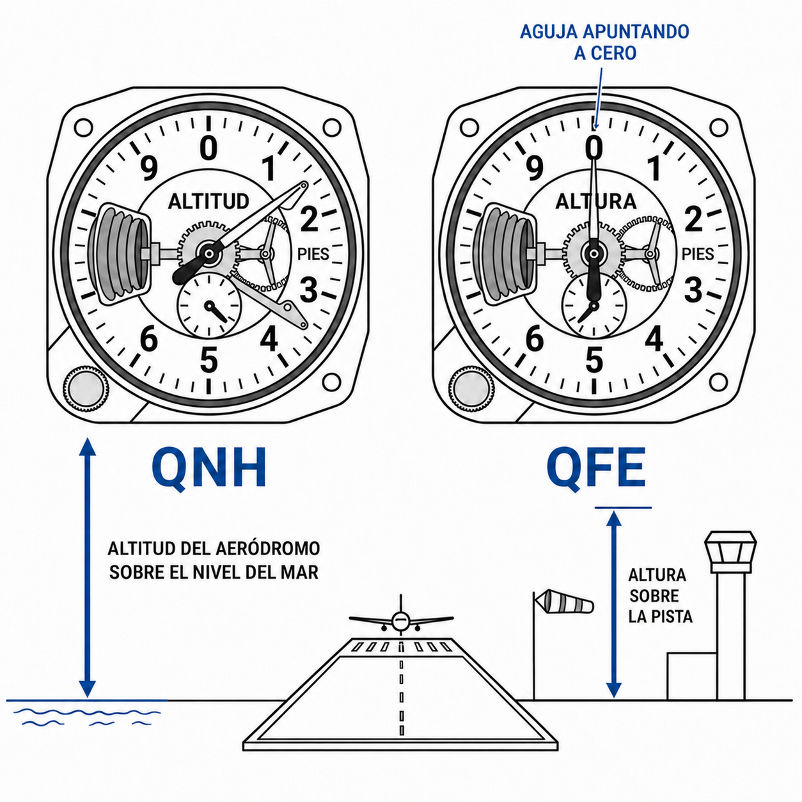
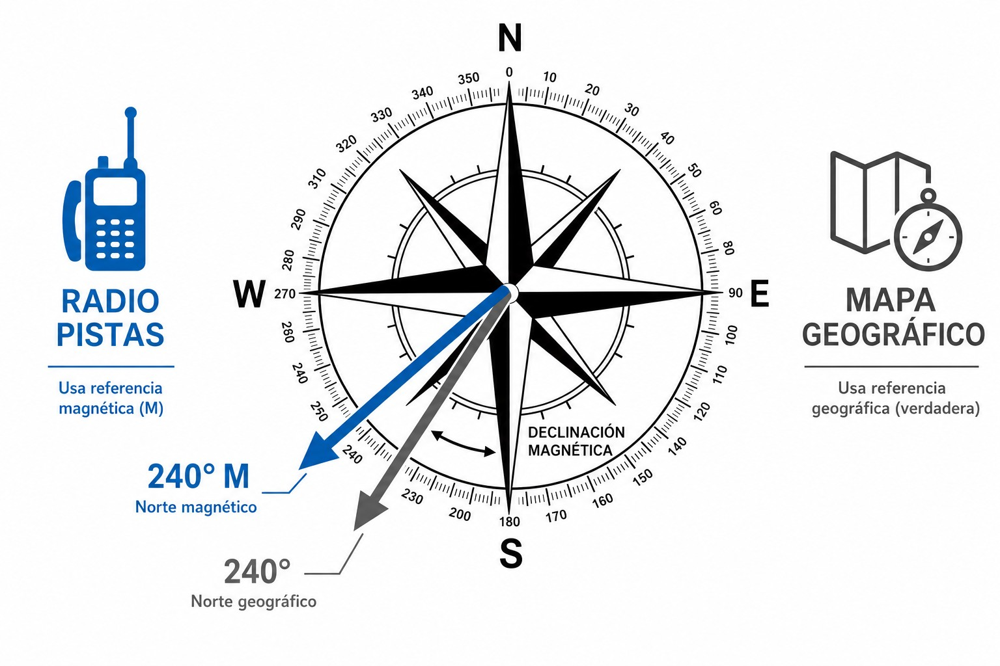

# Relevant weather information terms (VFR)

> Aeronautical radio has its own weather vocabulary, and knowing it saves you misunderstandings in flight. In this chapter you will see what ATIS and VOLMET are, what CAVOK means, how QNH and QFE work, why the Tower's wind and the wind on charts are measured differently, and when you must make an AIREP.

## ATIS: the automatic terminal information service

Without **ATIS** (**Automatic Terminal Information Service**), Tower controllers at aerodromes with medium or heavy traffic would spend half the day repeating the same thing to every approaching aircraft. ATIS exists to spare them that.

It is a voice recording (usually synthetic) that plays in a continuous loop on its own VHF frequency, separate from the control frequency (@fig-04-cap04-atis-escucha). It tells you:

* The **runway in use** for take-offs and landings.
* Current **weather conditions**: wind, visibility, cloud, temperature, dew point and QNH.
* **Operational information**: works on taxiways, wind shear warnings or bird activity.

Each broadcast carries a letter of the phonetic alphabet as its **information code** (*«Información Bravo»*, “Information Bravo”, for example). When the conditions or the runway in use change significantly, the broadcast moves on to the next letter (*«Información Charlie»*).

::: {.callout-tip title="Golden rule"}
Listen to the whole ATIS **before** calling the Tower. Then include the code in your first call: *«Jerez TWR, velero EC-DPE, a 10 millas al norte, con información Bravo, solicito…»* (“Jerez Tower, glider EC-DPE, 10 miles north, with information Bravo, request…”). The controller knows you already have all the data and can get straight to the point.
:::

{#fig-04-cap04-atis-escucha}

## VOLMET: weather information for aircraft in flight

ATIS gives you the weather at one airport. **VOLMET** (from the French **VOL MÉTéorologique**) gives you the weather for a whole region.

It is another pre-recorded broadcast in a loop, but instead of one aerodrome it transmits METARs, TAF forecasts and SIGMET warnings for **a group of airports in the same region**.

On long **cross-country** flights, when the weather starts to deteriorate and you are considering an alternate tens of kilometres away, the regional VOLMET tells you exactly what that field is like without calling anyone. You make the decision on real data, and the control frequency stays free.

## Key concepts in weather transmissions

On the radio, weather is not described in your own words: standard terminology is used, which every pilot understands the same way, whatever the accent and however much background noise there is.

### CAVOK

Probably the most welcome word you can hear on the ATIS. Read informally as *Ceiling and Visibility OK*, it means that three conditions are met at the same time:

1. **Visibility** of 10 kilometres or more.
2. **No convective cloud** (neither cumulonimbus, CB, nor towering cumulus, TCU) and no cloud layer below 5,000 feet or the minimum sector altitude, whichever is greater.
3. **No significant weather** at or near the aerodrome: no precipitation, thunderstorms, shallow fog or low drifting snow.

### The QNH and QFE settings

A glider's altimeter is a barometer: it needs a reference pressure in its window to know what altitude you are at.

* **QNH** is the atmospheric pressure reduced to mean sea level. Set it on the altimeter and it will give you **your actual altitude** above sea level. It is the setting you use en route and to respect the vertical limits of airspace (CTR ceilings are given as QNH altitudes).
* **QFE** is the pressure at aerodrome elevation. With QFE set, the altimeter reads **zero feet** on the ground: it shows height above the field, not altitude. It is hardly used in gliders any more, except for very local operations or aerobatics over the aerodrome. QNH is the reference setting in ATS communications (@fig-04-cap04-qnh-qfe).

{#fig-04-cap04-qnh-qfe}

### Two kinds of wind: magnetic and true

When you work out your final glide or the crosswind component, you need to know which reference the wind is given in. It is not always the same (@fig-04-cap04-viento-magnetico-geografico).

* **Wind given by radio (Tower / ATIS):** the wind direction for approach and take-off operations is given relative to **magnetic north** (*«Viento 240 grados, 15 nudos»*, “Wind 240 degrees, 15 knots”). That makes sense: both the cockpit compass and the runway numbers use magnetic variation, so you can compare the runway direction with the wind directly, without corrections.
* **Written wind (weather charts / METAR in text / VOLMET):** if you look up the wind on a weather website, on an upper-wind chart (GRIB) or in a METAR/TAF in text form (including the one broadcast by VOLMET), the direction is given relative to **true (geographic) north**. VOLMET broadcasts METARs and TAFs in text form, so its wind is also **true**, different from the operational wind the Tower gives you.

{#fig-04-cap04-viento-magnetico-geografico}

### SIGMET and AIRMET

Two kinds of weather warning that appear on VOLMET and in pre-flight briefings:

* **SIGMET** (**Significant Meteorological Information**): a warning issued by meteorological watch offices for severe en-route phenomena (thunderstorms, severe icing, severe turbulence, volcanic ash). It covers large areas and is valid for up to 4 hours (6 h over oceanic areas). When one is in force, take the flight decision very seriously.
* **AIRMET** (**Airmen's Meteorological Information**): a less severe warning, aimed especially at low-level and general aviation. It covers moderate phenomena (moderate turbulence, moderate icing, reduced visibility) that do not reach the SIGMET threshold.

You will find both on the regional VOLMET or in the pre-flight weather briefing. If an active SIGMET affects your route, assess whether conditions are flyable before you set off.

## AIREP: the special air-report

The **AIREP** (**Air-Report**) is the report that you, as pilot, transmit to FIS or ATC when you meet hazardous weather en route that had not been forecast.

If you run into severe turbulence, icing, a thunderstorm, hail or strong mountain waves, you make a special AIREP with your position and altitude. That way ATC can warn other traffic in the area.

::: {.callout-important title="Regulation"}
The SERA Regulation requires the pilot-in-command to report without delay any hazardous weather condition that may affect the safety of other aircraft.
:::

::: {.postit}
**Chapter summary: weather terminology**

* **ATIS**: automatic voice broadcast at airports. Listening to it before calling gives you the runway in use, wind, QNH and the **information code** (e.g. *«Información Bravo»*). It saves the controller time and speeds up communication.
* **VOLMET**: a station that broadcasts METARs, TAFs and SIGMETs for several airports in a loop. It lets you plan your arrival or choose an alternate without crowding the control frequency.
* **Key concepts**:
  * **CAVOK**: read informally as **Ceiling and Visibility OK** (visibility ≥ 10 km, no low cloud, no significant weather). The best possible conditions for VFR.
  * **QNH**: the reference pressure for reading altitude above sea level. Essential for respecting the vertical limits of airspace.
  * **Wind**: the Tower and the ATIS give the wind relative to magnetic north (like the runway numbers). On charts, in METAR/TAF text and on VOLMET the wind is given relative to true (geographic) north.
  * **AIREP**: a report the pilot must make in flight to tell other aircraft about severe weather phenomena that had not been forecast.
:::
