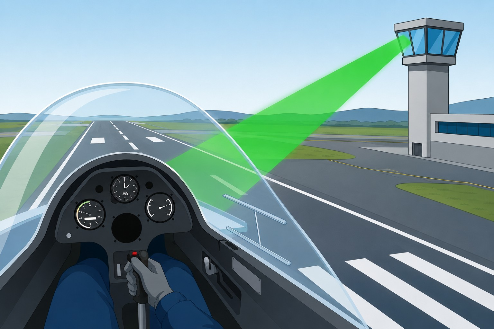

# Action required to be taken in case of communication failure

> Losing the radio in flight (a NORDO situation) has a specific procedure. Here you will see what to do with the transponder, how to manage the flight down to the ground, what the Tower's light signals mean and how to transmit when only the receiver has failed.

## Code 7600: the radio failure signal

Losing all radio in flight (technically, loss of two-way communication, or a **NORDO** situation, **No Radio**) is a serious problem, especially near controlled airspace. Do not panic: there is a procedure.

First go over the basics: volume, **squelch**, headset connectors (**jacks**), fuses and alternative frequencies. If nothing works, go to the transponder.

Set **code 7600** now.

With that code set, your aircraft appears on the control centres' secondary surveillance radar (SSR) screens with a special alert. The sector controllers know you are NORDO and start coordinating: they clear the airspace around you and follow you visually.

## Standard procedure in VFR flight

Once NORDO has been declared, the plan is this:

1. **Stay in VMC.** Do not enter cloud under any circumstances. You need visibility and visual contact with the ground and other traffic.
2. **Go round controlled zones.** If your route crossed a CTR, stay outside it. Without a radio you cannot get a clearance.
3. **Land at the nearest suitable aerodrome.** Preferably an uncontrolled one: join the visual circuit with your eyes wide open and land.
4. **Telephone as soon as you are on the ground.** Contact the relevant ATC unit to confirm your landing. If you do not, the ATS services will start the Search and Rescue (SAR) phase.

::: {.callout-warning title="Safety"}
If you have no choice but to land at a controlled aerodrome, approach the Tower through areas that do not interfere with operations and **rock your wings** so that you are seen. Then position yourself parallel to the runway, in front of the tower, and watch for ATC light signals.
:::

{#fig-04-cap05-pistola-luces}

## Light signals from the tower (SERA Regulation)

Since the earliest aerodromes, control towers have had directional lamps with coloured filters (the “light gun”) for exactly this purpose: guiding aircraft with no radio (@fig-04-cap05-pistola-luces). Memorise these signals. If you ever need them, there will be no time to look them up.

::: {.callout-important title="Regulation"}
Control Tower light signals are laid down in Commission Implementing Regulation (EU) No 923/2012, the Standardised European Rules of the Air (**SERA**). Every pilot who flies in airspace with an ATC service must know them and read them correctly (source: official SERA documentation, EASA / AESA).
:::

**Signals to aircraft in flight:**

* [●]{.luz-verde} **Steady green**: cleared to land.
* [●]{.luz-roja} **Steady red**: give way to other aircraft and continue circling.
* [●●●]{.luz-verde} **Series of green flashes**: return for landing.
* [●●●]{.luz-roja} **Series of red flashes**: aerodrome unsafe, do not land.
* ○○○ **Series of white flashes**: land at this aerodrome and proceed to apron.
* [★]{.luz-roja} **Red pyrotechnic**: notwithstanding any previous instructions, do not land for the time being.

**Signals to aircraft on the ground:**

* [●]{.luz-verde} **Steady green**: cleared for take-off.
* [●]{.luz-roja} **Steady red**: stop.
* [●●●]{.luz-verde} **Series of green flashes**: cleared to taxi.
* [●●●]{.luz-roja} **Series of red flashes**: taxi clear of landing area in use.
* ○○○ **Series of white flashes**: return to starting point on the aerodrome.

::: {.callout-tip title="Golden rule"}
When you receive a signal from the Tower in flight, acknowledge it in the only way you can: by day, with clearly visible yawing on the rudder or rocking of the wings. At night, by switching the landing or navigation lights on and off. On the ground, by moving the ailerons or the rudder.
:::

## Blind transmission

Sometimes only the receiver has failed: your voice goes out normally, but you receive nothing. You cannot know that for certain from the air, but if you suspect it, use **blind transmission**.

The idea is simple: you keep transmitting your position and intentions on the right frequency, but every message is preceded by a warning:

“Transmitting blind due to receiver failure. Transmitting blind. San Javier Tower, glider EC-EPE, 5 miles from point Sierra at 2,000 feet, intending to enter the zone and proceed to initial for runway 23 for a full-stop landing.” (*Transmitiendo a ciegas debido a fallo del receptor. Transmitiendo a ciegas. Torre de San Javier, planeador EC-EPE, a 5 millas del punto Sierra a 2.000 pies, intención entrar en zona y proceder a inicial de pista 23 para toma completa.*)

Transmit each complete message twice: with no acknowledgement, repetition is your only guarantee that it gets through whole. And repeat the warning at each change of circuit leg or when you start the descent on final. The controller may be receiving you perfectly on the ground and coordinating traffic from what you describe, even though you cannot confirm it.

::: {.postit}
**Chapter summary: communication failure**

* **Code 7600**: once the radio failure is confirmed, select 7600 on the transponder. The aircraft will stand out on the secondary surveillance radar (SSR) screen as a NORDO case.
* **In-flight procedure**: stay in VMC. Land preferably at an uncontrolled aerodrome. If you must go to a controlled one, fly past the Tower away from operating areas, rock your wings and watch for the light signals. Telephone as soon as you land.
* **Light signals (SERA)**: *steady green* (in flight) = cleared to land. *Steady red* (in flight) = give way. *Red flashes* (in flight) = aerodrome unsafe. *Green flashes* (in flight) = return for landing. *White flashes* (in flight) = land at this aerodrome. The corresponding signals on the ground mean different things: *steady green* = cleared for take-off; *green flashes* = cleared to taxi.
* **Blind transmission**: if only the receiver has failed, transmit your position and intentions on the right frequency, starting the message with “Transmitting blind due to receiver failure” (*Transmitiendo a ciegas debido a fallo del receptor*). Repeat it at each change of circuit leg.
:::
