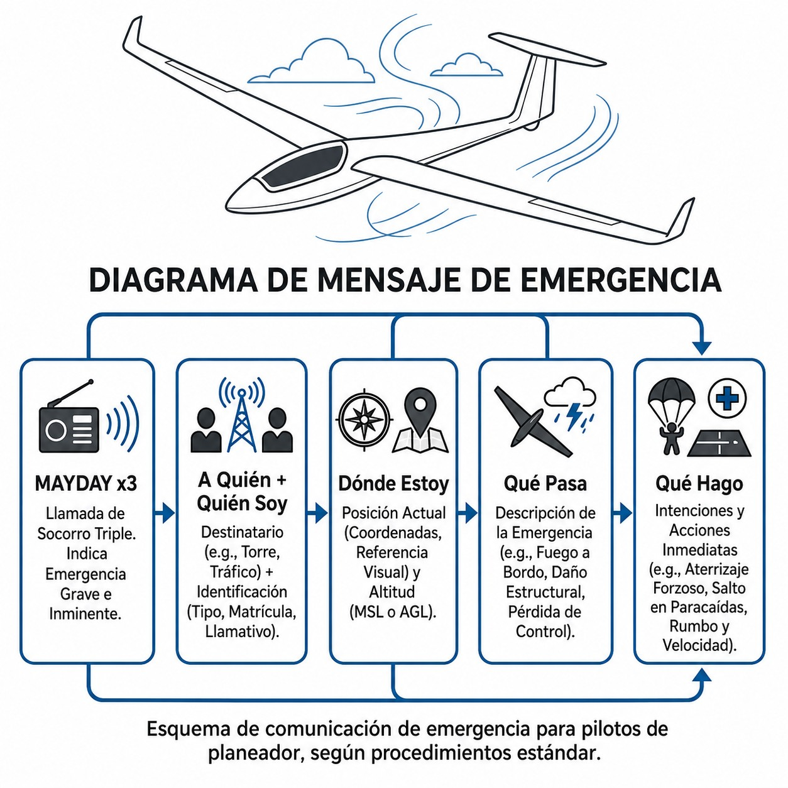
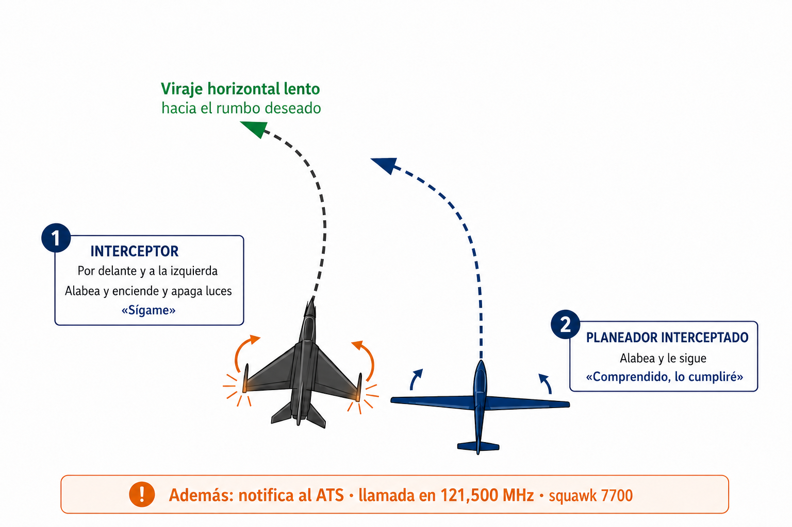

# Distress and urgency procedures

> MAYDAY and PAN PAN are not synonyms. This chapter explains when to use each one, exactly what to say and on which frequency. They are the two most important messages you can send on the radio, and with luck you will never need either. That is exactly why you must know them by heart. The chapter closes with another procedure you hope never to use: what to do if a military aircraft intercepts you.

## MAYDAY: distress

**MAYDAY** is the highest-priority word in aeronautical radio. It comes from the French *m'aider*, “help me”, pronounced the English way.

Use it when there is **grave and imminent danger and you need immediate assistance**. The lives of the occupants or the integrity of the glider are at risk right now.

In a glider that means fire on board, severe structural failure (canopy, rudder, wing), medical incapacitation of the pilot, or a loss of height with no field available that demands action now.

The word is repeated **three times** so that it stands out from normal traffic and interference:

*«Mayday, Mayday, Mayday…»*

::: {.callout-warning title="Safety"}
The malicious or false transmission of a MAYDAY distress message mobilises the State's search and rescue (SAR) resources. In Spain, simulating a danger or an accident that causes the rescue services to be mobilised is a **criminal offence**, punishable by imprisonment of three months and one day to one year or by a fine (Código Penal, the Spanish Criminal Code, Article 561).
:::

::: {.callout-important title="Regulation"}
Under international rules (ICAO/EASA), the declaration of a MAYDAY imposes **absolute radio silence** on all other air and ground stations operating on that frequency. No other traffic may transmit unless it is to offer direct help to the aircraft in distress or to relay its message to the Control Tower (**Mayday relay**).
:::

## PAN PAN: urgency

One step below is **urgency**. It is declared with **PAN PAN**, also three times: *«Pan Pan, Pan Pan, Pan Pan»*. It comes from the French *panne*, breakdown.

PAN PAN says that you have a serious problem that needs **priority attention** from ATC, but that you are not in immediate danger of an accident and do not need rescuing in the next few seconds.

In a glider: inadvertently entering IMC with no immediate way back to VFR, a medical problem that forces you to divert, or a gradual loss of height that leaves you time to plan an outlanding and coordinate it with ATC or FIS.

PAN PAN gives you priority in communications. Unlike MAYDAY, it does not require total silence from other traffic.

## The structure of the emergency message

With your heart racing and your hands busy, it can be hard to structure a message. But the control and rescue (SAR) services need specific information to find you and help you. This is the sequence (@fig-04-cap06-llamada-emergencia):

1. **WHOM:** the name of the ATS unit.
2. **WHO:** aircraft type and full callsign.
3. **WHERE:** current position, altitude or flight level, and heading.
4. **WHAT IS HAPPENING:** the nature of the emergency.
5. **WHAT YOU REQUEST:** the pilot's intentions and the kind of help needed.
6. **PERSONS:** persons on board (vital for the rescue services).

*Example of a distress message (MAYDAY):*
*«Mayday, Mayday, Mayday. Madrid Información. Velero ASK-21, EC-EPE. A 5 millas al este de Fuentemilanos, 2.800 metros. Impacto con ave y rotura masiva del timón de profundidad. El piloto y el pasajero van a saltar en paracaídas. 2 personas a bordo.»* (“Mayday, Mayday, Mayday. Madrid Information. Glider ASK-21, EC-EPE. 5 miles east of Fuentemilanos, 2,800 metres. Bird strike and major failure of the elevator. Pilot and passenger bailing out. 2 persons on board.”)

*Example of an urgency message (PAN PAN):*
*«Pan Pan, Pan Pan, Pan Pan. Madrid Información. Velero ASK-21, EC-EPE. Sobre el embalse de Pinilla, 2.200 metros QNH 1018. Pérdida de altura progresiva sin térmica disponible. Planificando aterrizaje fuera de aeródromo en 10 minutos. 2 personas a bordo. Solicito información de campos en el área.»* (“Pan Pan, Pan Pan, Pan Pan. Madrid Information. Glider ASK-21, EC-EPE. Over the Pinilla reservoir, 2,200 metres QNH 1018. Gradual loss of height, no thermal available. Planning an outlanding in 10 minutes. 2 persons on board. Request information on fields in the area.”)

{#fig-04-cap06-llamada-emergencia}

## The right frequency

Many pilots believe that in any emergency the first thing to do is change to 121.500 MHz. They are wrong.

**The best frequency for declaring an emergency is the one you are already on.**

If you are talking to “Zaragoza Torre” or listening to “Madrid Información”, transmit there. The controller already has you on the screen and communication is established. Changing frequency in the middle of an emergency adds work and risks losing contact.

However, if you are flying in a remote area with no ATS contact and nobody answers your local call, then yes: change to **121.500 MHz**.

That frequency is monitored continuously by airliners in the cruise, military air defence stations and area control centres. A MAYDAY on 121.500 MHz stands a good chance of being heard and passed on (**relay**) to the rescue services.

## Interception: if a fighter appears beside you

A glider rarely triggers an **interception**, but it has happened: infringing an active prohibited or restricted area, crossing a CTR without a clearance or appearing as an unidentified return near a sensitive area can make air defence send a military aircraft to identify you. **Book 1 — Air Law and ATC Procedures** already warns you about that risk when it covers P and R areas; here you will learn the signals and the right response. It is not a frill of the syllabus: the rules require you to carry a copy of these signals on board (SAO.GEN.155, see **Book 6 — Operational Procedures**, chapter 1).

### The interceptor's signals

The interceptor communicates with you by manoeuvres, not words. The three series you must recognise, as set out in SERA Table S11-1:

1. It rocks its wings and flashes its navigation lights at irregular intervals, from a position slightly above, ahead of and normally to your left. Then it makes a slow level turn onto the desired heading.

“You have been intercepted. Follow me.”

Rock your wings, flash your navigation lights if you have them, and follow it.

2. It breaks away from you abruptly with a climbing turn of 90° or more, without crossing your line of flight.

“You may proceed.”

Rock your wings: “Understood, will comply.”

3. It lowers its landing gear, shows steady landing lights and overflies the runway in use.

“Land at this aerodrome.”

Lower your undercarriage (if retractable), follow the interceptor and, after overflying the runway, land if it is safe to do so.

If the interceptor is much faster than you (and it always will be), the rules already allow for it: it will fly race-track patterns around you and rock its wings each time it passes you. Do not read this as a new signal; it is still Series 1.

{#fig-04-cap06-interceptacion-serie1}

### What you must do

If you are intercepted, apply the four steps of SERA.11015 at once:

1. **Follow the interceptor's visual instructions**, interpreting them and responding according to the signal tables.
2. **Notify**, if possible, the air traffic services unit you are in contact with.
3. **Try the radio**: a general call on **121.500 MHz**, giving your identity and the nature of the flight (for example: *«Aeronave interceptada, velero EC-EPE, vuelo VFR de Fuentemilanos a Santo Tomé, escucho»*, “Intercepted aircraft, glider EC-EPE, VFR flight from Fuentemilanos to Santo Tomé, listening”).
4. **Select Mode A, code 7700** on the transponder, unless ATS instructs you otherwise.

::: {.callout-important title="Regulation"}
SERA.11015(c): “If any instructions received by radio from any sources conflict with those given by the intercepting aircraft by visual signals, the intercepted aircraft shall request immediate clarification while continuing to comply with the visual instructions given by the intercepting aircraft.” The same rule applies if the conflict is with instructions given by radio by the interceptor (SERA.11015(d)).
:::

::: {.callout-warning title="Safety"}
**The interceptor's instructions take precedence over any other source, ATC included**, while you ask for clarification (when in doubt, obey the one carrying the missiles). An armed interceptor that believes you are not cooperating is the most dangerous situation a civil aircraft can get into: keep a smooth, predictable flight path, make no abrupt manoeuvres and respond to every signal.
:::

### If you cannot comply

The intercepted aircraft also has its own signals (SERA Table S11-2): switching **all available lights** on and off **at regular intervals** means “Cannot comply” (Series 5), and doing so **at irregular intervals** means “In distress” (Series 6). If you make radio contact but have no common language, the rules provide standard phrases (Table S11-3): the interceptor will use FOLLOW (“Follow me”), DESCEND (“Descend for landing”) or YOU LAND (“Land at this aerodrome”); you will answer WILCO (“Understood, will comply”), CAN NOT (“Unable to comply”), AM LOST (“Position unknown”) or MAYDAY.

::: {.callout-note title="Airmanship"}
A glider without navigation lights has few ways of signalling: your visible response is a **wide, clear wing rock**. Make up for the rest with the radio (121.500 MHz) and the transponder (7700). And remember that the best interception is the one that never happens: check the NOTAMs and the status of P and R areas before every cross-country flight.
:::

::: {.postit}
**Chapter summary: distress and urgency procedures**

* **MAYDAY (×3)**: only for situations of **GRAVE AND IMMINENT** danger with a risk to life (fire, collision, structural failure). It gives absolute priority and imposes total radio silence on other traffic.
* **PAN PAN (×3)**: an **URGENCY** situation. It calls for priority assistance (someone ill on board, disorientation, a non-critical failure) but there is no immediate risk of an accident. It asks for priority, not total silence.
* **Message structure**: WHOM (station) + WHO (callsign) + WHERE (position) + WHAT IS HAPPENING (problem) + WHAT YOU REQUEST (intentions and assistance).
* **Recommended frequency**: the best frequency is the one on which the flight is already in contact. If that fails or there is no answer, change to the international emergency frequency, 121.500 MHz.
* **Interception (SERA.11015)**: interceptor rocking its wings ahead of you and to your left = “Follow me” (respond by rocking your wings and following it); abrupt climbing turn of 90° or more = “You may proceed”; gear down and landing lights on over the runway = “Land at this aerodrome”. Procedure: follow the visual instructions + notify ATS + call on 121.500 MHz + squawk 7700. **The interceptor's instructions take precedence over any other source, ATC included**, while you ask for clarification. A copy of the signals must be carried on board (SAO.GEN.155).
:::
