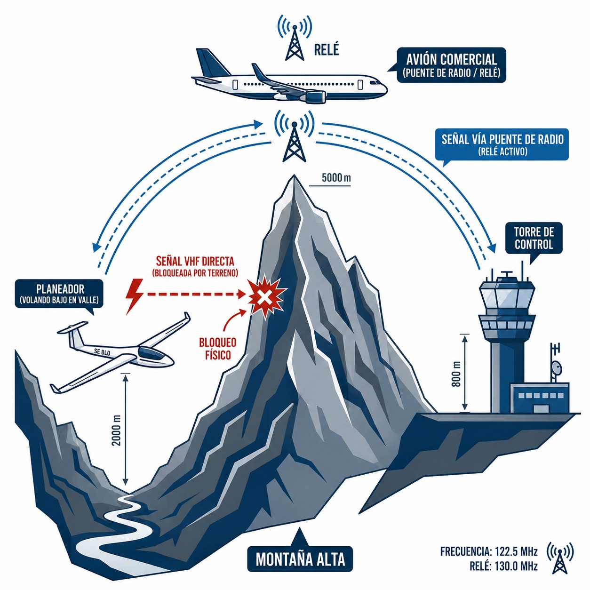

# General principles of VHF propagation and allocation of frequencies

> VHF radio works like a torch: it shines in a straight line, and a mountain leaves you in the dark. In this chapter you will see why altitude is your best ally for range, what changed with 8.33 kHz spacing, how to set the **squelch** properly, what to do when a mountain range blocks your signal, and which frequencies you need to know by heart. Also when a transponder is mandatory and what the **squawk** codes mean.

## Line of sight: VHF waves travel in straight lines

Aeronautical voice communications are transmitted in the **Very High Frequency (VHF)** band, between 118.000 MHz and 136.975 MHz, with amplitude modulation (AM).

VHF waves **travel in straight lines**, exactly like a beam of light. This is called **line-of-sight** propagation. The consequence is immediate: if something solid gets between your antenna and the receiver's, communication is cut. Simple as that.

Low-frequency waves bounce off the ionosphere and can get round the horizon. VHF waves cannot. They do not pass through the ground or bend over it. A mountain, a building or the curvature of the Earth itself stops them dead.

That is why **altitude is your best ally for radio range**. The higher you fly, the further your antenna “sees” over the curvature of the Earth and over obstacles. There is a formula for estimating it over flat terrain:

`Maximum range [NM] = 1.23 × √H [feet]`

*Worked example: at a height of 10,000 feet, the square root is 100. Multiplied by 1.23, the theoretical range to a ground station is about 123 nautical miles, some 228 km.*

## 8.33 kHz channel spacing

For decades, the aviation VHF spectrum was divided into channels 25 kHz apart. That worked well until the growth of air traffic in Europe left too few channels for new ATC sectors, approaches and aerodromes.

The solution was to reduce the spacing of each channel from 25 kHz to **8.33 kHz**. That tripled the number of channels available in the same slice of the spectrum.

Commission Implementing Regulation (EU) No 1079/2012 imposed the transition throughout Europe. In Spain, since **31 December 2022**, VFR flights must be equipped with “8.33-compatible” radios (**8.33 compliant**). IFR flights complied earlier.

::: {.callout-important title="Regulation: 8.33 kHz RADIOS"}
If your glider has an old 25 kHz radio (the kind that only shows dials ending in .000, .025, .050 or .075), the general rule in Europe is that it is no longer enough: to work with modern ATC units you need equipment capable of tuning to 8.33 kHz spacing. There is one exception worth knowing: the AIP-España (ENR 1.8) keeps, as notified to the Commission (Regulations 2023/1770 and 2023/1771), some **national 25 kHz sub-bands for air-to-air and air-to-ground communications until 31 December 2028**, precisely the gliding frequencies that appear in the table in this chapter (122.600, 123.375, 123.400, 123.450, 123.500). So, legally, the general rule has that exception; in practice, fit an 8.33 radio without hesitation, because without one you will not be able to talk to most ATC units.
:::

## Squelch: the noise gate

Almost every aeronautical radio has a rotary control, or a digital menu item, labelled **Squelch**.

The **squelch** is an electronic circuit that works as a noise gate. When nobody is transmitting on the frequency, the antenna picks up static: that annoying background hiss. The squelch silences it. Only when a strong enough signal arrives (a voice) does the gate open and the audio reach your headset or speaker.

**Correct setting:**

1. Turn the squelch down until you hear loud, continuous static (“hiss”).
2. Turn it up slowly, **just to the point** where the noise disappears.

::: {.callout-tip title="Golden rule"}
Do not turn the squelch up beyond the point where the noise stops. If you leave it “at maximum”, weak signals from distant gliders or a distant ATC unit will not be strong enough to open the gate. You will think the frequency is silent when in fact someone is calling you.
:::

{#fig-04-cap07-bloqueo-montana}

## Terrain blocking in the mountains and radio relay

Soaring often takes gliders into complex terrain: the slopes of the Pyrenees, the valleys of the Gredos, the deep valleys of the Sistema Central. Far from the plains and well below the ridges.

VHF waves travel in straight lines and do not pass through rock. If you drop below the ridge that separates you from the control tower or from the nearest ENAIRE FIS repeater, you will suffer total **terrain blocking** (@fig-04-cap07-bloqueo-montana). It does not matter how powerful your radio is: the signal hits the rock.

In high mountains, prepare for this with two measures:

1. **Anticipate the lack of coverage**: if you have to make a position report to FIS, do it **before** you go into that valley or behind that ridge.
2. **The bridge aircraft (relay)**: in an emergency from the bottom of a valley with no coverage, remember that above you there are gliders from your own club flying higher, or airliners en route. They can “see” both your position in the valley and the distant tower. Use them as **relay stations**. Transmit: *«Tráfico en 123,500, aquí Eco Papa Eco en emergencia en el fondo del valle del Jerte, ¿alguien puede retransmitir mi Mayday a Madrid Información?»* (“Traffic on 123.500, this is Echo Papa Echo in an emergency at the bottom of the Jerte valley, can anyone relay my Mayday to Madrid Information?”). Their signal will reach the tower with no obstacles in the way, and they will relay your call.

## Common frequencies in sport aviation

Knowing the most common frequencies by heart lets you tune them without looking at the chart and react quickly to any change or emergency.

| Frequency (MHz) | Use | Scope |
| --- | --- | --- |
| **121.500** | International aeronautical emergency | International. Monitored 24 h a day by airliners at cruising altitude, military air defence installations and area control centres. |
| **122.600** | Gliding (main frequency) | Spain. Coordination between gliders in free-flying areas and reports between pilots. |
| **123.375** | Gliding (alternative) | Alternative coordination frequency between gliders when 122.600 is congested. |
| **123.400** | Gliding (alternative) | Second alternative coordination frequency for gliders. |
| **123.450** | “Chat” frequency (**air-to-air**) | Flight comments and informal coordination between pilots. Not to be used for dealings with ATC or FIS. |
| **123.500** | Generic uncontrolled aerodrome | Blind broadcasts at aerodromes without a tower, or with AFIS, where no specific frequency is published. |
: Reference VHF frequencies for the glider pilot

The **regional FIS** frequencies in Spain (Madrid, Barcelona, Sevilla, Palma de Mallorca, Gran Canaria) vary by sector and altitude. They are published in the AIP España (GEN 3.3) and on the ICAO 1:500,000 aeronautical charts. Every aerodrome with a tower or AFIS has its own frequency, published on the aerodrome VAC. The table above itself comes from the AIP-España (GEN 3.4 and ENR 1.8).

::: {.callout-note title="Airmanship"}
With 8.33 kHz spacing, charts and radios show **channels**, not exact frequencies: you will see dials ending in .005, .010, .015… and sometimes a “C” suffix. It is not a tuning error; it is the channel name, which does not match the actual frequency. Tune the channel exactly as it appears on the chart.
:::

::: {.callout-note title="Airmanship"}
Before every cross-country flight, write down the FIS frequencies for the sectors you will cross. In an area with poor coverage or after an emergency, looking up the frequency on the map is time you do not have.
:::

## The transponder: secondary identification in flight

The **transponder** (*XPDR*) answers ground radars automatically by transmitting a four-digit code (*squawk*). That way the controller sees your aircraft identified on the screen.

Carrying one in working order is mandatory inside a **TMZ** (*Transponder Mandatory Zone*) and wherever the airspace class or the AIP-España (ENR 1.6) requires it: classes A and C require it, and D generally does (see the table in **Book 1 — Air Law and ATC Procedures**, chapter 7). Outside those areas it is still highly advisable wherever there is traffic: if it is fitted and working, the correct practice is to have it switched on in ALT mode (altitude reporting).

* **7000**: standard VFR code.
* **7500**: unlawful interference (hijacking). Only in the face of a real threat to the aircraft. Using it triggers immediate air defence procedures.
* **7600**: radio failure (NORDO).
* **7700**: general emergency.
* **IDENT button**: makes your label flash on the radar. Press it **only** when the controller asks for it explicitly (“*Squawk ident*”).

::: {.postit}
**Chapter summary: principles of VHF propagation**

* **Line of sight**: VHF waves travel in straight lines. If there is a mountain between the antenna and you, you will not be heard. Height is your ally: the higher you are, the greater the range (1.23 × √H).
* **8.33 kHz spacing**: the airspace is congested. To fit in more channels, the channel width was reduced. Make sure your radio is “8.33 compliant”, or you will not be able to tune many modern frequencies.
* **Squelch**: the “noise gate”. Set it just to the point where the background noise (“hiss”) disappears. Set it too tight and you will block weak but important signals.
* **Blocking**: in deep valleys you can lose contact with the repeater network. Have a communications plan (or a relay through another aircraft) ready if you fly low in the mountains.
* **Key frequencies**: 121.500 MHz (international emergency, permanent watch). 122.600 / 123.375 / 123.400 MHz (gliding). 123.450 MHz (chat between pilots). 123.500 MHz (generic uncontrolled aerodrome). Regional FIS: see AIP España GEN 3.3.
* **Transponder (XPDR)**: answers the secondary surveillance radar (SSR) automatically. Codes: **7000** (standard VFR), **7600** (radio failure, NORDO), **7700** (active emergency). Mandatory in TMZs (SERA.6005(b), described in AIP-España ENR 2.1, chart ENR 6) and wherever the airspace class or the AIP (ENR 1.6) requires it: classes A and C, and D generally. **IDENT** button: only when ATC asks for it.
:::
