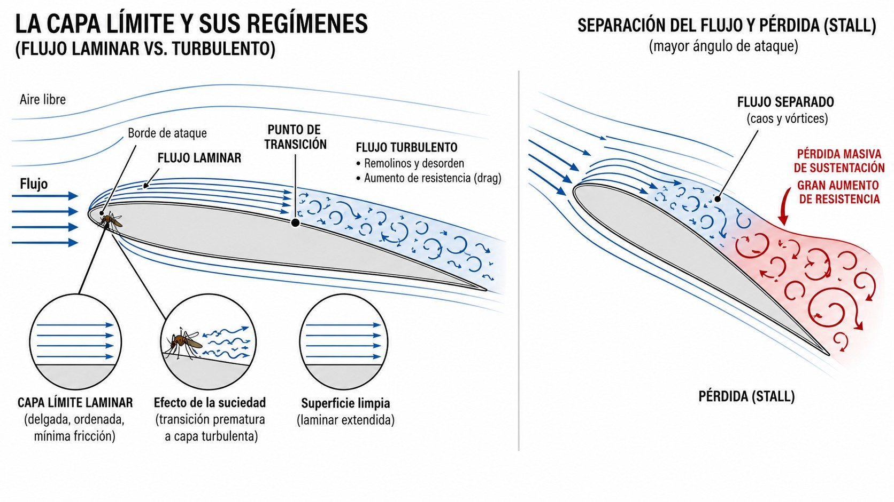
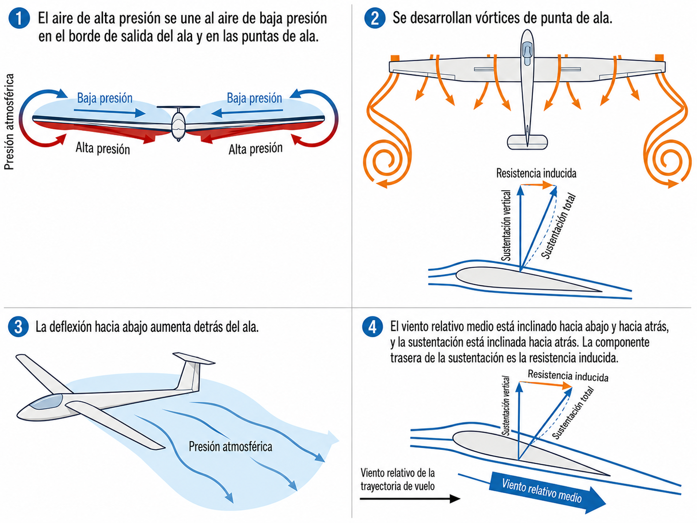
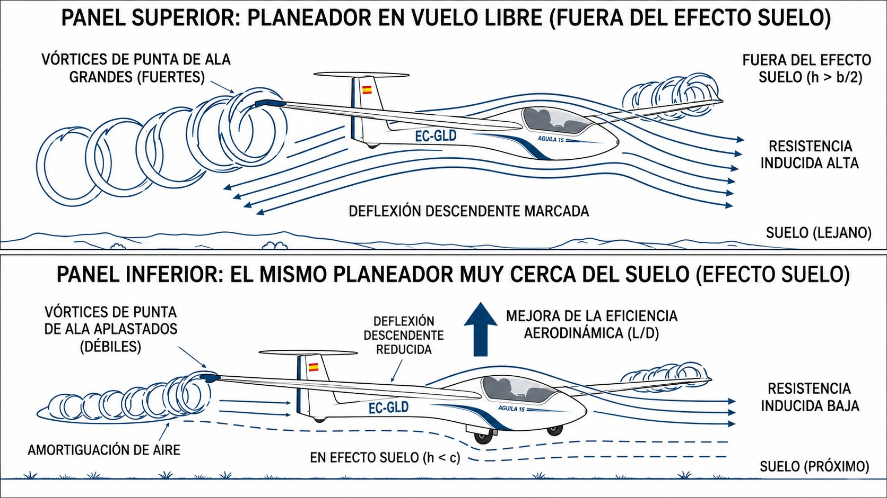

# Aerodynamics (airflow)

> Aerodynamics is the invisible foundation of everything a sailplane does in the air. In this chapter you will learn how the pressure difference between the upper and lower surfaces of the wing generates lift, what the boundary layer is and why a few squashed insects on the leading edge can degrade the performance of a laminar aerofoil, and how the two kinds of aerodynamic drag set the best gliding speed.

## Bernoulli's principle and lift

Lift is generated by a pressure difference between the upper surface and the lower surface of the wing.

As the sailplane moves forward, the air flowing over the curved upper surface of the aerofoil speeds up, while the air passing under the lower surface travels more slowly. According to Bernoulli's theorem, when the speed of a fluid increases, its static pressure decreases: the upper surface is left with less pressure than the lower surface, and that difference creates the net upward force that balances the weight of the sailplane.

::: {.callout-tip title="Golden rule"}
There are two ways to describe lift, and both describe the **same** phenomenon; they are not two forces to be added together: the pressure difference (Bernoulli) and the downward deflection of the air at the trailing edge (action and reaction, Newton's third law). The wing that speeds up the air above it is the same wing that deflects it downwards; both views give the same force.
:::

## The boundary layer

The boundary layer is the thin layer of air in direct contact with the skin of the wing. Viscous friction slows this layer progressively until the speed reaches zero at the surface itself. It has two regimes:

* **Laminar:** the air slides along in smooth, parallel layers. It produces the least possible friction and is the main goal in the design of modern sailplanes.
* **Turbulent:** the flow breaks up into small eddies. Friction is much higher than in the laminar regime, the layer thickens and the glide suffers. It does have one virtue: because it carries more energy, it clings to the aerofoil better and takes longer to separate. That is why many sailplanes carry turbulators (the zigzag tape you may have seen on a Discus): they force the transition to turbulent flow exactly where it helps to stop the flow separating.

The point on the chord where laminar flow becomes turbulent is called the **transition point** (@fig-05-cap01-capa-limite). To keep the boundary layer laminar over as much of the surface as possible, the wings must be perfectly clean; a single squashed insect on the leading edge is enough to cause premature transition to a turbulent layer. If the angle of attack increases too far, the flow reaches **separation**: it breaks away from the wing and causes a massive loss of lift together with a large increase in drag (the **stall**).

{#fig-05-cap01-capa-limite}

## Centre of pressure (CP)

The centre of pressure (CP) is the point on the wing chord where the net lift force acts. It is not fixed: it moves with the angle of attack.

The rule:

* More angle of attack → the CP moves forward, towards the leading edge.
* Lower the nose → the CP moves back.

This constant shifting has a direct effect on balance in pitch.

::: {.callout-warning title="Safety"}
Because the CP moves, the aircraft has to be designed with the centre of gravity (CG) ahead of the centre of pressure in normal flight conditions. That arrangement gives **positive longitudinal stability**. To counter the nose-down tendency caused by the forward CG, the horizontal stabiliser produces a downward force that keeps the aircraft balanced in pitch.
:::

## Types of drag and the drag curve

Everything that keeps the sailplane in the air has its price: **drag**. It has two components:

* **Parasite drag:** the drag produced by any solid object moving through a fluid. It grows with the square of the speed (if the speed doubles, the drag quadruples). It is made up of:
  
  * Skin friction on the wings and fuselage.
  * Form drag (the shape of each part).
  * Interference drag (where two surfaces meet at right angles, such as the wing root joining the fuselage).
* **Induced drag:** the direct by-product of generating lift. The pressure difference between the upper and lower surfaces makes the air flow round the wingtips, from the high-pressure area (lower surface) to the low-pressure area (upper surface). That detour creates **helical vortices** that trail from each tip. They tilt the resulting lift vector slightly backwards, producing a force that opposes forward motion: induced drag (@fig-05-cap01-vortices-punta-ala). Unlike parasite drag, it is greatest at low speeds (and high angles of attack) and decreases as the sailplane speeds up.

{#fig-05-cap01-vortices-punta-ala}

There are two reasons why a sailplane glides so differently from a light aeroplane. The first is the **aspect ratio**: how many times the chord fits into the span. Long, narrow wings form weaker tip vortices, so induced drag falls. A racing sailplane reaches an aspect ratio of 30:1 or more; a light general aviation aeroplane, such as a Cessna 172 or a Piper PA-28, between 7 and 8. That difference explains much of the performance gap; the rest comes from laminar aerofoils and the aerodynamic cleanliness of the whole aircraft. The second is the use of **winglets**: small vertical fins at the wingtips that block the air trying to flow round the tip from high to low pressure. They reduce the vortex without making the span any longer.

Plotted against speed, the sum of the two drags forms a U-shaped curve. The lowest point of that curve is the speed at which total aerodynamic drag is at its minimum. Flying at exactly that speed, the sailplane achieves its best lift/drag ratio (L/D): the best glide angle, for the greatest distance covered over the ground.

## Ground effect

When the sailplane flies very low over the runway (generally less than one wingspan above the ground), it enters a zone of aerodynamic influence called **ground effect**. The ground acts as a physical barrier that disrupts the normal formation of the wingtip vortices and reduces the strength of the downward flow that feeds them (**downwash**).

The result is a significant reduction in induced drag, which temporarily improves the sailplane's L/D ratio (@fig-05-cap01-efecto-suelo):

* On landing, the sailplane “floats” further than expected: with less induced drag it hardly slows down, and the wing keeps supporting it at speeds somewhat lower than it would need in free air. A pilot who arrives long or too fast can use up hundreds of metres of runway without touching down.
* On an aerotow take-off, the sailplane can lift off at slightly lower speeds than normal. Once it leaves ground effect, induced drag returns to its normal value and the climb may suffer slightly if the speed is too low.

{#fig-05-cap01-efecto-suelo}

::: {.callout-note title="Airmanship"}
Ground effect can catch out an inexperienced pilot: the sailplane seems unwilling to touch down during the landing. If you arrive over the touchdown zone with too much speed or momentum, resist the temptation to push the nose down to force the landing. Use the airbrakes to control the glide and let the sailplane settle only when it is ready, having first made sure you have enough runway.
:::

::: {.postit}
**Chapter summary: aerodynamics and airflow**

* **Bernoulli's principle**: the basis of flight. The air speeds up over the curved upper surface of the wing and its pressure falls, producing a net upward force. It is the same lift that the downward deflection of the air describes (Newton): two views of a single phenomenon, not two forces to be added together.
* **Boundary layer**: the thin layer of air stuck to the wing. If it is **laminar** (orderly), drag is at its minimum: the holy grail of modern sailplanes. If it becomes **turbulent**, drag rises, but the wing keeps producing lift. Only when the flow **separates** from the aerofoil does lift collapse: that is the stall.
* **Centre of pressure (CP)**: the point where the lift force acts. Careful: it moves with the angle of attack (forward at high angles, back at low ones), which affects stability.
* **Types of drag**: **parasite** (friction with the air, rises with speed) and **induced** (the price of generating lift, falls with speed). Induced drag comes from the wingtip vortices, which tilt the lift vector. Sailplanes keep it low with a high aspect ratio (long, narrow wings) and winglets at the tips.
* **Ground effect**: less than one wingspan above the ground, the tip vortices are squeezed, induced drag falls and the sailplane “floats” more efficiently than normal. Worth knowing: it explains why the sailplane will not settle on landing if you arrive fast or long.
:::
