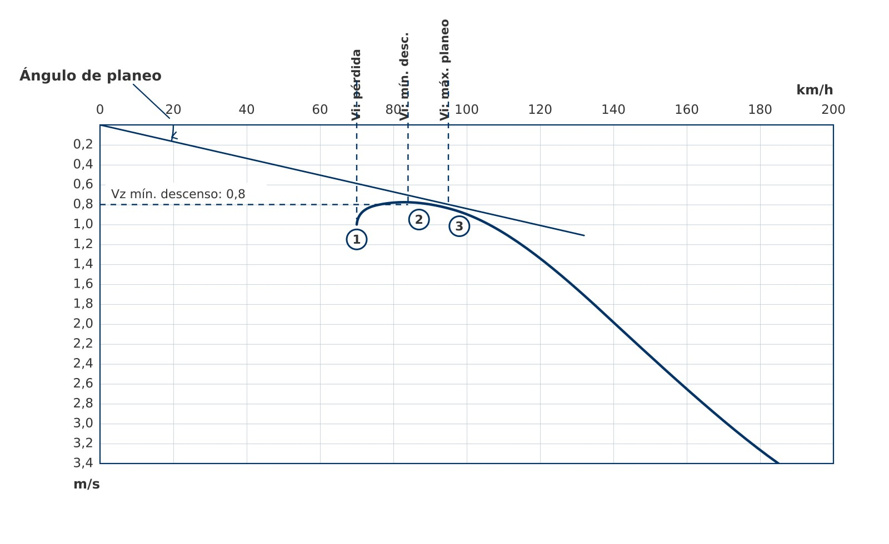
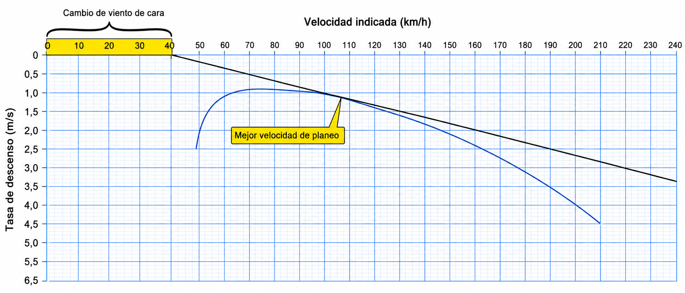
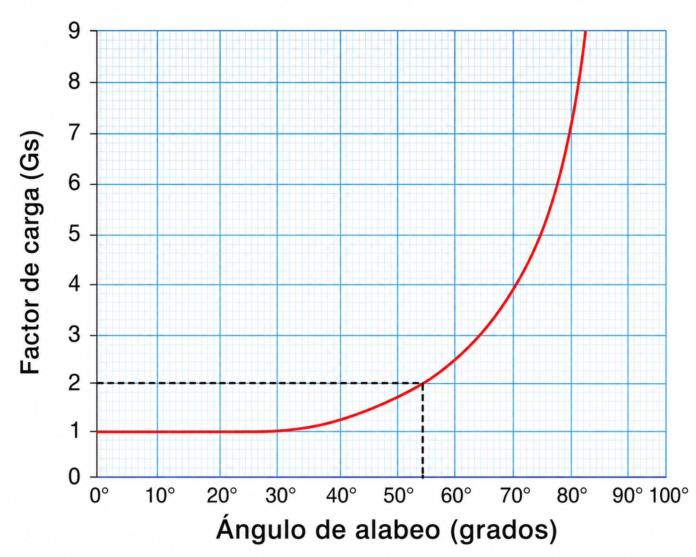

# Flight mechanics

> Without an engine, gravity is your only fuel. In this chapter you will learn to read your sailplane's polar curve to get the best performance out of it, to adjust your speed for wind and sink, and to understand load factor so that you can turn without overstressing the structure or drifting towards the stall without noticing.

## Gravity is the engine

A sailplane has no engine. Once released from the tow, its only fuel is the height it has under its wings.

Gliding flight is a constant exchange: potential energy (height) is converted into kinetic energy (speed). For the wing to keep producing lift, the sailplane flies slightly nose-down relative to the air mass. That attitude makes a component of the weight point forward along the flight path, acting as thrust and balancing aerodynamic **drag**.

::: {.callout-tip title="Golden rule"}
Speed gives you control of the sailplane; height is your energy reserve. By giving up height you gain speed (stick forward) and, by using up excess speed, you can regain some upward path (stick back). But that exchange does not last: the reserve is refilled only by climbing in lift.
:::

## The polar curve

The polar curve is your sailplane's performance ID card. It shows the relationship between speed (km/h) and rate of sink (m/s) in still air. You must know it, because the two key operating speeds come from it (@fig-05-cap02-curva-polar):

* **Minimum sink speed (V~min\ sink~):** at the top of the curve (the point closest to zero on the Y axis). At this speed you lose the least height per unit of time, so it is the speed that keeps you in the air longest. It is your reference when turning steeply in the core of a thermal or when holding.
* **Best glide speed (V~best\ glide~, also called the speed for best L/D):** found by drawing a tangent from the origin (0,0) to touch the curve. It gives the best ratio of distance covered to height lost. It is the speed for clean glides between thermals and for covering the greatest possible distance over the ground.

{#fig-05-cap02-curva-polar fig-alt="The different speeds shown on a sailplane polar."}

## Efficiency and glide ratio (L/D)

The glide ratio (L/D) expresses how many metres the sailplane travels forward for each metre of height lost in still air. A training sailplane such as the ASK 21 manages about 35:1 (it covers 35 km for every kilometre of height given up). Open Class racing sailplanes exceed 60:1 thanks to their long span and laminar aerofoils.

In real air, the figures in the manual are only theory: wind and moving air masses force you to adjust your speeds.

* **Headwind:** into wind, your progress over the ground falls even if you hold the same airspeed. Fly faster than V~best\ glide~: as a rule of thumb, add 50% of the headwind component to your cruising speed (@fig-05-cap02-curva-polar-viento-de-cara).

{#fig-05-cap02-curva-polar-viento-de-cara}

* **Tailwind:** with the wind behind you, the ground passes faster than the polar suggests. You can fly a little slower than the still-air V~best\ glide~, but never below V~min\ sink~. It is not a large adjustment; the margin above the stall always comes first.
* **Sinking air:** when you fly through a descending air mass, your actual rate of sink increases by the same amount. The best speed to fly rises above V~best\ glide~: fly faster to get out of that area as soon as possible and limit the height you lose in it.

::: {.callout-note title="Airmanship"}
Get used to planning final glides and outlandings with a reduced L/D. Counting on half the figure published in the Aircraft Flight Manual (AFM) protects you from ending up low and short when a headwind, sinking air and dirt or insects on the leading edge all add up, and they cut performance more than you might think.
:::

### Water ballast and the polar curve

Some sailplanes carry water tanks in their wings. Ballast does not change the shape of the wing: it simply adds weight, and that pushes the polar curve to the right. V~best\ glide~ and V~min\ sink~ both increase, and the minimum rate of sink also increases slightly.

What is it for? On a day of strong thermals with long glides between them, the ballasted sailplane covers the ground faster for the same glide angle; in a competition that means minutes gained. The price: in weak thermals it climbs worse, because it needs more speed and each circle costs more height. The ballast is dumped before landing.

The key point: **ballast does not change the maximum L/D**. The best glide ratio is the same with and without water; the only thing that changes is the speed at which you achieve it, which rises with weight. That is why the ballasted sailplane flies faster “for the same glide”. The mass and balance calculation that makes it possible to load that ballast is covered in **Book 7 — Flight Performance and Planning**, chapter 2.

### Airbrakes and flaps: changing the polar at will

Two devices let the pilot change the shape of the polar curve when it suits them:

* **Airbrakes (or spoilers)**: when extended, they destroy lift and add a lot of drag. The whole polar drops sharply: at any given speed, the rate of sink shoots up. They are the tool for controlling the approach path (they let you descend without speeding up), and their operational use in the circuit is covered in **Book 6 — Operational Procedures**.
* **Flaps**: they change the camber of the aerofoil. In a positive setting they increase lift and shift the polar towards low speeds (useful in thermals); in a negative setting they reduce it and shift the polar towards high speeds (useful on fast glides). Not all sailplanes have them.

How these devices are built and operated is covered in **Book 8 — Aircraft General Knowledge, Airframe and Systems and Emergency Equipment**, chapter 5; here we are concerned with their aerodynamic effect on the polar and on the stall.

## Load factor (n)

The **load factor** (n) tells you how many times its own weight the sailplane's structure is carrying at any moment. It is expressed in units of **g**.

In straight and level flight lift exactly equals weight: **n = 1g**. As soon as the sailplane banks into a turn, centrifugal force adds to gravity and the load factor rises. In a turn at 60° of bank, the structure (and the pilot) bears **2g**: structurally the sailplane weighs twice as much, and the wing has to produce twice as much lift. At 75° the load reaches almost 4g (@fig-05-cap02-factor-de-carga-alabeo).

{#fig-05-cap02-factor-de-carga-alabeo}

::: {.callout-warning title="Safety"}
When the load factor rises, the **stall** speed rises too, and faster than you might think. It goes with the square root of the load factor **n**: in a 60° turn at **2g**, the stall speed increases by **41%**. If you normally stall at 60 km/h, in that turn the stall comes at 85 km/h, even though the controls seem to respond normally.

The deadliest pattern in sailplane accident statistics is always the same: manoeuvring to land, little height, low speed, and then a sudden stab of rudder with too much bank. The stall comes without warning, and at that height there is no room to recover.
:::

::: {.postit}
**Chapter summary: flight mechanics**

* **Gravity is the engine**: the sailplane is always descending through the air mass. We convert height (potential energy) into speed (kinetic energy) by lowering the nose. The forward component of the weight acts as “thrust”.
* **The polar curve**: the sailplane's ID card. It relates horizontal speed to rate of sink. It tells you what speed to fly to go furthest (best glide) or to stay up longest (minimum sink).
* **Efficiency (L/D)**: the glide ratio. A 35:1 sailplane travels 35 km for every kilometre of height in still air. But watch out: headwinds and sink destroy that number in practice. Adjust your cruising speed for the wind (faster into wind and in sinking air; a little slower with a tailwind) and always take a safety margin off the published L/D.
* **Water ballast**: shifts the polar to the right: V~best\ glide~ and V~min\ sink~ both increase. An advantage in strong conditions and on long glides; a penalty in weak thermals. It is dumped before landing.
* **Load factor (n)**: in turns or abrupt manoeuvres, the apparent weight increases (n > 1g) and the stall speed with it. Remember: in a 60° turn you weigh twice as much (2g) and your stall speed rises by 41%.
:::
