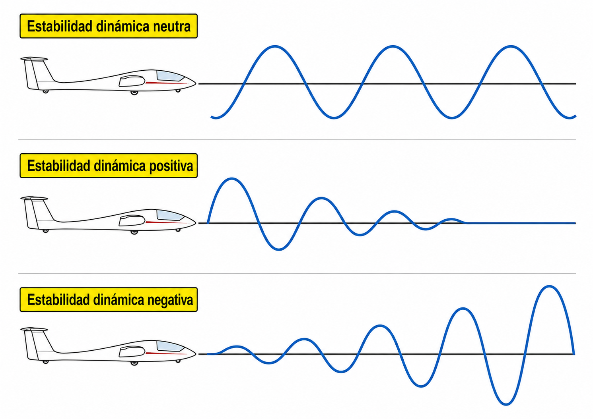
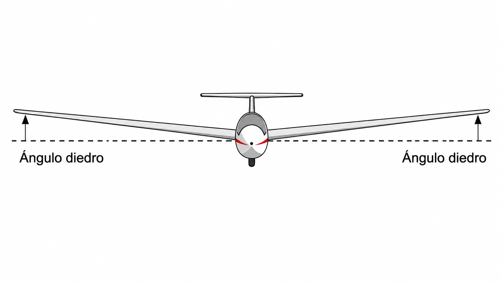
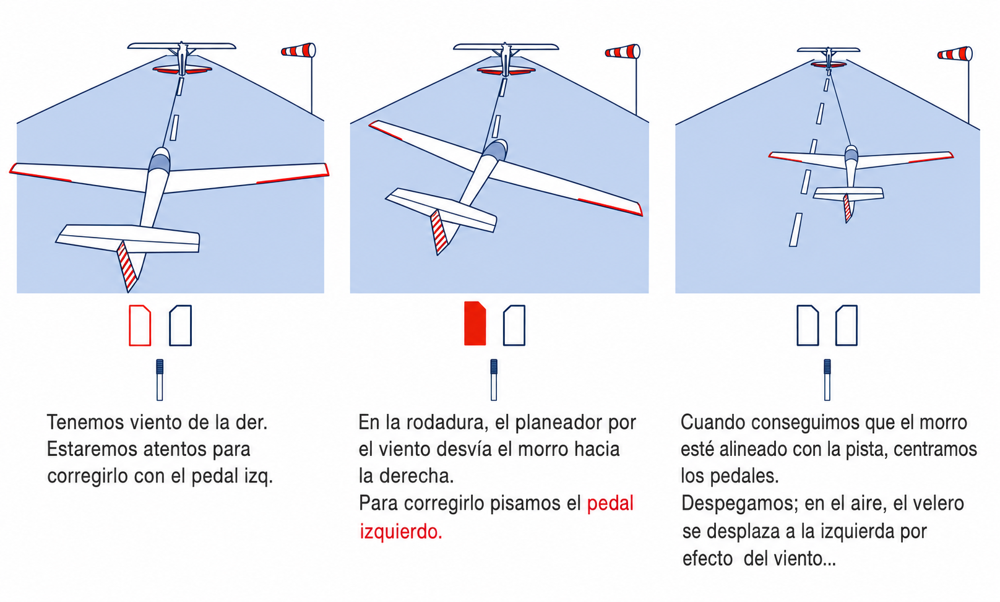

# Stability

> A well-designed sailplane wants to return to equilibrium when something disturbs it. In this chapter you will learn what makes a sailplane stable longitudinally, laterally and directionally, why the position of the centre of gravity is the most critical parameter to check before every flight, and how the dihedral angle and the fin work together to keep you level and straight without effort.

## Static stability

An aircraft's stability is its inherent ability to return to equilibrium after an atmospheric disturbance. When a gust knocks the sailplane out of its level attitude, the machine's immediate response, with no input from the pilot, is its **static stability**.

Depending on its design, the sailplane's behaviour falls into one of three types:

* **Positive static stability:** after a disturbance, the sailplane tends to return to its original position by itself. It is the basic design condition for safety in civil aircraft.
* **Neutral static stability:** the aircraft makes no attempt to correct the disturbance, but it does not amplify it either. If a gust raises the nose by 5 degrees, the sailplane stays in that new attitude, neither returning to the previous one nor pitching up further.
* **Negative static stability (instability):** the aircraft tends to move further and further away from its original equilibrium position. It is a dangerous condition: a small nose-up disturbance would make the sailplane keep pitching up, faster and faster.

::: {.callout-note title="Airmanship"}
Training sailplanes are usually designed with very strong positive static stability, to make learning easier and to forgive the student's mistakes. However, this makes them “heavier” or more sluggish on the controls. High-performance competition and aerobatic sailplanes reduce this stability to gain agility and immediate response.
:::

## Dynamic stability

Static stability describes only the aircraft's **initial reaction**: whether it tends to return or to move away. **Dynamic stability** describes what happens next, as the sailplane starts to oscillate while it tries to return to equilibrium.

Depending on how those oscillations develop over time, the behaviour falls into one of three types (@fig-05-cap03-estabilidad-dinamica):

* **Damped (positive):** the oscillations get progressively smaller until the sailplane regains its original attitude. This is the desired design condition.
* **Neutral:** the oscillations keep the same amplitude, neither growing nor shrinking. The sailplane never returns exactly to equilibrium, but it does not get worse either.
* **Divergent (negative):** the oscillations grow in amplitude with each cycle. A small disturbance turns into an ever-larger motion until control is lost.

{#fig-05-cap03-estabilidad-dinamica}

Two oscillation modes deserve special attention in a sailplane:

* **Phugoid mode:** a slow, long-period longitudinal oscillation (typically 30–60 seconds). The sailplane rises and falls, trading height for speed in gentle cycles. Its damping is weak, but the cycle is so slow that your usual small stick movements correct it without your noticing. It only shows up if you let go of the controls for a good while.
* **Spiral instability:** a lateral dynamic instability. Most sailplanes are statically stable in roll, but dynamically they tend towards a slight **spiral divergence**: if left alone with a small angle of bank, the bank slowly increases until it becomes a descending spiral. That is why the pilot must always watch the lateral attitude, especially in cloud or when visual references to the horizon are lost.

::: {.callout-warning title="Safety"}
Spiral instability lies behind most loss-of-control incidents in reduced visibility. A sailplane left alone with five degrees of bank can, within minutes, develop a fatal descending spiral. Never fly without visual references to the real horizon.
:::

## Longitudinal stability: the role of the CG

Longitudinal stability governs pitch. The parameter that determines it is the position of the centre of gravity (CG) relative to the centre of pressure (CP).

For the sailplane to be stable in pitch, the **CG must lie ahead of the CP** in normal flight conditions. That arrangement creates a natural nose-down moment. To balance it, the horizontal stabiliser produces a downward force that keeps the sailplane level.

* **CG too far forward:** stability increases, but the sailplane becomes excessively nose-heavy and hard to manoeuvre, especially on take-off and landing. L/D falls because of the extra drag from the tail as it balances the heavy nose.
* **CG too far aft:** this is the critical, dangerous condition. If the CG is behind the permitted limits, the sailplane becomes unstable: after any disturbance the nose tends to rise uncontrollably. Worse still: if the stall develops into a spin, the aft CG tends to flatten it, and a flat spin leaves the controls without the authority to stop it.

::: {.callout-important title="Regulation"}
Regulation (EU) 2018/1976, Part-SAO, point SAO.GEN.130(d)(4), requires the pilot-in-command to “only commence a flight if he or she is satisfied that […] the mass of the sailplane and the centre of gravity location are such that the flight can be conducted within the limits defined by the aircraft flight manual (AFM)”.
:::

## Lateral stability: the dihedral effect

Lateral stability is the sailplane's tendency to level its wings after a disturbance that causes an unwanted roll. The main design feature that achieves this is the **dihedral angle**.

Dihedral is the upward angle of the wings relative to the horizontal, which gives the sailplane, seen from the front, the shape of a very open “V” (@fig-05-cap03-efecto-diedro).

When a gust drops one wing (the left, say), the sailplane starts to slip sideways towards that side. Because of the dihedral angle, the lower wing meets the airflow at a greater effective angle of attack than the rising wing. This produces extra lift on the lower wing, which pushes the sailplane back to a level position automatically.

{#fig-05-cap03-efecto-diedro}

## Directional stability: weathercock stability

Directional stability keeps the sailplane flying aligned with the relative airflow and prevents **sideslip**: the air arriving from the side rather than head-on. It is provided by the vertical stabiliser, or fin.

The fin works exactly like a weathervane. Because it sits a long way behind the centre of gravity, any unwanted yaw exposes the side of the tail to the relative airflow. The air pressure on the fin produces a force that pushes the tail back, automatically aligning the sailplane's nose with its direction of travel (@fig-05-cap03-efecto-veleta).

{#fig-05-cap03-efecto-veleta}

::: {.postit}
**Chapter summary: stability**

* **Static stability**: the initial tendency. If you let go of the controls after a bump and the aircraft tends to return to its original position, it is stable. If it tends to move further away (divergence), it is unstable and dangerous.
* **Dynamic stability**: describes what happens **after** the initial reaction. Do the oscillations die away (good), stay the same (neutral) or grow (dangerous)? The phugoid mode is a slow, harmless longitudinal oscillation. **Spiral instability** (slow lateral divergence) is the one that matters most: if you let go of the controls with a little bank, the spiral grows by itself.
* **The CG is king**: the position of the centre of gravity determines longitudinal stability. CG forward = very stable but “heavy”. CG aft = very sensitive and unstable (risk of an unrecoverable flat spin).
* **Lateral stability (dihedral)**: the “V” shape of the wings helps the aircraft level itself. If a wing drops, the dihedral gives it a greater effective angle of attack and it rises.
* **Directional stability**: the fin (vertical tail) acts like a weathervane, keeping the nose pointing into the relative airflow and preventing **sideslip**, whether a slip or a skid.
:::
