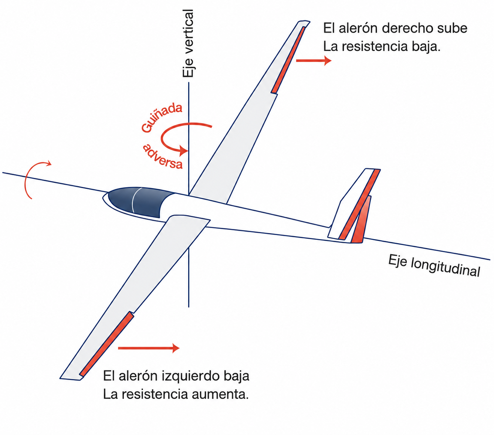
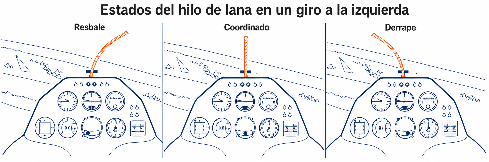

# Control

> A sailplane's controls are much more than a stick and pedals: they are the channel
> of communication between pilot and aircraft. In this chapter you will learn to
> understand adverse yaw and how to counter it by coordinating hand and foot, why the
> trim is an essential flying tool and not just a rest for your arm, and what the
> controls are telling you through how firm or soft they feel.

## Adverse yaw: the price of roll

In sailplanes, adverse yaw is a very pronounced aerodynamic side effect of trying to turn with the ailerons, because of the long wingspan.

When you move the stick sideways to start a turn, the aileron on the outer wing goes down to increase lift and raise that side. The problem is that, in creating more lift, it also generates a large amount of **induced drag**. That drag holds back the rising wing and pulls it backwards, yawing the sailplane's nose away from the intended turn (@fig-05-cap04-guinada-adversa).

{#fig-05-cap04-guinada-adversa}

::: {.callout-tip title="Golden rule"}
The answer to adverse yaw is **hand and foot coordination**. Apply stick and rudder pedal to the same side at the same time. The rudder counters the sudden braking of the outer wing and makes the nose follow the turn smoothly without skidding.
:::

## Differential aileron

To reduce adverse yaw mechanically, sailplanes use **differential aileron**.

The linkage is set up so that the up-going aileron (on the inner wing of the turn) moves through a larger angle than the down-going aileron (on the outer wing). By raising the inner aileron further, extra parasite drag is deliberately created on that side, which helps to offset the induced drag of the outer wing. Although this design markedly reduces the tendency of the nose to swing out of the turn, it does not remove it completely; the pilot must still always use the rudder (pedal) to keep the turn coordinated.

## The yaw string: your coordination indicator

Stuck to the middle of the canopy of almost every sailplane is a short piece of wool or thin tape: the **yaw string**. It is the most direct indicator there is, more reliable even than the slip ball.

String straight: coordinated flight. When it moves off centre, the string swings to the same side the nose is pointing relative to the flight path: string to the left, nose to the left of the relative airflow. What that means depends on the direction of the turn. String blown towards the inside of the turn: a **skid**, you have too much inside rudder. String towards the outside: a **slip**, you need more rudder. The correction is always the same: press the pedal on the side opposite the string, never the stick.

The skid is the one to avoid: the inner wing is flying more slowly and can reach the critical angle of attack without warning, starting an asymmetric stall. The slip looks more dramatic (the fuselage causes more drag and the turn is inefficient), but it is rarely dangerous in itself. @fig-05-cap04-hilo-lana-estados sums up the three states of the string and how to read them.

{#fig-05-cap04-hilo-lana-estados}

::: {.callout-tip title="Golden rule"}
Fly with the string straight. If it moves, correct it with the pedal. And if the string is off centre and the controls feel soft at the same time, act: you are about to stall.
:::

## Trim

The trim is not just relief for your arm. It is, in fact, an aerodynamic control: it balances the forces on the tail and lets the sailplane hold a constant nose attitude and speed by itself, without you having to push or pull.

::: {.callout-note title="Airmanship"}
Get used to trimming all the time. After changing the flight regime (for example, from thermalling at low speed to flying straight at a higher speed), first set the new attitude with the stick and then adjust the trim until you feel no force in your hand.
:::

## Control effectiveness

The controls give you vital information about the sailplane's speed through the way they resist your hand.

When you fly fast, the airflow strikes the control surfaces hard. The controls will feel **firm** and very responsive.

However, as you slow down towards the stall, the airflow weakens. The controls lose effectiveness and become soft, or **“mushy”**. That lack of response is a direct physical warning that you are flying too slowly and close to the limit of lift.

::: {.postit}
**Chapter summary: control**

* **Adverse yaw**: the most annoying side effect in long-span sailplanes. When you roll to turn, the rising wing has more drag and holds that side back, swinging the nose the **wrong way**. **Antidote**: hand and foot together (coordination).
* **Yaw string**: coordination indicator on the canopy. Straight = coordinated flight. String towards the inside of the turn = **skid**; towards the outside = **slip**. The skid is the dangerous one: the inner wing can enter an asymmetric stall. Correct it by pressing the pedal on the side opposite the string.
* **Trim**: not just for resting your arm. It is essential for holding a constant speed without effort. Retrim every time you change flight regime (from thermalling to a fast glide).
* **Control effectiveness**: the controls “talk”. If they are firm, you are fast. If they are soft and “mushy”, you are close to the stall. Listen to what they tell you through your hand.
* **Differential aileron**: an aileron design that reduces adverse yaw (the up-going aileron moves further than the down-going one), but you will still need your feet.
:::
