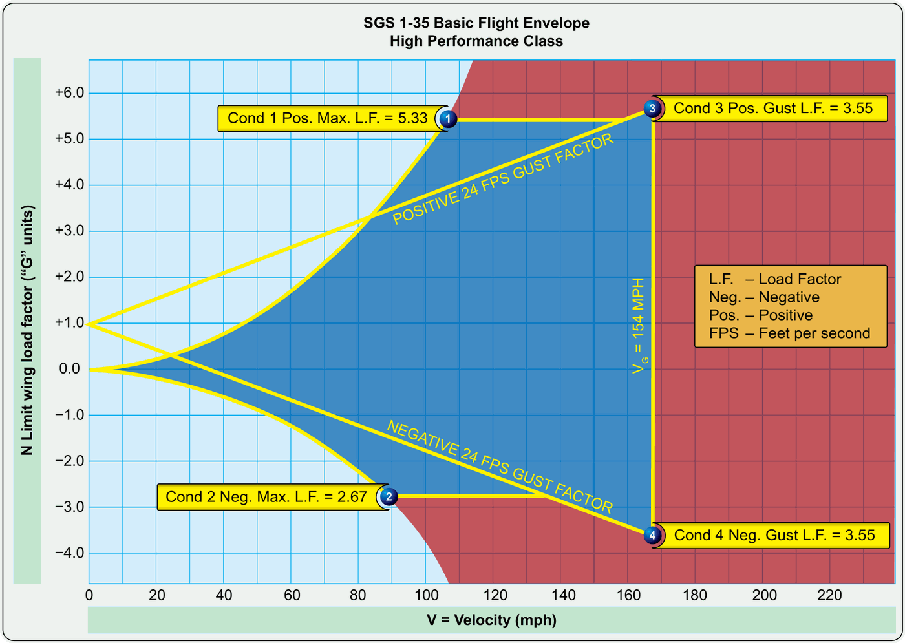

# Limitations (load factor and manoeuvres)

> Every sailplane has structural limits that must not be crossed: cross them and the
> aircraft can be destroyed in seconds. In this chapter you will learn to read the V-n
> diagram and why the manoeuvring speed protects the structure in turbulence. You will
> also see what the red line on the airspeed indicator means and why load factor raises
> the stall speed in turns.

## The V-n diagram: your survival map

The V-n diagram, also known as the flight envelope, is a graph of your sailplane's structural limits. It relates the speed at which you are flying (V) to the load factor in g (n) that the structure is bearing (@fig-05-cap05-diagrama-vn).

The diagram marks out the area of safe operation. As long as you stay within its limits, the structure will hold. If you go beyond them (through too much g or too much speed), the sailplane will suffer permanent deformation or structural failure.

Under CS-22, Utility (U) category sailplanes are designed to withstand from +5.3g to −2.65g at the manoeuvring speed (V~A~); both limits narrow as speed increases, down to +4.0g and −1.5g at the design diving speed (V~D~). Aerobatic (A) category sailplanes withstand from +7.0g to −5.0g. These load factors are valid only if the speed limitations are respected.

{#fig-05-cap05-diagrama-vn}

## Manoeuvring speed (V~A~)

The manoeuvring speed (V~A~) is the maximum speed at which you can apply full control deflections without causing structural damage.

If you are flying at or below V~A~ and apply an abrupt control deflection, the sailplane will simply **stall** before it generates enough g to exceed its structural load limit. The wing will stop flying and shed the load, protecting the sailplane.
However, if you are flying faster than V~A~ and make an abrupt movement, the sailplane will not stall in time. Instead it pulls an extreme g-force, more than the structure can take, and the structure breaks.

V~A~ is a structural limit, not a marking on the airspeed indicator. The marking you see on the dial is **V~RA~**, the **rough air speed**: the green arc ends and the yellow arc begins there, in accordance with CS 22.1545. In many sailplanes V~A~ and V~RA~ are almost the same, but certification distinguishes them, and so should you: V~A~ protects you against full deflection of a control; V~RA~, against the gusts of turbulent air; and V~NE~ is the absolute limit where the yellow arc ends at the red line.

::: {.callout-tip title="Golden rule"}
In strong turbulence, reduce speed below V~A~ straight away to protect the structure. Your visual reference is on the airspeed indicator: stay in the green arc, which ends at V~RA~ (rough air speed). The yellow arc, from V~RA~ to V~NE~, is for smooth air only.
:::

::: {.callout-warning title="Safety"}
V~A~ **does not protect you against simultaneous inputs on more than one axis**. The certification requirements cover full deflection of a single control at a time. If you apply full elevator and full rudder **at the same time** (even below V~A~), you can generate a structural load that exceeds the design limit. In turbulence, keep your control inputs smooth and avoid abrupt movements on several axes at once.
:::

## The red line: never exceed speed (V~NE~)

The red line on the airspeed indicator marks V~NE~ (never exceed speed). It is an absolute limit that you never cross, mainly because of the risk of **flutter**.

Flutter is an aeroelastic vibration of the wings or control surfaces which, if it occurs, can break the sailplane apart within seconds.

::: {.callout-warning title="Safety"}
V~NE~ decreases with altitude: in thinner air, the true airspeed (TAS), on which flutter depends, increases relative to the indicated airspeed (IAS) you read on the airspeed indicator. Check the table of V~NE~ corrections for altitude in the cockpit. This effect is critical in wave flying, where great heights are reached; its link with wave meteorology is covered in **Book 3 — Meteorology**.
:::

::: {.callout-note title="Airmanship"}
Close to V~NE~, limit control deflections to about **one third** of their full travel. At that speed the dynamic pressure is so high that a full deflection produces loads that can exceed the structural envelope even without turbulence. Do not use V~NE~ as a cruising speed: it is an absolute emergency limit, not a normal operating speed.
:::

## The load factor trap and the stall

In straight and level flight, the load factor is 1g. When you bank into a turn, centrifugal force adds to gravity and the load factor rises. In a steep 60° turn, the sailplane experiences 2g: the structure bears twice its normal weight.

::: {.callout-warning title="Safety"}
The stall speed increases with load factor. In a 60° turn (2g), the stall speed **rises by 41%**. A sailplane that stalls at 70 km/h in level flight will stall at almost 100 km/h in that steep turn. Harsh use of the controls in this situation can lead to a critical stall.
:::

::: {.postit}
**Chapter summary: limitations and manoeuvres**

* **V-n diagram**: the safety map of your structure. It shows the g you can take at each speed. Leaving the “box” means breaking the sailplane. CS-22 limits: category U +5.3g / −2.65g at V~A~, narrowing to +4.0g / −1.5g at V~D~; category A +7.0g / −5.0g.
* **Manoeuvring speed (V~A~)**: the “safe” speed for turbulence or for single harsh control inputs. Below V~A~, the sailplane will stall before it breaks. Above it, an abrupt deflection can damage the structure. But careful: V~A~ does not protect against simultaneous inputs on more than one axis. In strong turbulence, stay in the green arc of the airspeed indicator.
* **Airspeed indicator markings (CS 22.1545)**: the green arc ends at **V~RA~** (rough air speed), where the yellow arc begins, ending at the red line of V~NE~. V~A~ is a structural limit and is **not** marked on the airspeed indicator, although in many sailplanes its value is close to that of V~RA~.
* **V~NE~ (never exceed speed)**: the absolute speed limit (CS 22.1505), marked by the **red line** on the airspeed indicator. It is not a recommendation; it is a physical limit. Going beyond it invites **flutter** (aeroelastic vibration), which can break the sailplane apart in seconds. Close to V~NE~, limit control deflections to one third of their travel.
* **Load factor and the stall**: g “fattens” the sailplane. In a 60° turn (2g), the stall speed rises by 41%.
:::
