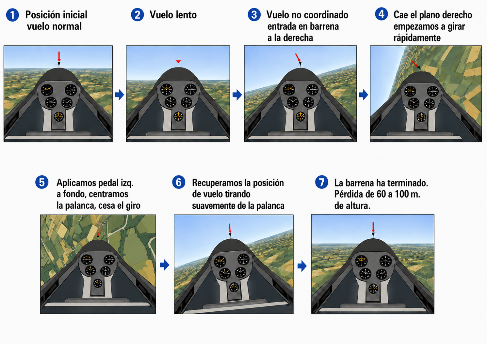

# Stalling and spinning

> The stall and the spin are the situations new pilots fear most and the ones practised most in training. In this chapter you will learn to recognise the symptoms that warn you before the stall arrives, to carry out the recovery correctly (even though it goes against instinct) and to tell a clean stall from autorotation so that you apply the right technique in each case.

## The stall

A stall occurs when the sailplane's wing exceeds its **critical angle of attack** (roughly between 15° and 18°). At that critical angle to the relative airflow, the air can no longer follow the curve of the upper surface of the wing and breaks away turbulently, causing a massive loss of lift and a large increase in drag.

Learn to read these symptoms: the sailplane warns you before the stall arrives.

* An unusually high nose attitude relative to the horizon.
* Very low speed on the airspeed indicator.
* Flying controls that feel excessively soft, spongy and ineffective.
* No normal sound of air flowing past the cockpit.
* Structural vibration known as “buffet”, caused by turbulent air striking the fuselage and tail.

The stall does not arrive all at once across the whole span: it starts at the **wing root** (where the wing joins the fuselage) and spreads towards the tips. This is by design: the wing has a greater angle of incidence at the root than at the tips, so the root stalls first. The ailerons, out at the tips, keep some authority for the first few moments: it is a design margin that lets you keep the wings level while the stall gives its warning. But if a wing does drop, do not try to raise it with aileron; hold it up with rudder, as you will see below.

## Stall recovery

The instinctive reaction to the drop is to pull back on the stick. In flying, that makes things worse. The only way out is to reduce the angle of attack.

Move the stick **forward** to the centre: the nose drops, the angle of attack decreases and the air reattaches to the upper surface. The sailplane gains speed, pulled along by gravity. Once you have regained a safe speed (the process typically uses between 30 and 50 metres of height), ease back on the stick to level off.

::: {.callout-note title="Airmanship"}
During a stall recovery, always keep the stick strictly centred laterally (no aileron). Instinctively trying to raise a dropped wing with aileron will make things worse: the down-going aileron increases the local angle of attack of that dropped wing, deepening its stall and violently starting the feared autorotation, or spin. Always use opposite rudder, and only rudder, to stop the yaw and hold the wings up.
:::

## The accelerated stall: the danger in the turn

The stall speed given in the Flight Manual is for straight and level flight at 1g. Whenever the load factor rises, that speed rises with it, in proportion to the square root of the load factor. In a 60° turn (2g), the stall speed increases by 41%. A sailplane that stalls at 70 km/h in a straight line will stall at almost 100 km/h in that turn. Nobody expects to stall at 100 km/h.

This **accelerated stall** is treacherous because the nose does not have to be particularly high. With an apparently normal nose attitude, pulling back on the stick in a steep turn can take the wing past the critical angle of attack without the pilot noticing until the wing lets go.

::: {.callout-warning title="Safety"}
The statistically deadliest scenario: the **base-to-final** turn in the circuit, below 150 metres. The pilot uses rudder to line up with final, the nose swings to one side, the pilot compensates by pulling back on the stick… and the sailplane enters an asymmetric stall with no room to recover. Flying the circuit coordinated and with a speed margin is not a technical nicety: it is what separates a normal landing from an accident.
:::

## The spin: an aggravated, asymmetric stall

The spin (also called autorotation) is an extreme flight condition that results from an **asymmetric stall**: one wing stalls more deeply than the other.

It is usually triggered in turbulent air or when the pilot is flying uncoordinated (with too much rudder or with crossed controls) close to the minimum flying speed. The inner wing of the turn, already flying more slowly, stalls completely and drops sharply. As it drops, its angle of attack increases further and locks it in the stall, while the outer wing is still partly flying. That imbalance couples yaw and roll into a very fast rotation and a steep descent: up to 100 metres lost on each turn of about 4 seconds.

### The three phases of the spin

You need to know the three phases, because acting in the first costs much less height than acting in the third:

* **Incipient phase:** the spin is starting. The forces have not yet settled and the rotation is not yet steady. Recovering here (before the first full turn) costs much less height.
* **Developed phase:** the rotation settles: rate of rotation, airspeed and rate of descent stabilise. The motion becomes regular. From here on, getting out can take one or more extra turns.
* **Recovery phase:** from the moment you apply rudder until the rotation stops. It can last from a quarter of a turn to several turns, depending on the sailplane. Each turn costs between 50 and 100 metres.

## Spin recovery

Getting out of a spin needs a methodical, counter-intuitive technique learned by heart. Always check the Aircraft Flight Manual (AFM) for your particular sailplane; the classic, universal sequence is:

1. **Full opposite rudder:** identify the direction of rotation and firmly apply the opposite pedal all the way (if you are turning right, full left rudder). This stops the yaw that feeds the rotation.
2. **Stick central and forward:** centre the ailerons (laterally neutral) and move the stick forward to reduce the angle of attack and break the deep stall on both wings equally.
3. **Recovery from the dive:** as soon as the rotation stops, **centralise the rudder** before pulling back on the stick. If you keep opposite rudder applied while pulling out of the dive, the resulting yaw can start a rotation in the opposite direction. Once the rudder is central, pull back **gradually** to ease out of the dive: an abrupt pull-out can overstress the structure or cause a second stall.

{#fig-05-cap06-recuperacion-barrena}

::: {.postit}
**Chapter summary: stalling and spinning**

* **Stall**: the wing “gives up” when it exceeds the critical angle of attack (≈ 15–18°). The stall starts at the wing root and spreads towards the tips: that is why the ailerons keep some authority at first. Warnings: high nose, soft controls and buffet; when the wing lets go, the nose drops.
* **Accelerated stall**: in a steep turn (60° → 2g), the stall speed rises by 41%. The wing can stall with the nose in an apparently normal attitude. The **base-to-final** turn in the circuit is the deadliest scenario.
* **Stall recovery**: stick forward (lower the nose) is the only cure. Do not use aileron to raise a dropped wing: it deepens the stall and starts a spin.
* **Spin (autorotation)**: an aggravated, asymmetric stall with three phases: **incipient** (recoverable within one turn), **developed** (steady motion) and **recovery** (the rotation stops). Each turn costs 50–100 m of height.
* **Spin recovery**: always check your sailplane's AFM. The standard sequence: 1. full rudder against the rotation; 2. stick central and forward; 3. when the rotation stops, **centralise the rudder** and then ease out of the dive smoothly.
:::
