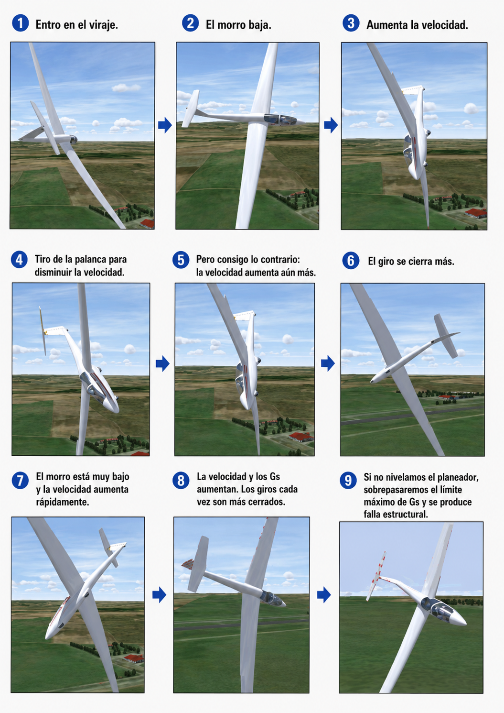

# Spiral dive

> The spiral dive deceives the pilot's instinct: it seems that you should pull back on the stick, but that reaction can be fatal. In this chapter you will learn to tell it apart from a spin, to understand why trying to raise the nose without first levelling the wings makes things worse, and to carry out the correct recovery sequence (level the wings, ease out of the dive and control the speed) as a set procedure with no room for error.

## Critical differences: it is not a spin

It is vital not to confuse a spiral dive (or descending spiral) with a spin.

In a spin, the sailplane is in an asymmetric stall, it falls vertically while yawing and its airspeed is low and constant. In a spiral dive, by contrast, **the sailplane is flying**; neither wing is stalled. The sailplane follows an ever-steeper descending curved path in which both the speed and the load factor (g-forces) increase steadily and rapidly.

Applying the spin recovery technique (full opposite rudder) in a spiral dive is a very serious mistake that can overstress the tail and rudder at those high speeds.

The quickest and most reliable diagnostic tool is the **airspeed indicator** (@fig-05-cap07-espiral-vs-barrena):

* **Speed high or increasing** → spiral dive. The sailplane is flying and accelerating.
* **Speed low and constant, around the stall speed or even lower** → spin. The wing is stalled and the speed cannot increase.

{#fig-05-cap07-espiral-vs-barrena}

## The deadly danger of instinct

The descending spiral has earned the nickname “graveyard spiral” in general aviation for good reason: it deceives the survival instinct of a disoriented pilot.

When the pilot sees the nose pointing down and the speed shooting up, the immediate instinct is to pull back on the stick to climb. In a spiral dive, however, the sailplane is steeply banked. If you pull back on the stick **without first levelling the wings**, the effect is catastrophic: because the sailplane is on its side, the elevator pulls it towards the centre of the turn, tightening the radius even more. The spiral tightens, the speed builds and the g-forces increase until they exceed the design limit and break the structure.

::: {.callout-warning title="Safety"}
Never pull back on the control column to try to stop a dive while the sailplane's wings are banked.
:::

## The typical cause: loss of visual reference

The classic situation that sets off a spiral dive is the accidental loss of the external visual references needed for flight in VMC, such as flying unintentionally into the base of a cloud while turning in a strong thermal.

Once the visual horizon is lost, the inner ear quickly becomes disoriented. The sailplane, which is not usually spirally stable (it tends to increase its bank angle gradually if the controls are left free in a turn), will start to bank further and lower its nose progressively. The disoriented pilot does not notice until the loud aerodynamic noise and the rising speed on the airspeed indicator reveal that the sailplane is falling faster and faster.

## Recovery procedure

Recovery from a spiral dive must be carried out as a set procedure, actively fighting the instinct to pull back on the stick at first:

1. **Level the wings:** this comes first, because the bank is what sustains and tightens the spiral. Apply stick and rudder firmly against the turn until the wings are completely level with your reference or on the instruments.
2. **Recover from the dive:** only when the wings are at 0° of bank, pull back on the stick firmly but smoothly to raise the nose. Do it progressively, taking care not to pull excessive g as you come out of the dive.
3. **Control the speed:** if the speed approaches V~NE~ (never exceed speed), extend the airbrakes to check the acceleration; but do so smoothly, because at high speed and with a high load factor an abrupt extension adds load to the structure.

::: {.postit}
**Chapter summary: spiral dive**

* **Quick diagnosis: look at the airspeed indicator**: speed high or increasing = spiral dive (the sailplane is flying and accelerating). Speed low and constant = spin (the wing is stalled and cannot accelerate). Do not confuse them: the techniques are opposite.
* **The danger of instinct**: if you pull back on the stick to raise the nose without first levelling the wings, you only tighten the spiral and increase the g until the structure fails.
* **How to get out**: 1. level the wings (aileron and rudder coordinated against the turn); this comes first, because the bank sustains the spiral; 2. ease out of the dive; 3. if the speed is approaching V~NE~, slow down with the airbrakes (smoothly).
* **Typical cause**: loss of visual reference (cloud, night) and distraction. The sailplane has spiral instability; if you leave it alone with a little bank, the spiral grows by itself.
:::
