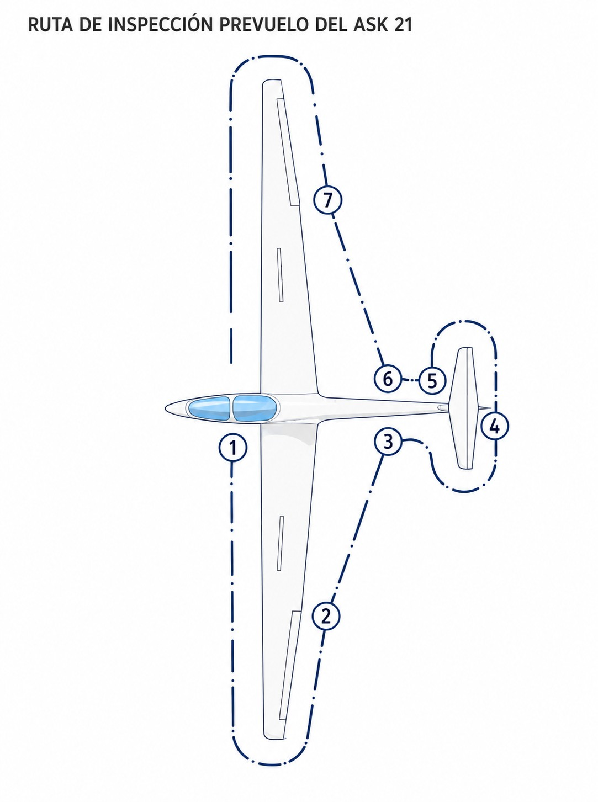
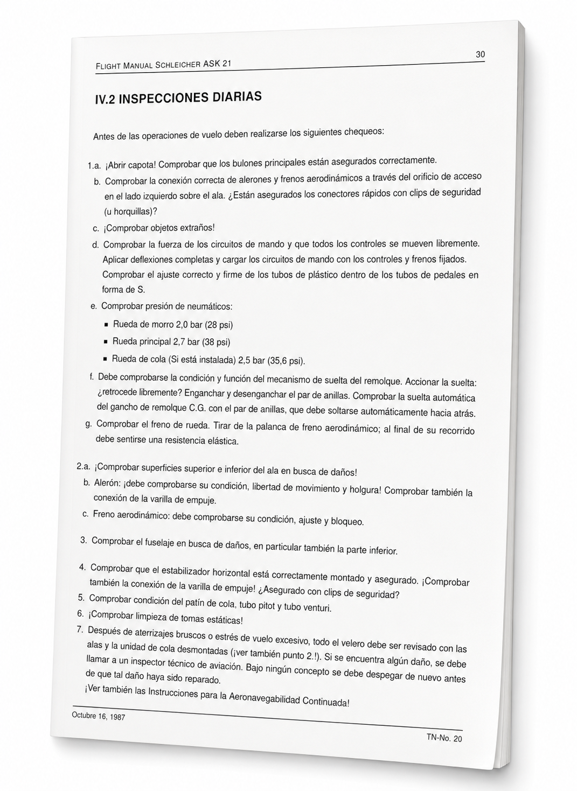

# General requirements

> Before take-off, the sailplane pilot has to meet legal and safety requirements that are not mere red tape: they are the first line of defence against an accident. Know which documents go on board, what the pilot-in-command answers for and when you may carry passengers. That knowledge protects you, other people and your licence.
>
>
> In this chapter you will learn:
>
>
> * **The mandatory documents**: what must be in the cockpit and what can stay at the aerodrome.
> * **The aircraft documents (SAO.GEN.155)**: what must be in order before every flight.
> * **The responsibilities of the PIC**: from the pre-flight inspection to the final decision not to fly.
> * **The IMSAFE check**: the self-assessment tool that can save your life.
> * **The requirements for carrying passengers**: experience, recency and a check flight.

## Mandatory documents

To operate a sailplane legally and safely, both the aircraft and the pilot must be in order before you go out to the runway. Two regulations share the task: **Part-SFCL** (SFCL.045) sets out the pilot's documents, and **Part-SAO** (SAO.GEN.155) those of the aircraft. Both allow the documents to be left at the aerodrome when the flight stays within sight of it or within an area set by the competent authority.

Do not confuse “nothing happened” with “it was all right”. Flying without the correct documents turns any minor incident into a major legal problem.

### Documents to be carried on board

Unless you fly within sight of the aerodrome or in an area authorised by the authority, the following documents must go with you in the cockpit:

* **Pilot's licence (SPL (Sailplane Pilot Licence)):** the original, and valid. A photocopy has no legal value.
* **Medical certificate:** class 1, class 2 or LAPL as appropriate, always valid.
* **Identification document:** national identity card (DNI), passport or official document with a photograph.
* **Flight manual (AFM):** the manual specific to the sailplane model you are flying.
* **Aeronautical charts:** current and suitable for the intended route.
* **Logbook:** enough data (or the logbook itself) to show that you meet the requirements of the regulations, including recent experience.
* **Interception signals:** a copy of the international procedures and visual signals for interception (SERA.11015; the signals and the correct response are covered in **Book 4 — Communications**, chapter 6).

The rest of the aircraft's papers (certificate of registration, certificate of airworthiness with its annexes, ARC, radio licence if radio equipment is fitted, insurance certificate and journey log) do not need to fly with you. SAO.GEN.155 requires them to be available at the aerodrome or operating site.

::: {.callout-tip title="Golden rule"}
Before every flight, check the four pillars of the aircraft. Three are documents, and **SAO.GEN.155** lists them: **airworthiness** (certificate of airworthiness + valid ARC), **registration** (certificate of registration) and **flight manual** (AFM on board). The fourth is not a paper but a check that **SAO.GEN.130(d)(4)** requires of you as pilot-in-command: **mass and balance** within the limits of the manual. If any of them fails, the sailplane does not fly.
:::

## Responsibility of the pilot-in-command (PIC)

The **pilot-in-command** (PIC) is the highest authority on board and has final responsibility for the safety of the operation, from the moment they sign the flight authorisation until the sailplane is properly secured on the ground. This responsibility is not shared, not delegated and has no exceptions.

That means that even if the club's engineer has checked the sailplane, the instructor has authorised your flight and the weather forecast is good, **the final decision is always yours**. If something does not add up, the only correct answer is not to fly.

Its main duties include:

1. **Pre-flight inspection:** checking that the sailplane has been inspected in accordance with the AFM and is fit to fly. Do not sign for the inspection if you have not done it yourself or if there is anything you do not understand.
2. **Loading and balance:** making sure that the total mass and the position of the centre of gravity (CG) are within the permitted limits. A CG out of range can make the sailplane unrecoverable from a stall.
3. **Safety briefing:** briefing passengers on the use of harnesses, parachutes (if applicable), emergency exits and behaviour in the cockpit.
4. **Fitness to fly:** not flying if any physical or mental impairment is suspected, however slight.

### The IMSAFE check

Before you get into the cockpit, be honest with yourself. It is not a formality: it is the first, and most important, check of the day.

* **I** (**Illness**): Do I have any illness or symptom, however mild? A cold can stop the pressure in the middle ear from equalising, especially as you descend.
* **M** (**Medication**): Have I taken any medicines that could affect my reflexes, vision or alertness?
* **S** (**Stress**): Am I under excessive personal or professional pressure that takes up part of my attention?
* **A** (**Alcohol**): Have I drunk alcohol in the last 8 hours? That is the minimum set by EASA's acceptable means of compliance; the FAA recommends leaving 12 to 24 hours, because even one drink the night before can affect cognitive performance.
* **F** (**Fatigue**): Have I had enough rest? Fatigue is one of the most frequent, and most underestimated, factors in accidents.
* **E** (**Emotion / Eating**): Am I emotionally stable? Have I eaten, and am I properly hydrated?

A single unfavourable answer on any of these points is reason enough not to fly that day. There is no such thing as a flight “to switch off” when the pilot is not one hundred per cent.

::: {.callout-note title="Airmanship"}
Do the **IMSAFE** check out loud or in writing before you leave home. The atmosphere at the airfield (the group's enthusiasm, the good weather, social pressure) can lead you to play down symptoms that would seem obvious at home. Deciding calmly, before you get to the airfield, is always easier than saying “no” in front of your friends when the tug is already waiting.
:::

## Carriage of passengers

Taking someone up in your sailplane adds a real responsibility. It is not just a matter of technique: it is the safety of someone who has put their trust in you and who probably would not know what to do if you were incapacitated.

To exercise this privilege, **Part-SFCL** requires the pilot to meet strict recent-experience requirements:

* **Licence:** you must hold the SPL (Sailplane Pilot Licence) (not be a student pilot in training), with all privileges valid.
* **Experience:** at least **10 hours of flight time or 30 launches** as PIC after the issue of the licence.
* **Recency:** at least **3 launches as PIC in the last 90 days** before you may carry passengers.
* **Check flight:** a training flight in which you demonstrate to an FI(S) the competence required to carry passengers (unless you hold an FI(S) certificate).

::: {.callout-warning title="Safety"}
As PIC you have the right and the duty to refuse carriage of any passenger or baggage that you consider may be a hazard to the safety of the flight. That decision is not open to outside pressure. If the mass of the passenger plus equipment exceeds the aircraft's limits, or if the passenger behaves in a way that may compromise your concentration, the answer is a firm “no”, with no negotiation.
:::

::: {.callout-important title="Regulation"}
Under Regulation (EU) 2018/1976, an SPL (Sailplane Pilot Licence) holder may carry passengers only if two conditions are met. First, after the issue of the licence, they have completed at least 10 hours of flight time or 30 launches or take-offs and landings as PIC on sailplanes, plus one training flight demonstrating their competence to an FI(S) (SFCL.115(a)(2)). Second, in the preceding 90 days, they have carried out at least 3 launches as PIC in sailplanes (in TMGs, 3 take-offs and landings) (SFCL.160(e)).
:::

## Ground operations and preparation

Safety, and the care of the aircraft, begin long before take-off, with careful preparation and handling on the ground. Because of their long spans, light structures and removable control surfaces, sailplanes are especially vulnerable to wind, collisions on the ground and carelessness during rigging.

### Rigging and storage

Rigging and de-rigging the sailplane are routine operations at the airfield that call for method and concentration:

* **Avoid distractions:** interruptions during rigging are the number one cause of unsecured pins and unconnected controls. If you are interrupted, stop and start the rigging checklist again from the first step.
* **Tool inventory:** use dedicated trays or boards for the bolts, pins and rigging tools. When you have finished, do a strict inventory: a screwdriver or pin left inside the wing or fuselage structure can jam the controls in flight.
* **Care when taping joints:** using plastic adhesive tape to seal the joints (such as the wing roots or the *turtle deck*) reduces drag and prevents turbulence. Make sure the ends of the tape are well stuck down and do not interfere with the free movement of the ailerons or airbrakes.

### Positive control check (PCC)

After every rigging of the aircraft, a **positive control check** (PCC) is mandatory and vital:

1. The pilot sits in the cockpit and holds the flying controls firmly.
2. A helper on the ground physically holds each control surface in turn (an aileron, the elevator, the rudder and the airbrakes) and resists its movement.
3. The pilot tries to move the stick and the pedals. If a control moves in the cockpit while the surface outside is held by the helper, the connection is not sound and the sailplane is **not airworthy**.

### Road transport (trailering)

Carrying the sailplane in its trailer requires the parts to fit precisely and firmly:

* **Avoid chafing:** the wings and fuselage must rest on padded cradles made for the model, firmly secured so that road vibration does not wear the composite or the control surfaces.
* **Closing the trailer:** secure the trailer's catches and check that its lights and brakes work properly before setting off on the road.

### Tying down and securing

When the sailplane is left parked and unattended at the airfield, it must be protected against gusts and the slipstream of powered aircraft (**propeller blast**):

* **Canopy closed:** always keep the canopy closed and locked. A gust or the turbulence from another aircraft can tear it right off.
* **Facing into wind:** park the sailplane with its nose pointing straight into the prevailing wind whenever possible.
* **Tie-down points:** use ropes, chains or straps tensioned from the wingtips and the fuselage to firm ground anchors. If strong winds are forecast, put a padded support under the tail to reduce the angle of attack of the wings and stop them producing lift.
* **Locks and covers:** fit external **gust locks** to stop the wind banging the control surfaces against their stops. Put protective covers on the canopy against UV rays and on the pitot and total energy ports to keep out insects and dirt.

### Moving on the ground (ground handling)

Moving the sailplane on the ground needs a clear team protocol:

* **Briefing and signals:** everyone helping to move the aircraft must know the commands and signals.
* **Towing with a vehicle:** when towing the sailplane with a car on the airfield, **the tow rope must be longer than half the sailplane's wingspan**. If a wingtip is stopped by an obstacle or the **wing walker** lets go of the wing, this length stops the sailplane from swinging round sharply and hitting the towing vehicle with the other wing.
* **Towing speed:** never go faster than a brisk walk. Always use at least one **wing walker** to guide the wing and watch for obstacles.

### Detailed pre-flight inspection (preflight walk-around check)

Before the first take-off of the day, the pilot-in-command must walk 360 degrees round the aircraft, following a logical order and using the official checklist in its AFM (@fig-06-cap01-inspeccion-prevuelo):

{#fig-06-cap01-inspeccion-prevuelo}

{#fig-06-cap01-checklist-prevuelo}

### Pre-take-off checklist (CB-SIFT-CBE)

Immediately before the cable is attached and before take-off, the pilot must carry out, and say out loud, the cockpit checklist in the AFM, here in the **CB-SIFT-CBE** form:

* **C** (**Controls**): controls free and moving correctly (full travel confirmed visually).
* **B** (**Ballast**): total mass and position of the centre of gravity within limits.
* **S** (**Straps**): harness and shoulder straps tight and locked.
* **I** (**Instruments**): altimeter set to QFE or QNH, variometer set, radio on the active frequency, FLARM on and showing no fault alarms.
* **F** (**Flaps**): flaps set for take-off, if fitted.
* **T** (**Trim**): pitch trim set in the take-off position.
* **C** (**Canopy**): canopy closed and its catches locked (checked by eye and by pushing on it gently).
* **B** (**Brakes**): airbrakes closed and firmly locked.
* **E** (**Eventualities**): a review of the current wind and of the emergency briefing for take-off (actions in the event of a launch failure).

::: {.callout-note title="Airmanship: THE TRADITIONAL CRISE CHECK"}
In most Spanish-speaking gliding clubs, especially at long-established centres such as Ocaña or Fuentemilanos, instructors have traditionally used the mnemonic **CRISE** (or **CRIS**), whose letters come from the Spanish words:

* **C** (**Mandos / Controles**, controls): stick free, pedals adjusted and airbrakes closed and locked.
* **R** (**Reglajes / Arneses**, adjustments and harness): straps tight, parachute on and pilot comfortable in the cockpit.
* **I** (**Instrumentos**, instruments): altimeter at zero (QFE) or set to QNH, variometer and electric vario on, and FLARM set up.
* **S** (**Seguridad exterior**, outside safety): canopy closed and latched, clear-view panel closed, runway clear and wind assessed.
* **E** (**Emergencias**, emergencies): a mental briefing for a cable break and an immediate plan for a failure on take-off.

Both mnemonics (the European CB-SIFT-CBE and the traditional CRISE) have the same safety aim: not to attach the cable to the sailplane on the runway until a complete physical and instrument check has been made in the cockpit.
:::

::: {.postit}
**Chapter summary: general requirements**

* **The sailplane's papers (SAO.GEN.155) and its condition (SAO.GEN.130)**: before every flight, check the four pillars of the aircraft. SAO.GEN.155 lists three of them: airworthiness (certificate + ARC), registration and flight manual (AFM). The fourth is required of you by SAO.GEN.130(d)(4) as pilot-in-command: mass and balance within the limits of the manual. If any one is missing, the sailplane does not fly.
* **Your papers**: valid licence (SPL (Sailplane Pilot Licence)), valid medical certificate, identity document and logbook data (SFCL.045). If you are a student, on solo cross-country flights carry your medical, your identity document and evidence of your instructor's authorisation (SFCL.125).
* **Responsibility of the PIC**: you are the final authority. If the sailplane is not airworthy, the weather is marginal or you are not at 100% (IMSAFE), the decision not to fly is yours.
* **IMSAFE**: **Illness, Medication, Stress, Alcohol, Fatigue, Emotion/Eating**. A single “yes” is enough to keep you on the ground.
* **Passengers**: SPL (Sailplane Pilot Licence) (not a student), 3 launches in the last 90 days, 10 hours or 30 launches after the licence, and a check flight with an instructor.
* **Ground operations**: positive control check (PCC) after every rigging. Tie down facing into wind with the canopy closed. The long-rope rule (more than half the span) when towing with a car.
* **Pre-flight and CB-SIFT-CBE**: a systematic 360-degree pre-flight inspection. A strict CB-SIFT-CBE cockpit checklist before the launch cable is attached.
:::
