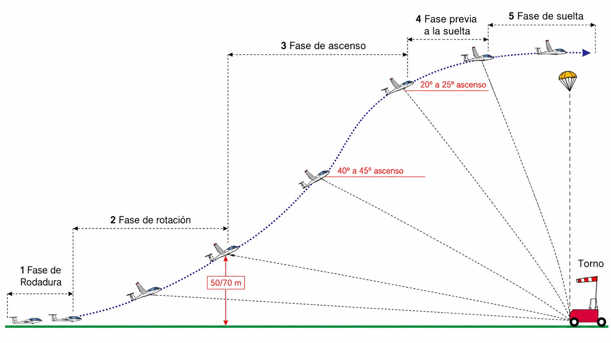
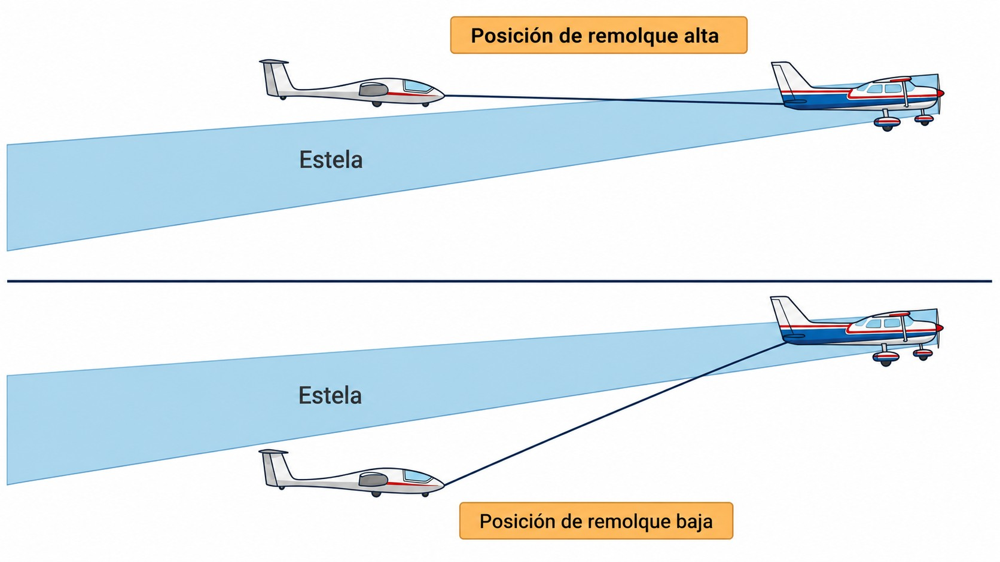
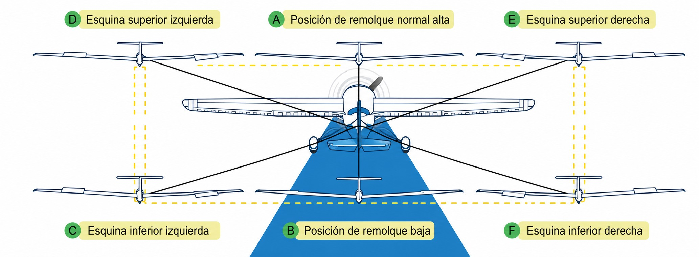
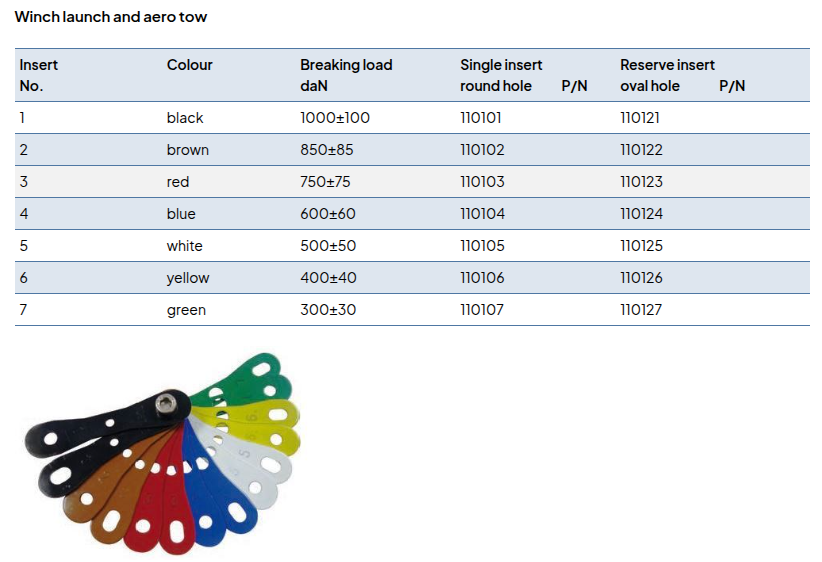

# Launch methods

> The launch is the highest-energy phase of a sailplane flight and, together with the landing, the one with the highest statistical risk. In a few seconds the pilot goes from standing still to flying fast, hanging on a cable or behind a tug. There is no room for improvisation: the procedures are exact, the calls are precise and the emergency reactions must be instinctive.
>
>
> In this chapter you will learn:
>
>
> * **The winch launch**: its dynamics, the five safety rules, the radio calls and the emergency procedure for a cable break.
> * **Aerotow**: positions on tow, visual signals and what to do if you cannot release.
> * **The general safety rules**: hooks, speeds and checks before hooking on.

## The winch launch

The **winch launch** is the quickest and cheapest way to get a sailplane into the air. A powerful engine at the far end of the runway winds in a cable at high speed, pulling the sailplane from rest to flying speed in barely three or four seconds. It feels like a catapult: the acceleration is so sudden that new pilots are often surprised by how strong it is.

During the climb, the pitch angle quickly increases to more than 40–45°. This attitude, which would be alarming in any other situation, is completely normal on the winch: the cable pulling from ahead and below imposes that geometry. The sailplane climbs at 10–15 metres per second and reaches between 300 and 500 metres in less than a minute (@fig-06-cap02-torno-fases). During the climb the pull of the cable loads the wing and raises its stall speed, so you fly faster than in free flight. As a guide, fly at between 1.3 and 1.6 times the minimum speed in straight flight, never exceeding the maximum winch launch speed set in the AFM.

{#fig-06-cap02-torno-fases}

### The five winch rules

Almost everything that goes wrong on a winch launch goes wrong **low down**, in the first few seconds and with the sailplane still rolling. At that height there is no time to analyse anything, so the British school condensed prevention into five rules that are recited before hooking on. They are taught in English, and that is how they travel from club to club.

::: {.callout-warning title="Safety: THE FIVE WINCH RULES"}
1. **Never winch launch with a tail wind.**
2. **Never winch launch in long grass.**
3. **Be ready to release BEFORE the wing touches the ground. HAND ON THE RELEASE.**
4. **Ensure the wing runner is trained.**
5. **Be careful in crosswinds.**
:::

All five have the same root: **the sailplane goes from standstill to flying in three seconds, and during that time the wing has no authority to correct anything.** It is worth understanding the reason for each. A rule that is only memorised gets skipped on the day it is in the way:

**Tail wind.** The winch pulls the cable, not the air. With a tail wind the sailplane needs a much longer ground run to reach the same indicated airspeed, the climb angle collapses and the height gained per metre of cable drops away. And if the cable breaks, the only runway left ahead of you has to be landed on **also** downwind.

**Long grass.** Grass drags on the wingtip that is still on the ground and catches the cable. With the sailplane accelerating, that held-back tip acts as a pivot: the sailplane yaws, slews sideways and the outer wing rises. That is exactly how rule 3 begins.

**The dropping wing.** If a wing touches the ground while the sailplane is accelerating, the swing is violent and immediate. The only useful action is to **cut the pull before contact**, not after: release as soon as you see the wing going down and not recovering, not when it is already scraping. That is why your hand is on the release knob **from the moment the cable goes taut**, not moved there “just in case” halfway through the ground run.

**The wing runner.** The *wing runner* (the person who holds the wingtip and runs with it) decides how the launch begins. Holding it crooked, letting go late, letting go early or running off the line all produce exactly the wing drop of rule 3. It is not a job for an improvised volunteer.

**Crosswind.** At low speed the sailplane wants to point into wind and the upwind wing tends to rise, while the ailerons still barely bite. The crossed-controls technique is the same as for any take-off and is described in the chapter on special operations. What is special about the winch is that here you have **seconds**, not metres of runway, to decide whether the launch goes on.

::: {.callout-tip title="Golden rule"}
All five are solved by the same decision, and it is the cheapest one of the day: **if something does not add up, do not hook on**. A launch abandoned on the ground costs five minutes. The other four cost a sailplane, and sometimes more.
:::

### Procedure and radio calls

The pilot and the winch driver must understand each other perfectly. A misunderstood command can lead to an unexpected pull. The standard sequence at Spanish airfields, with each call followed by its translation, is:

1. “Ready to take up slack” (*Listo para tensar el cable*): the pilot indicates that they are ready. The winch driver starts to wind in the cable slowly, with no sudden tension.
2. “Cable taut” (*Cable en tensión*): the pilot confirms that the cable is pulling smoothly and evenly.
3. “All out, all out, all out” (*Remolque, remolque, remolque*): the pilot authorises full power. The sailplane accelerates rapidly: control roll with the ailerons and keep straight with the pedals.
4. “Glider released” (*Velero libre*): after releasing the cable (at the end of the climb, typically at 300–400 metres, or immediately if in any doubt), the pilot confirms that the cable has come off and that they are flying free.

### Cable break emergency

A cable break during the climb is one of the most demanding emergencies in sailplane flying. The reaction must be **instinctive and immediate, without hesitation**. The moment the tension disappears, the sailplane's nose tends to rise dangerously (the effect of the cable is suddenly gone) and the speed falls quickly. If you do not act in the first two seconds, a **stall** at low height can be fatal.

::: {.callout-warning title="Safety"}
If the cable breaks during the climb, the first thing to do, **immediately**, is to **lower the nose** to the gliding attitude to regain speed and avoid a stall. Only once the speed is safe, pull the release to drop the remaining cable, and decide: land straight ahead on the remaining runway (low height), make a 180° turn (medium height) or fly an abbreviated circuit (enough height). **On a winch launch, never try to turn back to the runway if you are below 150 metres**: it is the deadliest manoeuvre in gliding.
:::

## Aerotow

In an **aerotow**, a powered aircraft pulls the sailplane on a rope between 30 and 60 metres long. This method has a decisive advantage over the winch: it lets you choose precisely the release height and the exact geographical position (over the right ridge, the first thermal of the day or the start point of the planned task). The penalty is the cost and the time it takes.

The correct tow position is essential both for safety and for the tug pilot's comfort (@fig-06-cap02-aerotow-posicion):

* **High tow position**: the sailplane flies just above the tug's wake, using as a visual reference the tug's wheels sitting on the horizon. From this position, the sailplane stays out of the propeller slipstream and exerts no pitching force on the tug's tail.
* **Area to avoid**: the area immediately behind the tug and below its tailplane is extremely turbulent because of the propeller wash. Crossing it in normal flight is uncomfortable; during an emergency on the tug, it can be dangerous.

{#fig-06-cap02-aerotow-posicion}

### Visual signals in flight

Even when the radio is used, visual signals are the international safety standard in case communication fails:

* **The tug rocks its wings:** release the cable immediately! It is a mandatory safety instruction: the tug has an emergency.
* **The tug waggles its rudder (“fishtail”):** something is wrong with your sailplane; check it. The most common cause: the airbrakes have opened without you noticing.
* **The sailplane moves low and to the left of the tug and rocks its wings:** the glider pilot cannot release the cable and is asking the tug to take them back to the aerodrome.

::: {.callout-tip title="Golden rule"}
On tow, always keep the tug aircraft **in view**, preferably in the “high tow position” (the tug's wheels sitting on the horizon). If the tug disappears from view, you have gone too high: the sailplane will be lifting the tug's tail and you may push its nose towards the ground. If in any doubt, release the cable: it is always the safest decision.
:::

### Boxing the wake

“Boxing the wake” is an advanced aerotow training exercise that shows the pilot's coordination and ability to manoeuvre under control around the tug's turbulence (**wake turbulence**).

The tug's wake has two components: the propeller slipstream (**propwash**), which causes light turbulence in the centre, and the wingtip vortices (**wingtip vortices**), which induce strong rolling moments at the edges.

The manoeuvre consists of flying a rectangular pattern (a box) around the tug's wake. Starting from the standard high tow position, you cross the wake down to the low tow position. From there you fly to the four corners of the rectangle (low left, high left, high right, low right) with coordinated controls, keeping a constant distance from the wake, and finish by crossing back up to the high position (@fig-06-cap02-boxing-wake). Each leg is an exercise in fine control: clean movements, without cutting the corners or entering the wingtip vortices.

It is not exam material, nor something you learn from a book: it is a flying exercise practised **with an instructor**, who will teach you the rhythm and the limits in your type of sailplane. Always start outside the circuit and above a reference safety height of **300 m AGL**.

{#fig-06-cap02-boxing-wake}

::: {.callout-warning title="Safety"}
Avoid flying the box too tight or cutting the corners, because the sailplane will enter the wingtip vortices uncontrollably. This can cause a violent, unexpected roll. If you lose control or the tug disappears from view, release the cable immediately.
:::

### Correcting a slack line

Slack in the tow rope (a **slack line**, or a bow in the rope) is common on aerotow. It is caused by gusts, thermals, turning inside the tug's radius or sudden power reductions by the tug.

The danger is that, as the sailplane slows and the rope goes slack, it can tangle with the sailplane's wings or undercarriage. And when the sailplane speeds up again, the rope will tighten all at once, causing a violent jerk (**snap**) that can break the weak link or cause structural damage to the sailplane or the tug.

To correct a slack line, use the following technique according to how severe it is:

* **Slight slack:** if the bow in the rope is small, hold a steady flight path directly behind the tug. The sailplane's own glide will take up the excess speed naturally and smoothly.
* **Moderate slack:** if the rope is visibly bowed, **make a gentle sideslip**, pointing the nose slightly out of the flight path to increase drag, or **open the airbrakes very gradually and intermittently**. This will slow the sailplane and take up the rope gently.
* **Critical slack:** if the rope forms a large loop and you lose sight of the rope or the tug, **release the cable at once**. Waiting for it to snap tight at high speed is very dangerous.

## Self-launch

**Self-launch** is the method used by motorgliders or self-launching sailplanes fitted with retractable engines or folding front propellers. It gives the pilot complete independence, allowing them to take off and climb without a winch or a tug.

However, operating with an engine brings a number of specific risks that must be managed rigorously:

* **Pitch-up tendency:** in most sailplanes with a retractable engine, the engine deploys on a vertical pylon above the fuselage. The thrust acts well above the aircraft's longitudinal axis: applying power produces a strong nose-down moment, and reducing or cutting it in the air a sharp pitch-up. The pilot must counter this tendency actively and firmly with the elevator.
* **Drag from the engine:** if the engine fails in flight, or is stopped and left deployed without being retracted, the glide polar deteriorates drastically (the rate of sink can double). Flying with the engine out is like flying with the airbrakes partly open.
* **The low-level restart dilemma:** the main cause of accidents in motorgliders is the pilot trying to start the engine in flight at very low height to avoid an outlanding. If the engine does not start (because it has cooled in the airflow, an electrical fault or lack of fuel), the pilot is left with no engine and without the height needed to plan a safe outlanding.

::: {.callout-warning title="Safety"}
Always set a minimum safe height for starting the engine in flight (typically **300 metres AGL**). If you descend below that height and the engine does not start at the first attempt, give up immediately, forget the engine and concentrate solely on a controlled outlanding. Many serious accidents happen when pilots try to sort out engine problems a few metres above the ground.
:::

### Secondary launch methods

As well as the winch, aerotow and self-launch, there are two other methods covered by the syllabus. They are rarely used today, but they matter a great deal in the history of gliding and at certain mountain sites:

* **Car launch:** similar to the winch, but instead of a fixed engine winding in a cable, a car or lorry drives along a long runway pulling the cable attached to the sailplane. It needs precise coordination of speed between the driver and the sailplane, and extremely long runways (more than 1,500 metres).
* **Bungee launch:** the founding method of gliding. It is used on steep slopes in strong headwinds. The sailplane is held by the tail while a team of people stretches a thick elastic rope attached to the sailplane's nose hook. When the rope is taut, the sailplane is released and is catapulted straight into the ridge lift on the slope.

## General safety rules

Whatever the launch method, there are common safety rules that must be checked before every flight:

1. **Approved hook:** check in the AFM and on the placards which hook goes with each method. The usual arrangement is the nose hook for aerotow and a hook close to the CG for the winch. The winch hook must have an automatic release (*back-release*).
2. **Towing speeds (V~T~):** never exceed the maximum towing speed specified in the AFM. Towing too fast causes oscillations that can exceed the sailplane's structural limits. Towing too slowly puts the tug on the edge of a stall.
3. **Checks before hooking on:** before the cable is attached, check:
  
  * Airbrakes closed and locked.
  * Trim in the take-off position.
  * Cockpit free of loose objects and properly closed.
  * Controls free and correctly connected (cross-check of movement confirmed).
  * Straps tight and locked.

::: {.callout-note title="Airmanship"}
Always do a control cross-check (**cross-check**) with another pilot or the launch marshal before the launch. An aileron or rudder control that is not properly connected can be impossible to spot during your own inspection. This simple check removes one of the most frequent causes of take-off accidents.
:::

### Inspecting the launch equipment

Before each flying day and at each individual pre-flight inspection, the pilot and the ground crew must check the condition of the tow and winch equipment:

* **Tow hooks:** check that the hooks are clean of dirt, rust or old grease. Pull the release knob in the cockpit and check that the mechanism opens fully and returns to its closed position without sticking halfway. The purpose of each hook is the one given in the AFM and on the sailplane's placards.
* **Tow rings:** inspect the metal rings at the ends of the cable. In Europe, the standard system is the **Tost double ring**. Check the rings for cracks, dents, worn welds or oval deformation.
* **Tow ropes and cables:** check the nylon rope or steel cable along its whole length. It must be free of knots. **A single knot in the tow rope reduces its structural strength by up to 50%** and creates a point of high friction that is prone to breaking. Check that there are no frayed strands and that the rope is not discoloured from long exposure to UV radiation.

::: {.callout-warning title="Safety: INCOMPATIBLE RINGS"}
The Tost double ring system is the only one approved for Tost hooks. Accidentally using a single American-type ring (Schweizer) on a Tost grasping-style hook can stop the hook from releasing when the knob is pulled in flight, leaving you dragged along uncontrollably. Always check that the cable is compatible before hooking on.
:::

### Weak links

The **weak link** is a calibrated metal fitting inserted in the tow cable, designed to break before an excessive, unexpected tension in the cable causes structural damage to the sailplane or the tug.

The pilot's operational obligation is to fit **exactly the weak link specified in the AFM** of their sailplane: neither stronger nor weaker. As a design reference, the certification standard **EASA CS 22.581(b)** assumes that the ultimate nominal strength of the cable or weak link is not less than 1.3 times the maximum weight of the sailplane nor less than 500 daN. Those are the values used to size the tow hook structurally.

European clubs use the standardised system made by Tost. The key point: **the right weak link always depends both on the weight of the sailplane and on the launch method**.

**On aerotow:** accelerations build up gradually and the loads in the cable are smaller. To protect the nose hook from overloads that endanger stability, weaker links are used.

| Colour | Nominal strength (daN) | Typical use (per AFM) |
| --- | --- | --- |
| **Green** (No. 7) | 300 daN | Aerotow of light/standard single-seaters. |
| **Yellow** (No. 6) | 400 daN | Classic wood-and-fabric sailplanes (e.g. Ka 8) on aerotow. |
| **White** (No. 5) | 500 daN | Aerotow of two-seaters; winch launch of light single-seaters. |
| **Blue** (No. 4) | 600 daN | Winch launch of standard and competition single-seaters. |
| **Red** (No. 3) | 750 daN | Winch launch of light two-seat trainers / heavy single-seaters. |
| **Brown** (No. 2) | 850 daN | Winch launch of two-seat trainers and high-performance sailplanes. |
| **Black** (No. 1) | 1000 daN | Winch launch of heavily loaded two-seaters or motorgliders. |
: Colour codes and strengths of Tost weak links

{#fig-06-cap02-fusibles-tost width="70%"}

The colours, numbers and nominal strengths are those in the weak link catalogue of Tost Flugzeuggerätebau; the actual use is always set by the AFM of each sailplane.

::: {.callout-warning title="Safety"}
Never fit a weak link stronger than the one specified in your sailplane's AFM, and never bypass it in the cable with karabiners or shackles. In a sudden overload (such as a gust or a jerk from a slack line), the sailplane's wings or nose will break before the cable does. Likewise, using too strong a weak link on aerotow can seriously damage the nose hook and the fuselage structure before it breaks.
:::

### The take-off emergency briefing

Mental preparation is the most effective safety factor against emergencies on take-off. International practice requires that, immediately before every take-off (just before the cable is attached or tension is requested), the pilot-in-command gives (and says out loud, if flying a two-seater) the **take-off emergency briefing**.

This briefing structures the immediate decision-making in the event of a cable break or engine failure, by three pre-set height bands:

1. **Safety speeds:** confirm the minimum speed to hold after any failure: the safe approach speed given in your sailplane's AFM.
2. **Failure at low height:** set the height below which you will land straight ahead without turning, identifying clear areas off the runway if necessary.
3. **Failure at critical height and turning back:** set the minimum height for attempting a safe turn back (as a guide, 150 metres AGL on a winch launch and 70 metres AGL on aerotow; see @fig-06-cap07-emergencia-altura on landing options by height and launch method) and decide in advance which way you will turn, taking into account the current wind direction and strength to counter the drift.

::: {.callout-note title="Airmanship"}
Do not start the take-off run without having said out loud or gone over in your head your **emergency briefing**. In a cable break at low height there is no time to think about what to do. The correct action (lower the nose, stabilise the speed and the flight path) must already be in your head and come out as a reflex.
:::

::: {.postit}
**Chapter summary: launch methods**

* **Winch**: brutal acceleration from 0 to 100 km/h in 3 seconds. If the cable breaks, the first thing is to **lower the nose** to regain speed. Only then release the remaining cable and decide whether to land straight ahead, turn through 180° or fly a short circuit, depending on the height available.
* **The five winch rules**: no tail wind, no long grass; **hand on the release** and release **before** the wing touches the ground; a trained wing runner; and care in crosswinds. All five protect against the same thing: the three seconds in which the sailplane accelerates while the wing can correct nothing.
* **Aerotow**: keep the “high tow position” (the tug's wheel on the horizon). If the tug rocks its wings, it is an order to release at once: it has an emergency. If you cannot release, fly out to one side and rock your wings. If a **slack line** forms, correct it with a gentle sideslip or with gradual airbrake. Practise **boxing the wake** from 300 m AGL.
* **Self-launch**: gives complete independence. Watch the pitching moment of an engine on a pylon: applying power pushes the nose down and reducing or cutting it **pitches it up**. Respect the safe height of 300 m for starting the engine in flight; below it, concentrate on the outlanding.
* **Emergency briefing**: a mental, spoken briefing before every take-off. It sets safety speeds and precise actions for failures at low, medium and high height, taking the wind into account.
* **Checks before the launch**: hook approved by the AFM, speeds respected, controls free and a cross-check. Also check the ropes (no knots), the Tost double rings and the **weak link** that matches the sailplane.
:::
