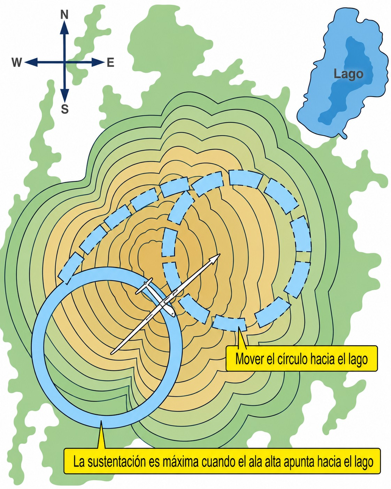
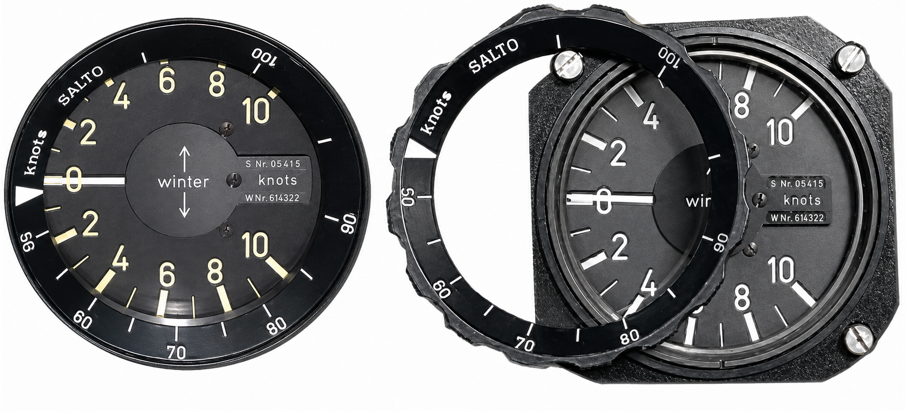
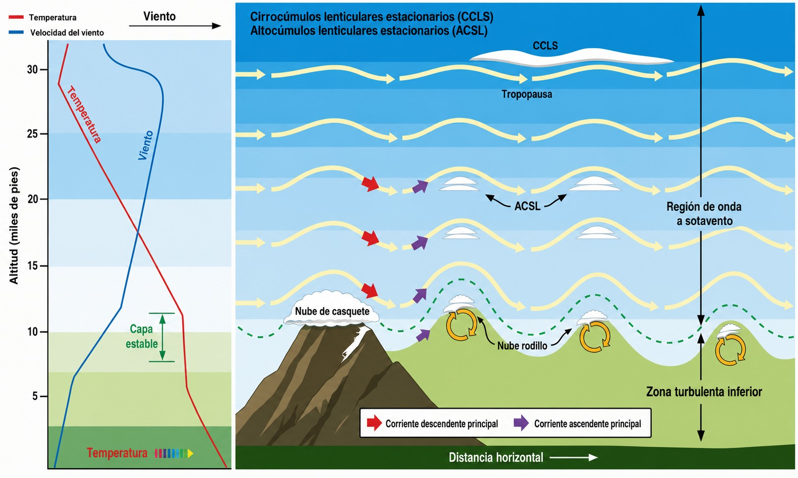

# Soaring techniques

> Sailplane flying is, at heart, a constant conversation with the atmosphere. Learn to listen to the air (the changes on the variometer, how the sailplane behaves in different air masses, the small signs that announce a thermal) and technique turns into instinct. This chapter covers the three main kinds of lift (thermal, ridge and wave) and how to manage water ballast.
>
>
> In this chapter you will learn:
>
>
> * **Centring thermals**: how to find the core and how to shift your turn towards it.
> * **The MacCready ring**: what it is and how it tells you exactly how fast to fly between thermals.
> * **Ridge soaring**: technique, traffic rules and safety margins.
> * **Wave soaring**: how to recognise it, ideal conditions and the risks of the rotor.
> * **Water ballast**: when to use it, when to dump it and what it changes in the sailplane's aerodynamics.

## Thermal soaring

**Thermals** are columns of rising air produced by uneven heating of the ground. When the sun warms the surface (especially over dark ground such as ploughed fields, tarmac or south-facing slopes), the warmer, lighter air rises as a bubble or a column. This rising air is the main source of energy for **cross-country** flying.

Think of a pan of boiling water: the heat rises from the bottom in irregular, intermittent currents. A thermal in the atmosphere works in a similar way. It is not a uniform tube of rising air but a mass of changing shape, with a core of strongest lift surrounded by calmer air and, at its outer edges, often by sinking air.

### Centring the thermal

Finding a thermal is only the first step. The really hard part (and what separates a good pilot from an outstanding one) is centring it efficiently. The basic technique is **shifting the circle** towards the core (@fig-06-cap03-centrado-termica):

1. When the vario starts to climb strongly, wait **2–3 seconds** to make sure you are inside the core and not on its leading edge.
2. Start a coordinated turn with a bank of between **30° and 45°**. The sailplane will take between 15 and 25 seconds to complete each turn.
3. Watch the vario during the turn: if the climb is stronger in one sector of the circle, the core lies towards that side. Widen the turn for 2–3 seconds in that direction (reducing the bank for a moment) and then tighten it again. You will be “carrying” the centre of your turn towards the core.

And what if you turned the wrong way on entry and the vario sinks as soon as the turn is established? That is where the **270-degree technique** comes in: remember at which point of the turn you had the best climb, complete 270° of turn, fly straight for 2–4 seconds towards that point and turn again in the same direction. It works better than reversing the turn, which takes time, covers more distance and usually takes you away from the core.

{#fig-06-cap03-centrado-termica}

::: {.callout-tip title="Golden rule"}
If one wing lifts as you fly through a thermal, the core is on that side: **turn towards the rising wing**. Once the turn is established, never reverse it: adjust it. Tighten the turn when the vario rises, widen it when it falls. With time this adjustment becomes automatic and you no longer need to work it out consciously.
:::

### Speed between thermals: the MacCready ring

The MacCready ring is the selector of the best speeds between thermals. It answers the question: “How fast should I fly to get as far as possible before the next thermal?”

The logic is this: if you expect to find 2 m/s thermals on the next leg, there is no point flying at the best glide speed (V~G~ (best glide speed)). It is more efficient to fly faster (giving up some glide) to reach the core of the next thermal sooner. The ring turns that logic into a direct speed instruction.

* **Set the ring** to the climb rate you expect in the next thermal (for example, 2 m/s).
* **Fly at the speed the ring shows** on the vario. In sinking air you will fly faster; in rising air, slower.
* The result is the **shortest possible time** for the cross-country flight, not the best instantaneous glide.

{#fig-06-cap03-el-anillo-maccready}

### The side string as an angle-of-attack indicator (a complementary technique)

The **central yaw string** stuck to the middle of the canopy is the king of instruments and must be consulted for controlling yaw (coordinated flight). However, some places and schools also teach, as a complementary and non-standard technique, the use of a **side string** as an analogue, indirect indicator of the wing's angle of attack (α, **alpha**).

Unlike the airspeed indicator, whose indicated stall speed changes with the aircraft's total weight (for example, with water ballast) or with the aerodynamic load in a turn (load factor, g), **the wing always stalls at the same physical angle of attack**. The side string tries to show the direction of the local airflow along the side of the cockpit, which changes in proportion to the attitude of the aerofoil relative to the relative airflow.

This technique has operational limitations that you should know:

* **Errors from yaw:** if the sailplane is not flying perfectly coordinated (ball and central string centred), the airflow along the side is badly distorted and the side string reading becomes useless.
* **Specific calibration:** an instructor or experienced pilot has to mark on the canopy, by trial, the physical marks for the **best glide angle** (V~G~ (best glide speed)) and the **stall angle** for each particular cockpit model.

Its use is limited strictly to slow thermal flying, to help the student see how close the sailplane is to its maximum lift coefficient and to prevent secondary stalls in steep turns.

::: {.callout-warning title="Safety"}
In **high-speed flight**, the side string is useless, because the angles of attack are tiny. In that range, the airspeed indicator and watching the horizon are the only valid references for avoiding exceeding V~NE~ (never exceed speed). The side string is a complementary teaching aid for slow thermal flying, never a substitute for the primary flight instruments or for the central yaw string.
:::

## Ridge and wave soaring

### Ridge soaring

**Ridge soaring** uses the upward deflection of the wind when it meets a mountain or hill. As long as the wind blows onto the slope with enough speed, the air is forced upwards and creates a band of lift that the sailplane can use continuously.

* **Technique:** fly parallel to the crest, always on the windward side (the side the wind comes from), at a safe distance that lets you turn away towards the valley at any moment.
* **Traffic:** if two sailplanes meet on the same ridge, the one with the hill on its **right** has right of way. The other must move out towards the valley. Turns are always made **away from the hill** (towards the valley).

::: {.callout-warning title="Safety"}
Never turn towards the slope unless you are sure you have room to complete the turn with a margin. On the lee side of the mountain (behind the crest) the air can sink violently, even when flying conditions look good on the windward side. Straying into the rotor zone at low height over the ground may be unrecoverable.
:::

### Wave soaring

**Wave soaring** happens when, in strong wind and stable atmospheric conditions, air forced upwards by a mountain range sets up a system of pressure waves downwind, like the ripples a stone makes in water. These waves can stretch for tens or hundreds of kilometres and reach stratospheric heights (@fig-06-cap03-onda-esquema).

* **Recognising it:** the most typical visual sign is **lenticular clouds**: lens- or hat-shaped clouds that stay still over the ground while the wind blows through them continuously.
* **Characteristics:** the lift on the crest of the wave is smooth, steady and wide. It is the way to heights that no thermal can reach.
* **Rotor zone:** immediately beneath the rotor clouds (the broken, churning clouds visible below the level of the wave) the air is violently turbulent. This zone can damage the sailplane structurally and must be avoided.

{#fig-06-cap03-onda-esquema}

::: {.callout-note title="Airmanship"}
High-altitude wave flying needs specific equipment: oxygen from 3,000–4,000 metres depending on the pilot's endurance and condition, suitable warm clothing and a calibrated altimeter. Before a planned wave flight, check the airspace: wave heights often coincide with restricted areas or areas reserved for controlled traffic, which need prior clearance.
:::

## Water ballast management

**Water ballast** means tanks in the sailplane's wings that can be filled with water before the flight. As the sailplane's mass increases, its polar curve moves towards higher speeds: the sailplane flies faster between thermals at the same glide angle.

The most useful comparison is with a cyclist: on a long descent, carrying a load gets you to the bottom faster without pedalling. With ballast, the sailplane “falls” faster but at the same glide angle, which is an advantage when thermals are strong and the glides between them are long.

* **When to use it:** only on days of strong thermals (above 2–3 m/s) and long flights where the glides between thermals are significant. On weak days, ballast hurts more than it helps.
* **Dumping:** if the weather gets worse, or before landing, the ballast must be dumped completely. Open the valves in good time: dumping all of it usually takes between 3 and 8 minutes, depending on the sailplane.
* **Ice:** if you fly at high altitude with ballast, add antifreeze to the water to stop it freezing and damaging the tanks or the dump systems.

::: {.callout-warning title="Safety"}
A sailplane carrying water ballast has a **significantly higher stall speed** (up to 15–20 km/h more than without ballast). Adjust all your reference speeds (take-off, approach, circuit) accordingly. **Never land with full ballast** unless a fault in the dump system leaves you no choice. If it does, make the landing as gentle as you possibly can: the extra inertia can exceed the structural strength of the wings and cause a catastrophic failure.
:::

::: {.postit}
**Chapter summary: soaring techniques**

* **Centring a thermal**: feel the push in the seat. If the right wing lifts, the core is to the right: turn right. Tighten the turn when the vario rises, widen it when it falls. With practice, this cycle becomes automatic.
* **Side string**: an optional complementary technique for showing, as a teaching aid, the angle of attack in slow flight; it does not replace the central string or the airspeed indicator.
* **MacCready ring**: your selector of the best speed. Set the ring to the climb rate you expect to find (for example, 2 m/s) and fly at the speed it shows. Speed up in sinking air, slow down in rising air.
* **Ridge**: stay close in on the windward side, with an escape route towards the valley always available. If the hill is on your right, you have right of way. Never turn towards the hill.
* **Wave**: the motorway to the sky. Climb in the smooth zone, ahead of the rotor cloud. It needs oxygen and warm clothing. Take care coming down: the rotor can break your sailplane in seconds.
* **Water ballast**: more mass = more speed without losing glide. Useful on strong days and long cross-country flights. Dump it before landing and always adjust your reference speeds: with ballast, the stall comes much sooner.
:::
