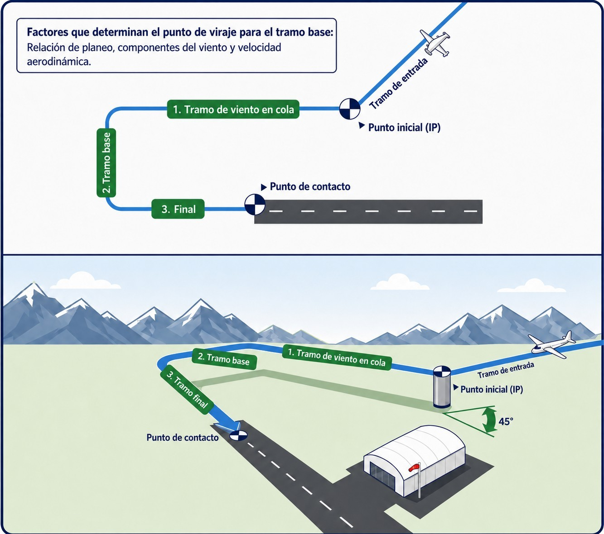
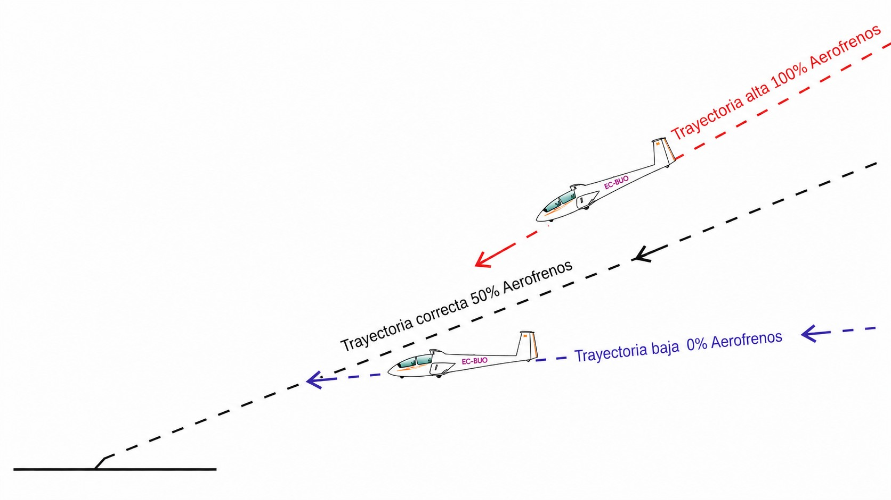
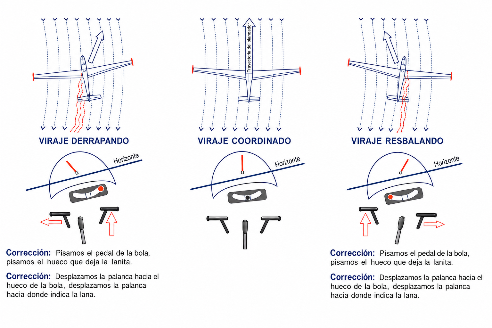
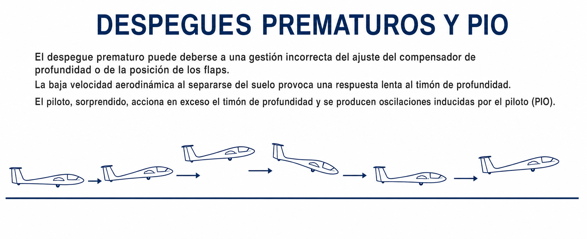

# Circuits and landing

> The traffic circuit is the heart of sailplane flying: the moment when all the energy gathered during the flight is turned into a precise, safe landing. Unlike a powered aircraft, the sailplane has no second chance if the first approach goes wrong: there is no power to put it right. The circuit demands planning ahead, a three-dimensional picture of the airspace and the ability to make decisions as the ground comes closer.
>
>
> In this chapter you will learn:
>
>
> * **The structure of the standard circuit**: the four legs and the reference heights on each.
> * **The FUSTALL checklist**: what to check before landing, and in what order.
> * **Managing speed in wind**: how to work out the correct approach speed.
> * **Using the airbrakes effectively**: how to use them to put the sailplane down on your chosen spot.
> * **Corrections in the circuit**: how to adapt when your energy does not match the plan.

## Structure of the traffic circuit

The **traffic circuit** is a standardised procedure that organises arrivals at the aerodrome in a way that is predictable and safe for everyone involved. Its rectangular shape means the pilot can always see the runway and can adjust the energy available on each leg.

The four standard legs are (@fig-06-cap04-circuito-estandar):

1. **Crosswind leg:** the leg at right angles to the runway, flown just after take-off or when joining the circuit from a cross-country flight. The recommended height on completing the turn onto crosswind is 250–300 metres (QFE).
2. **Downwind leg** (**downwind**): the leg parallel to the runway, in the opposite direction to the landing. It is flown 200–400 metres to the side of the runway, at a height of 200–300 metres. This is the leg on which the FUSTALL checks are done (see the next section).
3. **Base leg** (**base leg**): the leg at right angles to the runway, begun when the touchdown point is about 45° behind the pilot's wing. The recommended height at the start of base leg is 150 metres.
4. **Final approach** (**final leg**): the leg lined up with the runway, from which the descent and touchdown are flown. The airbrakes are managed continuously on this leg to put the sailplane down on the chosen spot.

{#fig-06-cap04-circuito-estandar}

### The FUSTALL checklist

Before joining the downwind leg, open the water ballast valves (even if you are not carrying any, to build the habit: dumping it all takes several minutes). Once on the downwind leg, run through the **FUSTALL** checklist before carrying on to base and final:

* **F** (**Flaps**): flaps in the landing position, if the sailplane has them.
* **U** (**Undercarriage**): wheel down and locked. Check the position of the indicator visually and, if the sailplane has one, the warning horn.
* **S** (**Speed**): set the approach speed recommended in the AFM (see the next section for the wind correction).
* **T** (**Trim**): trim the sailplane for the chosen approach speed.
* **A** (**Airbrakes**): check that the airbrakes move freely and close them again for the base leg.
* **L** (**Landing area**): scan the landing area and the whole circuit: wind, other aircraft and people on the runway. Is there another sailplane on final?
* **L** (**Land**): with everything checked, spend the rest of the circuit solely on flying and landing the sailplane.

::: {.callout-tip title="Golden rule"}
Always do FUSTALL at the same point on the downwind leg (for example, when the runway threshold is level with your wing). Repetition turns the checklist into a habit and makes it almost impossible to leave out. A pilot who improvises when to do the checks ends up not doing them.
:::

::: {.callout-note title="Airmanship: THE TRADITIONAL WULF CHECK"}
Many European clubs teach the short mnemonic **WULF** for the same downwind check: **W** (**Water ballast**): water ballast dumped; **U** (**Undercarriage**): wheel down and locked; **L** (**Loose articles / Look-out**): loose articles secured and a good look-out; **F** (**Flaps**): flaps in the landing position. Both checklists have the same aim: to reach the base leg fully configured and with your attention outside the cockpit.
:::

## Managing speed and wind

Speed in the circuit must be steady and safe. As a general reference, use the **recommended approach speed** in the AFM or, failing that, **1.5 times the stall speed** (1.5 V~S~). The margin is larger than in a powered aircraft because the sailplane meets the wind gradient and the round-out with no power to correct.

Wind changes this equation considerably:

* **Headwind on final:** add **half the wind speed** (and half the maximum expected gust) to your basic speed. A 20 km/h wind justifies adding 10 km/h to your normal speed.
* **Wind gradient:** close to the ground, the wind drops off sharply. If you arrive on final too slowly, you may suffer a sudden loss of lift just when you least expect it, a few metres above the ground. Always arrive with a little extra speed and let it bleed off during the final glide.

::: {.callout-warning title="Safety"}
Arriving slow on final with a headwind is one of the most dangerous combinations in sailplane flying. The wind gradient near the ground can steal the last 15–20 km/h of your speed in a fraction of a second, taking you straight into a stall at a height from which recovery is impossible. The extra speed on final is not a luxury: it is life insurance.
:::

## Using the airbrakes

The **airbrakes** are the sailplane's glide-path control: they let you increase the rate of sink without changing attitude or speed. They turn surplus potential energy into aerodynamic braking and let you put the sailplane down precisely on the chosen spot (@fig-06-cap04-aerofrenos-angulo).

The most reliable way to use the airbrakes is this:

* **Standard approach:** start final with the airbrakes **half open**. That middle position gives you room either way: if you are high, open them further; if you are low, close them.
* **Continuous adjustment:** use the airbrakes all the way down final to keep your aiming point fixed on the canopy. If the point moves up towards you, you are low: close the airbrakes. If the point moves down, you are high: open them further.
* **Base-to-final turn:** avoid having the airbrakes fully open during the turn. A high rate of sink combined with a steep bank increases the effective wing loading and can bring the sailplane dangerously close to the stall.
* **Touchdown:** once the sailplane has touched down, keep the airbrakes open to stop it bouncing back into the air (**ballooning**) and to make the wheel brake more effective.

{#fig-06-cap04-aerofrenos-angulo}

::: {.callout-note title="Airmanship"}
If in the base-to-final turn you see that you are going to overshoot the touchdown point even with the airbrakes fully open, do not close them abruptly near the ground: the sailplane will suddenly balloon. Instead, if the field allows, extend the base leg or fly a gentle S-turn on final to increase the distance flown. If nothing works, you are landing long: land and roll to the end of the runway.
:::

## The sideslip

The **sideslip** is an advanced operational manoeuvre that greatly increases the sailplane's rate of sink without increasing its forward speed. It consists of slipping deliberately, exposing the side of the fuselage to the airflow, which creates a great deal of drag.

It is the ultimate glide-path control in the following situations:

* Failure or jamming of the airbrakes on the approach.
* Approaches that are far too high into unfamiliar fields during an outlanding.
* Quick height adjustments on days of severe turbulence or wind shear.

To sideslip safely, use the following technique:

1. **Entry:** start a gentle turn to one side and at once apply rudder the opposite way (cross the controls: aileron one way, pedal the other). The fuselage will point obliquely to the actual flight path.
2. **Wind direction:** always slip so that **the lower wing points into the wind** (if the wind is from the left, slip with left bank and right rudder). This helps to counter sideways drift and improves control.
3. **Speed control:** because the air strikes the fuselage from the side, the static and dynamic pressure at the sailplane's ports is disturbed and **the airspeed indicator gives wrong readings or none at all**. Control the approach speed by eye alone, keeping the nose slightly low relative to the horizon.
4. **Exit:** to end the manoeuvre, first relax the back pressure on the stick (nose down) and then smoothly centralise the ailerons and rudder. The sailplane will return at once to coordinated flight on the desired path.

{#fig-06-cap04-resbale-lateral}

::: {.callout-warning title="Safety"}
Because the airflow is disturbed and the airspeed indicator is unreliable during the sideslip, there is a risk of stalling if the pilot pulls back too much on the stick. Always keep a clearly nose-low attitude. Practise the manoeuvre at a safe height before trying it in the circuit.
:::

### Downwind landing

The golden rule of aviation is always to land into wind to shorten the ground run. Even so, there are operational situations (such as a steep upslope in an outlanding, or obstacles on the approach) that may force the pilot to land downwind.

A tailwind radically changes the pilot's sensory references and the physics of the landing:

* **Higher groundspeed:** if your indicated approach speed is 90 km/h and you have a 20 km/h tailwind, your actual speed over the ground will be 110 km/h. The landing run will be much longer and will need more distance and effective use of the wheel brake.
* **The visual illusion of speed:** as you see the ground rushing past on final and at touchdown, your brain will wrongly conclude that you are going too fast. The instinctive and dangerous reaction is to pull back on the stick to slow the sailplane down. That will reduce the indicated airspeed below the safe speed and can cause a **stall** and a **spin** a few metres above the ground.
* **Flat approach path:** because you are moving faster over the ground, your apparent angle of descent will be much flatter. Keep to a conservative path by using the airbrakes precisely.

::: {.callout-warning title="Safety"}
When you fly a downwind approach, **rely solely on the airspeed indicator for speed control**, ignoring the apparent speed at which the ground passes under the cockpit. Hold the recommended approach speed and be ready for a very long ground run and firm braking.
:::

### Pilot-induced oscillations (PIO) in pitch

**Pilot-induced oscillations (PIO)** are rapid, uncontrolled swings in the sailplane's pitch attitude close to the ground, caused by the pilot's late reaction to small deviations from the flight path.

In the final stage of the approach and at touchdown, at low speed, the flying controls are less effective and there is a slight delay (**control lag**) between moving the stick and the aircraft's physical response. If a small gust pitches the sailplane up, a tired pilot or one with slow reflexes may push the stick forward hard; when the sailplane responds and starts to pitch down, the pilot pulls back hard. This cycle of excessive, out-of-phase corrections quickly grows:

* **Consequences:** the oscillations can end in an extremely hard contact of the main wheel or the nose wheel with the runway, with severe structural damage to the fuselage or injury to the crew.
* **Correction in flight:** the moment you feel a pitch oscillation starting near the runway, **freeze the stick** in a steady, neutral position. Let the sailplane settle by itself through its longitudinal static stability and, if necessary, open the airbrakes to half or keep them there to settle the aircraft gently (@fig-06-cap04-pio-cabeceo).

{#fig-06-cap04-pio-cabeceo}

::: {.postit}
**Chapter summary: circuits and landing**

* **Standard circuit**: four legs (crosswind, downwind, base and final) with reference heights of 250–300, 200–300 and 150 metres down to touchdown. The circuit is not a ritual; it is an energy manager.
* **FUSTALL on the downwind leg**: **Flaps**, **Undercarriage** (wheel down and locked), **Speed** (approach speed), **Trim**, **Airbrakes** (free, then closed), **Landing area** (wind and traffic), **Land**. Water ballast dumped before joining the circuit. Always do it at the same point.
* **Approach speed**: work out your basic speed (1.5 V~S~) and **add half the wind and half the gust**. Arriving slow in wind is a recipe for a wind-shear accident.
* **Airbrakes**: start final with them half out. If the touchdown point rises on the canopy, close them; if it sinks, open them. Never close them abruptly near the ground: balloon and tail strike.
* **Sideslip**: a quick emergency descent method with crossed controls. Remember: **lower wing into the wind**, a nose-low attitude judged by eye (the airspeed indicator is unreliable in the crossflow) and exit by relaxing the stick first.
* **Tailwind and PIO**: when landing downwind, ignore the visual speed of the ground (it prevents stalls) and be ready for a long ground run. If the sailplane oscillates in pitch (**PIO**) near the ground, freeze the stick and let its static stability do the work.
:::
