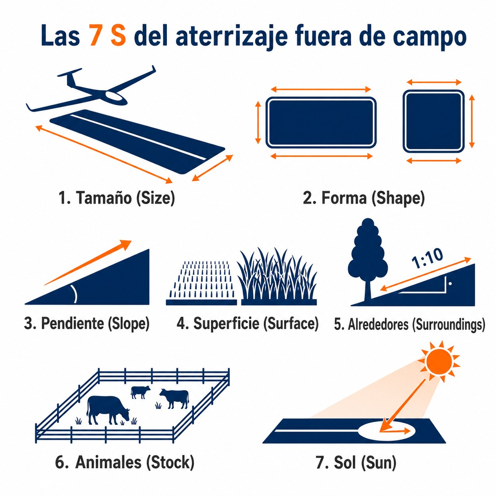

# Outlanding

> The **outlanding** is a statistical fact of cross-country flying. It is neither a failure nor an accident: it is a planned, practised procedure that can be carried out perfectly well with a cool head and enough height. The difference between an outlanding you tell stories about in the hangar and one that turns into an accident lies in a single factor: the moment at which the pilot makes the decision.
>
>
> In this chapter you will learn:
>
>
> * **The decision to land**: when, and why delay is the number one cause of accidents in fields.
> * **The 7 S of field selection**: the seven criteria you assess in seconds to choose the right field.
> * **Surface analysis**: which kinds of ground are suitable and which are the most common traps.
> * **The outlanding approach technique**: how to adapt the standard circuit to unfamiliar ground.
> * **Procedures after landing**: how to secure the sailplane, arrange the retrieve, look after your survival and deal with the landowner.

## The decision to land out

The pilot's greatest enemy when a field landing looms is not the ground: it is hope. The hope that a saving thermal will turn up. That the field you saw ten minutes ago is still within reach. That going a little lower to look for lift will not matter.

The statistics are clear: the number one cause of serious accidents on cross-country flights is not a lack of available fields but **delay in deciding to land**. The pilot who waits too long reaches the chosen field without enough height to inspect it properly, without room to correct a badly planned approach and without the energy to avoid an obstacle they had not seen.

The most useful tool against this cognitive bias is to set a **decision height** in advance. Better still: a three-step ladder that turns the descent into a plan in stages, rather than an ultimatum:

* **600 metres above the ground:** pick the general area where you are going to land. You can keep looking for thermals, but only ones that always leave that area within reach.
* **450 metres:** choose the final field and assess its 7 S (next section). If you try a thermal, it must be over the field itself.
* **300 metres:** commit to the circuit. The thermal game is over; from here on, all your attention goes on the landing.

::: {.callout-warning title="Safety"}
Putting off the decision to land while looking for a “rescue thermal” at low height is the best-documented pattern in serious gliding accidents. Once you have set your decision height, stick to it without exception. The sailplane can be repaired. The pilot, not always.
:::

## Selection criteria: the 7 S

To judge whether a field is suitable in the few seconds you have, use the **7 S** rule. This method makes you assess the right factors in the right order, so that urgency does not lead you to overlook a critical risk (@fig-06-cap05-7s-seleccion-campo):

1. **S** (**Size**): look for the largest field possible. A 400-metre field is ideal for most modern sailplanes; less than 200 metres is critical and calls for faultless technique.
2. **S** (**Shape**): a long, narrow field is better than a short, wide one. The shape must allow a clean approach from the direction of the wind, with no obstacles.
3. **S** (**Slope**): if there is a slope, always land uphill, even if that means landing with a light tailwind. A downhill slope may stop the sailplane from coming to rest in the distance available.
4. **S** (**Surface**): study the texture and colour of the ground. Stubble or fallow land are ideal surfaces. Tall crops, vineyards and rice fields are traps that do not forgive.
5. **S** (**Surroundings**): assess the obstacles on the approach path. The **1:10 rule** is your reference: a 10-metre obstacle uses up 100 metres of effective runway. Power lines, tall trees and buildings can wipe out half the available field at a stroke.
6. **S** (**Stock**): avoid fields with livestock. Cows, sheep or horses are unpredictable and can wander across your landing run with serious consequences for the sailplane and the pilot.
7. **S** (**Sun**): take the position of the sun into account. Landing into a low sun can blind you completely and hide critical obstacles, especially power lines, which are invisible against the light.

{#fig-06-cap05-7s-seleccion-campo}

## Analysis of common surfaces

| Type of field | Suitability | Key considerations |
| --- | --- | --- |
| **Fallow** | Excellent | Level, firm ground. Little risk of unevenness. First choice. |
| **Stubble** | Very good | Remains of harvested cereal. Hard, safe surface. Short ground run. |
| **Low green cereal (< 20 cm)** | Good | Takes normal landings. If the cereal is taller than 20 cm, it can catch a wing and cause a sharp swing. |
| **Tall or ripe cereal** | Avoid | High risk of a ground loop when a wing catches. Hides unevenness in the ground. |
| **Freshly ploughed** | Acceptable with care | Always land parallel to the furrows. The run will be very short. Risk of overturning if the furrows are deep. |
| **Pasture / meadow** | Deceptive | May hide stones, ditches, hidden wire fences or livestock not visible from the air. |
| **Vineyard** | Unacceptable | The posts and wires of the rows will certainly destroy the sailplane. |
| **Rice field** | Unacceptable | The ground is flooded. Touching the water at landing speed will flip the sailplane over. |
: Suitability of surfaces for an outlanding

## Approach and landing technique in an unfamiliar field

The approach to an unfamiliar field must be more conservative than usual. The margins for error are smaller: you do not know the exact level of the ground, the real texture of the surface or whether there are hidden obstacles.

1. **Inspection first:** if height allows, fly past the field at a safe distance to check for obstacles you cannot see from further away: thin wires, ditches, changes in level or livestock. Never descend below treetop height to inspect it: there is no margin for recovery.
2. **Standard circuit:** fly as standard a circuit as possible. Do not invent straight-in or curved approaches. The standard circuit gives you time to inspect the ground on the downwind leg and to adjust your energy on base.
3. **Configuration:** wheel down and locked, harness as tight as possible. In an impact, a well-tightened harness is the difference between a bruise and a serious injury.
4. **Speed:** fly slightly faster than usual (add 10–15 km/h to your normal speed) for better control in the mechanical turbulence from nearby trees and buildings.
5. **Touchdown:** touch down at the lowest possible speed and keep the sailplane straight. Once on the ground, brake firmly: it is better to break the undercarriage in a furrow than to try to float over an obstacle and stall.

::: {.callout-warning title="Safety: THE GROUND LOOP"}
If, during the ground run, a high-speed impact with an obstacle you cannot avoid becomes inevitable, you can deliberately ground loop the sailplane (*ground loop*) by putting a wing on the ground and applying full rudder towards the same side. The sailplane will pivot violently on the wingtip and come to an abrupt stop, sacrificing the wing structure or the undercarriage to absorb the energy and protect the occupants. This manoeuvre is a last resort when the only alternative is a head-on collision; remember that equipment can be replaced, but the occupants' lives cannot.
:::

## Procedures after an outlanding

Once the sailplane has come safely to a stop and the adrenaline starts to settle, the flight is not over. A successful **outlanding** calls for a series of coordinated actions to keep the aircraft intact, handle the communications for the retrieve, ensure your survival if you are in a remote area and keep a respectful relationship with the landowners.

### Securing the sailplane

Immediately after getting out of the cockpit and checking that you are unhurt, your first priority is to secure the sailplane against damage from the wind or from onlookers:

* **Orientation to the wind:** if there is a strong wind and the sailplane can be turned by hand without damaging the structure, turn it so that the into-wind wing is on the ground, or else turn it across the wind.
* **Improvised weight:** put a safe weight (such as a sack of earth or sand, or a heavy carry bag) on the tip of the wing that is resting on the ground, to stop the wind lifting the wing and overturning the aircraft. Never use sharp stones or branches that could scratch or pierce the glass fibre.
* **Gust locks:** secure the control stick with the safety harness and fit external locks on the control surfaces (rudder, elevator and ailerons) if you have them, to stop the wind banging the surfaces against their physical stops.
* **Protecting the cockpit and canopy:** close and lock the canopy at once. If the sun is strong, fit the canopy cover to prevent the greenhouse effect inside the cockpit (which can distort instruments or the structure's resins, or even start a fire through the magnifying-glass effect) and faster ageing from UV radiation.
* **Protective covers:** fit the covers on the pitot and the static/total energy (TE) ports to keep out insects or dirt from the field, which would put the instruments out of action on the next flight.

### Communications and location

Your road crew (**retrieve crew**) or your gliding club need to know exactly where you are. Do not rely on vague visual references such as “near a red barn”. Follow this communication protocol:

* **Getting the coordinates:** read the exact geographical coordinates from your navigation system or from your mobile phone's GPS. Note the coordinates in a standard format (decimal degrees, or degrees, minutes and seconds) and the altitude.
* **Status call:** phone or, if there is no mobile coverage, use the aviation radio on your club's frequency or that of the local aerodrome to report that the landing was safe and nobody was hurt.
* **Satellite trackers:** if you fly in mountainous or remote areas with no phone coverage, send the “safe arrival” message (**OK**) from your satellite tracking device (such as SPOT or Garmin inReach) so that your contacts receive your exact position in real time.
* **Emergency beacons (ELT/PLB):** in an emergency landing with injuries or serious damage that prevent other communications, make sure the 406 MHz **Emergency Locator Transmitter (ELT)** has been activated (or activate your personal locator beacon, PLB, by hand). Do not activate it for a normal precautionary landing without damage.

### Survival in remote areas

If you have landed in a mountainous, desert or wooded region that is hard to reach, the rescue may take several hours or even last through the night. Apply the following golden rule of aviation survival:

::: {.callout-warning title="Safety"}
**Always stay with the sailplane**. A white or brightly coloured aircraft with a 15-metre span is infinitely easier for rescue teams to spot from the air than a pilot walking alone through a forest or across a mountain. Leaving the sailplane to look for help on foot multiplies the risk of getting lost, of hypothermia and of delay in being found.
:::

* **The cockpit as a shelter:** the sailplane's cockpit gives excellent protection against wind, rain and cold. Use the cushions and the space inside to insulate yourself from damp ground or from the cold of the structure.
* **The emergency parachute:** the nylon canopy of your emergency parachute is a very valuable survival tool. You can pull it out of the pack and use its large area to rig a tent-like shelter against the sailplane, wrap yourself in it to keep in body heat (it makes an effective windbreak) or spread it on the ground as a high-contrast visual signal for air searches.

### Dealing with the landowner

An outlanding is made under the necessity of aviation safety, but you must not forget that you are on private property:

* **Keeping damage to a minimum:** when you de-rig the sailplane to load it into the trailer, try not to trample tall crops or damage fences or enclosures. If necessary, carry the parts on foot along the edges of the plot.
* **Diplomacy:** when the farmer or the owner of the land turns up, be polite and grateful. Explain calmly that it was a precautionary landing because of a lack of lift (a normal, safe situation) and that you had no engine to get back. The vast majority of people are understanding if they are treated courteously and with respect for their property.

::: {.postit}
**Chapter summary: outlanding**

* **The decision (600/450/300 m)**: at 600 m above the ground, choose the area; at 450 m, the field; at 300 m, commit to the circuit and forget the thermals. Putting off this decision in search of a “low-level miracle” is the number 1 cause of serious accidents.
* **Choosing the field (7 S)**: size, shape, slope, surface, surroundings, stock and sun. A large, level field, into wind and with no obstacles on the approach, is your life insurance.
* **The circuit**: make it **standard**. Do not invent odd straight-in approaches. The downwind leg is for inspecting the ground; base, for adjusting your height; final, for putting it down on the spot.
* **On the ground**: brake hard. It is better to break the undercarriage in a furrow than to try to float over an obstacle and stall three metres above the ground.
* **Procedures after landing**: secure the sailplane against the wind (weights on the wings, canopy closed, pitot covers), pass on your exact GPS coordinates, stay with the aircraft if you are in a remote area (use the parachute canopy as a shelter) and be respectful and polite to the farmer.
:::
