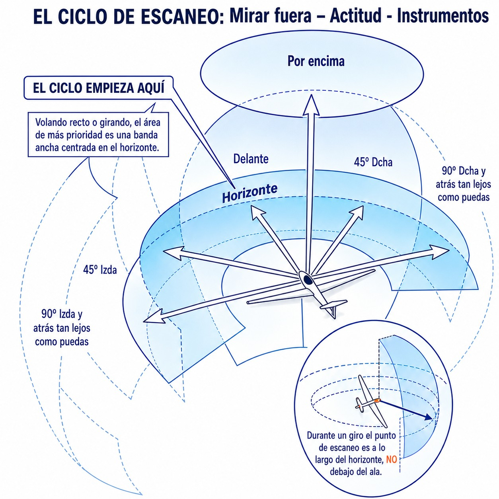
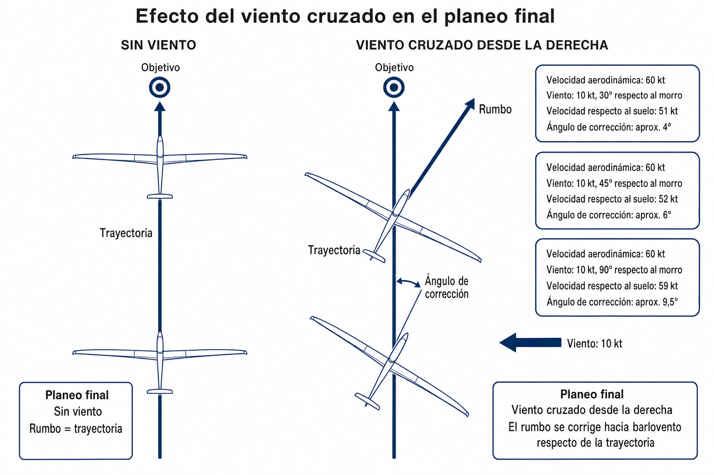

# Special operational procedures and hazards

> Sailplane flying takes place in an environment shared with other aircraft and with birds, with weather that can develop in minutes and with terrain that can be as much an ally as an enemy. Knowing the specific procedures for each of these situations (and understanding why they are designed the way they are) is what separates the reactive pilot from the preventive one.
>
>
> In this chapter you will learn:
>
>
> * **Look-out and collisions**: the 3-second rule and visual scanning techniques.
> * **FLARM**: how it works, what it detects and, above all, what it does not.
> * **Bird hazards**: how to share the sky with birds without taking needless risks.
> * **Wake turbulence and icing**: two silent threats in flight.
> * **Crosswind**: take-off and landing technique in demanding conditions.
> * **Mountain hazards**: the false horizon, right-of-way rules and the absolute ban on turning towards the slope.
> * **Ditching**: what to do if water cannot be avoided.

## Look-out and collisions

A **mid-air collision** is one of the gravest dangers for a sailplane, especially where aircraft are concentrated, such as strong thermals, popular ridges or the vicinity of the aerodrome at the busiest times of day.

The physics is relentless: at 150 km/h, two sailplanes approaching head-on have a closing speed of 300 km/h, or 83 metres per second. That means that if they see each other at 300 metres, they have a little under **four seconds** to react. In reality, half of that time (about two seconds) goes on perceiving and deciding, before the sailplane has changed its path by even a metre.

### The 3-second rule

To avoid a collision, a pilot needs about **3 seconds** from seeing the conflicting aircraft to the moment their sailplane has physically responded to the avoiding action:

* **1.5 seconds** to see the other aircraft, recognise the danger, decide on the manoeuvre and make it.
* **1.5 seconds** for the sailplane to respond physically and start to change its path.

This rule has a direct consequence: aircraft must be seen at **much more than 250 metres** for avoidance to be possible with a margin. And that only happens if the pilot is actively looking out.

### Visual scanning techniques

* **Active look-out:** spend more than 95% of the time looking outside the cockpit (99.9% is better). The instruments need only brief, regular glances.
* **Sector scan:** divide the horizon into sectors of 15–20° (@fig-06-cap06-escaneo-visual). Move your eyes from sector to sector, pausing briefly on each. Peripheral vision picks up movement, but to tell whether it is an aircraft you need to look straight at it.
* **Before turning:** always look towards the side of the turn, and at the opposite sector, before banking the sailplane.
* **Blind spots:** the wings, the fuselage and the nose hide part of the sky. Move the nose slightly or bank gently from time to time to “clear” the blind spots.

{#fig-06-cap06-escaneo-visual}

## Electronic aids: FLARM

**FLARM** is a collision warning system designed specifically for gliding and light general aviation. It works by sending the sailplane's GPS position and predicted flight path by short-range radio to all nearby FLARM units. Each unit receives these positions, works out whether the paths converge and, if it detects a risk of collision, gives an audible and visual warning showing the direction and seriousness of the threat.

* **What does it detect?** Aircraft fitted with FLARM or compatible devices (PowerFLARM, SoftRF, FANET), some aircraft with ADS-B Out, and fixed obstacles programmed into its database (cable-car wires, masts, power lines in competition flying areas).
* **What does it NOT detect?** Aircraft with neither FLARM nor ADS-B (many microlights, military helicopters, paragliders, unequipped balloons), objects not in its database, and traffic beyond its radio range (usually 3–5 km horizontally).

### Operating procedure for FLARM warnings

For FLARM to do its safety job without causing fatal distractions in the cockpit, the pilot must follow this standard protocol when a warning comes up:

1. **Quick read and call-out:** take in the visual warning with one quick, precise glance at the instrument and say it out loud (for example, “Traffic at one o'clock, higher”). This makes sure the crew (in a two-seater) share the situational awareness.
2. **Proactive look-out:** immediately turn your attention outside the cockpit, focusing on the sector shown by the warning. **Never stare at the FLARM display** trying to interpret symbols or paths; the instrument tells you where to look, but a collision is only avoided by looking outside.
3. **Visual confirmation:** hold your heading and attitude until you have the conflicting aircraft in sight.
4. **No abrupt “blind” avoiding action:** if you cannot get the traffic in sight, **avoid violent turns or height changes** based only on what the FLARM display shows. An abrupt turn without seeing the other sailplane can put you into its avoiding path, or into a collision with a third, unequipped sailplane that the system cannot see. If in doubt, make smooth, predictable changes of attitude to make yourself more visible.

::: {.callout-note title="Airmanship"}
FLARM is an extraordinarily useful safety tool (mandatory in official competitions, from regional contests to world championships), but it **never replaces a visual look-out**. Treat it as a supplement that warns you of the dangers it knows about, not as a system that removes every risk. When FLARM warns you, react by looking for the conflicting aircraft: the system gives you the direction, but the final manoeuvre is your responsibility.
:::

## Wildlife hazards: birds

Birds (especially griffon vultures, Egyptian vultures and black storks) are frequent companions in thermals and in ridge and cross-country flying. They are masters of thermal flying and excellent indicators of the quality of the lift. However, a collision with a griffon vulture (6–10 kg and a wingspan of almost 2.5 metres) can destroy the leading edge, come through the canopy or cause catastrophic damage to the flying controls.

1. **Treat them as traffic:** do not try to “chase” them, frighten them or corner them with the sailplane. A frightened bird can manoeuvre abruptly and unpredictably.
2. **Avoid sudden changes:** the bird will usually avoid you if you hold a predictable path. Sudden changes of direction can lead it straight towards you.
3. **Follow them, do not join them:** birds show you the best core of the thermal, but always keep a safe distance. Sharing a turn with a flock of vultures at close range means reduced visibility and unpredictable manoeuvring.

::: {.callout-note title="Airmanship: HOW VULTURES BEHAVE"}
In the Iberian Peninsula, meeting griffon vultures in a thermal is a daily event during the flying season. Spanish instructors teach a golden safety rule for an imminent collision course with a vulture: **always avoid the bird by flying above it:**

The natural escape instinct of a frightened vulture faced with a large threat is to **fold its wings and dive downwards** to gain escape speed quickly. If the pilot tries to avoid the vulture by diving the sailplane (passing below it), there is a very high chance of crossing the bird's falling path and hitting it head-on. If in doubt, hold your coordinated path or ease back gently on the stick to pass above its level.
:::

::: {.callout-warning title="Safety"}
Power lines and telecommunications cables are invisible from the air in many light conditions. They are the biggest undetected hazard in cross-country flying and field landings. FLARM may include their positions in competition areas, but in free flight spotting them is purely a visual responsibility: pick out the concrete or wooden poles and draw the line between them in your mind before flying over it.
:::

## Wake turbulence and icing

### Wake turbulence

**Wake turbulence** (the wingtip vortices produced by heavy aircraft) is invisible, persistent and extremely dangerous for a sailplane. It forms from the moment of take-off and throughout the flight, sinking slowly and drifting sideways with the wind.

* Avoid flying below and behind heavy aircraft or behind the tug itself.
* On an aerotow take-off, keep the high tow position so as not to cross the tug's wake.
* In areas of heavy air traffic, keep active situational awareness of airline traffic at higher levels.
* **Special danger from helicopters:** helicopters produce extremely powerful wake turbulence because of the load on their rotor blades. In the hover or in slow taxiing (**hover**), the downward airflow (**downwash**) spreads out radially at the surface and can overturn a sailplane on the ground; always keep at least **three rotor diameters** away. In forward flight they produce very strong wake vortices because of their low operating speeds. Avoid flying below or behind them and take extreme care in mixed circuits, because ATC does not always give wake turbulence warnings for light or medium helicopters.

::: {.callout-warning title="Safety"}
The wake turbulence produced by helicopters is out of all proportion to their weight. Because sailplanes have long spans and low wing loading, they are extremely vulnerable. Never try to land or take off immediately behind a moving helicopter, and avoid crossing areas where a helicopter has recently been hovering.
:::

### Icing

**Icing** is the build-up of ice on the leading edge, which changes the wing's aerodynamic shape drastically: it increases drag, reduces lift and raises the stall speed considerably. A layer of ice just 2 millimetres thick can raise the stall speed by 20–30% and make the sailplane almost uncontrollable.

* If you are flying in wave, near cloud or at great heights with temperatures below zero, check the leading edge regularly.
* At the first signs of a build-up (a change in handling, more aerodynamic noise), descend at once to warmer air.
* Fly with an extra speed margin for as long as the wing may be contaminated.

::: {.callout-warning title="Safety"}
Water on the wings (from humidity, dew or light rain) has an effect similar to light icing: it increases drag and raises the stall speed by 5–10%. Increase your approach and circuit speed if the wings are wet or if you have been flying in very humid conditions. This effect is particularly treacherous on landing.
:::

## Crosswind take-off and landing

Operating in a crosswind calls for active coordination of the controls to stop the sailplane drifting off the runway or suffering structural damage to the upwind wing:

### Crosswind take-off

Hold **full aileron into wind** at the start of the ground run to stop the upwind wing lifting too early. Use opposite rudder to keep the longitudinal axis on the runway. As you gain speed and the controls become more effective, reduce the aileron deflection gradually and in proportion. Lift the sailplane off with no sideways drift, at the correct speed, and turn to head into wind once airborne.

### Crosswind landing

On final, use the **crab** technique: point the nose into wind to counter the drift and keep the track over the ground lined up with the runway. Just before touchdown, use the rudder to line the nose up with the runway and the aileron to lower the into-wind wing, making sure the main wheel touches down with no sideways drift (@fig-06-cap06-viento-cruzado). A touchdown with significant drift can break the undercarriage or cause a skid that takes the sailplane off the runway.

{#fig-06-cap06-viento-cruzado}

## Hazards in mountain and ridge flying

### False horizon

In narrow valleys and in ridge flying, the surrounding peaks can confuse the pilot's visual system and take the place of the real horizon. If the pilot uses the slopes as the horizon reference instead of the true astronomical horizon, they may end up flying at a dangerously high angle of attack (believing they are in a normal attitude) and approach the stall without noticing.

The correction is always to look at the real horizon: the line that separates the sky from the most distant ground, usually in the valley or on the plain beyond.

### Right-of-way rules on a ridge

If two sailplanes meet on the same ridge, the one with the hill on its **right** has right of way. The other must move out towards the valley to make room. The rule works like right of way at sea in coastal waters: the one that cannot manoeuvre (it is between the other and the rock) has priority; the one that can manoeuvre gives way.

### Absolute ban on turning towards the mountain

Never turn towards the slope unless you are sure you have room to complete the turn with a safety margin. A sailplane that stalls or spins while turning towards the rock, at low height, has no chance of recovering. The mountain does not give second chances.

## Ditching

Although the sailplane operates mainly over land, a cross-country flight can take the pilot over large areas of water (lakes, reservoirs, rivers) if the lift runs out. If **ditching** cannot be avoided:

1. **Wheel down:** check whether your aircraft's AFM covers the case, but modern sailplane doctrine (confirmed by ditching trials and the safety notes of DG Flugzeugbau) is to ditch with the **wheel extended**. The wheel slows the sailplane on contact with the water and limits how deep it dives, with no significant risk of nosing over. With the wheel retracted, the opposite of what intuition says happens: the nose dives and the cockpit can be pushed under the water. The old “wheel up” rule comes from powered aircraft, not from sailplanes.
2. **Configuration:** ditch parallel to the waves or the swell if possible, with the airbrakes out to reduce speed as much as possible.
3. **Get out at once:** leave the cockpit as soon as you stop. The sailplane will sink within seconds: the composite cockpit and the rigid structure lose buoyancy quickly.

::: {.postit}
**Chapter summary: special procedures and hazards**

* **Visual look-out**: FLARM helps, but it does not see everything. Look outside 95% of the time. Scan the horizon in sectors. Before turning, always look towards the side of the turn.
* **Crosswind**: aileron into wind on take-off so that the wing does not lift, opposite rudder to stay on the runway. On landing, crab all the way down final and line up with the rudder before touching down.
* **Mountain flying**: the false horizon. The peaks deceive you; if you use them as a reference, you will fly with the nose too high and stall. Your real horizon is the foot of the mountain or the valley.
* **Icing and rain**: any contamination of the leading edge raises the stall speed. Add speed in the circuit and on the approach. If ice builds up, descend at once.
* **Ditching**: if there is no other option, **wheel down** (the wheel slows the sailplane on contact and stops the cockpit diving), parallel to the waves and at minimum speed. As soon as the sailplane stops, get out: it sinks in seconds.
:::
